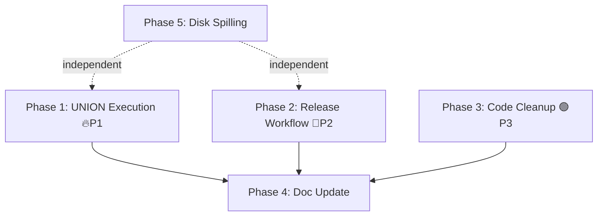

# Plan: Closing Remaining Gaps — Kuzu Rust

## TL;DR

Audit of 13 prompt files vs. codebase confirms >95% of claimed work is REAL. Three gaps remain, plus one new large feature (Disk Spilling) from `implementation_plan.md` that was never started.

---

## Dependency Graph

**Phases 1-4 are short-duration and can run in any order. Phase 5 is a large independent workstream.**

---

## Phase 1: UNION Physical Execution (🔥 P1 — ~2-3 jam)

**Problem:** UNION is parsed ✅ and bound ✅, but planner returns empty vec (catch-all `_ => Ok(vec![])`) and processor is a no-op (`Union(_) => vec![]`).

### Steps

**1.1 Planner: add `BoundUnion` arm** — `kuzu-planner/src/planner.rs`
- Current catch-all at line 23 (`_ => Ok(Vec::new())`) swallows `BoundUnion`
- Add match arm: plan left subtree → plan right subtree → wrap in `LogicalOperator::Union(LogicalUnion { left, right, cardinality })`
- **Challenge**: Current planner works on flat `Vec<LogicalOperator>`. `LogicalUnion` stores `Box<LogicalOperator>` children. Need to wrap each side's flat pipeline into a single logical operator (e.g., a `LogicalProjection` that collects expressions, or a synthetic root that owns the plan fragment).
- **Pattern to follow**: How `HashJoin` handles tree-shaped children — `LogicalHashJoin.has_left_child()/has_right_child()` + processor recursively executes children before the join.

**1.2 Processor: execute `LogicalUnion`** — `kuzu-processor/src/processor.rs`
- Replace the no-op at line 270
- Execute left subtree fully → collect `DataChunk`s
- Execute right subtree fully → collect `DataChunk`s
- Concatenate results column-by-column using `ValueVector::append()`
- Return merged result set

**1.3 Physical operator (optional simplification)** — `kuzu-processor/src/physical_operator.rs`
- Could add `PhysicalUnion` struct for cleaner separation, or
- Inline concat logic directly in processor match arm (simpler, matches current pattern)

**1.4 Tests** — `kuzu-main/tests/` or inline in processor
- `UNION ALL`: two IDENTICAL MATCH queries → verify rows are concatenated
- `UNION` (distinct): verify duplicates removed
- Column count mismatch: verify error

### Relevant files
- `kuzu-core/kuzu-planner/src/planner.rs` — add `BoundUnion` dispatch
- `kuzu-core/kuzu-planner/src/logical_operator.rs` — `LogicalUnion` already exists ✅
- `kuzu-core/kuzu-processor/src/processor.rs` — add Union execution
- `kuzu-core/kuzu-processor/src/physical_operator.rs` — optional `PhysicalUnion`

---

## Phase 2: Release Workflow (🔵 P2 — ~2-3 jam)

**Problem:** Rust CI exists ✅ but no release automation for crates.io.

### Steps

**2.1 Prepare workspace for publishing** — `kuzu-core/Cargo.toml`
- Add `description`, `keywords`, `categories` to `[workspace.package]` (required by crates.io)
- Add `publish = false` to internal crates that shouldn't be published individually (all except `kuzu-main` and `kuzu-cli` perhaps)
- Decision needed: **publish as 27 individual crates** vs. **consolidate into one publishable crate** vs. **publish only `kuzu-main`** as the public API

**2.2 Create release workflow** — `.github/workflows/rust-release.yml`
- Trigger: tag push (`v*`) or manual dispatch
- Jobs: `cargo test --workspace` → `cargo publish` for each public crate (in dependency order)
- Optionally: GitHub Release with changelog, binary artifacts

**2.3 Document release process** — `kuzu-core/RELEASE.md` (new)
- Version numbering convention
- Steps to cut a release
- Dependency publication order

### Relevant files
- `kuzu-core/Cargo.toml` — workspace metadata
- `.github/workflows/rust-release.yml` — **NEW**
- `kuzu-core/RELEASE.md` — **NEW**

---

## Phase 3: Code Cleanup (🟢 P3 — ~1 jam)

**Problem:** 2 TODO comments in `ladybug/tools/rust_api/src/value.rs` (NOT kuzu-core — these are in the C++ FFI wrapper crate).

### Steps

**3.1 Resolve TODO at line 247** — `ladybug/tools/rust_api/src/value.rs`
- `// TODO: Enforce type of contents` in `List(LogicalType, Vec<Value>)`
- `Value::new_list()` constructor already exists (added by earlier cleanup) but the TODO comment remains
- Either: add actual validation call in the impl, or update the comment to indicate intentional non-enforcement

**3.2 Resolve TODO at line 1154** — `ladybug/tools/rust_api/src/value.rs`
- `// TODO: Also test equivalence for values constructed entirely inside a Cypher query`
- Add a test companion that asserts `RETURN 42` in a query equals `Value::Int64(42)` constructed in Rust
- Need temp database + connection in test (same pattern as existing tests)

### Relevant files
- `ladybug/tools/rust_api/src/value.rs` — resolve 2 TODOs

---

## Phase 4: Documentation Update (📄 — ~30 menit)

**Problem:** `implementation_plan.md` and some prompt files have outdated ❌ markers for features that are already done (ART, HNSW Integration, COPY FROM, Benchmark, CI).

### Steps

**4.1 Update `implementation_plan.md`**
- Change ART Index ❌ → ✅
- Change HNSW Full Integration ❌ → ✅ (add detail about what was implemented)
- Change CI/CD ❌ → ✅ (CI exists; release workflow in Phase 2 of this plan)
- Change Benchmark ❌ → ✅
- Keep Disk Spilling as the only remaining ❌
- Remove DuckDB Binding from ❌ list (already done)

**4.2 Update `plan-kuzuGapClosurePlan.prompt.md`** (the most active plan file)
- Move "Columnar On-Disk Storage", "COPY FROM", "Operator Generalization", "Benchmark Infrastructure" from ❌ to ✅
- Keep UNION execution as the main pending item (add reference to this plan)

### Relevant files
- `implementation_plan.md`
- `.github/prompts/plan-kuzuGapClosurePlan.prompt.md`

---

## Phase 5: Disk Spilling & Stream-Merge (New Feature — Estimasi 1-2 minggu)

**Not started.** This is the only feature from `implementation_plan.md` (FASE 3) that is genuinely unimplemented.

**Current state research:**
- `ColumnChunk` is entirely in-memory (`Vec<Value>`) — no spilling, no memory threshold tracking
- `NodeGroup` is entirely in-memory — accumulates until explicitly flushed to `Column`
- `BufferManager` has Clock eviction for pages ✅ — can be reused
- `MemoryManager` tracks total allocation ✅ but enforcement is not wired
- **No `spiller.rs` exists**
- `SystemConfig` has `buffer_pool_size` (default 0, not wired) and `max_db_size` — no spill config

### Steps

**5.1 Spiller module** — `kuzu-storage/src/spiller.rs` (NEW)
- `Spiller` struct: `tmp_dir`, `memory_threshold`, spill counter
- `spill(chunk: &mut ColumnChunk) -> SpillFile` — serializes chunk to temp file, clears in-memory data
- `SpillFile` — metadata: path, row_count, column_types, sort_key
- `restore(spill: &SpillFile) -> ColumnChunk` — reads back from disk

**5.2 Stream-merge** — `kuzu-storage/src/spiller.rs` (continued)
- `MultiWayStreamMerge` — reads N spill files + current in-memory buffer
- Streaming merge: peek smallest key across all runs, yield one row at a time
- PK deduplication during merge (for `COPY FROM` with potential duplicates)
- Final output: writes to `Column` via `BufferManager`

**5.3 NodeGroup integration** — `kuzu-storage/src/node_group.rs`
- Before `append_row()` when memory exceeds threshold → call `Spiller::spill()` on the full column chunk
- After all rows are ingested → `Spiller::merge_all()` to produce final on-disk data

**5.4 Config wiring** — `kuzu-main/src/database.rs` + `connection.rs`
- Add `spill_threshold: u64` (bytes) to `SystemConfig` (default: 80% of `buffer_pool_size`)
- Add `SET spill_threshold = <bytes>` Cypher command
- Pass threshold to `Spiller` during `StorageManager::new()`

**5.5 Tests**
- Spill a single large column chunk → restore → verify values match
- Multi-way merge of 3 spill files → verify sort order + dedup
- `COPY FROM` with threshold=1MB → verify spilling is triggered
- Memory tracking: verify peak memory stays below threshold

### Relevant files
- `kuzu-core/kuzu-storage/src/spiller.rs` — **NEW**
- `kuzu-core/kuzu-storage/src/column_chunk.rs` — add spiller hooks
- `kuzu-core/kuzu-storage/src/node_group.rs` — add spiller hooks
- `kuzu-core/kuzu-storage/src/buffer_manager.rs` — reuse eviction infrastructure
- `kuzu-core/kuzu-main/src/database.rs` — SystemConfig spill fields
- `kuzu-core/kuzu-main/src/connection.rs` — SET command
- `kuzu-core/kuzu-storage/src/lib.rs` — register module

---

## Verification

| Phase | Verification | Command |
|-------|-------------|---------|
| **P1** | UNION query returns correct merged results | `cargo test --workspace` |
| **P2** | Release workflow created (dry-run only) | `cargo publish --dry-run -p kuzu-main` |
| **P3** | No TODO comments in value.rs | `grep -r "TODO" ladybug/tools/rust_api/src/` |
| **P4** | implementation_plan.md reflects reality | Manual review |
| **P5** | Spill → restore roundtrip; memory under threshold | `cargo test -p kuzu-storage -- spiller` |

## Scope Boundaries

| Included | Excluded (Deferred) |
|----------|---------------------|
| UNION physical execution (planner + processor) | Correlated subqueries in UNION |
| Release workflow for crates.io | Publishing all 27 crates (decide which are public) |
| Code cleanup TODOs | Full ladybug/tools/rust_api `unsafe` audit (already done per earlier plan) |
| Doc sync for implementation_plan.md | Full rewrite of all 13 prompt files |
| Disk spilling for ColumnChunk/NodeGroup during COPY FROM | Spilling for general query intermediate results (hash tables, sort runs) |
| Multi-way stream-merge | Full Arrow-CSR spilling (simpler direct merge first) |

## Key Decisions

1. **UNION execution**: Inline concat in processor match arm (no separate PhysicalOperator needed) — matches current pattern where operators are executed inline.
2. **Release scope**: Publish only `kuzu-main` to crates.io initially. Internal crates stay as path dependencies. Revisit if external users need individual crates.
3. **Disk spilling approach**: Direct `Vec<Value>` serialization first (simple), not Arrow-CSR format. Arrow-CSR can be a future optimization.
4. **Spill threshold default**: 80% of `buffer_pool_size`. User-configurable via `SET spill_threshold`.
