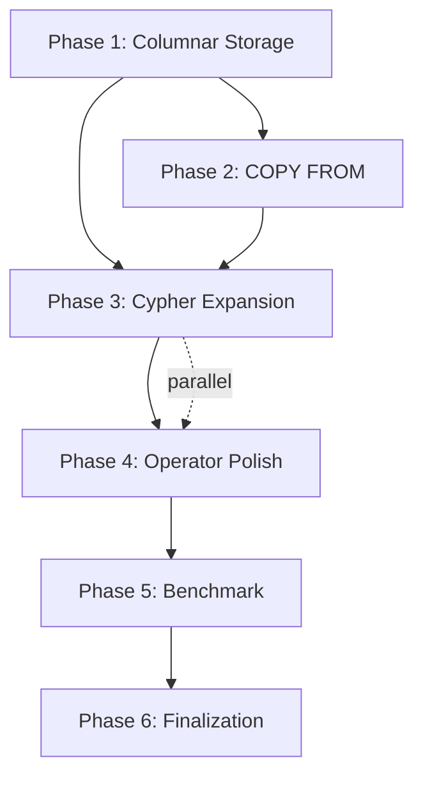

# Plan: Menutup Semua Gap Rust Kuzu — Final Push

## TL;DR

Dari 6 rencana sebelumnya (F0-F21), **hampir semua sudah selesai**: optimizer, extensions, callback bridge, DuckDB binding, PhysicalScan real data, HashJoin generalized, PreparedStatement, CI/CD, tools/rust_api dual-mode. Yang tersisa adalah **5 area kritis** yang diorganisir berdasarkan dependency graph natural: Storage dulu → Data loading → Cypher features → Operator polishing → Benchmark.

---

## Current State (Verified 2026-06-29)

### ✅ Selesai
| Area | Status |
|------|--------|
| Fase 0-14 (Foundation → Cleanup) | ✅ 203 tests passing |
| Optimizer (FactorizationRewriting + CardinalityEstimation) | ✅ Full port dari C++ |
| Callback Bridge (CustomScalar/CustomTable) | ✅ Extensions bisa execute real code |
| DuckDB Rust Binding | ✅ `duckdb` crate v1.10504.0 |
| 6 Extension Crates (SQLite, Delta, Iceberg, Azure, Postgres, Unity Catalog) | ✅ Native/Delegation hybrid |
| Storage Cardinality + Join Order Enumeration | ✅ StatsStore + greedy reorder |
| PreparedStatement | ✅ `prepare()` + `execute()` |
| PhysicalScan reads real table data | ✅ No more synthetic data |
| PhysicalHashJoin generalized | ✅ All Value types |
| Expression Evaluator | ✅ Proper module with scalar dispatch |
| CI/CD (Rust) | ✅ Multi-platform GitHub Actions |
| tools/rust_api | ✅ Dual-mode (default: pure Rust) |
| Extensions (JSON, FTS, ALGO, NEO4J, LLM) | ✅ Real implementations |
| Concurrent Multi-Writer (Phase A-C) | ✅ `concurrent_writes=true`, dashmap, LocalWAL, MVCC, checkpoint drain |

### ❌ Masih Perlu Dibuat
| Area | Prioritas | Effort |
|------|-----------|--------|
| **Columnar On-Disk Storage** | **P0** 🔴 | **Besar** — port full C++ columnar storage |
| **COPY FROM (CSV/Parquet)** | **P0** 🔴 | **Besar** — grammar → reader → processor |
| **Cypher Expansion** (DELETE, SET, ALTER, OPTIONAL MATCH, WITH, UNION, UNWIND) | P1 🟡 | Besar — multi-layered |
| **Operator Generalization** (OrderBy multi-key, Aggregate GROUP BY generic) | P1 🟡 | Sedang |
| **Benchmark Infrastructure** | P2 🔵 | Sedang |

---

## Dependency Graph



---

## Phase 1: Columnar On-Disk Storage (P0 🔴)

**Goal:** Replace in-memory `Vec<Vec<Value>>` with real page-based columnar storage using BufferManager + WAL + Compression.

**Approach:** Port the C++ columnar storage architecture from `src/storage/` into `kuzu-storage/`. BufferManager, WAL, compression already exist — need to **connect them** into NodeTable/RelTable.

### Steps

**1.1 Column data structure** (`kuzu-storage/src/column.rs` — new file)
- Struct `Column` with: `column_type: LogicalType`, `file_handle: FileHandle`, `buffer_manager: Arc<Mutex<BufferManager>>`, metadata tracking
- Methods: `append_value(page_id, offset, &Value)`, `scan_values(start, count) → Vec<Value>`, `get_value(row_idx) → Value`
- Write path: allocate pages via BufferManager → serialize Value bytes → write to page
- Read path: pin page → deserialize bytes → Value → unpin
- *Depends on:* BufferManager, FileHandle, serialization (all exist)

**1.2 ColumnChunk** (`kuzu-storage/src/column_chunk.rs` — new file)
- In-memory buffer for a contiguous range of values (e.g., one column's data for `StorageStrategy::NODE_GROUP_SIZE` rows)
- Methods: `append(&Value)`, `flush_to_column(&mut Column)`, `scan(range) → Vec<Value>`
- Flush strategy: when chunk is full, write to Column's pages
- *Depends on:* 1.1

**1.3 NodeGroup** (`kuzu-storage/src/node_group.rs` — new file)
- Collection of ColumnChunks (one per column) + metadata (start_node_offset, num_nodes)
- `NodeGroup { columns: Vec<ColumnChunk>, start_offset: offset_t, num_nodes: node_offset_t }`
- Methods: `append_row(&[Value])`, `flush()`, `scan()`
- Constant `NODE_GROUP_SIZE`: 4096 (matching C++ default)
- *Depends on:* 1.2

**1.4 Rewrite NodeTable** (`kuzu-storage/src/table.rs` — modify)
- Replace `data: Vec<Vec<Value>>` with `node_groups: Vec<NodeGroup>`
- Add `column_types: Vec<LogicalType>` (already exists partially)
- Methods: `insert_row(&[Value])` — appends to current node group, auto-creates new group when full
- Methods: `scan_column(col_id, start, count)` — traverses node groups
- Methods: `get_value(row_idx, col_id)` — locate correct node group + column chunk
- Keep existing `num_rows`, `columns` metadata
- *Depends on:* 1.3

**1.5 Rewrite RelTable** (`kuzu-storage/src/table.rs` — modify)
- Replace `data: Vec<Vec<Value>>` with CSR-based storage
- `adj_lists: Vec<Vec<(node_offset_t, node_offset_t)>>` — adjacency per rel label
- `properties: Vec<Vec<Vec<Value>>>` — per-column, per-rel-list property storage
- Methods: `insert_rel(from, to, &[Value])`
- Methods: `scan_adj_list(label, direction)`
- *Depends on:* 1.4

**1.6 Integrate Compression** (`kuzu-storage/src/compression.rs` — enhance)
- Current: `Constant` + `Boolean` only, rest is pass-through
- Implement: `IntegerBitpacking` (int8/int16/int32/int64), `Float` compression
- Wire into `Column::append_value` and `Column::get_value` — compress on write, decompress on read
- Use existing `CompressionMetadata` struct
- *Depends on:* 1.1

**1.7 Integrate WAL + Checkpoint** (`kuzu-storage/src/wal.rs`, `checkpoint.rs` — enhance)
- `WAL::log_column_write(table_id, col_id, page_id, data)` — log before writing
- `Checkpoint::flush_table(table)` — write all dirty node groups to disk pages
- `Checkpoint::checkpoint()` — flush WAL → write pages → truncate WAL
- *Depends on:* 1.4, 1.5

**1.8 Integration tests**
- Create table → insert rows → flush → reopen → verify data persists
- WAL crash recovery test: insert → simulate crash → recover → verify
- Compression round-trip: write compressed → read back → verify values
- Multi-node-group scan: insert > NODE_GROUP_SIZE rows → verify scan across groups

**Relevant files:**
- `kuzu-core/kuzu-storage/src/column.rs` — baru
- `kuzu-core/kuzu-storage/src/column_chunk.rs` — baru
- `kuzu-core/kuzu-storage/src/node_group.rs` — baru
- `kuzu-core/kuzu-storage/src/table.rs` — rewrite major
- `kuzu-core/kuzu-storage/src/compression.rs` — enhance
- `kuzu-core/kuzu-storage/src/wal.rs` — enhance
- `kuzu-core/kuzu-storage/src/checkpoint.rs` — enhance
- `kuzu-core/kuzu-storage/src/lib.rs` — register modules baru
- `kuzu-core/kuzu-main/src/database.rs` — mungkin perlu update inisialisasi storage
- `kuzu-core/kuzu-main/src/connection.rs` — update handle_ddl untuk storage baru

**Verification Phase 1:**
- `cargo test -p kuzu-storage` — semua existing + new tests pass
- Insert 10k rows → scan → verify semua nilai benar
- WAL recovery test
- Compression round-trip test

---

## Phase 2: COPY FROM (Data Loading) (P0 🔴)

**Goal:** Load data dari CSV/Parquet ke columnar storage.

**Blocks on:** Phase 1 (karena COPY FROM perlu menulis ke storage)
**Can parallel with:** Phase 1 steps 1.6-1.8 (detail implementation)

### Steps

**2.1 Parser grammar for COPY** (`kuzu-parser/src/cypher.pest` — modify)
- Add grammar rule: `copy_from → { "COPY" ~ table_ref ~ "FROM" ~ string_literal ~ copy_options? }`
- `copy_options → { "(" ~ copy_option ("," ~ copy_option)* ")" }`
- `copy_option → { header_option | delim_option | escape_option | ... }`
- Add `Statement::CopyFrom { table_name, file_path, options }` to AST
- *Depends on:* nothing parser-side

**2.2 Binder for COPY** (`kuzu-binder/src/binder.rs` — modify)
- `bind_copy_from(table_name, file_path, options) → BoundCopyFrom`
- Validate: table exists, file path accessible, column count matches
- Resolve column types from catalog
- Infer CSV schema if no explicit schema (optional)
- *Depends on:* 2.1

**2.3 CSV Reader** (`kuzu-storage/src/csv_reader.rs` — new file OR `kuzu-processor/src/csv_reader.rs`)
- Parse CSV with: delimiter, header, quote, escape, null handling
- Use `csv` crate (Rust-native, serde support)
- `read_csv(path, schema) → Result<Vec<Vec<Value>>>` or streaming iterator
- Error handling: line numbers, type coercion errors, bad rows
- Support: header detection, custom delimiter, quoting
- *Depends on:* nothing (pure parsing utility)

**2.4 Parquet Reader** (`kuzu-storage/src/parquet_reader.rs` — new file)
- Use `parquet` crate (Rust-native, Arrow format)
- `read_parquet(path, projection) → Result<Vec<Vec<Value>>>`
- Read row groups → convert Arrow types → Kuzu Value
- Type mapping: Arrow Int64 → LogicalTypeID::INT64, Arrow Utf8 → STRING, etc.
- *Depends on:* nothing (pure parsing utility)

**2.5 Processor: PhysicalCopyFrom** (`kuzu-processor/src/physical_operator.rs` — modify)
- Add `PhysicalCopyFrom { table_id, file_path, file_type, options }`
- Execute: detect file type → call CSV/Parquet reader → insert rows via StorageManager
- Handle: type coercion, error reporting, progress
- *Depends on:* 2.3, 2.4, Phase 1 (storage writes)

**2.6 Wire through pipeline** (`kuzu-processor/src/processor.rs`, `kuzu-main/src/connection.rs`)
- Parser produces `Statement::CopyFrom` → Binder produces `BoundCopyFrom` → Planner produces `LogicalCopyFrom` → Processor creates `PhysicalCopyFrom`
- `Connection::handle_ddl` or new dispatch for COPY statements
- *Depends on:* 2.2, 2.5

**2.7 Integration tests**
- Load tinysnb CSV files → verify data in NodeTable/RelTable
- Load with header / without header
- Load with custom delimiter
- Error handling: wrong column count, type mismatch, file not found
- Parquet round-trip

**Relevant files:**
- `kuzu-core/kuzu-parser/src/cypher.pest` — grammar
- `kuzu-core/kuzu-parser/src/ast.rs` — `Statement::CopyFrom`
- `kuzu-core/kuzu-parser/src/parser.rs` — parse_copy_from()
- `kuzu-core/kuzu-binder/src/binder.rs` — bind_copy_from()
- `kuzu-core/kuzu-binder/src/bound_statement.rs` — BoundCopyFrom
- `kuzu-core/kuzu-processor/src/physical_operator.rs` — PhysicalCopyFrom
- `kuzu-core/kuzu-processor/src/processor.rs` — dispatch
- `kuzu-core/kuzu-main/src/connection.rs` — pipeline wiring
- `kuzu-core/kuzu-storage/src/csv_reader.rs` — baru (atau di kuzu-processor)
- `kuzu-core/kuzu-storage/src/parquet_reader.rs` — baru

**Verification Phase 2:**
- `cargo test` — all tests pass
- Load dataset/tinysnb via CLI → verify `MATCH (n:Person) RETURN n.name` returns real data

---

## Phase 3: Cypher Expansion (P1 🟡)

**Goal:** Add missing Cypher clauses: DELETE, SET, ALTER, OPTIONAL MATCH, WITH, UNION, UNWIND.

**Blocks on:** Phase 2 only partially (DELETE/SET need write-capable storage, which comes from Phase 1)
**Can parallel with:** Phase 4 (operator generalization)

### Steps

**3.1 DELETE clause** — Full pipeline
- Parser: `delete_clause → { "DELETE" ~ expression ("," ~ expression)* }`
- AST: `Clause::Delete { expressions: Vec<Expression> }`
- Binder: `bind_delete()` — resolve node/rel references, validate
- Logical: `LogicalDelete`
- Physical: `PhysicalDelete { table_id, key_column }` — remove row from NodeTable/RelTable
- *Depends on:* Phase 1 (table write methods)

**3.2 SET clause** — Full pipeline
- Parser: `set_clause → { "SET" ~ property_expression ~ "=" ~ expression ("," ~ ...)* }`
- Binder: `bind_set()` — validate property exists, type-check
- Logical: `LogicalSet`
- Physical: `PhysicalSet { table_id, col_id, value_expr }` — update property in-place
- *Depends on:* Phase 1 (table write methods)

**3.3 ALTER TABLE** — Full pipeline
- Parser: `alter_table → { "ALTER" ~ "TABLE" ~ table_ref ~ alter_action }`
- `alter_action → { add_column | drop_column | rename_column | rename_table }`
- Binder: `bind_alter()` — validate table/column exists, type-check for ADD
- Catalog: methods to add/drop/rename columns on catalog entries
- Physical: `PhysicalAlter` — modify column metadata in StorageManager
- *Depends on:* nothing parser-side; Phase 1 for physical storage changes

**3.4 OPTIONAL MATCH** — Full pipeline
- Parser: `optional_match → { "OPTIONAL" ~ "MATCH" ~ pattern ~ where_clause? }`
- Binder: `bind_optional_match()` — similar to MATCH but produces nullable bindings
- Logical: Outer join variant (LeftJoin / LeftOuter)
- Physical: `PhysicalHashJoin` with outer-join mode (produce NULLs for non-matching)
- *Depends on:* Phase 1 (table reads via PhysicalScan)

**3.5 WITH clause** — Full pipeline
- Parser: `with_clause → { "WITH" ~ return_item ("," ~ return_item)* ~ order_by? ~ limit_clause? ~ where_clause? }`
- Binder: `bind_with()` — creates projection boundary (like RETURN but within pipeline)
- Planner: produces projection, can carry ordering/limiting
- Physical: `PhysicalProjection` (already exists) — WITH is essentially an inline RETURN
- *Depends on:* nothing conceptually new

**3.6 UNION** — Wire existing LogicalUnion
- Parser: `union → { "UNION" ~ "ALL"? }`, modify `query_statement` to allow `query ~ union ~ query`
- Binder: `bind_union()` — validate column count/type compatibility between branches
- Physical: `PhysicalUnion` — concatenate DataChunks from left + right
- *Depends on:* `LogicalUnion` already exists; just need parser → binder → processor wiring

**3.7 UNWIND** — Full pipeline
- Parser: `unwind_clause → { "UNWIND" ~ expression ~ "AS" ~ variable }`
- Binder: `bind_unwind()` — validate expression is a list
- Physical: `PhysicalUnwind` — expand list elements into rows
- *Depends on:* nothing complex

**Relevant files (per clause):**
- `kuzu-core/kuzu-parser/src/cypher.pest` — masing-masing grammar rule
- `kuzu-core/kuzu-parser/src/ast.rs` — masing-masing AstNode/Clause variant
- `kuzu-core/kuzu-parser/src/parser.rs` — masing-masing parse function
- `kuzu-core/kuzu-binder/src/binder.rs` — bind functions
- `kuzu-core/kuzu-binder/src/bound_statement.rs` — BoundStatement variants
- `kuzu-core/kuzu-planner/src/logical_operator.rs` — LogicalOperator variants
- `kuzu-core/kuzu-planner/src/planner.rs` — plan construction
- `kuzu-core/kuzu-processor/src/physical_operator.rs` — physical operator impls
- `kuzu-core/kuzu-processor/src/processor.rs` — operator mapping

**Verification Phase 3:**
- `cargo test` — all existing + new tests pass
- DELETE: `MATCH (n:Person) WHERE n.name='Alice' DELETE n` → verify row removed
- SET: `MATCH (n:Person) WHERE n.name='Alice' SET n.age=35` → verify updated
- ALTER: `ALTER TABLE Person ADD COLUMN email STRING` → verify catalog + data
- OPTIONAL MATCH: query with optional pattern → verify NULL in result
- WITH: `MATCH (n) WITH n.name AS name RETURN name ORDER BY name`
- UNION: `MATCH (n:Person) RETURN n.name UNION ALL MATCH (n:Person) RETURN n.name`
- UNWIND: `UNWIND [1,2,3] AS x RETURN x`

---

## Phase 4: Operator Generalization (P1 🟡 — parallel with Phase 3)

**Goal:** Fix PhysicalOrderBy (multi-key + all types), PhysicalAggregate (generic GROUP BY), PhysicalLimit (proper chunk-aware slicing).

### Steps

**4.1 PhysicalOrderBy: multi-key support** (`kuzu-processor/src/physical_operator.rs`)
- Change `sort_column: u32` to `sort_keys: Vec<(u32, bool)>`
- Read from `LogicalOrderBy.sort_keys` during plan construction
- Sort tuples by composite key (lexicographic comparison)
- Handle: ties (stable sort), NULL ordering (default: NULLs last)
- Handle all Value types via `Value::partial_cmp()` or scalar comparison
- *Depends on:* nothing

**4.2 PhysicalAggregate: generic GROUP BY** (`kuzu-processor/src/physical_operator.rs`)
- Change `HashMap<i64, ...>` to `HashMap<Value, ...>` for GROUP BY keys
- Handle: multi-key GROUP BY (`GROUP BY a, b`)
- Output type: use actual aggregate result type instead of hardcoded Int64
- NULL handling in GROUP BY keys (SQL: NULLs group together)
- *Depends on:* nothing (Value already has Hash + Eq)

**4.3 PhysicalLimit: chunk-aware slicing**
- Review current `PhysicalLimit::execute()` for correctness with DataChunk boundaries
- Ensure OFFSET skips complete chunks, not just rows within first chunk
- Ensure LIMIT stops mid-chunk correctly
- *Depends on:* nothing

**Relevant files:**
- `kuzu-core/kuzu-processor/src/physical_operator.rs` — semua perubahan

**Verification Phase 4:**
- OrderBy: sort by multiple columns, sort by STRING/DATE/DOUBLE, handle ties
- Aggregate: GROUP BY string column, multi-key GROUP BY, NULL GROUP BY key
- Limit: OFFSET > chunk size, LIMIT < chunk size, combination

---

## Phase 5: Benchmark Infrastructure (P2 🔵)

**Goal:** Add criterion benchmarks, compare Rust vs C++, identity performance regression.

### Steps

**5.1 Add criterion dev-dependency** (`kuzu-main/Cargo.toml`, `kuzu-processor/Cargo.toml`)
- `criterion = { version = "0.5", features = ["html_reports"] }`
- `pprof = { version = "0.13", features = ["flamegraph", "criterion", "frame-pointer"] }` (optional)

**5.2 Create `kuzu-main/benches/`**
- `query_pipeline.rs` — full pipeline benchmark: parse→bind→plan→optimize→execute for representative queries
- `storage_bench.rs` — buffer_manager pin/unpin throughput, table scan throughput

**5.3 Create `kuzu-processor/benches/`**
- `physical_scan.rs` — scan throughput at various table sizes
- `physical_filter.rs` — filter selectivity + throughput
- `physical_hash_join.rs` — join throughput at various build/probe sizes
- `physical_order_by.rs` — sort throughput, multi-key vs single-key
- `physical_aggregate.rs` — aggregate throughput (COUNT, SUM, AVG) with/without GROUP BY

**5.4 Query suite + C++ comparison**
- Select 5-10 representative queries from `benchmark/queries/` that both Rust and C++ can run
- Run C++ benchmark via `kuzu_benchmark.exe` (already built)
- Run Rust criterion benchmarks
- Create comparison table in `kuzu-core/BENCHMARK_COMPARISON.md`

**5.5 Baseline documentation**
- Document in `kuzu-core/BENCHMARK_RUST.md` — current Rust performance numbers
- Gap ratio: Rust / C++ per query category
- Track improvements over time

**Relevant files:**
- `kuzu-core/kuzu-main/Cargo.toml` — criterion dep
- `kuzu-core/kuzu-processor/Cargo.toml` — criterion dep
- `kuzu-core/kuzu-main/benches/query_pipeline.rs` — baru
- `kuzu-core/kuzu-main/benches/storage_bench.rs` — baru
- `kuzu-core/kuzu-processor/benches/` — baru (5 files)
- `kuzu-core/BENCHMARK_COMPARISON.md` — baru

**Verification Phase 5:**
- `cargo bench --workspace` — semua bench runs successfully
- C++ benchmark numbers recorded
- Comparison document shows gap analysis

---

## Phase 6: Finalization (P3 🟢)

**Goal:** Tie up loose ends, documentation, edge cases.

### Steps

**6.1 Documentation audit**
- Update `kuzu-core/README.md` with current feature coverage
- Add supported Cypher clause table
- Update crate-level READMEs if needed

**6.2 Edge case fixes**
- NULL handling consistency across all operators
- Empty table scan (return empty result, not error)
- Schema evolution edge cases
- Large dataset stability (>100k rows)

**6.3 Code quality**
- Run `cargo clippy --workspace --all-targets -- -D warnings` — fix any new warnings
- Run `cargo fmt --all` — ensure consistent formatting

**Relevant files:**
- `kuzu-core/README.md` — update
- Various source files for edge case fixes

**Verification Phase 6:**
- `cargo test --workspace` — all 203+ tests pass
- `cargo clippy --workspace --all-targets -- -D warnings` — clean
- `cargo build --workspace` — no warnings

---

## Ringkasan Timeline & Dependencies

```
Phase 1: Columnar Storage ────────────────────────────────── (P0, ~2-3 minggu)
  ├── 1.1 Column           ─┐ parallel
  ├── 1.2 ColumnChunk      ─┤
  ├── 1.3 NodeGroup        ─┘
  ├── 1.4 NodeTable rewrite ── depends on 1.3
  ├── 1.5 RelTable rewrite  ── depends on 1.4
  ├── 1.6 Compression       ── parallel with 1.4-1.5
  ├── 1.7 WAL+Checkpoint    ── depends on 1.4
  └── 1.8 Tests             ── depends on 1.7

Phase 2: COPY FROM ───────────────────────────────────────── (P0, ~1-2 minggu)
  ├── 2.1 Parser grammar    ─┐ parallel
  ├── 2.3 CSV Reader        ─┤
  ├── 2.4 Parquet Reader    ─┘
  ├── 2.2 Binder            ── depends on 2.1
  ├── 2.5 PhysicalCopyFrom  ── depends on 2.2-2.4, Phase 1
  ├── 2.6 Pipeline wiring   ── depends on 2.5
  └── 2.7 Tests             ── depends on 2.6

Phase 3: Cypher Expansion ────────────────────────────────── (P1, ~2-3 minggu)
  ├── 3.1 DELETE            ─┐ can be parallel per clause
  ├── 3.2 SET               ─┤
  ├── 3.3 ALTER             ─┤
  ├── 3.4 OPTIONAL MATCH    ─┤
  ├── 3.5 WITH              ─┤
  ├── 3.6 UNION             ─┤
  ├── 3.7 UNWIND            ─┘

Phase 4: Operator Polish ─────────────────────────────────── (P1, ~1 minggu, parallel Phase 3)
  ├── 4.1 OrderBy multi-key ─┐ parallel
  ├── 4.2 Aggregate GROUP BY─┤
  └── 4.3 Limit chunk-aware  ┘

Phase 5: Benchmark ───────────────────────────────────────── (P2, ~1 minggu)
  ├── 5.1 Criterion dep     ─┐ parallel
  ├── 5.2 main/benches      ─┤
  ├── 5.3 processor/benches ─┘
  ├── 5.4 Query suite       ── depends on 5.2-5.3
  └── 5.5 Baseline docs     ── depends on 5.4

Phase 6: Finalization ────────────────────────────────────── (P3, ~3 hari)
  ├── 6.1 Documentation     ─┐ parallel
  ├── 6.2 Edge cases        ─┤
  └── 6.3 Code quality      ─┘
```

---

## Relevant Files (Complete List)

### Phase 1 — Storage
- `kuzu-core/kuzu-storage/src/column.rs` — baru
- `kuzu-core/kuzu-storage/src/column_chunk.rs` — baru
- `kuzu-core/kuzu-storage/src/node_group.rs` — baru
- `kuzu-core/kuzu-storage/src/table.rs` — rewrite
- `kuzu-core/kuzu-storage/src/compression.rs` — enhance
- `kuzu-core/kuzu-storage/src/wal.rs` — enhance
- `kuzu-core/kuzu-storage/src/checkpoint.rs` — enhance
- `kuzu-core/kuzu-storage/src/lib.rs` — register modules
- `kuzu-core/kuzu-main/src/database.rs` — init updates
- `kuzu-core/kuzu-main/src/connection.rs` — DDL wiring

### Phase 2 — COPY FROM
- `kuzu-core/kuzu-parser/src/cypher.pest` — grammar
- `kuzu-core/kuzu-parser/src/ast.rs` — Statement::CopyFrom
- `kuzu-core/kuzu-parser/src/parser.rs` — parse_copy_from()
- `kuzu-core/kuzu-binder/src/binder.rs` — bind_copy_from()
- `kuzu-core/kuzu-binder/src/bound_statement.rs` — BoundCopyFrom
- `kuzu-core/kuzu-processor/src/physical_operator.rs` — PhysicalCopyFrom
- `kuzu-core/kuzu-processor/src/processor.rs` — dispatch
- `kuzu-core/kuzu-main/src/connection.rs` — pipeline
- `kuzu-core/kuzu-storage/src/csv_reader.rs` — baru
- `kuzu-core/kuzu-storage/src/parquet_reader.rs` — baru

### Phase 3 — Cypher
- `kuzu-core/kuzu-parser/src/cypher.pest` — 7 grammar rules
- `kuzu-core/kuzu-parser/src/ast.rs` — 7 Clause variants
- `kuzu-core/kuzu-parser/src/parser.rs` — 7 parse functions
- `kuzu-core/kuzu-binder/src/binder.rs` — 7 bind functions
- `kuzu-core/kuzu-binder/src/bound_statement.rs` — variants
- `kuzu-core/kuzu-planner/src/logical_operator.rs` — variants
- `kuzu-core/kuzu-planner/src/planner.rs` — plan construction
- `kuzu-core/kuzu-processor/src/physical_operator.rs` — impls
- `kuzu-core/kuzu-processor/src/processor.rs` — mapping

### Phase 4 — Operator
- `kuzu-core/kuzu-processor/src/physical_operator.rs`

### Phase 5 — Benchmark
- `kuzu-core/kuzu-main/Cargo.toml`
- `kuzu-core/kuzu-processor/Cargo.toml`
- `kuzu-core/kuzu-main/benches/` — 2 files baru
- `kuzu-core/kuzu-processor/benches/` — 5 files baru
- `kuzu-core/BENCHMARK_COMPARISON.md` — baru

### Phase 6 — Finalization
- `kuzu-core/README.md`

---

## Keputusan

- **Urutan:** Natural dependency graph — storage dulu, baru data loading, baru Cypher features, baru operator polish, baru benchmark, baru finalization
- **Columnar storage:** Full port dari C++ (Column → ColumnChunk → NodeGroup → CSR untuk rel)
- **C++ code:** Tidak dihapus (biarkan sebagai referensi)
- **COPY FROM:** Bekerja dengan columnar storage (Phase 1 selesai dulu)
- **Cypher clauses:** Dikerjakan paralel per clause (independent parser → binder → planner → processor pipeline per clause)
- **Operator generalization:** Paralel dengan Phase 3
