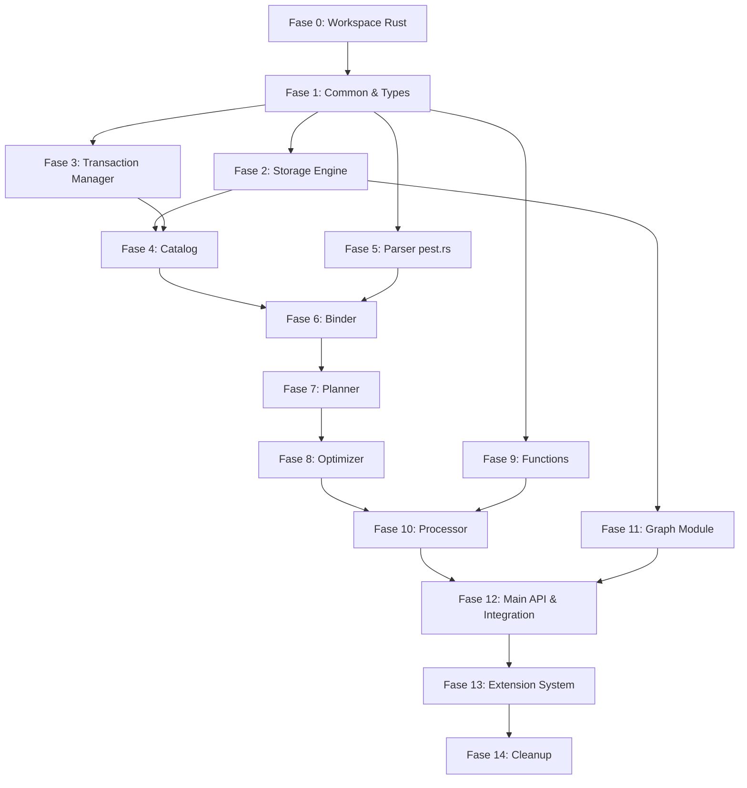

# Plan: Refaktor Kuzu C++ → Rust (Bertahap)

**TL;DR:** Porting ulang embedded graph database engine Kuzu dari C++20 ke Rust secara inkremental, modul per modul. Mulai dari lapisan paling bawah (common → storage → transaction → catalog) ke lapisan atas (parser → binder → planner → optimizer → processor), mengganti parser ANTLR4 dengan pest.rs (Rust-native). Setiap modul di-Rust-kan, diuji independen, lalu dihubungkan via FFI hingga C++ dapat dihilangkan sepenuhnya.

---

## Arsitektur Saat Ini (C++)

```
Cypher Query
    ↓
Parser (ANTLR4) ─── AST
    ↓
Binder ─── BoundStatement (catalog lookup, semantic analysis)
    ↓
Planner ─── LogicalPlan (join order enumeration)
    ↓
Optimizer (15+ passes) ─── Optimized LogicalPlan
    ↓
Processor ─── Physical Operators → Result
    ↓
Storage Engine (Buffer Mgr, WAL, Compression, Index, Table)
    ↓
Transaction Manager (MVCC, serializable)
```

## Arsitektur Target (Rust)

```
                    ┌──────────────────────┐
                    │   Public Rust API     │  (tools/rust_api/ — sudah ada)
                    │  Database, Connection │
                    └──────────┬───────────┘
                               │
                    ┌──────────▼───────────┐
                    │   kuzu-core (Rust)    │  <-- crate baru
                    │  module per module    │
                    └──────────┬───────────┘
                               │
          ┌────────────────────┼────────────────────┐
          ▼                    ▼                    ▼
   Rust-native modules   FFI bridge to C++    C++ modules (sisa)
   (sudah di-port)       (saat transisi)      (belum di-port)
```

---

## Fase 0: Foundation — Setup Proyek Rust

| # | Langkah | Deskripsi | Dependencies |
|---|---------|-----------|-------------|
| 0.1 | Buat workspace Cargo | Buat `kuzu-core/` Cargo workspace dengan sub-crates: `kuzu-common`, `kuzu-storage`, `kuzu-transaction`, `kuzu-catalog`, `kuzu-parser`, `kuzu-binder`, `kuzu-planner`, `kuzu-optimizer`, `kuzu-processor`, `kuzu-function`, `kuzu-graph`, `kuzu-main` | None |
| 0.2 | Setup CI/tooling | Rust edition 2024, clippy, rustfmt, nextest, cargo-deny (license check), criterion (benchmark) | 0.1 |
| 0.3 | Migrasi third-party ke Rust | Identifikasi dependensi C++ yang punya alternatif Rust: `spdlog` → `tracing`, `nlohmann_json` → `serde_json`, `re2` → `regex`, `roaring_bitmap` → `croaring`, `simsimd` → `wide`/`core_simd`, `fast_float` → `fast-float-rust`, `lz4`/`zstd`/`snappy` → crate Rust masing-masing | 0.1 |
| 0.4 | Benchmark baseline | Ukur performa Kuzu C++ existing dengan benchmark yang ada (`benchmark/`) sebagai referensi | 0.1 |

**Verifikasi Fase 0:** `cargo build --workspace` sukses, benchmark C++ baseline terekam.

---

## Fase 1: Common & Types (Foundation Layer)

*Lapisan paling dasar yang digunakan semua modul lain.*

| # | Langkah | Deskripsi | Dependencies |
|---|---------|-----------|-------------|
| 1.1 | Tipe data dasar | Port `src/include/common/types/` ke Rust: `LogicalType`, `PhysicalType`, `Value`, `InternalID`, date/time types, `Interval`, `Decimal`. Tipe union Rust + serde. | 0.1 |
| 1.2 | Enum & konstanta | Port semua enum dari `src/include/common/enums/` | 1.1 |
| 1.3 | Vector & DataChunk | Port `ValueVector` (kolom data typed), `DataChunk` (batch vektor). Ini unit data utama query engine. | 1.1 |
| 1.4 | File system abstraction | Port `FileSystem` — abstract I/O layer untuk local fs, HTTP, dll. Di Rust pakai `std::fs` + `tokio::fs` opsional. | 1.1 |
| 1.5 | Serialization | Port `Serializer`/`Deserializer` — LittleEndian binary serialization untuk storage. | 1.1 |
| 1.6 | Task system | Port thread pool / task scheduler dari `src/common/task_system/`. Rust punya `rayon` atau `tokio` untuk ini. | 1.1 |
| 1.7 | Memory management | Port `MemoryManager` — alokasi memori terkelola untuk buffer manager. | 1.1 |
| 1.8 | FFI bridge (Fase 1) | Modul Rust yang sudah selesai diekspos via `extern "C"` agar C++ yang belum di-port masih bisa memanggilnya. Atau sebaliknya: Rust panggil C++ yang belum di-port. | 1.1-1.7 |

**Verifikasi Fase 1:** Unit test tipe data, vector operations, serialization roundtrip. Benchmark vs C++ baseline.

---

## Fase 2: Storage Engine

*Jantung database — disk-based columnar storage, WAL, compression, buffer management.*

| # | Langkah | Deskripsi | Dependencies |
|---|---------|-----------|-------------|
| 2.1 | Buffer Manager | Port `BufferManager` — manajemen halaman memori, eviction policy (LRU? clock?), page pinning/unpinning. Alternatif Rust: `mmap`-based atau custom. | 1.7 |
| 2.2 | File handle & page management | Port `FileHandle` — mapping logical page → physical file offset. | 2.1 |
| 2.3 | Compression | Port `compression/` — Algoritma kompresi per kolom (constant, one-value, boolean, integer bitpacking, string dictionary, float, list). | 1.1 |
| 2.4 | WAL (Write-Ahead Log) | Port `wal/` — Write-ahead logging untuk crash recovery. | 2.1 |
| 2.5 | Shadow File | Port `shadow_file/` — Copy-on-write untuk versioning halaman. | 2.1 |
| 2.6 | Local Storage | Port `local_storage/` — Write buffer per-transaction sebelum commit. | 2.1 |
| 2.7 | Table Storage | Port `table/` — Columnar table, node table, rel table, node group, CSR adjacency index. | 2.1-2.6 |
| 2.8 | Index | Port `index/` — Hash index (primary key lookup). Di Rust bisa pakai `hashbrown` + custom storage. | 2.7 |
| 2.9 | Statistics | Port `stats/` — Column statistics untuk cardinality estimation optimizer. | 2.7 |
| 2.10 | Checkpointing | Port checkpoint logic — flush WAL → update main database files. | 2.4, 2.7 |

**Verifikasi Fase 2:** Test suite storage: create table, insert, read, checkpoint, recovery. Benchmark write throughput & read latency vs C++.

---

## Fase 3: Transaction Manager

| # | Langkah | Deskripsi | Dependencies |
|---|---------|-----------|-------------|
| 3.1 | Transaction context | Port `Transaction` — read/write transaction state, MVCC timestamp. | 1.1 |
| 3.2 | Transaction Manager | Port `TransactionManager` — koordinasi concurrent transactions, serializable isolation. | 3.1, 2.6 |
| 3.3 | Undo buffer | Port undo buffer untuk rollback write transaction. | 3.1, 2.6 |

**Verifikasi Fase 3:** Concurrent read/write test, serializable isolation test. Stress test concurrent transactions.

---

## Fase 4: Catalog

| # | Langkah | Deskripsi | Dependencies |
|---|---------|-----------|-------------|
| 4.1 | Catalog entries | Port `CatalogEntry`, `CatalogSet`, `TableCatalogEntry`, `RelGroupCatalogEntry`, `NodeTableCatalogEntry` | 1.1 |
| 4.2 | Catalog | Port `Catalog` — system catalog manager, schema storage. | 4.1, 3.1 |

**Verifikasi Fase 4:** DDL test: CREATE/DROP TABLE, catalog query.

---

## Fase 5: Parser (Rust-native)

*Mengganti ANTLR4 C++ dengan pest.rs (PEG parser) di Rust.*

| # | Langkah | Deskripsi | Dependencies |
|---|---------|-----------|-------------|
| 5.1 | Grammar rewrite | Tulis ulang grammar Cypher (`src/antlr4/Cypher.g4`) ke PEG grammar `pest.rs`. | 1.1 |
| 5.2 | AST types | Port AST node types (`Statement`, `Query`, `ReadingClause`, `ReturnClause`, dll) ke Rust enum, hapus pointer ownership. | 1.1 |
| 5.3 | Parser implementation | Implementasi parser dengan pest.rs — Cypher query text → AST. | 5.1, 5.2 |
| 5.4 | Parser tests | Port test parser dari `test/parser/` dan `test/test_files/`. | 5.3 |

**Verifikasi Fase 5:** Test ribuan Cypher queries dari test suite. Bandingkan AST output dengan parser C++ existing.

---

## Fase 6: Binder

| # | Langkah | Deskripsi | Dependencies |
|---|---------|-----------|-------------|
| 6.1 | Bound statement types | Port `BoundStatement`, `BoundQuery`, `BoundReadingClause`, dll. | 4.1, 5.2 |
| 6.2 | Binder implementation | Port `Binder` — semantic analysis, symbol resolution, catalog lookup, type checking. | 6.1, 4.2 |
| 6.3 | Expression binder | Port `expression_binder` — bind expressions (function calls, property access, parameters). | 6.2, 1.1 |
| 6.4 | DDL binder | Port DDL binder — CREATE/DROP/ALTER node/rel table binding. | 6.2, 4.2 |
| 6.5 | Rewriter & visitor | Port `rewriter/` dan `visitor/` — AST rewriting passes. | 6.2 |

**Verifikasi Fase 6:** Binder test suite — valid & invalid queries, error messages match.

---

## Fase 7: Planner

| # | Langkah | Deskripsi | Dependencies |
|---|---------|-----------|-------------|
| 7.1 | Logical operator types | Port logical operator enum: `LogicalScanNode`, `LogicalFilter`, `LogicalJoin`, dll. | 6.1 |
| 7.2 | Join order enumeration | Port `join_order/` — DPccp, greedy, atau algorithm join ordering. | 7.1 |
| 7.3 | Query planner | Port `QueryPlanner` — bound statement → logical plan. | 7.1, 7.2 |
| 7.4 | Plan utilities | Port plan utilities, property collection. | 7.1 |

**Verifikasi Fase 7:** Planner test suite. Bandingkan logical plan output dengan C++.

---

## Fase 8: Optimizer

| # | Langkah | Deskripsi | Dependencies |
|---|---------|-----------|-------------|
| 8.1 | Optimizer pass infrastructure | Port framework optimizer pass — daftar pass, apply order. | 7.1 |
| 8.2 | Individual optimizer passes | Port 15+ passes: filter push-down, projection push-down, join optimization, factorization rewriting, top-k optimization, cardinality estimation, dll. | 8.1, 2.9 |

**Verifikasi Fase 8:** Optimizer test suite. Bandingkan optimized plan.

---

## Fase 9: Function System

| # | Langkah | Deskripsi | Dependencies |
|---|---------|-----------|-------------|
| 9.1 | Function registry | Port `FunctionRegistry` — registrasi & lookup built-in functions. | 1.1 |
| 9.2 | Scalar functions | Port scalar functions: arithmetic, string, date, cast, comparison, boolean, list, struct, map, blob, uuid, dll. | 9.1, 1.3 |
| 9.3 | Aggregate functions | Port aggregate functions: COUNT, SUM, AVG, MIN, MAX, COLLECT, dll. | 9.1, 1.3 |
| 9.4 | Table functions | Port table functions untuk scan/export. | 9.1 |

**Verifikasi Fase 9:** Function test suite. Bandingkan hasil function evaluation.

---

## Fase 10: Processor (Query Execution)

| # | Langkah | Deskripsi | Dependencies |
|---|---------|-----------|-------------|
| 10.1 | Physical operator types | Port physical operator enum: `PhysicalScan`, `PhysicalFilter`, `PhysicalHashJoin`, `PhysicalOrderBy`, dll. | 7.1, 1.3 |
| 10.2 | Expression evaluator | Port `ExpressionEvaluator` — runtime expression evaluation dari optimized expression. | 10.1, 9.2 |
| 10.3 | Physical operator implementations | Implementasi setiap physical operator: scan → filter → join → aggregate → order by → limit → union → intersect, dll. Faktorized/worst-case optimal join. | 10.1, 10.2 |
| 10.4 | Result set materialization | Port `QueryResult` — hasil query bisa di-iterate, dikonversi ke Arrow/CSV. | 10.3 |

**Verifikasi Fase 10:** Full query test suite — SELECT, RETURN, UNION, subquery, aggregation.

---

## Fase 11: Graph Module

| # | Langkah | Deskripsi | Dependencies |
|---|---------|-----------|-------------|
| 11.1 | Graph data structures | Port `Graph`, `GraphEntry`, `OnDiskGraph` — graph traversal structures. | 2.7 |
| 11.2 | Graph algorithms | Port GDS functions dari `function/gds/` — PageRank, dll. Bisa pakai `petgraph` di Rust. | 11.1 |

**Verifikasi Fase 11:** Graph traversal & algorithm tests.

---

## Fase 12: Main API & Integration

| # | Langkah | Deskripsi | Dependencies |
|---|---------|-----------|-------------|
| 12.1 | Database class | Port `Database` — entry point, inisialisasi semua komponen. | 2.x, 3.x, 4.x, 5.x, 6.x, 7.x, 10.x |
| 12.2 | Connection class | Port `Connection` — query execution, prepared statement. | 12.1 |
| 12.3 | ClientContext | Port `ClientContext` — per-connection state, transaction management. | 12.2, 3.x |
| 12.4 | QueryResult | Port `QueryResult` — hasil query untuk user. | 10.4 |
| 12.5 | PreparedStatement | Port `PreparedStatement` — parameterized query. | 12.2 |
| 12.6 | Integrasi dengan tools/rust_api | Ganti FFI bridge C++ dengan panggilan langsung ke `kuzu-core` Rust. Hapus `cxx` dependency. | 12.1-12.5 |
| 12.7 | Hapus C++ FFI di rust_api | tools/rust_api panggil kuzu-core Rust langsung, bukan C++ via cxx. | 12.6 |

**Verifikasi Fase 12:** Full integration test — end-to-end queries, prepared statements, concurrent access.

---

## Fase 13: Extension System

| # | Langkah | Deskripsi | Dependencies |
|---|---------|-----------|-------------|
| 13.1 | Extension framework | Port `ExtensionManager`, `ExtensionLoader` — load/unload extensions di Rust. | 12.1 |
| 13.2 | Extension porting | Port ekstensi satu per satu: JSON, FTS, Vector, DuckDB, Postgres, SQLite, dll. | 13.1 |
| 13.3 | WASM support | Pastikan Rust bisa di-compile ke WASM (wasm-pack). | 12.6 |

**Verifikasi Fase 13:** Extension test suite. WASM build test.

---

## Fase 14: Cleanup & Finalization

| # | Langkah | Deskripsi | Dependencies |
|---|---------|-----------|-------------|
| 14.1 | Hapus kode C++ | Setelah semua modul di-port, hapus `src/`, `third_party/` C++, `CMakeLists.txt`. | All |
| 14.2 | Update build system | Hapus CMake, ganti dengan Cargo workspace sepenuhnya. | 14.1 |
| 14.3 | Update CI/CD | Migrasi CI dari CMake ke Cargo. | 14.2 |
| 14.4 | Update language bindings lain | Python, Node.js, Java bindings perlu diupdate untuk panggil Rust (via C FFI) bukan C++. | 14.1 |

**Verifikasi Fase 14:** Full test suite lulus, semua binding berfungsi.

---

## Diagram Alur Refaktor



---

## Strategi FFI Transisi

Selama transisi, modul yang sudah di-Rust-kan perlu berkomunikasi dengan modul C++ yang belum di-port:

```
┌─────────────────────────────────────────────────┐
│                   Rust crate                     │
│  ┌──────────┐  ┌──────────┐  ┌───────────────┐  │
│  │ Parser   │─▶│ Binder   │─▶│ Planner (Rust)│  │
│  │ (Rust)   │  │ (Rust)   │  │               │  │
│  └──────────┘  └────┬─────┘  └───────┬───────┘  │
│                      │                │          │
│              ┌───────▼────────┐       │          │
│              │  FFI Bridge     │       │          │
│              │ (extern "C")    │       │          │
│              └───────┬────────┘       │          │
└──────────────────────┼────────────────┼──────────┘
                       │                │
              ┌────────▼────────────────▼──────┐
              │       C++ library (sisa)        │
              │  Optimizer → Processor → Storage │
              └─────────────────────────────────┘
```

Setiap modul Rust selesai → ganti FFI call ke C++ dengan panggilan Rust langsung. Pola ini memungkinkan progress bertahap tanpa harus "big bang" rewrite.

---

## File Kritis

| File C++ | Rust Target | Prioritas |
|----------|-------------|-----------|
| `src/include/common/types/` | `kuzu-common/src/types.rs` | Tinggi |
| `src/include/common/vector/value_vector.h` | `kuzu-common/src/vector.rs` | Tinggi |
| `src/include/common/data_chunk/data_chunk.h` | `kuzu-common/src/data_chunk.rs` | Tinggi |
| `src/storage/buffer_manager/*` | `kuzu-storage/src/buffer_manager.rs` | Tinggi |
| `src/storage/wal/*` | `kuzu-storage/src/wal.rs` | Tinggi |
| `src/storage/compression/*` | `kuzu-storage/src/compression.rs` | Tinggi |
| `src/storage/store/*` | `kuzu-storage/src/store.rs` | Tinggi |
| `src/storage/index/hash_index.h` | `kuzu-storage/src/index.rs` | Tinggi |
| `src/transaction/*` | `kuzu-transaction/src/lib.rs` | Sedang |
| `src/catalog/*` | `kuzu-catalog/src/lib.rs` | Sedang |
| `src/antlr4/Cypher.g4` | `kuzu-parser/src/grammar.pest` | Sedang |
| `src/parser/*` | `kuzu-parser/src/lib.rs` | Sedang |
| `src/binder/*` | `kuzu-binder/src/lib.rs` | Sedang |
| `src/planner/*` | `kuzu-planner/src/lib.rs` | Rendah |
| `src/optimizer/*` | `kuzu-optimizer/src/lib.rs` | Rendah |
| `src/processor/*` | `kuzu-processor/src/lib.rs` | Rendah |
| `src/function/*` | `kuzu-function/src/lib.rs` | Rendah |
| `src/graph/*` | `kuzu-graph/src/lib.rs` | Rendah |
| `src/main/*` | `kuzu-main/src/lib.rs` | Rendah |
| `tools/rust_api/*` | Di-update untuk panggil kuzu-core langsung | Nanti |

---

## Verifikasi Akhir

1. **Functional**: Full TCK (Temporal Cypher Compatibility Kit) test suite lulus — ribuan query patterns
2. **Performance**: Benchmark (LDBC SNB, LSQB, click benchmarks) dalam 10% performa C++ baseline
3. **Correctness**: ACID transaction tests (serializable isolation, crash recovery)
4. **Compatibility**: API kompatibel dengan tools/rust_api yang sudah ada, semua binding (Python, Node.js, Java) tetap berfungsi via C FFI
5. **Safety**: Zero unsafe code (kecuali FFI boundary), clippy clean, no data races (Send + Sync)

---

## Estimasi Timeline (Solo Developer)

| Fase | Estimasi | Catatan |
|------|----------|---------|
| Fase 0: Setup | 1-2 minggu | |
| Fase 1: Common & Types | 2-4 minggu | Kritis, harus benar |
| Fase 2: Storage Engine | 3-6 bulan | Tersulit, paling banyak kode |
| Fase 3: Transaction | 2-4 minggu | |
| Fase 4: Catalog | 2-3 minggu | |
| Fase 5: Parser | 4-8 minggu | Grammar rewrite besar |
| Fase 6: Binder | 2-3 bulan | Kompleksitas tinggi |
| Fase 7: Planner | 4-8 minggu | |
| Fase 8: Optimizer | 2-3 bulan | 15+ optimization passes |
| Fase 9: Functions | 4-8 minggu | Banyak fungsi built-in |
| Fase 10: Processor | 3-6 bulan | WCOJ, factorization |
| Fase 11: Graph | 2-4 minggu | |
| Fase 12: Main API | 2-4 minggu | |
| Fase 13: Extensions | 2-4 bulan | Per extension |
| Fase 14: Cleanup | 2-4 minggu | |
| **Total** | **~18-36 bulan** | Solo, part-time |

---

## Scope

### Included
- ✅ Rewrite semua 13 modul C++ core ke Rust
- ✅ Parser ANTLR4 diganti pest.rs
- ✅ Storage engine full (buffer, WAL, compression, index, checkpoint)
- ✅ MVCC transaction manager
- ✅ Full Cypher query pipeline
- ✅ Extension system
- ✅ Integrasi penuh dengan tools/rust_api

### Excluded (untuk saat ini)
- ❌ Rewrite Python bindings — tetap panggil Rust via C FFI
- ❌ Rewrite Node.js/Java bindings — tetap via C FFI
- ❌ Rewrite extensions (DuckDB, Postgres, dll) — prioritas setelah core selesai
- ❌ Perubahan arsitektur fundamental — porting dengan arsitektur yang sama
