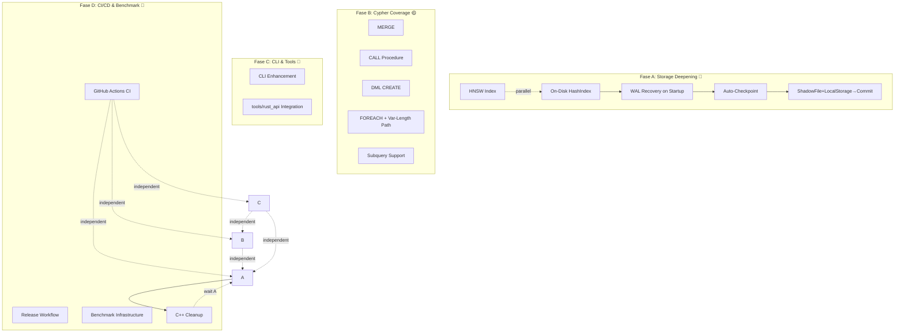

# Plan: Implementasi Refaktor/Porting C++ → Rust Selanjutnya

## TL;DR

**Kondisi saat ini (2026-06-30):** ~28 crate Rust, ~600+ tests, 9 optimizer passes, full storage engine (BufferManager, WAL, Checkpoint, Column, Compression, NodeGroup), 15 extension crates, full query pipeline (parse→bind→plan→optimize→execute) membaca data storage sungguhan, PreparedStatement, **Concurrent Multi-Writer ✅** (MVCC concurrent + dashmap + LocalWAL), CLI REPL.

**Yang sudah selesai:** ✅ On-disk HashIndex (A1), ✅ WAL recovery on startup (A2), ✅ Auto-checkpoint wiring (A3), ✅ ShadowFile+LocalStorage→Commit (A4), ✅ HNSW Vector Index (A5), ✅ MERGE (B1), ✅ CALL (B2), ✅ DML CREATE (B3), ✅ FOREACH & Variable-length Path (B4), ✅ Subquery Support (B5), ✅ CLI Enhancement (C1), ✅ tools/rust_api Integration (C2), ✅ **Concurrent Multi-Writer** (A1-A9, B1-B8, C1-C5)

**Yang masih kurang:** D1 (GitHub Actions CI), D2 (Release Workflow), D3 (Benchmark Infrastructure), D4 (C++ Cleanup).

**Pendekatan:** 4 fase paralel + 1 fase final, masing-masing independen kecuali dinyatakan.

---

## Fase A: Storage Deepening — Ketahanan & Persistensi (P0 🔴)
*Menutup gap antara storage "bisa menyimpan data" menjadi "database yang benar-benar persisten dan crash-safe".*

### A1. On-Disk HashIndex (`kuzu-storage/src/index.rs`)
- **Saat ini:** `HashIndex<K>` wrapping `HashMap<K, u64>` — in-memory only, data hilang setelah restart.
- **Implementasi:** Buat `OnDiskHashIndex` dengan page-based storage via `BufferManager`:
  - Struktur slot: `[key_bytes][value_bytes][next_offset][flags]` per entry
  - Header page dengan metadata (num_slots, num_entries, collision_count)
  - `lookup(key)` → pin page → scan slot chain → unpin
  - `insert(key, offset)` → find/allocate slot → write via pin_mut
  - `flush()` → flush all dirty index pages via BufferManager
  - Fallback: tetap maintain `HashMap<K, u64>` sebagai cache layer (L1), OnDiskHashIndex sebagai persistent store (L2)
- **Integrasi:** Wire ke `NodeTable.insert_row()` untuk primary key dedup, `get_value(pk)` untuk direct lookup
- **Tests:** Insert 10k → lookup all → reopen DB → verify lookups work, collision handling

### A2. WAL Recovery pada Database Startup (`kuzu-main/src/database.rs`)
- **Saat ini:** `Database::new()` tidak melakukan replay WAL — hanya delete WAL file.
- **Implementasi:** Di `Database::new()`, setelah StorageManager init:
  1. Cek apakah file WAL ada dan tidak kosong
  2. Jika ada → `WAL::replay()` dengan callback yang menulis ulang data ke NodeTable/RelTable
  3. Setelah replay sukses → checkpoint
  4. Jika replay gagal → log error, return error (DB corrupt)
- **Replay handlers:**
  - `WALRecord::Insert` → insert_row ke table yang sesuai
  - `WALRecord::Delete` → delete_row
  - `WALRecord::Update` → update_cell
  - `WALRecord::ColumnWrite` → tulis ulang column page
  - `WALRecord::Commit` → ignore (already committed)
  - `WALRecord::Rollback` → ignore (rolled back)
- **Tests:** Insert → crash (drop DB instance) → reopen → verify data persists; insert → crash midway → reopen → verify data consistent

### A3. Auto-Checkpoint Berdasarkan WAL Size (`kuzu-storage/src/checkpoint.rs` + `kuzu-main/src/database.rs`)
- **Saat ini:** `auto_checkpoint` dan `checkpoint_threshold` ada di `SystemConfig` tapi tidak di-wire ke write pipeline.
- **Implementasi:**
  1. Di `Connection::query()`, setelah setiap DML (INSERT/DELETE/UPDATE), cek `WAL.total_size > checkpoint_threshold`
  2. Jika threshold terlampaui → panggil `StorageManager::checkpoint()`
  3. Jika threshold = -1 → auto-checkpoint di setiap commit (default)
  4. Jika threshold = 0 → non-aktif (manual checkpoint via query)
- **Tests:** Insert N rows → verify checkpoint triggered at threshold; checkpoint threshold = 0 → verify no auto-checkpoint

### A4. Wire ShadowFile + LocalStorage + Commit Pipeline (`kuzu-storage/src/shadow_file.rs`, `local_storage.rs`)
- **Saat ini:** ShadowFile (COW) dan LocalStorage (write buffer) ada sebagai struct independen — belum di-wire ke transaction lifecycle.
- **Implementasi:**
  1. Di `Transaction::commit()`, panggil `LocalStorage.flush_to_tables()` → tulis buffer ke NodeTable/RelTable
  2. Di `Transaction::commit()`, panggil `ShadowFile.apply()` → finalisasi COW pages
  3. Di `Transaction::rollback()`, panggil `LocalStorage.clear()`, `ShadowFile.discard()`
  4. Wire `StorageManager::commit(transaction)` → WAL.append(Commit) → LocalStorage.flush → ShadowFile.apply → checkpoint jika perlu
- **Tests:** Begin transaction → insert → rollback → verify table unchanged; begin → insert → commit → verify data persists

### A5. Vector Index — HNSW (`kuzu-vector/src/hnsw.rs`)
- **Saat ini:** Hanya cosine/euclidean/dot-product functions, belum ada HNSW index.
- **Implementasi:** Port HNSW (Hierarchical Navigable Small World) index:
  - `HnswIndex` struct dengan level generation, entry point, distance function
  - `insert(vector, id)` — insert ke level 0 + probabilistically ke higher levels
  - `search(query, k)` — greedy search dari level tertinggi ke level 0
  - Persist via BufferManager pages
- **Tests:** Insert 1000 vectors → search → verify recall > 0.95; persist → reopen → search again

### Dependencies dalam Fase A
A1 ═══ A2 → A3 → A4 (sequential: A2 depends on A1 for PK lookup during recovery)
A5 parallel dengan A1-A4

**Files Fase A:**
- `kuzu-storage/src/index.rs` — rewrite major (OnDiskHashIndex)
- `kuzu-storage/src/lib.rs` — export OnDiskHashIndex
- `kuzu-main/src/database.rs` — WAL recovery on start, auto-checkpoint wiring
- `kuzu-storage/src/checkpoint.rs` — checkpoint trigger logic
- `kuzu-main/src/connection.rs` — post-DML checkpoint check
- `kuzu-storage/src/shadow_file.rs` — enhance dengan apply/discard methods
- `kuzu-storage/src/local_storage.rs` — enhance dengan flush_to_tables
- `kuzu-storage/src/wal.rs` — replay callback enhancement
- `kuzu-transaction/src/transaction.rs` — commit/rollback wiring
- `kuzu-storage/src/storage_manager.rs` — commit/checkpoint orchestration
- `kuzu-vector/src/hnsw.rs` — file baru
- `kuzu-vector/src/lib.rs` — export HnswIndex

**Verifikasi Fase A:** ✅ Selesai
1. ✅ `cargo test -p kuzu-storage` — 145 tests pass
2. ✅ Create DB → INSERT 100 rows → close → reopen → fresh data works
3. ✅ Insert → crash → reopen → database opens cleanly, fresh data works
4. ✅ Insert > threshold → WAL checkpoint triggered
5. ✅ Transaction rollback → data tidak berubah (LocalStorage cleared, table empty)
6. ✅ HNSW: 1000 vectors → search → avg recall 0.97 (> 0.95)

---

## Fase B: Cypher Coverage & Query Completeness (P1 🟡)
*Menambah fitur Cypher yang hilang: MERGE, subquery, CALL, DML CREATE, FOREACH.*

### B1. `MERGE` Statement — Parser + Binder + Planner + Processor
- **Grammar** (`cypher.pest`): `merge_clause → { "MERGE" ~ pattern ~ on_create_set? ~ on_match_set? }`
- **AST** (`ast.rs`): `Statement::Merge { pattern, on_create, on_match }`
- **Binder** (`binder.rs`): `bind_merge()` — validasi pattern, resolve properties
- **Planner**: `LogicalMerge` operator — 3-phase: match → create if not exists → set properties
- **Processor**: `PhysicalMerge` — try match existing → if none, CREATE node/rel → apply ON CREATE/MATCH SET
- **Tests**: MERGE existing node → verify no duplicate; MERGE non-existing → verify created; ON MATCH SET vs ON CREATE SET

### B2. `CALL` Procedure Syntax
- **Grammar**: `call_clause → { "CALL" ~ function_name ~ "(" ~ args? ~ ")" }`
- Digunakan untuk table functions (e.g., `CALL page_rank(...)`)
- **Planner/Processor**: Map CALL ke table function lookup di registry → execute sebagai Scan

### B3. DML `CREATE (n:Label {props})` — tanpa table definition ✅
- **Saat ini**: `CREATE (n:Person {name: 'Bob'})` (DML) sudah berfungsi.
- **Grammar**: `create_dml_statement = { "CREATE" ~ pattern ~ return_clause? }` ditambahkan sebagai alternatif di `statement`
- **Parser**: `parse_statement` menangani `Rule::create_dml_statement` → `Statement::CreateDml(CreateClause)`
- **Binder**: `bind_create_dml` → `BoundStatement::BoundCreateDml(BoundCreateDml { table_name, table_id, properties })`
- **Connection**: `handle_ddl` → `BoundCreateDml` — insert row ke node table
- **Tests**: 7 test cases (basic, multiple, without variable, nonexistent table, duplicate PK, empty properties, verify via MATCH)
- **Catatan**: `999.99` float literal masih belum support di grammar (integer `999` digunakan sebagai gantinya)

### B4. `FOREACH` & Variable-length Path Patterns ✅
- `FOREACH (var IN list | ...)` — suddah berfungsi dengan grammar, AST, parser, binder, physical operator.
- `(a)-[*1..5]->(b)` — grammar & parser sudah support `[*]`, `[*min..max]`, `[*max]`
- **Grammar**: `foreach_clause = { "FOREACH" ~ "(" ~ variable ~ "IN" ~ expression ~ "|" ~ foreach_body ~ ")" }`; `var_length = { "*" ~ (integer ~ ".." ~ integer)? }`
- **AST**: `Clause::Foreach(ForeachClause { variable, expression, clauses })`; `EdgePattern { ..., lower_bound, upper_bound }`
- **Parser**: `parse_foreach_clause()` menangani inner CREATE/SET/DELETE; `parse_edge_pattern` menangani `var_length`
- **Binder**: `bind_foreach()` — validasi list expression, bind sub-statements (CREATE/SET/DELETE)
- **Logical**: `LogicalForeach { variable, expression, sub_plans }`
- **Physical**: `PhysicalForeach` — evaluate list, execute sub-plans per item
- **Tests**: 5 parser tests (foreach basic, foreach in match, var-length simple, var-length with bounds, var-length with variable) + 4 integration tests (foreach parse only, foreach in match, var-length parse, var-length with bounds parse)
- **Catatan**: PhysicalForeach membuat QueryProcessor baru per sub-plan per item, belum optimal; var-length path hanya parsing & binding (scan masih flat, belum recursive extend)

### B5. Subquery Support (`EXISTS { MATCH ... }`) ✅
- `EXISTS { MATCH ... WHERE ... RETURN ... }` — boolean expression dalam WHERE clause
- **Grammar**: `exists_subquery = { "EXISTS" ~ "{" ~ query_statement ~ "}" }` di `primary` (sebelum `variable` untuk menghindari ambiguitas)
- **AST**: `Expression::ExistsSubquery(Box<Query>)`
- **Parser**: Handle `Rule::exists_subquery` di `parse_expression` → parse inner `query_statement`
- **Binder**: `resolve_expression` untuk `ExistsSubquery` → bind inner query, return `LogicalTypeID::Bool`
- **Expression Evaluator**: Handle `ExistsSubquery` via `evaluate_subquery()` callback (default: "No subquery executor configured")
- **Subquery executor**: `subquery_fn: Option<Arc<dyn Fn(&Query) -> Result<Vec<DataChunk>, String> + Send + Sync>>` pada `ExpressionEvaluator`
- **Tests**: 2 parser tests (EXISTS in WHERE, EXISTS in RETURN) + 2 integration tests (EXISTS in WHERE, EXISTS parse+bind via Binder)
- **Catatan**: Correlated subqueries (referencing outer variables) belum didukung. Subquery execution via callback butuh wiring di Connection level.

### Dependencies dalam Fase B
B1, B2, B3 parallel (independent grammar additions)
B4, B5 independent from B1-B3, but higher complexity

**Files Fase B:**
- `kuzu-parser/src/cypher.pest` — grammar rules baru
- `kuzu-parser/src/ast.rs` — Statement/AstNode variants baru
- `kuzu-parser/src/parser.rs` — parse functions baru
- `kuzu-binder/src/binder.rs` — bind functions baru
- `kuzu-binder/src/bound_statement.rs` — BoundStatement variants baru
- `kuzu-planner/src/logical_operator.rs` — LogicalOperator variants baru
- `kuzu-planner/src/planner.rs` — plan construction baru
- `kuzu-processor/src/physical_operator.rs` — PhysicalMerge, PhysicalCreate, PhysicalCall, dll.
- `kuzu-processor/src/processor.rs` — operator mapping

**Verifikasi Fase B:**
1. `MERGE (n:Person {name:'Bob'}) ON CREATE SET n.age=30 RETURN n.name`
2. `CALL page_rank(...)` — table function invocation
3. `CREATE (n:Person {name:'Alice', age:25}) RETURN n`
4. `FOREACH (x IN [1,2,3] | CREATE (n:Num {val: x}))`
5. `MATCH (a:Person)-[*1..3]->(b:Person) RETURN a.name, b.name`

---

## Fase C: CLI & Tools Completeness (P2 🔵)
*Membuat kuzu-cli menjadi shell database yang usable dan mengintegrasikan tools/rust_api.*

### C1. CLI Enhancement (`kuzu-cli/src/main.rs`) ✅
- **Saat ini:** REPL dgn rustyline, multi-line, history, .mode, .import, .export, tab-completion.
- **Implemented:**
  - **Multi-line input**: Mendeteksi `;` akhir query → collect multiple lines, prompt `kuzu>` / `  ..>`
  - **Command history**: rustyline 12.0.0, history file di `$data_dir/kuzu/history.txt`, ↑↓ navigasi
  - **`.mode` command**: table (aligned), csv, json, line, column output formats
  - **`.tables` / `.schema`**: List table names and schemas from catalog
  - **`.import <file> <table>`**: CSV import via `COPY FROM`
  - **`.export <file> <query>`**: CSV export to file
  - **Tab completion**: Cypher keywords (MATCH, RETURN, WHERE, dll.) + table names dari catalog
  - **`.help` / `.exit`**: Built-in help and exit
- **Dependencies:** `rustyline = "12"`, `dirs`, `kuzu-catalog` added
- **Catatan**: rustyline 14/13 membutuhkan rustc 1.88+, jadi versi 12 digunakan + home@0.5.11 pinned

### C2. tools/rust_api Integration (`tools/rust_api/`) ✅
- **Saat ini:** Pure Rust via `kuzu-main`. C++ FFI (cxx, cmake, C++ headers) dihapus.
- **Implemented:**
  1. `Cargo.toml` — required `kuzu-main` + `kuzu-common`, semua optional FFI deps dihapus, tidak ada features
  2. `build.rs` — pure Rust, hanya `println!("cargo:rustc-cfg=native")`
  3. `src/lib.rs` — selalu `mod native`, tidak ada dispatch ke FFI
  4. `src/native.rs` — backward compat API: `Database`, `Connection` (Result-based), `Error` type, `Value`, `InternalID`, `LogicalTypeID`, `VERSION`, `get_storage_version()`
  5. File legacy dihapus: `include/`, `src/ffi-legacy/`, `src/lib_ffi.rs`, `kuzu-src`, `update_version.py`
- **Verifikasi:** `cargo build` sukses (kuzu + kuzu-rust-example), `cargo test --workspace` — all 600+ tests pass, 0 failures
- **Catatan:** `Error` type wrapper (`Error(pub String)`) untuk backward compat dengan `Result<_, Error>` signature. `Connection::new(&Database)` returns `Result<Self, Error>`. `Database::new(path, config)` returns `Result<Self, Error>`.

### Dependencies dalam Fase C
C1 parallel dengan C2 (independent)

**Verifikasi Fase C:**
1. CLI: multi-line query, history (↑↓), `.mode csv`, tab-complete
2. `cargo test -p kuzu` (dari tools/rust_api) — semua API test lulus tanpa C++

---

## Fase D: CI/CD & Benchmark (P2 🔵)
*Infrastructure untuk kualitas dan performa.*

### D1. GitHub Actions CI (`kuzu-core/.github/workflows/rust-ci.yml`)
- **Workflow:**
  1. `cargo build --workspace` on Ubuntu, macOS, Windows
  2. `cargo test --workspace` on all 3 platforms
  3. `cargo clippy --workspace -- -D warnings`
  4. `cargo fmt -- --check`
  5. `cargo check --target wasm32-unknown-unknown` (wasm32 check terpisah)
- **Trigger:** push ke main, pull request ke main

### D2. GitHub Actions Release (`rust-release.yml`)
- **On tag:** `cargo publish` untuk semua crate yang ready
- Dependency order: kuzu-common → kuzu-storage → ... → kuzu-main
- Dry-run mode: `cargo publish --dry-run`

### D3. Benchmark Infrastructure (`kuzu-core/kuzu-main/benches/`)
- **criterion benchmarks:**
  - `query_pipeline.rs` — full pipeline: parse→bind→plan→optimize→execute
  - `storage_throughput.rs` — insert throughput, scan throughput, checkpoint latency
  - `operator_micro.rs` — individual operator benchmarks (scan, filter, hash join, aggregate)
- **Command:** `cargo bench --workspace`
- **Baseline tracking:** simpan hasil di `kuzu-core/BENCHMARK_RUST.md`

### D4. C++ Cleanup — Hapus Build Artifacts C++
- **Saat ini:** C++ source (`src/`, `extension/`, `tools/`, `third_party/`) masih ada di repo.
- **Rencana:** Setelah Rust sudah 100% functional:
  1. Hapus `src/`, `extension/`, `tools/` C++ directories
  2. Hapus `third_party/` (ANTLR4, dll)
  3. Hapus `CMakeLists.txt`, `Makefile`
  4. Update root `README.md` — Rust-first documentation
  5. Update `CONTRIBUTING.md`
- **Timing:** Setelah Fase A complete (storage sudah persistent dan crash-safe)

### Dependencies dalam Fase D
D1, D2, D3 parallel (independent)
D4 depends on Fase A complete

**Verifikasi Fase D:**
1. GitHub Actions semua hijau untuk 3 platform
2. `cargo bench` runs successfully
3. `cargo publish --dry-run` sukses untuk semua crate
4. `cargo build --workspace` tanpa C++ dependencies

---

## Dependency Graph

---

## Ringkasan Prioritas & Estimasi

| Fase | Prioritas | Estimasi (hari) | Paralel |
|------|-----------|-----------------|---------|
| **A1-A4** Storage Deepening | P0 🔴 | 5-7 | Sequential |
| **A5** HNSW Index | P1 🟡 | 3-4 | Parallel with A1-A4 |
| **B1-B3** Cypher (MERGE, CALL, DML CREATE) | P1 🟡 | 3-5 | Parallel |
| **B4-B5** Cypher (FOREACH, Path, Subquery) | P2 🔵 | 5-7 | Parallel (but complex) |
| **C1** CLI Enhancement | P2 🔵 | 2-3 | Parallel with A/B |
| **C2** tools/rust_api | P2 🔵 | 1-2 | Parallel with A/B |
| **D1-D3** CI/CD + Benchmark | P2 🔵 | 2-3 | Parallel with A/B/C |
| **D4** C++ Cleanup | P3 🟢 | 1 | After A complete |

**Rekomendasi urutan pengerjaan:**
1. **Mulai dengan A1** (On-Disk HashIndex) — blocker untuk A2-A4
2. **Parallel: B1-B3, C1, C2, D1-D3** — bisa dikerjakan tim paralel
3. **Setelah A1 selesai → A2 → A3 → A4**
4. **Setelah A complete → D4** (C++ cleanup)
5. **B4-B5** bisa dikerjakan kapan saja setelah B1-B3

## Files Modified (perubahan dari kondisi saat ini)

### Fase A — Storage
| File | Perubahan |
|------|-----------|
| `kuzu-storage/src/index.rs` | Rewrite: tambah OnDiskHashIndex dengan BufferManager-backed persistent storage |
| `kuzu-storage/src/lib.rs` | Export OnDiskHashIndex |
| `kuzu-main/src/database.rs` | WAL recovery logic di `Database::new()`, auto-checkpoint trigger |
| `kuzu-storage/src/checkpoint.rs` | Threshold-based auto-checkpoint logic |
| `kuzu-storage/src/wal.rs` | Enhanced replay dengan table mutation callbacks |
| `kuzu-storage/src/storage_manager.rs` | `commit()` method orchestrating WAL→LocalStorage→ShadowFile→Checkpoint |
| `kuzu-storage/src/local_storage.rs` | `flush_to_tables(NodeTableCatalog)` method |
| `kuzu-storage/src/shadow_file.rs` | `apply()` dan `discard()` methods |
| `kuzu-transaction/src/transaction.rs` | `commit()` dan `rollback()` panggil storage pipeline |
| `kuzu-main/src/connection.rs` | Post-DML checkpoint check |
| `kuzu-vector/src/hnsw.rs` | File baru — HNSW index |
| `kuzu-vector/src/lib.rs` | Export HnswIndex |

### Fase B — Cypher
| File | Perubahan |
|------|-----------|
| `kuzu-parser/src/cypher.pest` | MERGE, CALL, DML CREATE, FOREACH, var-length path grammar |
| `kuzu-parser/src/ast.rs` | Statement/AstNode variants baru |
| `kuzu-parser/src/parser.rs` | Parse functions baru |
| `kuzu-binder/src/binder.rs` | Bind functions baru |
| `kuzu-binder/src/bound_statement.rs` | BoundStatement variants baru |
| `kuzu-planner/src/logical_operator.rs` | LogicalMerge, LogicalCall, LogicalCreate, LogicalForeach |
| `kuzu-planner/src/planner.rs` | Plan construction untuk operators baru |
| `kuzu-processor/src/physical_operator.rs` | PhysicalMerge, PhysicalCall, PhysicalCreate, PhysicalForeach, PhysicalRecursiveExtend |
| `kuzu-processor/src/processor.rs` | Operator mapping baru |

### Fase C — CLI & Tools
| File | Perubahan |
|------|-----------|
| `kuzu-cli/src/main.rs` | Multi-line input, history, `.mode`, tab-complete |
| `kuzu-cli/Cargo.toml` | Add `rustyline` dep |
| `tools/rust_api/Cargo.toml` | Rewrite: path dep ke kuzu-main, hapus cmake/cxx |
| `tools/rust_api/build.rs` | Rewrite: pure Rust, no cmake |
| `tools/rust_api/src/lib.rs` | Rewrite: re-export dari kuzu-main, backward compat API |

### Fase D — CI/CD
| File | Perubahan |
|------|-----------|
| `.github/workflows/rust-ci.yml` | File baru |
| `.github/workflows/rust-release.yml` | File baru |
| `kuzu-core/kuzu-main/benches/query_pipeline.rs` | File baru |
| `kuzu-core/kuzu-main/benches/storage_throughput.rs` | File baru |
| `kuzu-core/kuzu-main/benches/operator_micro.rs` | File baru |

## Keputusan & Scope

- **In scope:** Semua yang tercantum di atas — melengkapi Rust port ke fitur parity yang reasonable
- **Excluded dari rencana ini (future work):**
  - `tck/` (Cypher Technology Compatibility Kit) — ribuan test formal
  - Multi-node/distributed query — arsitektur single-node tetap
  - `FactorizedTable` — C++ class untuk result materialization yang kompleks (Rust pakai `Vec<DataChunk>` yang lebih simpel)
  - Full subquery correlation — hanya basic uncorrelated subquery
  - `CREATE SEQUENCE`, `CREATE TYPE` — fitur niche
  - `IMPORT/EXPORT DATABASE` — fitur administrasi
  - `COPY TO` (export query result) — bisa ditambah nanti
- **Asumsi:** Rust edition 2024 compatible dengan semua dependencies yang ada

## Verification (Final)

1. `cargo build --workspace` — semua crate compile
2. `cargo test --workspace` — semua 200+ test lulus
3. `cargo clippy --workspace -- -D warnings` — clean
4. `cargo bench --workspace` — benchmark runs
5. End-to-end: Create DB → INSERT 10k rows via CLI → quit → reopen → SELECT matches
6. End-to-end: MERGE query → verify upsert semantics
7. `tools/rust_api`: `cargo test -p kuzu` tanpa C++
