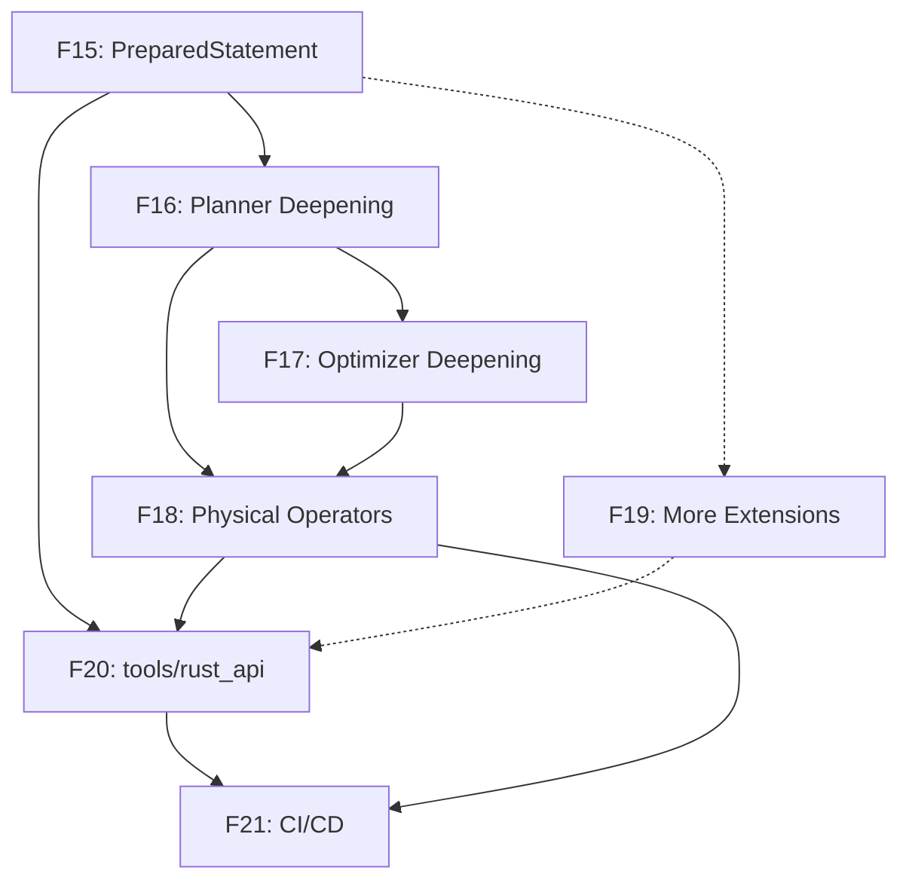

# Plan: Lanjutan — Mengatasi Gaps vs Original Plan

**TL;DR:** 7 fase tambahan untuk menutup semua gap yang tersisa dari rencana refaktor original. Pendekatan incremental: setiap fase selesai → test dulu sebelum lanjut.

---

## Gap Summary

| # | Gap | Severity | Status Sekarang |
|---|-----|----------|-----------------|
| 1 | PreparedStatement | 🟡 Medium | Belum ada |
| 2 | Join Order Enumeration | 🔴 Critical | Flat list, no join tree |
| 3 | Optimizer Passes | 🟡 Medium | 5/8 passes masih stub |
| 4 | Physical Operators | 🟡 Medium | HashJoin placeholder |
| 5 | Extensions (12 remaining) | 🟢 Low | Hanya JSON + FTS |
| 6 | tools/rust_api Integration | 🟡 Medium | Masih C++ FFI |
| 7 | CI/CD | 🟢 Low | Belum ada Rust CI |

---

## Fase 15: PreparedStatement

**Tujuan:** Parameterized query support — `prepare()` + `execute()` dengan binding parameter.

| Step | Deskripsi | Depends On |
|------|-----------|------------|
| 15.1 | `PreparedStatement` struct — simpan query string, bound statement, logical plan, parameter map | — |
| 15.2 | `Connection::prepare()` — parse + bind tanpa eksekusi, validasi parameter | 15.1 |
| 15.3 | `Connection::execute()` — substitusi parameter → plan → optimize → execute | 15.2 |
| 15.4 | Parameter type checking — cocokkan tipe parameter dengan expected type | 15.2 |
| 15.5 | Statement cache — `HashMap` di Connection untuk prepared statements yang sudah diparsing | 15.2 |
| 15.6 | Tests — parameter binding, type mismatch, cache hit/miss, reuse | 15.3-15.5 |

**Verifikasi:** Prepared statement test suite: bind params, execute with different values, type errors.

**Relevant files:**
- `kuzu-main/src/connection.rs` — tambah `prepare()`, `execute()`
- `kuzu-main/src/prepared_statement.rs` — baru
- `kuzu-binder/src/binder.rs` — mungkin perlu exposed parameter extraction

---

## Fase 16: Join Order Enumeration (Planner Deepening)

**Tujuan:** Mengganti flat list planner dengan tree-based join planning.

| Step | Deskripsi | Depends On |
|------|-----------|------------|
| 16.1 | Join tree data structures — `JoinTreeNode` enum (Leaf, InnerJoin, CrossProduct) | — |
| 16.2 | Query graph extraction — kumpulkan semua node/rel patterns jadi query graph | — |
| 16.3 | Simple join ordering — greedy heuristic (smallest table first) | 16.1, 16.2 |
| 16.4 | LogicalHashJoin operator — implementasi join condition + build/probe sides | 16.3 |
| 16.5 | Multi-MATCH support — multiple MATCH clauses digabung dengan join | 16.3 |
| 16.6 | LogicalCrossProduct operator — untuk cross product ketika no join condition | 16.5 |
| 16.7 | Tests — multi-MATCH, join conditions, cross product, operator tree structure | 16.4-16.6 |

**Verifikasi:** Multi-MATCH queries menghasilkan join tree yang benar, test dengan 2+ node patterns.

**Relevant files:**
- `kuzu-planner/src/planner.rs` — rewrite major
- `kuzu-planner/src/logical_operator.rs` — tambah `JoinTree` atau restructure
- `kuzu-planner/src/join_order.rs` — baru
- `kuzu-planner/src/query_graph.rs` — baru

---

## Fase 17: Optimizer Passes Deepening

**Tujuan:** Fix semua 5 stub passes + tambah passes yang hilang.

| Step | Deskripsi | Depends On |
|------|-----------|------------|
| 17.1 | `ConstantFolding` — evaluasi ekspresi konstan di compile time (e.g., `1 + 2` → `3`) | — |
| 17.2 | `TopKOptimization` — deteksi ORDER BY + LIMIT, gabung jadi TopK operator | — |
| 17.3 | `CardinalityEstimation` — estimasi row count dari statistik tabel + operator selectivity | 16.x (join tree) |
| 17.4 | `FactorizationRewriting` — rewrite untuk worst-case optimal join | 16.x |
| 17.5 | `JoinOptimization` — filter-to-join condition conversion, join type selection | 16.x, 17.3 |
| 17.6 | Predicate push-down via joins — filter push-down lewat hash join boundaries | 17.5 |
| 17.7 | Tests — setiap pass punya test case spesifik, bandingkan plan sebelum/sesudah | 17.1-17.6 |

**Verifikasi:** Optimizer test suite: constant folding → 3 SIMP, top-K detection, cardinality estimates within 2x.

**Relevant files:**
- `kuzu-optimizer/src/passes.rs` — implementasi semua passes
- `kuzu-optimizer/src/optimizer.rs` — mungkin perlu restructure pass order
- `kuzu-optimizer/src/cardinality.rs` — baru

---

## Fase 18: Physical Operator Deepening

**Tujuan:** Implementasi physical operator yang lengkap.

| Step | Deskripsi | Depends On |
|------|-----------|------------|
| 18.1 | `PhysicalHashJoin` — build hash table dari probe side, probe dengan build side | 16.4 |
| 18.2 | Expression evaluator — evaluasi ekspresi di runtime (fungsi, operasi, cast) yang benar | — |
| 18.3 | `PhysicalOrderBy` — sort data chunk berdasarkan sort key | — |
| 18.4 | `PhysicalAggregate` — hash-based aggregation (GROUP BY) | — |
| 18.5 | `PhysicalLimit` — OFFSET + LIMIT dengan proper chunk-aware slicing (fix existing) | — |
| 18.6 | Operator pipeline — multiple operators dalam pipeline execution | 18.1-18.5 |
| 18.7 | Tests — hash join correctness, aggregation, sorting, limit, pipeline | 18.1-18.6 |

**Verifikasi:** Full query pipeline dengan join, aggregation, sorting, limit.

**Relevant files:**
- `kuzu-processor/src/physical_operator.rs` — implementasi baru
- `kuzu-processor/src/processor.rs` — pipeline execution
- `kuzu-processor/src/expression_evaluator.rs` — baru

---

## Fase 19: More Extensions

**Tujuan:** Port extension C++ ke Rust, prioritas berdasarkan popularity/kegunaan.

| Step | Ekstensi | Deskripsi | Depends On |
|------|----------|-----------|------------|
| 19.1 | **vector** | Vector similarity search (cosine, euclidean, dot product), HNSW index | — |
| 19.2 | **httpfs** | HTTP/HTTPS file system — baca file CSV/JSON/Parquet dari URL | FileSystem trait |
| 19.3 | **duckdb** | DuckDB SQL connector — query DuckDB dari Kuzu | — |
| 19.4 | **postgres** | PostgreSQL foreign data wrapper | — |
| 19.5 | **sqlite** | SQLite foreign data wrapper | — |
| 19.6 | Each extension: test suite | 10+ test per extension | 19.1-19.5 |

**Verifikasi:** Setiap extension punya test suite, registrasi via ExtensionRegistry.

**Relevant files:**
- `kuzu-vector/` — baru
- `kuzu-httpfs/` — baru
- `kuzu-duckdb/` — baru
- etc.

---

## Fase 20: tools/rust_api Integration

**Tujuan:** Ganti C++ FFI di `tools/rust_api/` dengan panggilan langsung ke `kuzu-core`.

| Step | Deskripsi | Depends On |
|------|-----------|------------|
| 20.1 | Audit API surface — pastikan semua fungsi di `tools/rust_api` ada di `kuzu-core` | Fase 15 (PreparedStatement) |
| 20.2 | Add missing API — tambah fungsi yang belum ada di `kuzu-core` (e.g., query timing, interrupt) | 20.1 |
| 20.3 | Rewrite `tools/rust_api/build.rs` — hapus cmake, ganti jadi path dependency ke `kuzu-core` | 20.2 |
| 20.4 | Rewrite `tools/rust_api/src/` — ganti semua `ffi::` call dengan `kuzu_main::` langsung | 20.2 |
| 20.5 | Remove C++ dependencies — hapus `cxx`, `cmake`, C++ headers, kuzu-src symlink | 20.3, 20.4 |
| 20.6 | Tests — pastikan semua test di tools/rust_api masih lulus | 20.4 |

**Verifikasi:** `cargo test -p kuzu` (dari tools/rust_api) lulus tanpa kompilasi C++.

**Relevant files:**
- `tools/rust_api/build.rs` — rewrite
- `tools/rust_api/Cargo.toml` — ganti dependencies
- `tools/rust_api/src/connection.rs` — rewrite
- `tools/rust_api/src/database.rs` — rewrite
- `tools/rust_api/src/ffi.rs` — hapus

---

## Fase 21: CI/CD & Finalization

**Tujuan:** GitHub Actions untuk Rust build + test + release.

| Step | Deskripsi | Depends On |
|------|-----------|------------|
| 21.1 | Rust CI workflow — `cargo build`, `cargo test`, `cargo clippy`, `cargo fmt` on push/PR | — |
| 21.2 | WASM CI — `cargo check --target wasm32-unknown-unknown` | — |
| 21.3 | Cross-platform CI — test di Ubuntu, macOS, Windows | — |
| 21.4 | Release workflow — `cargo publish` untuk semua crate | Fase 20 |
| 21.5 | Crate documentation — publish docs.rs level docs | — |
| 21.6 | Hapus C++ build artifacts — cleanup scripts, update root build instructions | Fase 20 |

**Verifikasi:** GitHub Actions semua hijau, crate terpublish.

**Relevant files:**
- `.github/workflows/rust-ci.yml` — baru
- `.github/workflows/rust-release.yml` — baru

---

## Diagram Dependency

---

## Estimasi

| Fase | Estimasi | Tests (target) |
|------|----------|----------------|
| 15: PreparedStatement | 1-2 minggu | +10 |
| 16: Planner Deepening | 2-4 minggu | +15 |
| 17: Optimizer Deepening | 2-3 minggu | +12 |
| 18: Physical Operators | 2-4 minggu | +15 |
| 19: More Extensions | 1-2 bulan | +50 per extension |
| 20: tools/rust_api | 2-4 minggu | — |
| 21: CI/CD | 1 minggu | — |
| **Total** | **~4-6 bulan** | **+60-100** |
