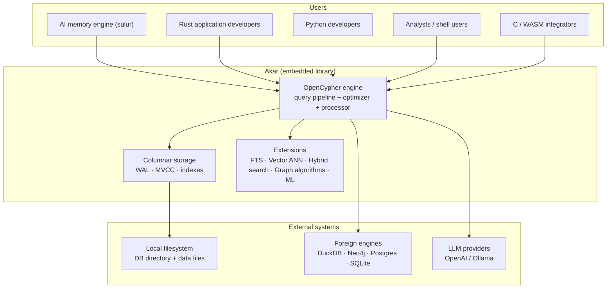

# 1. Akar — Overview

> Pure-Rust embedded property-graph database for AI-agent memory.
> Workspace version `0.2.3` · ~139K LOC Rust (edition 2024) · GPL-3.0-or-later · 2,242 tests green.

## What is Akar?

Akar is a **graph database that lives inside your process**. It is not a server, has no Docker deploy, and needs no infrastructure — you add a crate (`cargo add akar-main`) or a Python package (`pip install akar`) and start running **openCypher** queries over a durable, columnar, multi-writer graph store. It is a from-scratch, pure-Rust reimplementation of the KuzuDB design: worst-case-optimal joins, factorized execution, column-major storage, and MVCC transactionality, but compressed into a library with no C++ and no external runtime.

It exists because AI agents need memory that captures *relationships*, not just documents. Tracing a chain like `Founder → Company → Funding Round → Outcome` is a multi-hop graph traversal; doing that well requires an in-process graph engine at database-level speed. Akar's hot path is measured at parity with the C++ engines it was modeled on: **397 µs** average per hot-path query, versus **400 µs** for Kuzu C++ and **374 µs** for LadybugDB C++.

## Who is Akar for?

| Role | Scenario | Entry point |
|---|---|---|
| AI memory engine (`sulur`) | Primary consumer — in-process remember/recall, multi-hop reasoning, hybrid retrieval | PyPI `akar` / Cargo |
| Rust developers | Embed a graph engine with zero ops footprint | `cargo add akar-main` |
| Python developers | Kuzu-compatible drop-in client for agent memory stores | `pip install akar` |
| Analysts / shell users | Ad-hoc exploration, `COPY FROM`, `EXPLAIN`, `EXPORT` | `akar-cli` REPL |
| C / WASM integrators | Embed Akar in non-Rust runtimes (browser, Node, C hosts) | `akar-c`, `akar-wasm` |

## What does Akar do?

- **Query:** full openCypher — `MATCH`, `OPTIONAL MATCH`, `WITH`, `UNWIND`, `FOREACH`, `MERGE`, subqueries and recursion-friendly planning — with a 33-variant statement AST (a superset of the C++ grammar that added vector/FTS/graph/index DDL).
- **Optimize:** a 26-pass optimizer (19 flat + 7 tree) covering predicate/filter/projection push-down, constant folding, join ordering, WCOJ factorization, top-K, ART range scans, and automatic ANN/FTS detection.
- **Execute:** a vectorized, rayon-parallel Arrow processor (`DataChunk` pipelines) with hash joins, factorized worst-case-optimal intersect shapes, block-merge sorting, and spill-to-disk.
- **Store:** column-major node groups, CSR adjacency for relationships, ART / hash / HNSW / Tantivy indexes, a group-commit WAL, crash recovery, and checkpoint.
- **Transact:** MVCC snapshots + optimistic-concurrency control (OCC) — multiple concurrent writers, row-level conflict detection, durability on commit.
- **Retrieve:** full-text search (Tantivy BM25), vector ANN (HNSW), hybrid retrieval fusing both signals with Reciprocal Rank Fusion, plus hierarchical summary/content fusion with authority boosting.
- **Analyze:** ~27 graph-algorithm table functions in SQL (`CALL page_rank(...)`, `CALL louvain(...)`, WCC/SCC, k-core, Dijkstra, spreading activation, node2vec, …).
- **Dream:** an autonomous memory-consolidation cycle — NREM decay, conflict supersession, REM bridging, synthesis, analogical encoding — over a backend-provided memory graph.
- **Integrate:** DuckDB / SQLite / Postgres / Neo4j interop functions, HTTP/S3 file reads through a VFS, OpenAI/Ollama embeddings, and lakehouse adapters (Delta, Iceberg, Azure Blob, Unity Catalog) that run in native pure-Rust mode or delegate to DuckDB.
- **Bind:** interactive CLI, C FFI, WASM, a Python package modeled as a Kuzu drop-in, and a TCP daemon (retained as a wire reference / test harness — deprecated for production).

## What Akar deliberately does not do

- No bundled production server (the TCP daemon is deprecated; the primary consumer embeds in-process).
- No authentication/RBAC in the core engine.
- No network replication or distributed-cluster features.
- No migration guarantee across `STORAGE_VERSION` bumps without an explicit SemVer `0.2.0` gate.

## Technology at a glance

| Layer | Choice |
|---|---|
| Language | Rust edition 2024, MSRV 1.80+ |
| Query grammar | openCypher via pest PEG (`cypher.pest`) |
| In-memory columnar runtime | Apache Arrow 59.1 (`DataChunk`, vectors) |
| On-disk format | Custom column-major (node groups, CSR adjacency) + Parquet/CSV/JSON/NPY readers |
| Indexes | ART (PK), hash, HNSW (vectors), Tantivy (FTS/BM25) |
| Concurrency | rayon data parallelism, MVCC + OCC multi-writer, group-commit WAL |
| ML | Pure-Rust LSTM, node2vec; local ONNX embeddings (fastembed/BGE/Rerank) |
| Test/CI | 2,242 tests / 0 failed; `-D warnings` clippy; GitHub Actions; fuzz targets (nightly) |

## Repository layout

- `akar-core/` — Cargo workspace, 36 crates, from `akar-common` (types) up through `akar-main` (the single published surface).
- `SPEC.md` — the living spec (architecture, metrics, parity, gates). The code must stay aligned with it.
- `implementation plan.md` and `CHANGELOG.md` — spec-driven work tracking (git-excluded plan + changelog, respectively).
- `dataset/` — 68 test datasets; `examples/rust/` — API examples.
- `graft/` — repo context graph; `.terrain/` — AI engineering assets (including these docs).

## Where to go next

- **[2. Architecture](./2.Architecture.md)** — the crate-level landscape and how data flows through it.
- **[3. Workflows](./3.Workflows.md)** — end-to-end: query, write+durability, hybrid search, graph analytics, dreaming, Python drop-in.
- **[4. Deep-Exploration](./4.Deep-Exploration/)** — one page per module (core engine, storage, query pipeline, optimizer, processor, vector, search, ML, bindings, …) with real file:line citations.
- **[5. Boundaries-Interfaces](./5.Boundaries-Interfaces.md)** — every user-facing surface: CLI flags, C/WASM/Python APIs, TCP protocol, config and env vars.
- **[6. Database-Overview](./6.Database-Overview.md)** — the on-disk world: WAL, catalog, node groups, indexes, versions.