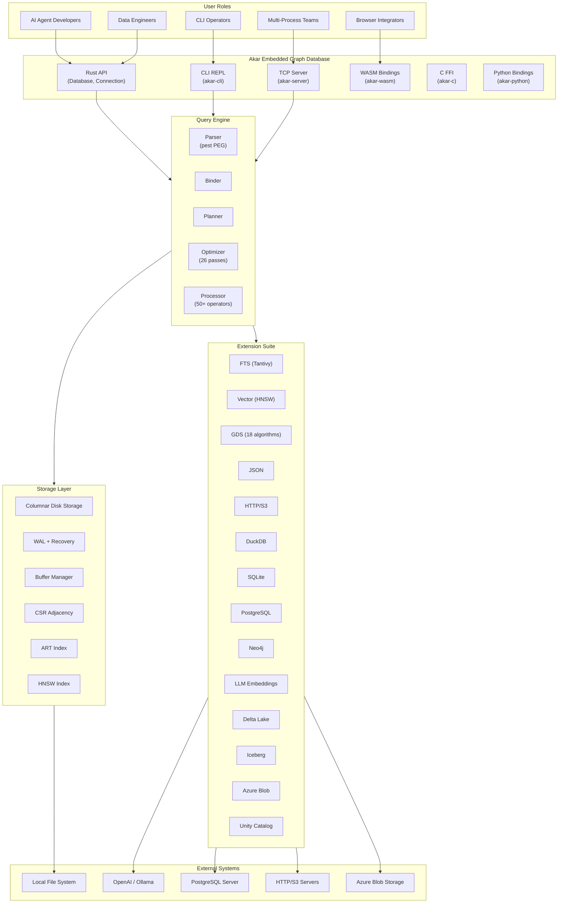

# Akar

Akar is a pure Rust embedded graph database built from the ground up for AI agent memory. Imagine you are building an AI agent that needs to remember not just documents, but the relationships between people, companies, funding rounds, and outcomes — the kind of multi-hop traversal where you follow `Founder -> Company -> Round -> Outcome` across several hops. Traditional key-value or document stores make this painful; a graph database makes it natural. Akar delivers that capability as an embedded, in-process library — no server, no Docker, no connection pool — just `cargo add akar-main` and you are querying.

The project is a from-scratch Rust reimplementation of KuzuDB, an archived C++ embedded graph database originally from the University of Waterloo. Akar preserves the architectural foundations (worst-case optimal joins, factorized execution, columnar storage) while being a standalone pure Rust codebase with zero C++ dependencies and zero FFI. Performance is validated at 3-way parity with the C++ originals: Rust 397 microseconds, Kuzu C++ 400 microseconds, LadybugDB C++ 374 microseconds on the same 10K-row hot-path query.

## What It Can Do

Akar's core capability is "a full graph database engine that runs inside your Rust application." You give it a directory path and a Cypher query, and it handles everything from parsing to disk persistence — all in-process with sub-millisecond latency.

**Full Cypher Query Pipeline** — Akar parses openCypher queries through a PEG grammar (33 statement variants, a superset of Kuzu's 22), resolves symbols against a system catalog, builds a logical plan (59 operator types), optimizes it through 26 passes (19 flat + 7 tree), and executes it with 50+ physical operators running on Arrow-native data chunks. The pipeline is the heart of the system, and every stage is independently testable.

**Concurrent Multi-Writer Transactions** — When multiple AI agents share a database, Akar uses Optimistic Concurrency Control at the row level: each writer tracks which rows it touched, and at commit time, first-committer wins. Different rows on the same table never conflict. This is ACID serializable isolation without the locking overhead of pessimistic approaches.

**Vector Similarity Search** — Built-in HNSW indexing lets you store embedding vectors alongside graph entities and query them with cosine, Euclidean, or inner-product similarity. The optimizer automatically rewrites `MATCH ... WHERE cosine_similarity(n.col, q) >= thr` into a `[VectorSimilarityScan, Filter, OrderBy, Projection, Limit]` plan.

**Full-Text Search** — Tantivy-backed BM25 indexing with commit-consistent lifecycle: rows written after `CREATE FTS INDEX` are propagated to the Tantivy index at commit time by a sync hook. Phrase queries, boolean operators, regex, and phrase-prefix queries are all supported.

**18 Graph Algorithms** — PageRank, Weakly Connected Components, Strongly Connected Components (Tarjan and Kosaraju), K-Core Decomposition, Louvain community detection, BFS, Dijkstra shortest path, all shortest paths, betweenness/closeness centrality, triangle counting, random walk, node2vec, and spread activation — all implemented in pure Rust.

**Data Federation** — Extension crates let Akar read from and query across DuckDB, SQLite, PostgreSQL, Neo4j (migration), Delta Lake, Apache Iceberg, Azure Blob Storage, and Unity Catalog, plus HTTP/HTTPS/S3 file reads. Each extension is feature-gated and compiled statically.

**Multiple Embedding Surfaces** — Rust library API, interactive Cypher CLI, WebAssembly bindings (browser execution), C FFI for language bindings, embedded TCP server for multi-process access, and Python bindings (PyO3) that serve as a drop-in KuzuDB replacement.

## C4 Context Diagram (System Landscape)

The following diagram shows where Akar sits in the broader ecosystem: who uses it, what it depends on, and how it connects to external systems.

This diagram reveals a key design decision: all user-facing surfaces (Rust API, CLI, TCP server, WASM, C FFI, Python) converge on the same query engine. There is no separate "server mode" query path — the engine is the engine, regardless of how you reach it.

## The Technology Behind the Choices

Akar's technology stack is not a random collection of popular Rust crates. Each choice solves a specific problem that an embedded graph database faces.

| Technology Domain | Choice | Why This Was Chosen |
|-------------------|--------|---------------------|
| Language & Runtime | Rust (edition 2024) | Memory safety without garbage collection; zero-cost abstractions; cross-compilation to WASM |
| In-Memory Format | Arrow 59.1.0 | Standard columnar interchange; SIMD-friendly; zero-copy with Parquet readers |
| Grammar | pest (PEG) | Composable, maintainable Cypher grammar; replaces ANTLR4 from the C++ origin |
| Parallelism | rayon | Data parallelism for scan/join/aggregate; work-stealing scheduler |
| Full-Text Search | Tantivy 0.26.2 | BM25 scoring, phrase/regex queries; replaces 3 custom macro tables |
| Hash Maps | hashbrown + ahash | 2-3x faster than std HashMap; critical for hash joins and aggregations |
| Serialization | serde + serde_json | Catalog persistence, WAL encoding, system config |
| Concurrent Access | DashMap | Lock-free sharded concurrent catalog; shard-level locking |

The choice of pure Rust over C++ FFI was the most consequential architectural decision. It eliminated an entire class of memory safety bugs, enabled WASM compilation, and made cross-platform builds trivial — but it required reimplementing every component from scratch, including the parser (pest instead of ANTLR4), the storage engine, and the graph algorithms.

## What Akar Can and Cannot Do

**What it does well:**
- Embedded, in-process graph database with zero infrastructure overhead
- Sub-millisecond query latency on hot paths (397 microseconds on 10K rows)
- Concurrent multi-writer support via row-level OCC
- Vector similarity search and full-text search integrated into the same engine
- 18 graph algorithms for network analysis
- Data federation across DuckDB, SQLite, PostgreSQL, and lakehouse formats
- Cross-platform: Linux, macOS, Windows, WebAssembly

**What it does not do:**
- Distributed multi-node database — it is single-owner embedded by design
- Full auth/RBAC — optional TCP bearer token, not an identity management system
- Cloud provisioning or secret management — credentials are delegated to external systems
- Direct performance comparison with Neo4j or vector-specific databases — verified parity is limited to Kuzu C++ and LadybugDB C++
- Auto-migration of FTS indexes built before the P107.1 schema change — requires DROP/CREATE rebuild
