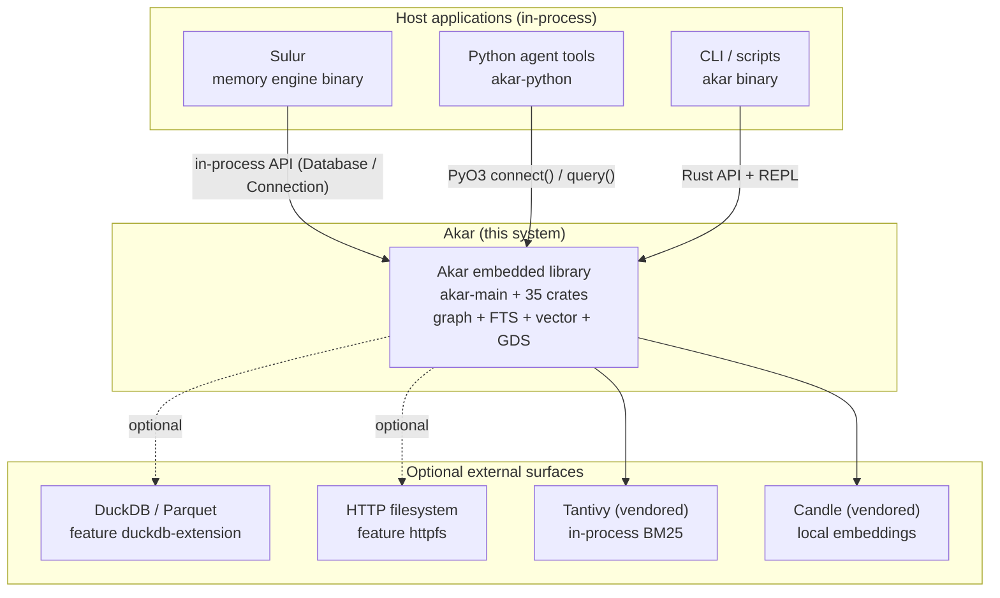

# Akar

Akar is a pure-Rust, embedded property-graph database — a from-scratch reimplementation of KuzuDB's engine with openCypher query support, columnar storage, full-text and vector search, and 18 built-in graph algorithms, all compiled into your application as a library rather than deployed as a separate server. It exists because AI-memory products (the sibling project Sulur and agents like it) need graph traversal, keyword recall, and vector similarity over the *same* rows, in the *same* process, with zero FFI and zero external services — a combination no single off-the-shelf database provides cleanly. The result is a single-binary-capable engine: 36 workspace crates, roughly 139K lines of Rust, 2,260 passing tests, and feature parity audited line-by-line against the C++ reference (33 statement types vs 22, 26 optimizer passes vs 17, all 58 C++ physical operators covered).

Version 0.2.4 (edition 2024), GPL-3.0, hosted as a Cargo workspace under `akar-core/` with the Python bindings in a sibling `akar-python/` crate. The project follows a spec-driven workflow: `SPEC.md` is the living source of truth, and every behavior change is gated by a full-workspace test run before it lands.

## What it can do

Akar's capabilities form a coherent story: "store relationships durably, query them with a standard language, and retrieve them by keyword, vector, or topology — all in-process."

**Property-graph storage with acid guarantees** — Nodes and relationships with typed properties live in column-major table files with CSR adjacency for fast traversal. Commits are write-ahead-logged and fsync'd before acknowledgment; an optimistic concurrency-control layer with row-level conflict detection lets multiple writers coexist without table locks. Crash recovery replays the WAL deterministically, and a salvage mode exists for the worst case.

**openCypher query engine, superset of the reference** — A hand-written PEG parser feeds a binder that resolves every name against the catalog, a planner that emits 59 logical operators, and a 26-pass optimizer (pushdown, join reordering, constant folding, TopK, factorization, and specialized scan detection) before a vectorized Arrow-based physical executor runs the plan. A per-connection LRU plan cache skips parse/bind/plan/optimize entirely for repeated statements.

**Full-text search (BM25)** — `CREATE FTS INDEX` builds a Tantivy index alongside the tables; committed writes propagate into it synchronously with a single shared-reader reload per commit, giving deterministic read-after-write. The query language is verbatim Tantivy syntax (phrases, boolean operators, slop, prefixes).

**Vector similarity (HNSW)** — Approximate nearest-neighbor indexes over any vector-typed property, with SIMD-accelerated cosine/dot/L2 metrics (SSE, AVX, NEON). Crucially, the optimizer *recognizes* `cosine_similarity(...) ORDER BY ... LIMIT k` patterns and rewrites them into a dedicated vector scan — no proprietary query syntax required.

**Hybrid ranking (RRF)** — A hierarchical reciprocal-rank-fusion module merges lexical, vector, and structural result lists with authority re-weighting, so "find what I mean, not just what I said" works out of the box.

**18 graph algorithms as table functions** — PageRank, WCC, SCC (Tarjan and Kosaraju, iteration-safe on deep chains), K-core, label propagation, Louvain community detection, betweenness/closeness centrality, triangle counting, BFS/Dijkstra shortest paths, spanning forest, spread activation, random walks, and node2vec embeddings — all callable as `CALL page_rank()` directly in Cypher.

**AI-memory cognitive primitives** — Ebbinghaus forgetting decay, offline Candle-backed local embeddings, an LSTM with parity against the reference implementation, and a phased background "dream" consolidation pipeline — the store-retrieve-forget-predict loop an agent runtime needs, embedded rather than outsourced.

**Extension system** — A two-method `Extension` trait (`name` + `load`) is the sole plugin contract; DuckDB, SQLite, HTTPFS, FTS, vector, ML, and the algorithm suite all register through it at database open, so third-party plugins exercise exactly the code the first party does.

## C4 Context diagram (system landscape)

The diagram places Akar in its ecosystem: an embedded library linked directly into host applications (Sulur's single binary, Python tools, CLI scripts), with no mandatory external dependencies at runtime.

The key design decision visible here: *everything is in-process*. There is no Akar server the host must deploy — the deprecated `akar-server` TCP broker exists only as a test harness (P124) while Sulur migrates fully to single-binary embedding. External systems appear only behind feature flags.

## Technology choices and the reasoning behind them

Each technology in Akar's stack was chosen to serve the "pure-Rust embedded library" identity; where a mainstream alternative existed, it was rejected specifically for FFI, deployment, or licensing reasons.

| Area | Choice | Why this choice (and what was given up) |
|------|--------|------------------------------------------|
| Language | Rust (edition 2024, workspace pinned) | Memory safety + fearless concurrency in a long-lived embedded library; gives up C++'s massive existing graph-DB ecosystem and must reimplement it (the entire project's premise) |
| FFI policy | No C/C++ required (ADR-001) — pure Rust, `cargo install` works anywhere | Rejects DuckDB/libduckdb-sys and SQLite's C++ core as hard dependencies (they remain optional features); gives up their raw ingest speed in default builds |
| Query parsing | pest PEG grammar (`cypher.pest`) | Grammar readability and error messages over raw speed; the LRU plan cache makes the parse cost a non-issue on hot paths |
| Execution format | Apache Arrow `DataChunk` batches | Vectorized columnar execution end-to-end; gives up row-at-a-time simplicity |
| Storage layout | Column-major pages + CSR adjacency (ADR-002) | Analytical scans and graph traversal both stay cache-friendly; gives up row-store update simplicity (mitigated by MVCC undo buffers) |
| Concurrency | Optimistic CC with row-level conflict tracking | No lock tables or deadlock detectors; gives up conflict-free behavior under pathological write contention (aborts and retries instead) |
| Full-text | Vendored Tantivy | Production-grade BM25 without a server or C library; in-process segment commits define the crash boundary |
| Vectors | Own HNSW + SIMD metrics | Keeps the no-FFI promise (vs FAISS); gives up FAISS's algorithm breadth |
| ML runtime | Candle (pure Rust) | Offline, embeddable embeddings; gives up GPU/ONNX-model breadth |
| Parallelism | rayon + `SystemConfig::max_num_threads` | Work-stealing across query operators without a custom scheduler |
| Config | `SystemConfig` struct, no TOML/YAML env file | Library-first: embedders configure in code, not files; gives up ops-style file tuning |

## What Akar does and does not do

Understanding the boundary matters: Akar deliberately *is not* a general-purpose distributed SQL warehouse, and several absences are architectural positions rather than gaps.

**It does**: store and query property graphs with openCypher (superset of KuzuDB's dialect); provide durable ACID commits with WAL and MVCC; index properties with ART primary keys, Tantivy FTS, and HNSW vectors; run graph algorithms and ML primitives as `CALL`-able table functions; embed directly into Rust, Python, C, and WASM hosts; scale query execution across CPU cores with vectorized operators; and restore everything from a single database directory on restart.

**It does not**: run as a managed multi-node cluster (single-process embedded by design, per §13/ADR-02 — distributed memory belongs to Sulur above); serve as a deprecated-free TCP SQL server (the JSON broker is a test harness only, P124); require Python, a network call, or a GPU for embeddings (the whole point of the Candle integration); hide its consistency model behind eventual-index tricks (FTS/HNSW visibility is commit-gated by contract, P107); or support hot-reload of extensions (they load once at `Database::new` — a simplicity trade-off that eliminates unload races).

---

*Generated: 2026-09-23 · Sources: `SPEC.md`, `README.md`, `akar-core/Cargo.toml`, `akar-core/docs/adr/001-005-*.md`, `.terrain/.litho-agent/{preprocessing,c1-system-context,c2-domain-modules,architecture}.md`*
