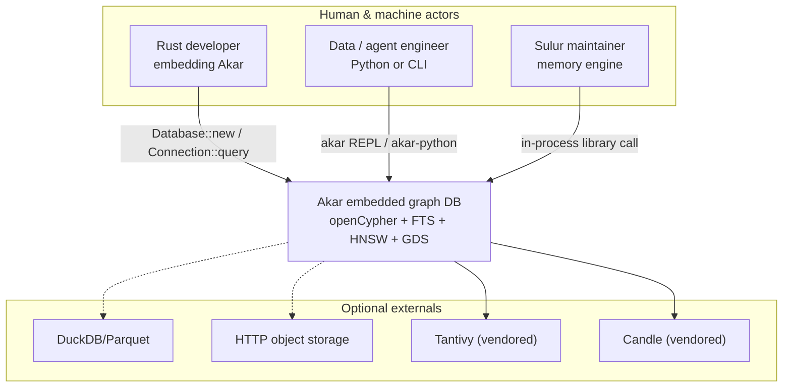
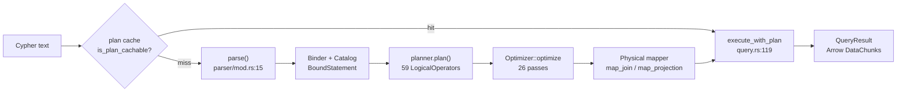
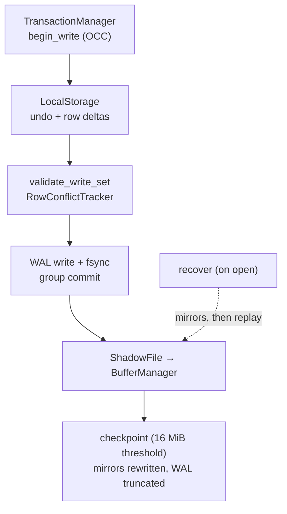
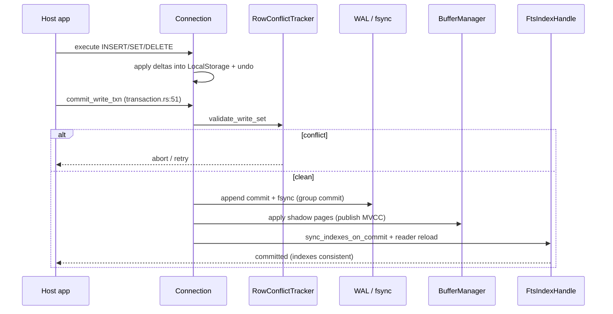

# System Architecture Document: Akar

**Version:** 1.0
**Classification:** Internal architecture documentation
**Generated:** 2026-09-23

---

## 1. Architecture overview

### 1.1 Design philosophy

Akar's architecture rests on a handful of principles that are visible in almost every crate boundary. They are not slogans — each one forced a concrete, often expensive, decision.

**1. Pure Rust, no required FFI (ADR-001).** The entire engine — parser through storage to ML — compiles with zero C/C++ in the default feature set. `libduckdb-sys` and `rusqlite` exist only behind feature flags. This is why `cargo install akar` works on any target and why the Sulur binary can claim a single-binary story. The cost: reimplementing capabilities (vector search, BM25, embeddings) that C libraries give away, which the project accepted as the price of the identity.

**2. Embedded library first, server last (ADR-02 / §13).** The canonical deployment is `Database::new(path)` inside the host process. `akar-server`'s TCP JSON broker is explicitly deprecated for production (P124) and demoted to a wire-format test harness while Sulur moves to in-process embedding. Consequence: no network hop in the hot path, but also no out-of-process scaling knob.

**3. Columnar + CSR hybrid storage (ADR-002).** Tables are stored column-major (analytical scan efficiency) with compressed-sparse-row forward/reverse adjacency on relationship tables (traversal efficiency). One layout serves both `MATCH (a)-[:KNOWS*1..3]->(b)` and `WHERE n.score > 0.9` well. The trade: updates become page-level surgery, which is why MVCC undo buffers and shadow paging exist.

**4. Bound certainty before execution.** Nothing reaches the executor unvalidated: parse → bind (against `Catalog`) → plan → optimize → map to physical operators. Every stage narrows ambiguity, so the hot loop never re-checks names or types. The plan cache (`is_plan_cachable`, `akar-main/src/connection/query.rs:799`) collapses this whole pipeline for repeated statements.

**5. Honest parity over optimistic claims.** The SPEC's parity matrices audit every C++ statement, operator, and optimizer pass — including three optimizer passes deliberately kept as documented NO-OPs (`CommonSubexpressionElimination`, `OrderByPushDown`, `AggregateFusion`) rather than shipped as subtly wrong rewrites. Architecture as a truth document, not a brochure.

### 1.2 Core architectural patterns

The table below summarizes the patterns a newcomer should internalize before reading code; each maps to concrete crates in §3.

| Pattern | How it's implemented | Purpose |
|---------|----------------------|---------|
| Layered compiler pipeline | parser → binder → planner → optimizer → processor, each a separate crate | Independent testing, plan-cacheable front half |
| Volcano-style vectorized execution | `Physical*` operators emitting Arrow `DataChunk`s | Columnar throughput without row materialization |
| Extension / plugin registry | `Extension::load(&ExtensionContext)` at `Database::new` (`akar-main/src/database.rs:765`) | Uniform capability registration for builtins and third parties |
| MVCC + optimistic concurrency | Snapshot reads, row-level `RowConflictTracker` at commit | Lock-free readers, abort-on-conflict writers |
| Write-ahead logging + shadow paging | LocalStorage → WAL fsync → BufferManager apply | Durable commits with page-level atomicity |
| Dual-write index sync (commit-gated) | `sync_indexes_on_commit` after WAL fsync (`akar-processor/src/physical/write_ops/fts_sync.rs:39`) | Deterministic FTS/HNSW read-after-write |
| Specialized-scan detection passes | Optimizer rewrites idioms → `VectorSimilarityScan`, `FtsScan`, `ArtIndexRangeScan` | Expose indexes through standard Cypher, no proprietary syntax |
| Facade / orchestrator | `Connection` (`akar-main/src/connection/query.rs:21`) sequences all stages | One semantic implementation behind every door (Rust/C/Python/CLI/WASM) |

### 1.3 Technology stack overview

The stack is best read as concentric rings: an outer ring of host-facing technology (CLI, PyO3, C ABI, WASM), a middle ring of query-engine technology (pest, Arrow, rayon), and an inner ring of storage/durability technology (own WAL, buffer manager, Tantivy, HNSW, Candle). Every inner-ring choice honors the no-FFI rule; optional C dependencies are quarantined behind features so the default build stays pure.

| Layer | Technology | Role |
|-------|-----------|------|
| Workspace | Cargo, 36 crates, edition 2024, version 0.2.4 | Build topology enforcing dependency direction |
| Parsing | pest (`cypher.pest`) | Declarative PEG grammar for openCypher superset |
| Execution memory | Apache Arrow (`DataChunk`, `arrow_vector`) | Vectorized batch exchange between operators |
| Parallelism | rayon (`task_system`, `max_num_threads`) | Work-stealing across operator pipelines |
| Full-text | Tantivy (vendored) | BM25 inverted index, in-process |
| Vectors | Own HNSW + SIMD (`akar-vector/src/hnsw.rs`, `distance.rs`) | ANN + cosine/dot/L2 metrics (SSE/AVX/NEON) |
| ML | Candle (vendored) | Offline embeddings, LSTM inference/training |
| Durability | Own WAL + buffer manager + shadow files (`akar-storage/src/lib.rs`) | fsync commits, checkpointing, recovery |
| Concurrency | Own `TransactionManager` (OCC, `akar-transaction/src/lib.rs:389`) | Snapshots, conflict validation, group commit |
| Bindings | PyO3 (`akar-python`), C ABI (`akar-c`), WASM feature | Multi-language embedding doors |
| Optional ETL | DuckDB, SQLite (rusqlite), HTTPFS — feature-gated | External table/file bridges without default FFI |

---

## 2. System context (C4 Level 1)

Context at this level answers "who touches Akar and what does it touch back." Hosts embed the library; Akar itself only reaches optional externals behind flags.



What this diagram highlights: there is no "Akar server" actor box — every relationship is a function call. That absence *is* the architecture (ADR-02).

---

## 3. Container view (C4 Level 2)

At this level the "containers" are the major crate groups that compile into the embedded library, plus the optional host-facing binaries. Read it as the dependency pipeline: data flows strictly downward through the query path, while cross-cutting crates (common, catalog, extension) sit beside it as shared foundations.

```mermaid
graph TB
    subgraph host["Host-facing containers"]
        cli["akar-cli<br/>REPL + benchmark binary"]
        py["akar-python<br/>PyO3 module"]
        cffi["akar-c<br/>cdylib C ABI"]
        wasm["akar-wasm<br/>browser/edge build"]
        srv["akar-server<br/>TCP JSON broker (deprecated)"]
    end
    subgraph core["Embedded engine (akar-main + pipeline)"]
        main["akar-main<br/>Database / Connection / plan cache"]
        frontend["Frontend: akar-parser<br/>akar-binder + akar-planner"]
        opt["akar-optimizer<br/>26 passes"]
        proc["akar-processor + akar-function<br/>50 physical ops, 260 functions"]
    end
    subgraph substrate["Foundation & storage"]
        common["akar-common + akar-catalog<br/>Value / DataChunk / Catalog"]
        storage["akar-storage + akar-transaction<br/>WAL / buffer / OCC"]
        ext["akar-extension<br/>Extension trait + registry"]
    end
    subgraph cap["Capability crates"]
        graph["akar-graph + akar-algo<br/>CSR + 18 algorithms"]
        search["akar-fts + akar-vector + akar-search<br/>BM25 / HNSW / RRF"]
        intel["akar-ml + akar-dream<br/>embeddings / decay / dream"]
    end
    cli --> main
    py --> main
    cffi --> main
    wasm --> main
    srv -.->|"reference only"| main
    main --> frontend --> opt --> proc
    main --> storage
    main --> ext
    proc --> common
    proc --> graph
    proc --> search
    search --> storage
    intel --> search
    ext --> common
```

### 3.1 Domain module responsibilities

The table grounds each container in its actual path and the type a developer will meet first. The three column groups answer the questions that matter when you're about to edit: *where do I go, what do I touch, and what's the public face?*

| Module / domain | Path(s) | Responsibility | Key abstraction |
|------------------|---------|----------------|-----------------|
| Foundation | `akar-core/akar-common/`, `akar-catalog/` | Value model, DataChunk, versioned metadata catalog | `Catalog`, `Value`, `CatalogEntry` |
| Query frontend | `akar-core/akar-parser/`, `akar-binder/`, `akar-planner/` | Cypher → bound statement → 59-op logical plan | `parse()`, `BoundStatement`, `LogicalOperator` |
| Optimizer | `akar-core/akar-optimizer/` | 26 ordered passes incl. specialized-scan detection | `Optimizer::optimize` |
| Processor / functions | `akar-core/akar-processor/`, `akar-function/` | Physical execution over Arrow batches | `QueryProcessor`, `Physical*` ops, `FunctionRegistry` |
| Storage / transactions | `akar-core/akar-storage/`, `akar-transaction/` | WAL, buffer manager, MVCC/OCC, recovery | `StorageManager`, `TransactionManager` |
| Graph / GDS | `akar-core/akar-graph/`, `akar-algo/` | CSR substrate, 18 `CALL`-able algorithms | `AlgoExtension`, `compute_*` kernels |
| Search | `akar-core/akar-fts/`, `akar-vector/`, `akar-search/` | BM25, HNSW, hybrid RRF ranking | `FtsIndexHandle`, `hnsw`, hierarchical RRF |
| Intelligence | `akar-core/akar-ml/`, `akar-dream/` | Embeddings, Ebbinghaus decay, LSTM, dream phases | `embed`, `phases` pipeline |
| Extension system | `akar-core/akar-extension/` | Two-method plugin contract | `Extension`, `ExtensionContext` |
| Interfaces | `akar-main/src/connection/`, `akar-cli/`, `akar-c/`, `akar-python/` | Doors into the engine | `Connection::query`, `akar_state` |
| Orchestration | `akar-core/akar-main/src/database.rs` | Open, config, extension boot, recovery | `Database`, `SystemConfig` |

From this inventory the dependency discipline stands out: capability crates (graph, search, intelligence) never import each other's internals — they meet only through the processor's operator/registry seams, which is what keeps the 35-crate workspace acyclic enough for bottom-up publishing.

---

## 4. Component view (C4 Level 3)

### 4.1 Query pipeline components (frontend → optimizer → processor)

The query path is the system's spine. This component graph traces one statement from text to Arrow results; note the plan-cache shortcut that bypasses the left half entirely.



**Component responsibilities**: `parse()` enforces grammar (33 statement variants); the binder enforces semantics (name/type legality against `Catalog`); the planner chooses relational structure; the optimizer rewrites for cost (filters to scans, join order, TopK); the mapper materializes `Physical*` operators; `execute_with_plan` runs them with write-statement transaction wrapping; the plan cache remembers the optimized artifact keyed by statement text + catalog version.

### 4.2 Storage & durability components

Under the query path sits the durability stack — the part that must be correct even when everything above it is redesigned. Components: `StorageManager` (facade, `akar-storage/src/lib.rs:111`), `WAL`/`WALReplayer` (append + typed replay), `BufferManager` (clock-evicted page cache), `PageManager`/FSM (buddy allocation), `UndoBuffer` (before-images), `TransactionManager` + `RowConflictTracker` (OCC, `akar-transaction/src/lib.rs:389,:488`), `GroupCommit` (batched fsync).



### 4.3 Capability components (search, graph, intelligence)

These components hang off the processor rather than the storage core: specialized scans (`PhysicalFtsScan`, `PhysicalVectorSimilarityScan`), `CatalogGraphSource` bridging tables to GDS CSR (`akar-processor/src/processor/graph_source.rs`), `AlgoExtension` registering 18 algorithms, `FtsIndexHandle` shared-reader reload, and the RRF fusion modules in `akar-search`. The design intent: capabilities plug into *operator dispatch*, never into the WAL or recovery path directly — durability stays centralized.

---

## 5. Key flows

### 5.1 Read query (cold cache)

The cold path shows every stage; it is the reference against which the warm-cache shortcut (5.2) is measured.

```mermaid
sequenceDiagram
    participant App as Host app
    participant Conn as Connection
    participant Bind as Binder + Planner
    participant Opt as Optimizer
    participant Proc as QueryProcessor
    participant Stor as StorageManager

    App->>Conn: query(cypher)
    Conn->>Conn: plan cache miss (query.rs:799)
    Conn->>Bind: parse + bind + plan
    Bind-->>Conn: LogicalOperator pipeline (59)
    Conn->>Opt: optimize (26 passes)
    Opt-->>Conn: optimized plan
    Conn->>Proc: map + execute_with_plan
    Proc->>Stor: scan pages / index probes
    Stor-->>Proc: DataChunks
    Proc-->>App: QueryResult (Arrow)
```

### 5.2 Write commit (durability boundary)

Writes are where architecture becomes contract: validation strictly precedes the log, the log fsync strictly precedes visibility, and index sync strictly follows durability — the ordering that makes the P107 FTS guarantees true.



### 5.3 Open & recovery

`Database::new` (`akar-main/src/database.rs:606`) loads `CATALOG_FILE_NAME`, runs `StorageManager::recover` (mirrors → WAL replay, `akar-storage/src/lib.rs:844`), restores tables via `restore_storage_from_catalog` (`database.rs:549`), then calls `register_builtin_extensions` (`:765`) so FTS/vector/algo/ML functions exist before the first query. Extension load is once-per-open by design — no hot reload, no unload races.

---

## 6. Technical implementation

### 6.1 Key implementation patterns

**Plan-cache gate.** The single most important hot-path branch is `is_plan_cachable` (`akar-main/src/connection/query.rs:799`): statements that qualify skip parse/bind/plan/optimize entirely and jump to `execute_with_plan` (`:119`). Write statements additionally get wrapped in an implicit transaction when the caller didn't open one (`:119-136`).

**Specialized-scan detection.** Rather than adding `VECTOR_SEARCH(...)` syntax, the optimizer pattern-matches plans. `VectorSimilarityDetection` (`akar-optimizer/src/passes/flat/vector_similarity.rs:54-101`) recognizes `cosine_similarity(n.col, q) >= thr ORDER BY ... LIMIT k` and rewrites it to `VectorSimilarityScan → Filter → OrderBy → Projection → Limit`. The same philosophy produces `FtsScan` (tree pass, P108.1) and `ArtIndexRangeScan` (conservative, P52.4).

**Commit-ordered side effects.** `commit_write_txn` (`akar-main/src/connection/transaction.rs:51-149`) sequences OCC validation → WAL fsync → shadow apply → `sync_indexes_on_commit`. Each arrow is a correctness boundary, not a convenience: moving index sync before fsync would break crash consistency (P107.3).

### 6.2 Concurrency and parallelism

Two distinct mechanisms coexist deliberately. *Intra-query*: rayon fans operator work across `SystemConfig::max_num_threads` (`akar-main/src/database.rs:34-69`), with hash tables (`AggregateHashTable`, `JoinHashTable`) built for concurrent population. *Inter-transaction*: readers take MVCC snapshots (never block); writers take an `AtomicBool`+`Condvar` gate (`ConcurrencyControl`, `akar-transaction/src/lib.rs:545`), validate row-level write sets at commit, and lose cleanly on conflict. Group commit batches fsyncs across writers so durability doesn't serialize throughput.

### 6.3 Performance optimization strategies

The strategy layers roughly in order of leverage: (1) plan cache eliminates front-half work on hot statements; (2) vectorized Arrow execution amortizes per-row overhead across batches; (3) pushdown passes move filters/projections to the source so less data flows; (4) specialized scans (HNSW ANN, ART point lookup, CSR count, FTS pre-join) replace generic operators with index-shaped ones; (5) TopK heaps avoid full sorts; (6) checkpoint threshold + WAL truncation bound recovery time; (7) `MemoryGovernor` admission control (`admit_query`) prevents memory blowups from degrading the whole process — an embedded database must share RAM politely with its host.

---

## Appendix: Architecture Decision Records (ADR)

The full texts live in `akar-core/docs/adr/`. What follows is the decision/rationale/consequence triple for each, which is what a reviewer needs at design time.

**ADR-001 — Pure Rust, no required FFI**
- **Decision**: Reimplement required capabilities (including ML and search) in pure Rust; C/C++ only behind optional features.
- **Reason**: `cargo install` portability and the single-binary Sulur story; avoid C toolchain pain on user machines.
- **Consequence**: Greater implementation burden (own HNSW, vendored Candle/Tantivy); default gate `test [akar-core]` compiles without libduckdb-sys; `check [akar-core]` (all features) is the stricter pre-commit pass.

**ADR-002 — Column-major storage + CSR adjacency**
- **Decision**: Store properties column-major; maintain forward/reverse CSR on relationship tables.
- **Reason**: One layout that serves analytical scans and multi-hop traversal equally well.
- **Consequence**: Updates require undo buffers and shadow paging; page-management complexity is real (buddy FSM, overflow pages).

**ADR-003 — Optimizer pass ordering (flat before tree)**
- **Decision**: Run 19 flat passes first, then 7 tree passes; join reorder precedes factorization; cardinality estimation runs last.
- **Reason**: Restructure cheaply bottom-up before expensive recursion; tree passes assume stable shape; estimates depend on final joins.
- **Consequence**: Deterministic, testable pass list (`pass_names`); new passes must pick a phase deliberately.

**ADR-004 — Embedded library, not a server (with §13 boundary)**
- **Decision**: `Database`/`Connection` in-process API is canonical; `akar-server` deprecated for production (P124).
- **Reason**: Memory systems (Sulur) need embedded primitives, not another network hop; deployment simplicity.
- **Consequence**: Multi-process access is out of scope; distributed memory semantics live above Akar; TCP broker retained only as wire-format test harness.

**ADR-005 — Spec-driven development with parity matrices**
- **Decision**: `SPEC.md` is the source of truth for behavior; every C++ statement/operator/pass is audited; incomplete parity is documented, not hidden.
- **Reason**: A reimplementation's biggest risk is silent divergence; the SPEC makes gaps reviewable.
- **Consequence**: Process overhead (plan/CHANGELOG reconciliation per batch); three optimizer passes shipped as documented NO-OPs instead of guessed rewrites.

---

*Generated: 2026-09-23 · Sources: `akar-core/docs/adr/*.md`, `SPEC.md §3/§11`, `akar-core/akar-main/src/connection/query.rs`, `akar-core/akar-main/src/database.rs`, `akar-core/akar-optimizer/src/optimizer.rs`, `akar-core/akar-storage/src/lib.rs`, `akar-core/akar-transaction/src/lib.rs`, `.terrain/.litho-agent/{architecture,c2-domain-modules}.md`*
