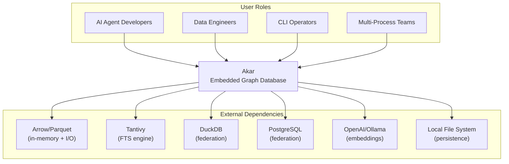
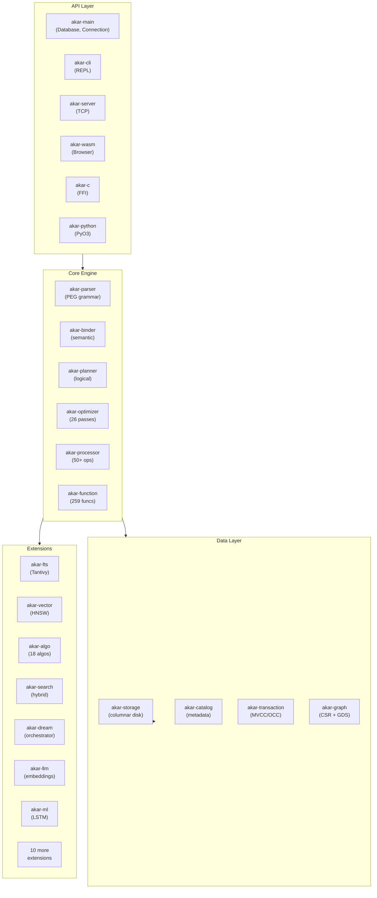
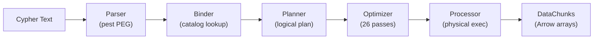
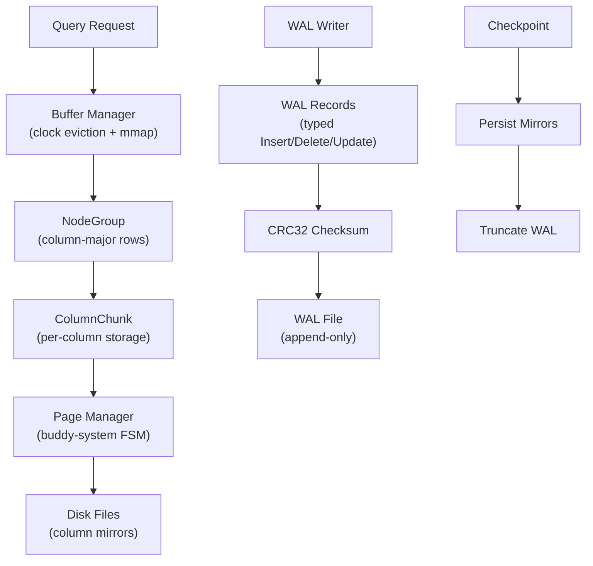
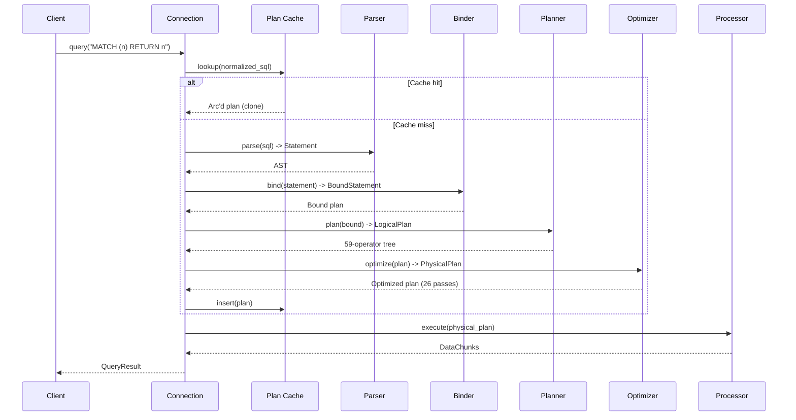
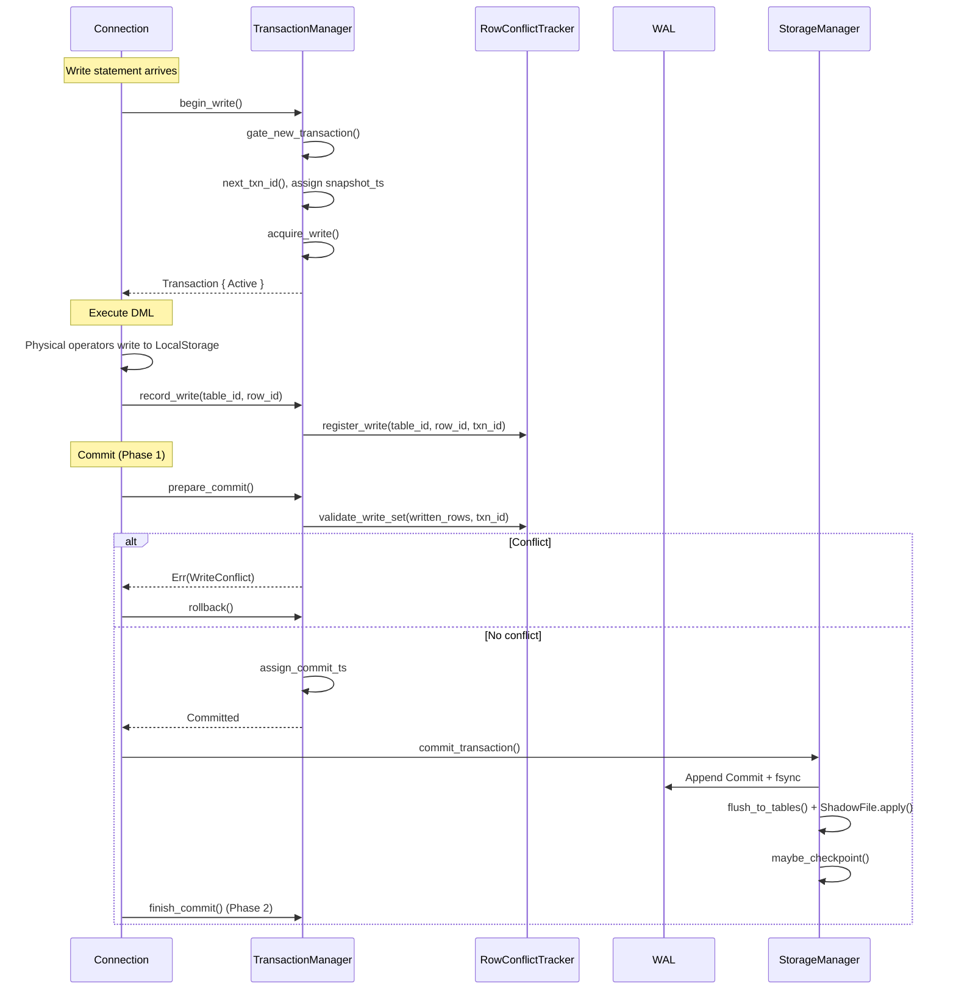

# System Architecture: Akar

**Version:** 1.0
**Classification:** Internal Architecture Document
**Generated:** 2026-09-15

---

## 1. Architecture Overview

### 1.1 Design Philosophy

Akar's architecture is built around three non-negotiable constraints that shaped every design decision: it must be pure Rust (zero FFI), it must be embedded (no server required), and it must match C++ performance. These constraints are not aspirational goals — they are hard boundaries that eliminated entire categories of solutions and forced the team to reimplement everything from scratch.

The first principle is **pipeline separability**. The query engine is divided into five distinct stages (Parser, Binder, Planner, Optimizer, Processor), each communicating through well-defined intermediate representations (AST, BoundStatement, LogicalPlan, PhysicalPlan, DataChunks). This is like a factory assembly line where each workstation does exactly one thing and passes the result to the next — you can test, debug, and optimize each stage independently.

The second principle is **columnar-first data flow**. Every piece of data inside Akar flows as Arrow-native DataChunks (column-major batches). This is not an accident — analytical workloads scan columns, not rows, and Arrow is the industry standard for columnar in-memory data. The choice also means zero-copy interchange with Parquet readers and natural SIMD acceleration.

The third principle is **embedded-by-default isolation**. The database runs inside your process with no network overhead. Concurrent access is handled at the OS level (file locks for multi-process, MVCC/OCC for multi-writer within a process). The TCP server mode is an optional layer that adds network access without changing the engine underneath.

### 1.2 Core Architecture Patterns

| Pattern | Implementation in Akar | Why It Matters |
|---------|----------------------|----------------|
| Layered Pipeline | 5-stage query execution (Parser -> Binder -> Planner -> Optimizer -> Processor) | Clean separation of concerns; each stage independently testable |
| Columnar Storage | NodeGroup-based column-major layout with per-column ColumnChunk | Analytical workload performance; vectorized scan over columns |
| MVCC + OCC | Timestamp-based MVCC with row-level Optimistic Concurrency Control | Concurrent reads during writes; fine-grained conflict detection at row level |
| Write-Ahead Logging | Typed WAL records (Insert/Delete/Update) with CRC32 per record | Crash recovery via typed delta replay on checkpoint mirrors |
| Copy-on-Write | ShadowFile COW pages applied at commit | Transaction isolation without locking readers |
| Extension/Plugin | Feature-gated compilation with Extension trait | Compile-time customization; zero runtime overhead for unused extensions |

### 1.3 Technology Stack Overview

The technology choices reflect a "right tool for the right job" philosophy rather than ideological purity. Arrow handles in-memory columnar data because it is the standard. Tantivy handles full-text search because it is the best Rust search library. pest handles parsing because PEG grammars are composable and maintainable. rayon handles parallelism because work-stealing is the right model for uneven query workloads.

| Layer | Technology | Purpose |
|-------|-----------|---------|
| Language | Rust (edition 2024) | Memory safety, zero-cost abstractions, WASM target |
| In-Memory Format | Arrow 59.1.0 | Columnar interchange, SIMD-friendly, Parquet zero-copy |
| Grammar | pest (PEG) | Cypher parsing, composable rules |
| Parallelism | rayon | Data parallelism for scan/join/aggregate |
| Full-Text Search | Tantivy 0.26.2 | BM25 scoring, phrase/regex queries |
| Hash Maps | hashbrown + ahash | High-performance hash joins and aggregations |
| Serialization | serde + serde_json | Catalog, WAL, config |
| Concurrent Catalog | DashMap | Lock-free sharded access |
| Benchmarking | criterion 0.8.2 | Performance regression testing |

---

## 2. System Context (C4 Level 1)

Akar sits between its users (developers building AI agents, data engineers, CLI operators) and its external dependencies (Arrow for data format, Tantivy for search, various federated databases, and the local filesystem for persistence). The key insight from this diagram is that Akar is an embedded library — it runs inside the user's process, not as a separate service.

---

## 3. Container View (C4 Level 2)

The workspace contains 35 Rust crates organized into three domain groups. The container diagram below shows the major subsystems and how they connect.

### 3.1 Module Responsibilities

| Module | Path | Core Responsibility | Key Abstractions |
|--------|------|-------------------|------------------|
| akar-common | `akar-common/` | Type system (37 LogicalTypes), Value, DataChunk, memory management | `LogicalType`, `Value`, `DataChunk`, `MemoryManager` |
| akar-parser | `akar-parser/` | Cypher PEG grammar, 33 Statement AST variants | `parse()`, `Statement`, `pest` grammar |
| akar-binder | `akar-binder/` | Semantic analysis, symbol resolution, type checking | `Binder`, `BoundStatement` |
| akar-planner | `akar-planner/` | Logical plan construction, 59 LogicalOperator variants | `QueryPlanner`, `LogicalOperator` |
| akar-optimizer | `akar-optimizer/` | 26 optimization passes (19 flat + 7 tree) | `Optimizer`, individual pass traits |
| akar-processor | `akar-processor/` | Physical operators (50+ executors), Arrow evaluation | `PhysicalOperator`, `ExpressionEvaluator` |
| akar-storage | `akar-storage/` | Columnar disk storage, WAL, buffer manager, CSR, indexes | `StorageManager`, `BufferManager`, `WAL` |
| akar-catalog | `akar-catalog/` | System catalog (schemas, tables, types, sequences) | `Catalog`, `NodeTableEntry`, `IndexType` |
| akar-transaction | `akar-transaction/` | MVCC, OCC row-level conflict detection, checkpoint | `TransactionManager`, `RowConflictTracker` |
| akar-function | `akar-function/` | 259 built-in functions (244 scalar + 14 aggregate + 1 table) | `FunctionRegistry`, `TableFunction` |
| akar-graph | `akar-graph/` | CSR adjacency, GDS framework, 18 algorithms | `CSRAdjacency`, `Graph`, `OnDiskGraph` |
| akar-extension | `akar-extension/` | Extension framework trait + registry | `Extension`, `ExtensionRegistry` |
| akar-fts | `akar-fts/` | Tantivy-backed FTS (BM25, commit-hook sync) | `FtsExtension`, `TantivyIndex` |
| akar-vector | `akar-vector/` | HNSW vector similarity search | `VectorExtension`, `HnswIndex` |
| akar-search | `akar-search/` | Hybrid search, RRF fusion | `HybridScan`, `NativeBm25Index` |
| akar-dream | `akar-dream/` | Dream engine orchestrator (memory consolidation) | `DreamOrchestrator`, `DreamBackend` |
| akar-main | `akar-main/` | Public API facade | `Database`, `Connection`, `QueryResult` |

---

## 4. Component View (C4 Level 3)

### 4.1 Query Pipeline Architecture

The query pipeline is the heart of Akar. A Cypher query enters as text and exits as Arrow-native result chunks. Each stage has a clean interface to the next, making the pipeline independently testable and debuggable.

**Parser** (`akar-parser/src/`): Converts Cypher text into an AST using a pest PEG grammar. Produces 33 Statement variants (a superset of Kuzu's 22), including DDL (CREATE/DROP/ALTER TABLE), DML (MATCH/WHERE/RETURN/CREATE/DELETE/SET/MERGE), transactions, and extensions. The grammar is defined in `cypher.pest` with composable rules.

**Binder** (`akar-binder/src/`): Resolves symbols against the system catalog, checks types, and produces BoundStatement variants. The binder handles property resolution via catalog lookups (not hardcoded types), and includes a `ConfidentialStatementAnalyzer` for detecting sensitive CALL statements.

**Planner** (`akar-planner/src/`): Converts bound statements into a logical plan tree with 59 LogicalOperator variants. Handles join ordering, optional match expansion, recursive extend planning, and DDL operator generation.

**Optimizer** (`akar-optimizer/src/`): Applies 26 optimization passes organized as 19 flat passes (applied in sequence) and 7 tree passes (applied to the plan tree structure). Key passes include FilterPushDown, PredicatePushDown, ProjectionPushDown, ExtendFilterPushDown, JoinOptimization (cardinality-aware reordering), TopKOptimization, VectorSimilarityDetection, and ArtRangeScanDetection. Three passes (CSE, OrderByPushDown, AggregateFusion) are deliberately NO-OP until a proven cost model exists.

**Processor** (`akar-processor/src/`): Executes the physical plan using 50+ operator executors. Arrow-native expression evaluation (`evaluate_to_arrow` + `boolean_array_to_selection`), parallel aggregation via `AggregateHashTable`, parallel hash join via `JoinHashTable`, `BlockMergeSort` + `RadixSort` for ORDER BY, and `BinaryHeap` O(n log k) TopK.

### 4.2 Storage Engine Architecture

The storage engine manages everything from in-memory buffers to on-disk persistence. It is designed for analytical workloads where column scans dominate.

Key storage components:
- **BufferManager**: Clock eviction policy with mmap support and NUMA awareness; 256KB readahead for sequential scans
- **NodeGroup**: Groups of rows stored column-major; default `NODE_GROUP_SIZE` rows per group
- **ColumnChunk**: Per-column storage with compression (constant, boolean, string dictionary)
- **WAL**: Typed records (Insert/Delete/Update/Commit/Rollback) with CRC32 per record; append-only for 52x write speedup
- **CSR Adjacency**: Compressed Sparse Row forward/reverse adjacency arrays for efficient graph traversal
- **Indexes**: ART (Adaptive Radix Tree) for primary keys, HNSW for vector similarity, Hash for point lookups

---

## 5. Key Flows

### 5.1 Query Execution Sequence

The following sequence diagram shows the complete lifecycle of a Cypher query, from text to results, including the plan cache optimization.

### 5.2 Write Transaction Sequence

Write transactions follow a two-phase commit protocol with OCC validation at the boundary.

---

## 6. Technical Implementation

### 6.1 Concurrency Model

Akar supports two concurrency modes, configurable at database creation time:

**Single-writer mode** (default): Only one write transaction can execute at a time. Readers are never blocked. This is the simplest and safest mode for most use cases.

**Concurrent multi-writer mode** (`concurrent_writes = true`): Multiple write transactions can execute simultaneously. Conflicts are detected at commit time via row-level OCC: each writer tracks which `(table_id, row_id)` pairs it modified, and at commit time, checks if any other active transaction touched the same rows. First committer wins; the loser gets a `WriteConflict` error and rolls back. Different rows on the same table never conflict — this is the key insight that makes concurrent inserts with different primary keys work without contention.

Group commit reduces fsync overhead under concurrent writers: a leader thread batches multiple WAL records into a single fsync call, while followers wait for the leader's fsync to complete.

### 6.2 Durability Model

Akar's durability model (P45.4, P60.2) uses a checkpoint-then-replay strategy:

1. **Checkpoint**: Persist all table data as durable column mirrors; truncate the WAL
2. **Normal operation**: Writes go to in-memory tables + typed WAL records (Insert/Delete/Update)
3. **Recovery**: Load durable column mirrors (last checkpoint state), then replay post-checkpoint WAL deltas on top. If any data records were replayed, re-persist mirrors and checkpoint again.

The WAL alone is the recovery source for every checkpoint-threshold mode. Mirrors are written only by checkpoints and by `recover()` itself — there is no per-commit mirror persist.

### 6.3 Performance Optimizations

- **Plan cache**: LRU(100) at connection level; identical statements skip parse/bind/plan/optimize entirely
- **Arrow-native evaluation**: Expression evaluation returns Arrow arrays; boolean_array_to_selection for filter vector creation
- **Parallel operators**: rayon-based parallel aggregation (AggregateHashTable), parallel hash join (JoinHashTable), BlockMergeSort + RadixSort for ORDER BY
- **Columnar compression**: Constant, boolean, and string dictionary encoding reduce I/O
- **Buffer manager**: Clock eviction + mmap + NUMA awareness + 256KB readahead for sequential scans

---

## Appendix: Architecture Decision Records

**ADR 1: Pure Rust, Zero FFI**
- Chose: Full Rust rewrite with no C/C++ dependencies
- Rejected: FFI bindings to KuzuDB C++
- Why: Memory safety, WASM compilation target, cross-platform builds without C++ toolchain
- Consequence: All components reimplemented from scratch; parser uses pest instead of ANTLR4

**ADR 2: Column-Major Storage**
- Chose: NodeGroup-based column-major layout
- Rejected: Row-store (like SQLite)
- Why: Analytical workloads scan columns; vectorized processing over columns is faster
- Consequence: Point lookups require column reconstruction; insert is slightly slower

**ADR 3: Tantivy-Only FTS (P104.2/P105)**
- Chose: Replace 3 custom macro tables with Tantivy index
- Rejected: Keeping custom TF-IDF implementation
- Why: BM25 parity, phrase/regex queries, crash recovery via segment commit
- Consequence: FTS indexes built before P107.1 require DROP/CREATE rebuild

**ADR 4: Two-Phase Commit (P51.29)**
- Chose: prepare_commit -> durable pipeline -> finish_commit
- Rejected: Single-phase commit
- Why: Checkpoint drain can proceed without waiting for committed transaction's locks
- Consequence: Two lock acquisition points; slightly more complex commit protocol

**ADR 5: Row-Level OCC**
- Chose: Row-level conflict detection via (table_id, row_id) write sets
- Rejected: Page-level or table-level locking
- Why: Different rows on same table never conflict; enables high concurrency for multi-agent workloads
- Consequence: First committer wins; losers must retry
