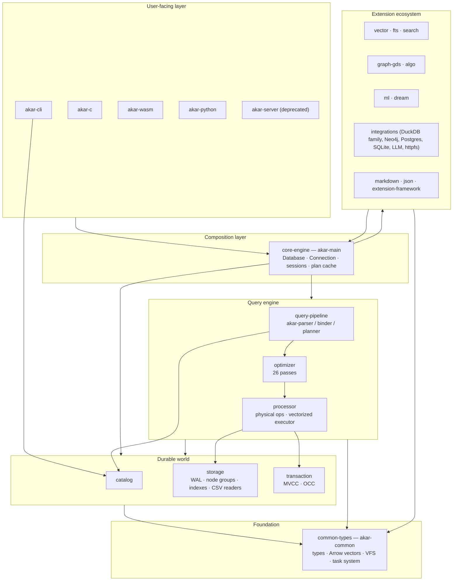

# 2. Akar — Architecture

> How the 36 crates under `akar-core/` fit together, and how data moves through them.

## Architectural posture

Akar is a **layered embedded library**. The vertical stack is strict: `akar-common` underpins everything; the storage and transaction layers hold the durable world; the query pipeline, optimizer and processor transform and execute Cypher; `akar-main` is the single public crate that composes it all; and bindings/servers sit on top. Around the core sits a horizontal, uniformly-plugged **extension ecosystem** — vector, FTS, algorithms, ML, dream, markdown, JSON, and the foreign-engine adapters — all entering through one `Extension` trait.

The design DNA is inherited from KuzuDB, deliberately preserved: column-major storage with node groups, CSR adjacency, worst-case-optimal joins, factorized execution, and MVCC. But Akar compresses all of it into a process, replaces C++ with Rust, and opens the engine's seams — index-aware optimizations, SQL-visible ANN/FTS, and a pluggable graph-data-source — as first-class citizens.

## Bottom-up: the layers

### 1. Foundation — `akar-common` (common-types)
The shared vocabulary every crate depends on: the physical type system (`types.rs:8`, 37 logical types), `Value` for scalar/nesting values, Arrow-backed `DataChunk` for columnar batches, the `Selection` vector for row filters, the VFS traits (`FileSystem`/`FileRead`/`FileWrite`), a worker-thread `TaskSystem`, and a unified `MemoryManager`. Nothing above it re-implements these; nothing below it needs them twice.

### 2. The durable world — storage + transaction + catalog
- **`akar-storage`** owns the on-disk format: column-major node groups, CSR adjacency for relationships, page/buffer management, the ART/hash index family, the group-commit WAL, the replay-based crash recovery, checkpoint (ShadowFile), and the Parquet/CSV/JSON/NPY readers. `STORAGE_VERSION = 1` (`version_info.rs`) is the compatibility contract.
- **`akar-transaction`** implements the MVCC lifecycle — snapshot timestamps, commit ordering, undo management — plus OCC write-set tracking so multiple writers can coexist and row-level conflicts are detected at commit.
- **`akar-catalog`** is the schema brain: the `TableCatalog` (tables, columns, indexes) that the binder locks for symbol resolution (`binder/mod.rs:170`) and that the processor reads for scans.

### 3. The query engine — parser / binder / planner / optimizer / processor
- **`akar-parser`** (pest PEG) turns Cypher text into a 33-variant `Statement` AST.
- **`akar-binder`** resolves every symbol and type against the catalog, yielding a 33-variant `BoundStatement`, plus FTS/vector index binding and confidential-call detection (S3/GCS/Azure).
- **`akar-planner`** turns bound statements into a flat `Vec<LogicalOperator>` (59 variants) with greedy join ordering and worst-case-optimal `Intersect` shapes.
- **`akar-optimizer`** applies 26 rewrites (19 flat + 7 tree): push-downs, constant folding, top-K, ART range-scan detection, vector-similarity scan detection, FTS predicate routing, cardinality estimation.
- **`akar-processor`** is the executor: each logical operator becomes a `PhysicalOperatorExec` closure pushing Arrow `DataChunk`s forward, with rayon parallelism for joins/aggregation/sort, MVCC/OCC/WAL instrumentation, spill-to-disk, and dedicated paths for table functions and vector-similarity scans.

### 4. Composition — `akar-main` (core-engine)
The single published surface (`cargo add akar-main`). `Database::new` builds the storage, catalog, and registers built-in extensions (`register_builtin_extensions`, `database.rs:758`); `Connection` wraps sessions, DDL/DML/COPY helpers, standalone calls, plan cache (`plan_cache.rs:30`), the TCP client (`connect_tcp`, `database.rs:512`); `QueryResult`/`PreparedStatement` expose results over Arrow.

### 5. Extension ecosystem (all `Extension` -trait plugins)
One contract — `Extension::name() + load(&ExtensionContext)` (`akar-extension/src/lib.rs:20`) — and the shared `ExtensionContext` hands each plugin the `FunctionRegistry`, the Catalog, and the VFS so it can register SQL objects. The same lifecycle serves built-ins and third parties:

| Extension | Capability added to SQL |
|---|---|
| `vector` | Distance scalar functions + `vector_similarity_scan` (HNSW ANN) |
| `fts` | `stem`, `tokenize`, `bm25`, `tf_idf`, `highlight` + FTS index DDL |
| `search` (library) | Hybrid fusion (RRF), hierarchical fusion, `HybridScan` operator |
| `algo` + `graph` | ~27 graph algorithms as table functions over a `GraphDataSource` |
| `ml` | `embed_text` scalar (local fastembed/BGE/Rerank), pure-Rust LSTM |
| `dream` | Memory-consolidation orchestrator over a `DreamBackend` |
| `markdown` / `json` | `read_markdown_wiki` table fn; 7 JSON scalar functions |
| integrations | DuckDB/SQLite/Postgres/Neo4j interop, `httpfs` VFS, `create_embedding`, lakehouse adapters (Delta/Iceberg/Azure/Unity Catalog) |

### 6. Bindings & server
`akar-cli` (interactive REPL), `akar-c` (extern "C" ABI), `akar-wasm` (browser/Node, in-memory), `akar-python` (Kuzu drop-in via a SQL dialect translator), and `akar-server` (TCP daemon — deprecated for production per P124; Sulur embeds `akar-main` in-process instead).

## Cross-cutting concerns

- **Concurrency**: one writer lock around the storage; MVCC snapshots for readers; OCC retry for rival writers; rayon for data-parallel operator work; `Arc<Mutex<Catalog>>` for schema access.
- **Extension seams are index-aware**: the optimizer *converts* patterns into index scans (ART range, FTS push-down, HNSW) rather than leaving index awareness to the planner — the planner stays grammar-complete and the optimizer owns performance.
- **Dependency inversion for graphs**: `GraphDataSource` lives in `akar-function`, so `akar-algo`/table functions and Sulur's embedding keep the graph layer decoupled.

## Design decisions worth knowing

| Decision | Rationale |
|---|---|
| Plugin everything behind one `Extension` trait | Users add features with one append to `register_builtin_extensions`; lifecycle is uniform |
| 26-pass optimizer with detection passes | Idle users get ANN/FTS/ART acceleration with no query rewrites |
| Binder is serialized per statement (`Arc<Mutex<Catalog>>`) | Schema-snapshot correctness over parallel binding |
| Keep `akar-server` as a wire reference | Sulur moved to in-process embedding; the TCP JSON framing stays documented/tested (P124) |
| Column-major storage + CSR adjacency | Memory-efficiency and cache-locality for graph traversals (ADR heritage) |
| Storage version gated SemVer `0.2.0` | No silent format breaks — a bump without migration forces a MINOR version |