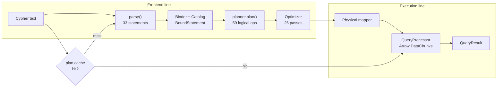
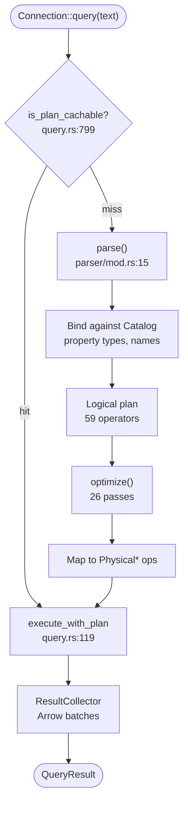
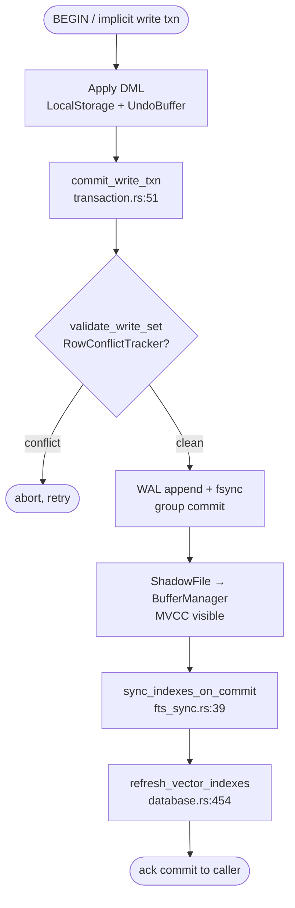
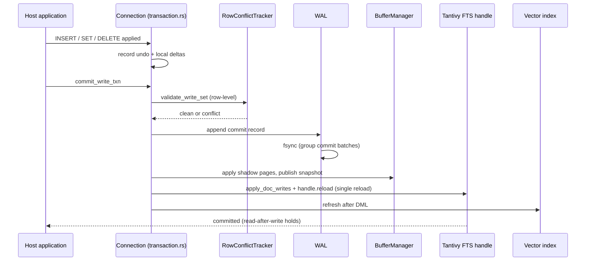
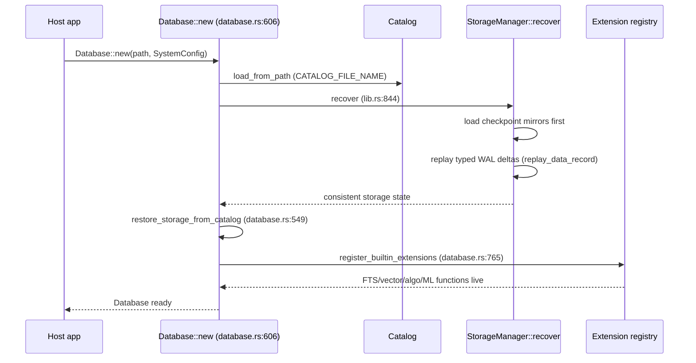
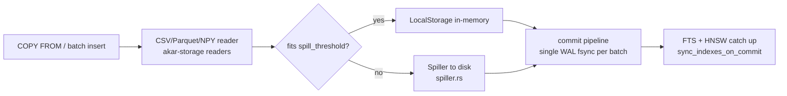
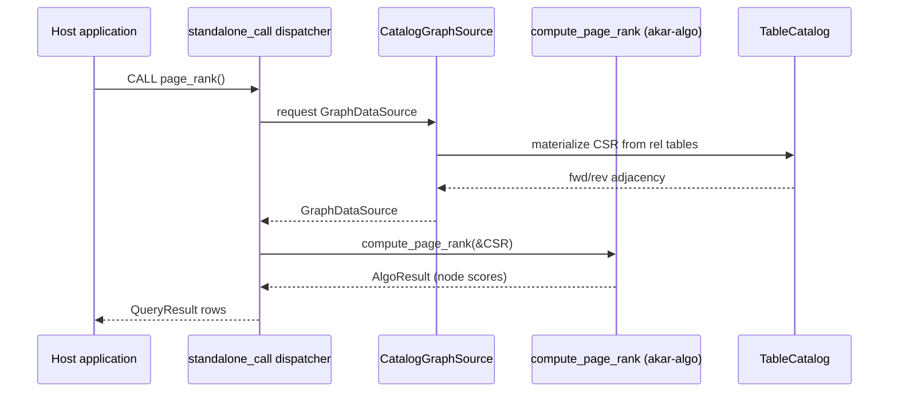

# Core Workflows

## 1. Workflow overview

### 1.1 Workflow philosophy

Akar's workflows are best understood as an assembly line with quality gates: raw Cypher text enters at one end, each station (parse, bind, plan, optimize, execute) refines it, and nothing ships without passing the gate ahead of it. Writes take a second, stricter lane — the durability line — where a commit isn't "done" when the data is in memory, but when it is fsync'd, published to readers, and reflected in the indexes. This document walks the five flows a maintainer or embedder must know: the read query, the write commit, database open/recovery, bulk ingest, and a GDS algorithm call.

### 1.2 Core execution path

Every query — read or write, cold or warm cache — ultimately follows this spine. The plan-cache gate is the first fork: hot statements skip the entire left half of the line.



---

## 2. Main workflows

### 2.1 Read query (SELECT/MATCH via openCypher)

A read query is the everyday case: an application asks a question of the graph and wants typed rows back fast. Its importance lies in the *cold vs warm* split — the first execution pays the full compiler cost, every subsequent one should not. Understanding where time goes on each path tells you whether a latency regression is a parse problem, an optimizer problem, or a scan problem.

#### Flowchart



#### Sequence diagram

```mermaid
sequenceDiagram
    participant App as Host application
    participant Conn as Connection
    participant Cache as Plan cache (LRU)
    participant FE as Parser/Binder/Planner
    participant Opt as Optimizer
    participant Proc as QueryProcessor
    participant Stor as StorageManager

    App->>Conn: query("MATCH (n:Person) WHERE n.age > 30 RETURN n")
    Conn->>Cache: lookup(statement text)
    alt cache miss
        Cache-->>Conn: miss
        Conn->>FE: parse + bind + plan
        FE-->>Conn: LogicalOperator pipeline
        Conn->>Opt: optimize (pushdown, TopK, joins)
        Opt-->>Conn: optimized plan
        Conn->>Proc: build via create_processor (query.rs:553)
    else cache hit
        Cache-->>Conn: cached optimized plan
        Conn->>Proc: reuse handlers
    end
    Proc->>Stor: scan / index probe (ART, HNSW, FTS)
    Stor-->>Proc: DataChunks
    Proc-->>App: QueryResult
```

#### Stage table

| Stage | Executor | Input | Output | Notes |
|-------|----------|-------|--------|-------|
| Entry | `Connection::query` (`akar-main/src/connection/query.rs:21`) | Cypher text | — | Also checks plan cache |
| Frontend | `parse()` (`akar-parser/src/parser/mod.rs:15`) | Text | `Statement` (33) | EXPLAIN prefix handled here |
| Bind/Plan | binder + `planner.plan()` | `Statement` | `LogicalOperator` list | Types from `Catalog::get_property_type` |
| Optimize | `Optimizer::optimize` (`akar-optimizer/src/optimizer.rs:134`) | Logical plan | Optimized plan | Detection passes may swap in index scans |
| Execute | `execute_with_plan` (`query.rs:119`) | Plan | Arrow batches | Write statements get implicit txn |
| Collect | `ResultCollector` | Batches | `QueryResult` | Columnar, zero row-copy |

### 2.2 Write commit (the durability workflow)

If the read workflow is the assembly line, the commit workflow is the bank vault — its entire purpose is that once `commit` returns, the data will survive a power cut *and* every index agrees it exists. This flow matters because ordering bugs here are the classic database failure mode: an index that shows a row before the WAL can restore it, or a reader that sees half-published pages. Akar's sequence is strictly validation → log → publish → index-sync, and each arrow below is a tested contract (P107.x, P51.x).

#### Flowchart



#### Sequence diagram



#### Stage table

| Stage | Executor | Input | Output | Notes |
|-------|----------|-------|--------|-------|
| Apply | processor write ops (`physical/write_ops/`) | DML statement | LocalStorage deltas + undo | Not yet durable |
| Validate | `RowConflictTracker::validate_write_set` (`akar-transaction/src/lib.rs:511`) | Write set | Pass/fail | OCC: fail = abort, no lock waits |
| Log | `StorageManager::commit_transaction` (`akar-storage/src/lib.rs:658`) | Commit bytes | fsync'd WAL | Group commit amortizes fsync |
| Publish | `BufferManager` via shadow apply | Pages | MVCC-visible snapshot | Readers never block |
| Index sync | `sync_indexes_on_commit` (`akar-processor/src/physical/write_ops/fts_sync.rs:39`) | Undo write set | Updated Tantivy segment + reloaded reader | Runs *after* durability |
| Vector refresh | `refresh_vector_indexes` (`akar-main/src/database.rs:454`) | Table id | Refreshed HNSW graph | P52.38 |

### 2.3 Database open & crash recovery

Open/recovery is the workflow users never see until something goes wrong — which is exactly why it deserves the same rigor as the happy path. The invariant: after `Database::new` returns, the catalog, the tables, and the indexes describe *one consistent world* — the world the last successful commit promised. The two-phase recovery (checkpoint mirrors first, then WAL replay last-write-wins) is what makes that invariant achievable in bounded time.



The extension step runs *after* recovery because FTS handles must open against replayed segments — registering them earlier would let the first query race a half-recovered index.

### 2.4 Bulk ingest (COPY FROM / CSV / Parquet)

Bulk ingest is the workflow where throughput, not latency, is the design target: millions of rows must reach storage without per-row commit overhead or unbounded memory growth. Two mechanisms define it — spilling (an ingest that exceeds `spill_threshold` flushes to local spill files instead of ballooning RAM) and the deferred index update (FTS/HNSW catch up at commit rather than per row). The memory governor (`admit_query`) sits upstream as the bouncer: if the host is already memory-constrained, ingest waits rather than OOM-ing the process it lives inside.



### 2.5 GDS algorithm call (CALL page_rank ...)

The GDS workflow demonstrates Akar's table-function seam: a Cypher `CALL` crosses from the connection's standalone-call dispatcher into a pure CSR kernel and comes back as ordinary rows — no special result type, no client-side API. The interesting design point is `CatalogGraphSource`: the algorithm never touches `TableCatalog` internals directly; it receives a `GraphDataSource` view, so the same kernel works against a real catalog, a test sample, or (potentially) a remote source without changing a line of algorithm code.



---

## 3. Concurrency model

Akar splits concurrency into two independent planes, and conflating them is the most common mental-model error when reading the code. *Within* one query, rayon fans operator work across `SystemConfig::max_num_threads` — hash tables and sort pipelines build for parallel population, and Arrow batches are the unit of exchange. *Across* transactions, readers take MVCC snapshots and never block a writer; writers take a brief `ConcurrencyControl` gate (`AtomicBool` + `Condvar`, `akar-transaction/src/lib.rs:545`), accumulate row-level write sets, and validate them at commit — losing cleanly on conflict instead of holding locks. Group commit batches the fsyncs of multiple winners into one disk round-trip, so durability doesn't serialize write throughput. The practical consequence for embedders: expect retry-on-conflict under pathological write contention (the OCC trade), not deadlock — there are no row locks to deadlock on.

## 4. Error-handling strategy

Errors in Akar travel as typed results from the layer that detected them, never as panics across a crate boundary — the panic firewall is most visible at the FFI edge, where `akar-c`'s `catch` wrapper (`akar-c/src/lib.rs:55`) converts any unwinding panic into an `akar_state` code plus a heap-allocated message the caller must free. Inside the engine, the layers partition responsibility cleanly: the parser reports syntax position, the binder reports semantic illegality (`Bind error: Table 'X' not found` — case-sensitive by design), the optimizer and executor report runtime conditions (type mismatch, conflict abort, memory admission denial), and storage reports durability failures as commit errors that must be treated as fatal for that transaction. Two graceful-degradation paths are deliberate exceptions to fail-fast: FTS sync after commit is non-fatal by contract (P107.1 — a failed index update must not roll back a durable row; the index catches up or is rebuilt), and salvage mode (`set_skip_wal`, `akar-storage/src/lib.rs:211`) lets an operator open a database with a corrupt WAL when recovery is preferable to inaccessibility. For hosts, the rule of thumb: treat commit errors and open/recovery errors as fatal-to-operation, treat bind/parse errors as data-entry bugs, and treat index-sync warnings as telemetry, not transaction failure.

---

*Generated: 2026-09-23 · Sources: `akar-core/akar-main/src/connection/query.rs`, `akar-core/akar-main/src/connection/transaction.rs`, `akar-core/akar-storage/src/lib.rs`, `akar-core/akar-transaction/src/lib.rs`, `akar-core/akar-processor/src/physical/write_ops/fts_sync.rs`, `akar-core/akar-main/src/database.rs`, `.terrain/.litho-agent/workflow.md`*
