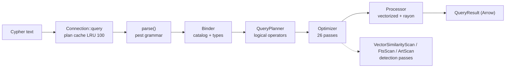
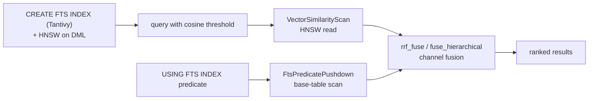

# 3. Akar — End-to-End Workflows

> Six canonical journeys through the engine, from a Cypher keystroke to a durable graph mutation to a dream cycle.

## Workflow 1 — Query (the read path)

The most travelled road in the engine: Cypher text in, `QueryResult` out. Every stage is a crate boundary, so the path is easy to trace end to end.

1. `Connection::query` (`akar-main/src/connection/query.rs:21`) receives the text, consults the plan cache (LRU, capacity 100 — `connection/plan_cache.rs:30`).
2. `parse()` (`akar-parser/src/parser/mod.rs:15`) tokenizes via the pest PEG grammar and builds the `Statement` AST (33 variants, `ast.rs:107-141`).
3. `Binder` (`akar-binder/src/binder/mod.rs:198`) resolves symbols and types against `Arc<Mutex<TableCatalog>>`, producing a `BoundStatement` (33 variants, `bound_statement.rs:10-44`).
4. `QueryPlanner::plan` (`akar-planner/src/planner.rs:139`) arranges a flat `Vec<LogicalOperator>` (59 variants, `logical_operator.rs:66-126`), choosing a greedy join order or a worst-case-optimal `Intersect` shape (`join_order.rs:36,216`).
5. `Optimizer::optimize` (`akar-optimizer/src/optimizer.rs:134`) runs 26 passes; `VectorSimilarityDetection` (`passes/flat/vector_similarity.rs:47`) and `ArtRangeScanDetection` (`passes/flat/art_range_scan.rs:23`) may rewrite the plan into index scans.
6. `QueryProcessor::execute` (`akar-processor/src/processor/mod.rs:354`) maps each operator to a `PhysicalOperatorExec` (`physical/types.rs:14`) and pushes Arrow `DataChunk`s through the pipeline, with rayon parallelism in joins (`join_ops.rs:755-758`), aggregation (`aggregatehashtable.rs:170`) and sort (`blockmergesort.rs:10`).
7. Results collect as `Vec<DataChunk>` and come back as a `QueryResult` over Arrow.

**Concurrency notes:** bind + plan are serialized per statement; the plan cache lets hot queries skip everything from parse through optimization.

## Workflow 2 — Write + durability

How a DML statement becomes an append-only WAL record, gets a durable commit, and survives a crash.

1. `Connection::transaction` starts an MVCC transaction (`akar-main/src/connection/transaction.rs:9`); a snapshot timestamp is assigned.
2. `PhysicalInsert/Delete/Set` operators execute against the snapshot, tracking the OCC write-set (`written_rows`) and writing logical undo records to `undo_sink` (`akar-processor/src/processor/mod.rs:304-352`).
3. On `commit`, the transaction layer runs optimistic conflict detection against the commit history; a `WriteConflict` aborts rival writers instead of corrupting either.
4. The committed changes append to the group-commit WAL — file magic `b"AKAR"`, format version 2 (`akar-storage/src/wal.rs:12,14,324`) — before acknowledgment, giving durability-on-commit.
5. The buffer manager applies pages lazily; a checkpoint (`ShadowFile` in `akar-storage`) periodically flushes all tables so recovery never replays too much WAL. `--checkpoint-threshold` (default 16 MiB) decides when.
6. Crash recovery replays the WAL from the last milestone (`wal_replayer.rs:36`) and re-materializes the graph.

**Soft-delete semantics:** `PhysicalDelete`/`PhysicalSet` resolve the `_id` column correctly (P52.62 fix in `delete.rs:14`/`set.rs:26`), so deleted rows fall out of PK lookups but still appear in full scans until compaction.

## Workflow 3 — Hybrid search (FTS + vector + RRF fusion)

The retrieval path that makes "find the memory that means this" work.

1. **Index the data** — `CREATE FTS INDEX ON :Document (text)` builds a Tantivy index per text column (`akar-fts`), with an optional `WITH TOKENIZER('...')` part of the DDL (P109.1). HNSW graphs for vector columns are maintained by the catalog on DML (`TableCatalog::refresh_vector_indexes_for_tables`).
2. **Query with vector intent** — `MATCH (d:Document) WHERE cosine_similarity(d.embedding, $q) > 0.8 RETURN d ORDER BY cosine_similarity(d.embedding, $q) DESC LIMIT 10` is detected by the optimizer's `VectorSimilarityDetection` and rewritten into `[VectorSimilarityScan(HNSW), Filter, OrderBy, Limit]` (`akar-optimizer/src/passes/flat/vector_similarity.rs:47`). The physical side is `PhysicalVectorSimilarityScan` (`akar-processor/src/physical/write_ops/vectorsimilarityscan.rs:15`).
3. **FTS routing** — `USING FTS INDEX` predicates bind at the binder, plan as `FtsScan`, and are pushed back onto the base-table scan by `FtsPredicatePushdown` (`akar-optimizer/src/passes/tree/fts_predicate_pushdown.rs:21`) so index read and predicate land together.
4. **Fuse** — the two candidate lists meet in `akar-search`: `rrf_fuse_owned` / `weighted_rrf_fuse` (`akar-search/src/algorithm/rrf.rs:23`) blend ranks (`DEFAULT_K = 60`), producing a single ranked result; the hierarchical variant (`fuse_hierarchical`, `hierarchical.rs:71`) fuses summary/content/BM25 channels with optional authority boosting (`apply_authority`, `hierarchical.rs:119`).

## Workflow 4 — Graph analytics via `CALL`

GDS runs entirely inside SQL through the `ALGO` extension.

1. `CALL page_rank(*, 0.85, ...)` enters through the binder's standalone-call path (`bind_standalone_call`, `akar-binder/src/binder/mod.rs:1592`).
2. At execution, the processor resolves the table function (`QueryProcessor::execute_table_function`, `akar-processor/src/processor/mod.rs:485`) with a `CatalogGraphSource` snapshot built from `TableCatalog` (`graph_source.rs:13,20`) — connected in `standalone_call.rs` via the `TableFunction::CustomTableWithGraph` variant (P52.46).
3. `akar-algo` builds a CSR adjacency (`akar-graph/src/graph.rs:33,64`) and runs the kernel (PageRank `algorithms.rs:54`, WCC `:120`, SCC variants, k-core, Louvain, spreading activation, node2vec `gds/node2vec.rs:112`).
4. Results stream back as (node, value) rows. When no catalog exists (tests, bare registry), a 5-node ring `sample_edges` fallback keeps everything usable (`akar-algo/src/lib.rs:57-73`).

## Workflow 5 — Memory consolidation ("dreaming")

The background cognitive cycle that turns a raw memory store into a hardened, connected one.

1. `DreamOrchestrator::run_cycle` (`akar-dream/src/orchestrator.rs:57`) walks a fixed phase sequence over a `DreamBackend` (the persistence seam: `backend.rs:31`).
2. NREM (`phases/nrem.rs:27`) decays edges by recency/salience using `retention_score` (P119.2) from `akar-function`; SUPERSEDES resolves contradictions; REM finds bridges (optionally via shared embeddings from `akar-ml`, P119/P120); Insight/AFE/Synthesis/DAE abstract and synthesize.
3. Weaken/enhance/prune operations land through `DreamBackend` (`strengthen_edge`/`weaken_edge`/`prune_edge`), so the engine is storage-agnostic (`MockBackend` in tests).
4. Statistics accumulate on `DreamStats`; on the server, `DreamControl` serializes dream cycles across connections (`akar-server/src/dream.rs:781`).

## Workflow 6 — Python drop-in (Kuzu compatibility)

How `import akar` becomes a drop-in replacement for the KuzuDB Python client.

1. `Connection.query(cypher)` (`akar-python/src/lib.rs:97`) splits multi-statements, then the `Translator` (`translation.rs`) rewrites Kuzu dialect — `FLOAT[384]`, `IF NOT EXISTS`, `CALL QUERY_VECTOR_INDEX`, `INSTALL vector; LOAD EXTENSION vector`, `ALTER … DEFAULT` — into Akar dialect.
2. `param_interp::interpolate` (`param_interp.rs`) inlines side parameters that native prepared statements cannot substitute (`LIMIT $n`, `ORDER BY`).
3. Execution returns a Kuzu-shaped `QueryResult` (`has_next()`, `get_next()`, `rows_as_dict(True)`, `__iter__`, truthiness), converting Arrow cells to Python values (`value_to_py`).
4. Reserved internal columns (`_id/_label/_src/_dst/_rel_id`) are filtered from `CALL table_info` expansions (`lib.rs:40,282-307`), so user-facing schemas look like plain Kuzu schemas.

## Workflow cross-cutting notes

| Concern | Behavior |
|---|---|
| Concurrency | Read via MVCC snapshots; write via OCC retry; extension/plan/catalog access mutex-guarded |
| Failures | WriteConflict → retry; malformed wire chunks → `<malformed chunk>` not panics; crash → WAL replay |
| Security | Confidential `CALL`s (S3/GCS/Azure) excluded from CLI history (`is_confidential_call`); auth token on TCP; 128 MiB frame cap |