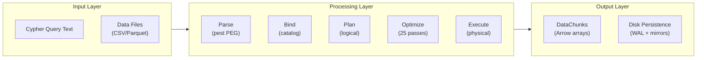
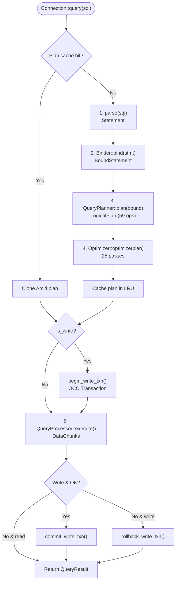
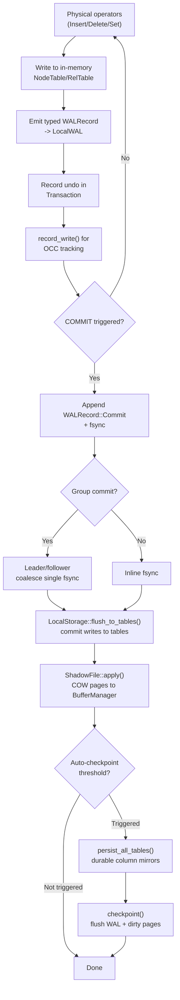
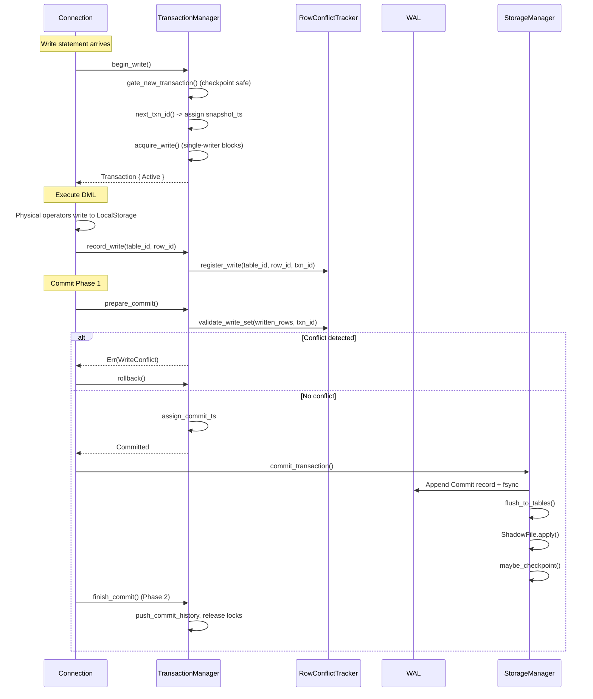
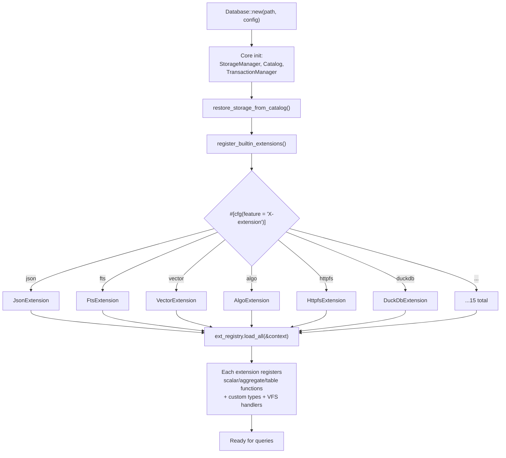
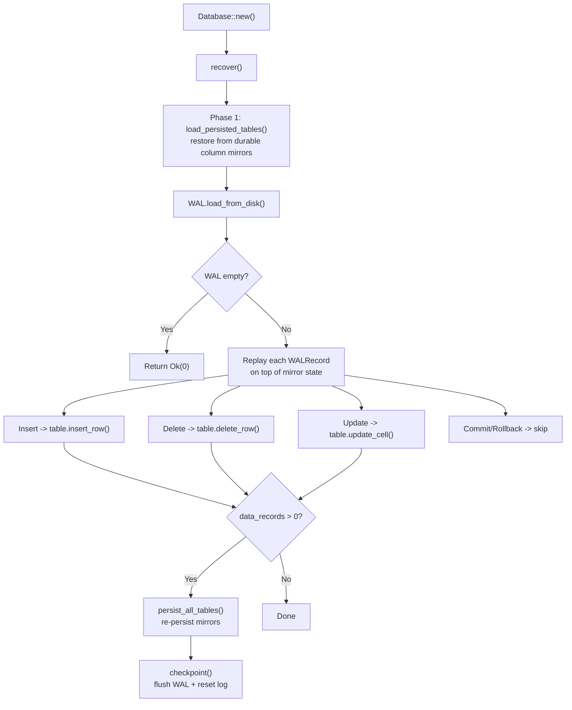

# Core Workflows

## 1. Workflow Overview

### 1.1 System Architecture and Workflow Philosophy

Akar's workflows are designed around a single guiding metaphor: the system is a precision manufacturing line for graph data. Raw Cypher queries enter one end, travel through a series of specialized stations (parse, bind, plan, optimize, execute), and emerge as structured Arrow-native result chunks at the other end. Each station does exactly one thing and does it well — there is no station that tries to be clever about someone else's job.

This philosophy extends to the data persistence side: writes are buffered in per-transaction staging areas, validated for conflicts at the boundary, committed with typed WAL records for durability, and periodically checkpointed to durable column mirrors. The separation of "in-memory buffering" from "durable persistence" from "conflict validation" is what makes the system both fast and correct.

### 1.2 Core Execution Path



---

## 2. Main Workflows

### 2.1 Query Execution Pipeline

The query execution pipeline is the most fundamental workflow in Akar — every user interaction ultimately passes through it. Think of it as the central nervous system: it receives a signal (Cypher text), processes it through a series of specialized reflexes (parse, bind, plan, optimize), and produces a coordinated response (result chunks).

The pipeline's key innovation is the plan cache. Identical queries skip the expensive parse-bind-plan-optimize stages entirely, which is significant for planning-dominated workloads where the same complex query runs repeatedly on small data.

**Trigger:** `Connection::query(sql)` or `Connection::execute(prepared, params)`
**Entry:** `akar-main/src/connection/query.rs:21-113`



**Key implementation details:**
- Plan cache: LRU(100), keyed by normalized query string, validated against catalog version (`query.rs:86-113`)
- DDL statements (CREATE/DROP/ALTER TABLE) bypass the processor pipeline and execute directly via `connection/ddl.rs`
- Write statements are automatically wrapped in OCC transactions — the caller does not need to manage transaction boundaries for simple DML
- `PreparedStatement` supports named `$param` extraction via AST walk and batched row objects (Value::Struct -> Map, P69)

**Phase breakdown:**

| Phase | Executor | Input | Output | Key File |
|-------|----------|-------|--------|----------|
| Parse | `parse()` (pest) | Cypher text | `Statement` AST | `akar-parser/src/lib.rs` |
| Bind | `Binder::new(catalog).bind()` | `Statement` | `BoundStatement` | `akar-binder/src/lib.rs` |
| Plan | `QueryPlanner::plan()` | `BoundStatement` | `Vec<LogicalOperator>` | `akar-planner/src/lib.rs` |
| Optimize | `Optimizer::optimize()` | `LogicalPlan` | Optimized plan | `akar-optimizer/src/lib.rs` |
| Execute | `QueryProcessor::execute()` | Physical plan | `DataChunks` | `akar-processor/src/lib.rs` |

### 2.2 Storage Write Path

The storage write path is where data actually touches disk. It is designed around a "buffer-then-commit" model: writes accumulate in per-transaction staging areas, are validated for conflicts at commit time, and only then are they made durable via WAL records and applied to the in-memory tables.

Think of this like a bank's batch processing: individual transactions are recorded in a journal (WAL) throughout the day, but the actual account balances (column mirrors) are updated in a nightly batch (checkpoint). The journal ensures that if anything goes wrong, the bank can replay the day's transactions to reconstruct the correct state.

**Trigger:** PhysicalInsert / PhysicalDelete / PhysicalSet operators during query execution
**Entry:** `akar-storage/src/lib.rs:602-686`



**Write buffering chain (3 layers):**
1. **LocalStorage** — per-transaction buffer of pending writes (inserts/deletes/updates); not visible to other transactions until commit
2. **LocalWAL** — per-transaction typed WAL records (bulk-copied into global WAL only after OCC validation succeeds, so a conflict loser's records never reach the log)
3. **ShadowFile** — copy-on-write pages for BufferManager modifications; applied atomically at commit

### 2.3 Transaction Lifecycle (OCC Two-Phase Commit)

The transaction lifecycle is the system's safety net. It ensures that concurrent writers do not corrupt each other's data, and that every committed write is durable. The two-phase commit protocol (P51.29) splits the commit into "prepare" (validate and mark committed) and "finish" (release locks and publish), allowing checkpoint operations to proceed without waiting for committed transactions to release their locks.

**Trigger:** Write statement arrives at Connection
**Entry:** `akar-transaction/src/lib.rs:752-942`



**OCC conflict detection (row-level):**
- Each `(table_id, row_id)` written is registered in `RowConflictTracker`
- At commit: check if any *other* active transaction also wrote to the same row
- First committer wins; the loser gets a `WriteConflict` error and rolls back
- Different rows on the same table never conflict — concurrent inserts with different primary keys succeed

### 2.4 Extension Loading Lifecycle

Extensions are compiled statically via Cargo feature flags and loaded during database initialization. This is a "compile-time plugin" model — there is no dynamic loading, no shared libraries, no plugin discovery at runtime. The benefit is zero runtime overhead for unused extensions and guaranteed type safety across the extension boundary.

**Trigger:** `Database::new(path, config)`
**Entry:** `akar-main/src/database.rs:621-773`



**Extension trait contract:**
```rust
trait Extension: Send + Sync {
    fn name(&self) -> &'static str;
    fn load(&self, context: &ExtensionContext) -> Result<(), String>;
}
```

The `ExtensionContext` provides access to the `FunctionRegistry`, `Catalog`, and `VirtualFileSystemRegistry` — everything an extension needs to register its capabilities without depending on internal engine types.

### 2.5 Crash Recovery

Crash recovery is the system's last line of defense. It follows a "load checkpoint, then replay WAL" strategy that guarantees exactly-once recovery of all committed transactions.

**Trigger:** `Database::new()` after catalog restore
**Entry:** `akar-storage/src/lib.rs:809-852`



**Durability guarantee:** Mirrors + typed WAL replay. A crash between akar commit and Tantivy FTS commit leaves the FTS index stale but uncorrupted (P107.3) — the non-fatal hook contract degrades to lower searchability, which is exactly the right tradeoff for an embedded database where durability of the graph data is paramount.

---

## 3. Concurrency and Async Model

Akar's concurrency model is deliberately simple: synchronous query execution with optional concurrent writers via OCC. There is no async runtime in the core engine — this is a deliberate choice because the hot path is CPU-bound (column scans, hash joins, expression evaluation), not I/O-bound.

**Single-writer mode** (default): One write transaction at a time. Readers are never blocked. Simple and safe.

**Concurrent multi-writer mode** (`concurrent_writes = true`): Multiple write transactions via row-level OCC. First committer wins. Different rows never conflict. Group commit reduces fsync overhead.

The only place where async appears is `akar-postgres` (tokio-postgres for PostgreSQL federation), which uses `block_on` to bridge the async/sync boundary.

---

## 4. Error Handling Strategy

Akar's error handling follows a "local failure stays local" philosophy: a failed query should not corrupt the database, and a failed transaction should not affect other transactions.

**Error hierarchy** (defined in `akar-common`):
```
AkarError
├── StorageError     (12 variants)
├── TransactionError (6 variants)
├── CatalogError     (5 variants)
├── BinderError      (6 variants)
├── PlannerError     (1 variant)
└── ProcessorError   (3 variants)
```

All crates use `Result<T, E>` with `?` propagation. No `panic!()` or `.unwrap()` in production code paths — replaced with `ok_or_else()`, epsilon float comparisons, etc. The `akar-c` FFI layer wraps every function in a `catch()` boundary to prevent panics from crossing the FFI boundary (which would be undefined behavior).

Write conflicts produce `TransactionError::WriteConflict` which triggers automatic rollback — the caller does not need to handle cleanup manually. FTS index sync failures are non-fatal by contract (P107.1) — the durable commit already succeeded, so a broken index only degrades searchability, never durability.
