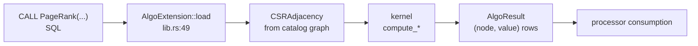

# Graph Algorithms (akar-algo)

**Module path:** `akar-core/akar-algo/`
**Role:** Core domain — graph algorithms callable from SQL.

---

## Overview

`akar-algo` ships graph algorithms as SQL table functions through an `ALGO` extension. Each algorithm builds (or receives) an in-memory CSR adjacency over the catalog's graph, runs its kernel, and streams results back as node→score rows. This is the payoff of the graph-database wager: PageRank, connected components, shortest paths, k-core, Louvain community detection, and even embedding-style sampling (Node2Vec, random walk) are all one `CALL` away — no exporting, no separate analytics toolchain.

When no catalog is available (registry tests, bare embedding), `load` falls back to a 5-node ring `sample_edges` closure (`lib.rs:57-73`) so algorithms remain usable anywhere.

## Core functions

1. **Classic metrics** — `compute_closeness_centrality` (`lib.rs:1261`) and `compute_triangle_count` (`lib.rs:1303`).
2. **Sampling methods** — `compute_node2vec` (`gds/node2vec.rs:112`) and `compute_random_walk` (`gds/random_walk.rs:9`) with biases/exponents.
3. **Table functions** — PageRank (alias `PR`), WCC, SCC (Tarjan) / `SCC_KO` (Kosaraju), KCORE, Louvain, SF (Spanning Forest), SP (BFS shortest path), Dijkstra (weighted), ASPD (All Shortest Path Destinations), SpreadingActivation — registered in `load` (`lib.rs:49`, e.g. first call at `lib.rs:311`).
4. **Walk generation** — `node2vec.rs:7` biased random-walk generation with p/q.
5. **Walk scoring** — `random_walk.rs:9` uniform scattered walks counting per-node hits.

## Key components

| Component/type | File path | One-line responsibility |
|---|---|---|
| `AlgoExtension` | `akar-algo/src/lib.rs:30` | ALGO extension load (`name()` `lib.rs:45`) |
| Registration | `akar-algo/src/lib.rs:49-863` | ~27 `register_table_function` calls |
| `compute_*` kernels | `akar-algo/src/lib.rs` | In-file algorithm implementations |
| `gds` module | `akar-algo/src/gds/mod.rs` | node2vec/random_walk/rng submodules |
| `Node2Vec` fn | `akar-algo/src/gds/node2vec.rs:112` | Biased walks → `compute_node2vec` |
| `RandomWalk` fn | `akar-algo/src/gds/random_walk.rs:9` | Uniform walk hits |

## Internal data flow

## Key interfaces & extension points

- **`Extension` trait** + one `register_table_function` call per algorithm — adding a new algorithm is registering a new function.
- Each algorithm has its own SQL-facing name; aliases provided (`PR` == PageRank).
- **`CSRAdjacency`** is the input graph abstraction shared with `akar-graph`.

## Interactions with other modules

| Module | Direction | Interface used |
|---|---|---|
| akar-graph | ← | `CSRAdjacency`, `BaseBFSGraph` |
| akar-extension | → | Extension framework |
| akar-storage | → | Catalog / graph source |

## Performance & concurrency notes

Kernels operate on CSR for cache locality; BFS uses an iterative frontier stack. Spreading activation is batched (`batch_spread_activation`) for many seeds. Sampling algorithms use a small in-crate `SimpleRng` (seed 42 in `random_walk`) — deterministic by default.

## Implementation highlights

- A rich algorithm menu exposed directly in SQL — rare for an embedded database.
- **Both SCC variants**: Tarjan (iterative, P52.47) and Kosaraju (`SCC_KO`).
- Louvain + K-core for community/structure analysis; spread activation for influence spread and query expansion in retrieval workflows.