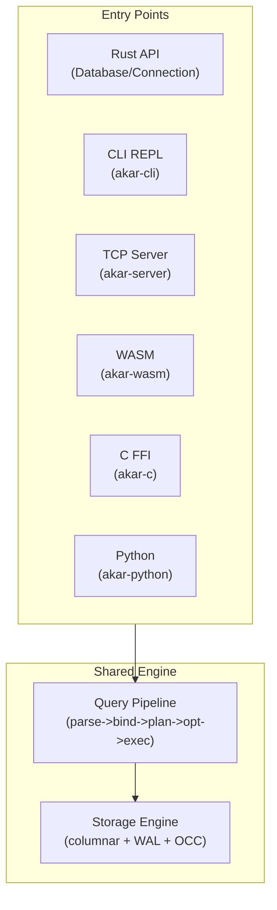

# API Surface & Delivery Domain

**Module Path:** `akar-main/`, `akar-cli/`, `akar-wasm/`, `akar-c/`, `akar-server/`, `akar-migrate/`
**Generated:** 2026-09-15

---

## What This Module Does

The API surface and delivery modules are how users actually interact with Akar. They provide the different ways to create a database, connect to it, execute queries, and get results — from the Rust library API (the primary interface) to the interactive CLI, the WebAssembly bindings for browsers, the C FFI for language interop, the TCP server for multi-process access, and the migration tool for moving from C++ KuzuDB.

Think of these modules as the "front doors" of the system. The engine is the same regardless of which door you enter through — the query pipeline, storage engine, and transaction system are all shared. The delivery modules just provide different ways to reach that shared engine.

---

## Core Capabilities

1. **Rust Library API (akar-main)** — The primary interface. `Database::new(path, config)` creates or opens a database. `Connection::new(&db)` creates a connection. `conn.query("Cypher")` executes queries. `PreparedStatement` supports parameterized queries. `QueryResult` provides Arrow-native result chunks. The API is synchronous, simple, and designed for embedding. Key file: `akar-main/src/lib.rs`.

2. **Interactive CLI (akar-cli)** — A rustyline-based REPL with multi-line Cypher input, tab completion (30+ keywords + table names), 8 output modes (table, CSV, JSON, line, column, box, HTML, LaTeX), dot commands (.mode, .tables, .schema, .import, .export), history with confidential CALL scrubbing, and script mode for piped input. Key file: `akar-cli/src/main.rs`.

3. **WebAssembly Bindings (akar-wasm)** — wasm-bindgen classes (`AkarDatabase`, `AkarConnection`, `QueryResult`) for browser execution. In-memory only on wasm32 (no filesystem access). JS->Value coercion handles null, bool, f64, string. `get_next()` returns row-major objects via `serde_wasm_bindgen`. Key file: `akar-wasm/src/lib.rs`.

4. **C FFI (akar-c)** — `extern "C"` functions for language bindings. Opaque structs (`akar_database`, `akar_connection`, `akar_query_result`). All functions wrapped in `catch()` to prevent panics from crossing FFI boundary. Error messages heap-allocated as C strings (P52.61). Key file: `akar-c/src/lib.rs`.

5. **TCP Server (akar-server)** — Length-prefixed JSON framing over TCP. One owner process holds the file lock; N clients query over TCP. Operations: query, ping, flush, stats, export, shutdown, dream_control. Optional bearer token auth. Session management: one thread per client, own Connection per session. Group commit for concurrent writers. Key file: `akar-server/src/lib.rs`.

6. **Migration Tool (akar-migrate)** — CLI tool for migrating from C++ KuzuDB to Rust Akar. Pipeline: Python extract (schema + data) -> schema.json + Parquet files -> DDL + COPY statements. Idempotent (safe to re-run). Key file: `akar-migrate/src/lib.rs`.

7. **Python Bindings (akar-python)** — PyO3 bindings that serve as a drop-in KuzuDB replacement. `import kuzu` -> `import akar` (single-line change). Cypher translation layer handles Kuzu syntax -> Akar SQL. 53 compatibility tests. Key file: `akar-python/src/lib.rs`.

---

## Key Components

| Component | File | One-Line Role |
|-----------|------|---------------|
| `Database` | `akar-main/src/database.rs:133` | Create/open database, DDL methods, extension loading |
| `Connection` | `akar-main/src/connection/mod.rs:69` | Execute queries, prepare statements, plan cache |
| `QueryResult` | `akar-main/src/query_result.rs:66` | Arrow-native result chunks, row iteration |
| `PreparedStatement` | `akar-main/src/prepared_statement.rs:14` | Parameterized queries with $param extraction |
| `RemoteDatabase` | `akar-main/src/remote.rs:396` | TCP client for server mode |
| CLI REPL | `akar-cli/src/main.rs` | Interactive Cypher shell with 8 output modes |
| `AkarDatabase` | `akar-wasm/src/lib.rs` | WASM database wrapper |
| `Server` | `akar-server/src/lib.rs` | TCP listener with JSON framing |
| `Session` | `akar-server/src/session.rs` | Per-client connection and query handling |

---

## Internal Data Flow

**Key insight:** All entry points converge on the same query pipeline and storage engine. There is no "server mode" query path — the engine is the engine, regardless of how you reach it.

---

## Key Interfaces and Extension Points

- **`SystemConfig`** (`akar-main/src/database.rs:33`): Configures buffer pool size, max threads, compression, concurrent writes, checkpoint threshold, spill threshold. New config options can be added here.
- **`Extension` trait** (`akar-extension`): Extensions loaded during `Database::new()` can register new functions, types, and VFS handlers.
- **TCP protocol**: Length-prefixed JSON framing. New operations can be added to the `session.rs` dispatch table.
- **CLI dot commands**: New dot commands can be added to `execute_dot_command()`.

---

## Interactions with Other Modules

| Module | Direction | Interface | Description |
|--------|-----------|-----------|-------------|
| akar-parser | Depends | `parse()` | All entry points parse Cypher via the same parser |
| akar-binder | Depends | `Binder` | All entry points bind via the same binder |
| akar-processor | Depends | `QueryProcessor` | All entry points execute via the same processor |
| akar-storage | Depends | `StorageManager` | All entry points persist via the same storage |
| akar-extension | Depends | `ExtensionRegistry` | Extensions loaded during Database::new() |
| akar-dream | Depends | `DreamOrchestrator` | TCP server exposes dream_control operation |

---

## Cross-Module Collaboration

**In the Query Execution Pipeline:** Every entry point (Rust API, CLI, TCP, WASM, C FFI, Python) calls `Connection::query()`, which runs the same parse->bind->plan->optimize->execute pipeline.

**In the Server Mode:** The TCP server creates a `Database` instance, accepts client connections, creates per-client `Connection` instances, and routes queries through the standard pipeline. Group commit reduces fsync overhead under concurrent writers.

**In the Migration Tool:** The migrate CLI reads C++ KuzuDB data via Python extraction, converts it to Parquet files, and replays DDL + COPY statements through the standard Akar pipeline.

---

## Performance Characteristics

- Rust API: sub-millisecond overhead (direct function calls)
- CLI: ~1ms overhead (rustyline + output formatting)
- TCP server: ~100 microseconds overhead (JSON framing + network)
- WASM: depends on browser engine; typically ~10ms overhead
- C FFI: ~10 microseconds overhead (function call + panic catch)
- Python: ~100 microseconds overhead (PyO3 bridge)
