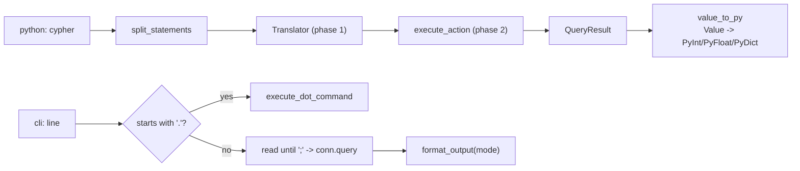

# Bindings (akar-cli, akar-c, akar-wasm, akar-python, akar-migrate)

**Module paths:** `akar-core/akar-cli/`, `akar-core/akar-c/`, `akar-core/akar-wasm/`, `akar-core/akar-python/`, `akar-core/akar-migrate/`
**Role:** Integration — exposing the embedded engine to foreign runtimes.

---

## Overview

Five bindings give the Rust engine its human and cross-language faces. `akar-cli` is a standalone interactive Cypher REPL (with a dot-command shell and piped-script mode). `akar-c` exposes an `extern "C"` ABI for C/C++ hosts. `akar-wasm` is `wasm_bindgen` bindings for Node/wasm32 (in-memory only). `akar-python` is a PyO3 module (`import akar`) that acts as a drop-in shim of the KuzuDB Python client — the key to Sulur's migration story. `akar-migrate` is a one-shot C++-to-Rust database migration tool. All five sit on top of `akar_main::{Database, Connection}`.

The Python binding is the engineering crown jewel: a Kuzu-compatible `QueryResult` API plus a dialect translator, which lets legacy kairos/kuzu bootstrap SQL run unchanged.

## Core functions

1. **CLI** — `CliState::new(db_path, skip_wal)` opens the DB; `execute_dot_command()` handles dot-commands; `execute_query()` / `format_output()` run one query and render it in the selected output mode (`akar-cli/src/main.rs:71,95,443,490`).
2. **C ABI** — `akar_database_init(path, config, out)` → `akar_state`, `akar_connection_init(db, out)`, `akar_connection_query(conn, query, out_result, error_message)` (`akar-c/src/lib.rs:95,168,229`); panic-safe via a `catch()` wrapper; errors exported as heap C strings freed via `akar_error_message_free`.
3. **WASM** — `AkarDatabase::new(db_path)`, `AkarConnection::query/prepare/execute`, `QueryResult::has_next/get_next/get_column_names` — Arrow cells converted to JS values via `serde_wasm_bindgen` (`akar-wasm/src/lib.rs:14,47,144`).
4. **Python** — `Database(path)`, `Connection(db)`, `Connection.query(cypher)` / `execute(cypher, params)`; Kuzu-compatible `QueryResult` with `has_next()`, `get_next()`, `get_all()`, `rows_as_dict(True)`, `__iter__`, `len(r)`, truthiness (`akar-python/src/lib.rs:57,97,117,429,389`).
5. **Migrate** — `main()` runs a 4-step pipeline: Python extraction (`export_cpp.py` → `schema.json` + `<table>.parquet`), open destination DB, reconstruct node/rel DDL, `COPY` data (`akar-migrate/src/main.rs:25,81,142`).

## Key components

| Component/type | File path | One-line responsibility |
|---|---|---|
| `CliState` (mode, conn, catalog) | `akar-cli/src/main.rs:64` | Holds `OutputMode`, `Connection`, `Arc<Mutex<Catalog>>` |
| `CypherCompleter` | `akar-cli/src/main.rs:207` | rustyline `Helper` for keyword/table tab completion + `;` validation |
| `format_output()` | `akar-cli/src/main.rs:490` | `Table`/`Csv`/`Json`/`Line`/`Column`/`Box`/`Html`/`Latex` output modes |
| opaque handles | `akar-c/src/lib.rs:9-33` | `#[repr(C)]` handle structs (`akar_system_config`, `akar_database`, `akar_connection`, `akar_query_result`) |
| `AkarDatabase` / `AkarConnection` / `QueryResult` | `akar-wasm/src/lib.rs:7/34/110` | wasm-bindgen exported classes |
| `Database` / `Connection` / `QueryResult` (pyclass) | `akar-python/src/lib.rs:44/88/360` | PyO3 classes; `Database` force-closes connections on `close()` to release the file lock |
| `Translator` (translation.rs) | `akar-python/src/translation.rs` | Kuzu-dialect → Akar-dialect SQL translation (FLOAT[n], IF NOT EXISTS, CALL vector index, INSTALL/LOAD, ALTER … DEFAULT) |
| `param_interp::interpolate` | `akar-python/src/param_interp.rs` | Side-parameter interpolation into Cypher literals (native prepared statements can't substitute `LIMIT $n`) |
| `Args` (`--from`/`--to`/`--skip-extract`) | `akar-migrate/src/main.rs:9` | Migration CLI surface |

## Internal data flow

## Key interfaces & extension points

- **`akar-cli`**: positional `[database_path]` (default `:memory:`), flags `--skip-wal` / `--salvage`; exit code 2 on unknown args (`main.rs:281-293`); interprets stdin as a script when not a TTY (`main.rs:316`). Dot commands (`.exit`, `.help`, `.tables`, `.schema`, `.mode`, `.import`, `.export`); history persisted to `<data_dir>/akar/history.txt` (`main.rs:431`), with confidential `CALL`s skipped via `is_confidential_call` (`main.rs:408`).
- **`akar-c` ABI**: `#no_mangle extern "C"` functions, `AkarSuccess=0`/`AkarError=1`, error-message out-param; released with `akar_query_result_destroy` — never C `free()`.
- **`akar-wasm`**: constructor accepts only `""`/`":memory:"` on wasm32 (in-memory enforced early); `console_error_panic_hook` installed via `#[wasm_bindgen(start)]`.
- **`akar-python`**: module `akar` also registers sub-modules `knn`, `lstm`, `spread`, `louvain`, `search`, `dream` (`lib.rs:621-633`). Reserved internal columns (`_id/_label/_src/_dst/_rel_id`) are filtered from `CALL table_info` expansion (`lib.rs:40,282-307`).
- **`akar-migrate`**: Python-side `export_cpp.py` produces `schema.json` (`tables[]`, `connections[]`) plus one Parquet per table (`main.rs:30-78`).

## Interactions with other modules

| Module | Direction | Interface used |
|---|---|---|
| akar-main | uses | `Database`, `Connection`, `QueryResult`, `PreparedStatement`, `SystemConfig` |
| akar-catalog | uses (cli) | `Catalog::all_entries`, table names, node/rel flags, columns, PK |
| akar-common | uses | `types::Value` |
| akar-binder | uses (cli) | `confidential_statement_analyzer::is_confidential_call` |
| akar-py sub-modules | uses | `Translator`, `param_interp::interpolate` |

## Performance & concurrency notes

`akar-python` `Database.close()` force-closes tracked connections so a `close → checkpoint → reopen` cycle works while wrapper objects still reference them (P53.18); in-process reentrant file locks allow two `Database` objects on the same path to coexist (P53.35). `akar-c` wraps every entry point in `catch_unwind` because the crate compiles with `panic = "abort"` in release — a panic crossing `extern "C"` would abort the host process. The CLI is single-threaded; a `GLOBAL_STATE` static bridges rustyline completion to `CliState` (`main.rs:203`).

## Implementation highlights

- **Kuzu-drop-in compatibility** is a design goal: kairos bootstrap SQL (`INSTALL vector; LOAD EXTENSION vector; CREATE NODE TABLE IF NOT EXISTS Memory(FLOAT[384]…)`) is accepted, translated, idempotent (`akar-python/src/lib.rs:654-718`); `CALL QUERY_VECTOR_INDEX(...)` is rewritten to a brute-force `MATCH ... ORDER BY array_cosine_similarity(...) DESC` fallback (`lib.rs:310-343`).
- **`akar-migrate` is idempotent**: tables already present in the destination are skipped via `get_table_id` (`main.rs:90-97`).
- WASM refuses on-disk paths at the constructor, enforcing wasm32 constraints early (`akar-wasm/src/lib.rs:17-21`).