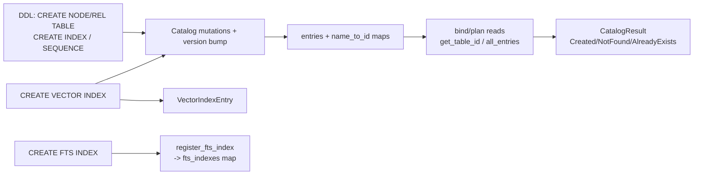

# Catalog (akar-catalog)

**Module path:** `akar-core/akar-catalog/`
**Role:** Supporting domain — the in-memory schema registry that describes the graph.

---

## Overview

`akar-catalog` answers the question "what does this database contain?" — the registry of node tables, relationship tables, columns, primary keys, indexes, sequences, vector/FTS index metadata, projected graphs, type aliases and table comments. Think of it as the database's organ chart: it doesn't hold any of the rows, but every department needs to read it — the binder when typing references, the planner when shaping plans, `akar-main` when persisting or exporting. It is serialisable, so it survives restart as `catalog.json` in the DB directory (`CATALOG_FILE_NAME="catalog.json"` at `akar-main/src/database.rs:23`).

The crate is single-file (`akar-core/akar-catalog/src/lib.rs`, 1,901 lines). Crucially, it stores only **declarative metadata** — the actual built indexes (FTS reads, HNSW graphs) live in storage's `TableCatalog` (`akar-storage/src/table.rs:1230`) — which keeps this crate small, serialisable and cheap to snapshot.

## Core functions

1. **Table creation** — `Catalog::create_node_table` (`src/lib.rs:525`) registers a node table with its columns.
2. **Vector index metadata** — `Catalog::create_vector_index` (`src/lib.rs:451`) records metric + dimensions, validating the target table exists (`lib.rs:459-464`).
3. **FTS index registration** — `Catalog::register_fts_index` (`src/lib.rs:485`) maps an FTS index name → (table, column), erroring on duplicates (P52.39).
4. **Lookups** — `get_table_id` (`src/lib.rs:1124`), `get_table_comment` (`src/lib.rs:943`), `all_entries` (`src/lib.rs:1175`).
5. **SERIAL sequences** — `SequenceEntry::next_k_val` / `rollback_val` (`src/lib.rs:140`, `lib.rs:174`) advance the counter and restore state on rollback.

## Key components

| Component/type | File path | One-line responsibility |
|---|---|---|
| `CatalogColumn` | `src/lib.rs:10` | name, logical_type, is_primary_key, compression, default value |
| `IndexType` | `src/lib.rs:20` | `Hash` vs `Art` (`from_str` L29) |
| `NodeTableEntry` | `src/lib.rs:47` | table_id, name, columns, PK column, index type/name; `has_art_index` L68, `has_index` L73 |
| `RelTableEntry` | `src/lib.rs:80` | table_id, name, src/dst table ids, columns |
| `SequenceEntry` | `src/lib.rs:99` | SERIAL auto-increment state; `get_serial_name` L180 |
| `VectorIndexEntry` | `src/lib.rs:187` | index_id, name, table+column, metric, dimensions |
| `FtsIndexEntry` | `src/lib.rs:202` | FTS index name → source (table, column) |
| `Catalog` | `src/lib.rs:425` | entries map (L426), name→id map (L427), `version` counter bumped per DDL (L430), projected_graphs (L433), fts_indexes (L436), type_aliases (L439), table_comments (L442) |

## Internal data flow

The catalog is mutated through DDL, which `akar-main` redirects via `handle_ddl` bypassing transactions (`akar-main/src/connection/ddl.rs:25-31`), and every DDL bumps `Catalog::version` (L430) — the invalidation signal for the plan cache.

## Key interfaces & extension points

DDL calls return `CatalogResult` (`AlreadyExists`/`NotFound`/`Created{table_id}`); FTS registration surfaces `CatalogError` (`lib.rs:491-493`). `NodeTableEntry::primary_key_column()` (L59) and `num_columns()` (L63) are the everyday helpers. All entries implement serde `Serialize/Deserialize` so the whole catalog round-trips as JSON. Sequences expose a counter-style API: `next_k_val` advances by steps and returns the current value (L140-170); `rollback_val` restores both usage count and current value.

## Interactions with other modules

| Module | Direction | Interface used | Note |
|---|---|---|---|
| akar-main | depended on by | `Arc<Mutex<Catalog>>`, persisted as `catalog.json` | DDL; copy-export reads `all_entries()` (`akar-main/src/connection/copy.rs:22`) |
| akar-binder | depended on by | Catalog entries at bind time | Name/type resolution |
| akar-storage | peer | `TableCatalog` in storage holds the *built* indexes (FTS/HNSW) | Metadata here, handles there |
| akar-common | depends on | `LogicalTypeID`, `CompressionType` | Column definitions |

## Performance & concurrency notes

The `Catalog` is wrapped in `Arc<Mutex<…>>` in `akar-main`, so reads are exclusive; copy/export deliberately releases the lock before writing data files to avoid holding it for the I/O phase (`akar-main/src/connection/copy.rs:16-23`). The version counter (L430) is the plan-cache invalidation signal, so a DDL invalidates cached plans for exactly one version bump.

## Implementation highlights

- Single source of truth for DDL metadata, persisted as JSON — the entire schema round-trips through restart and `EXPORT DATABASE`.
- The metadata/handle split: declarative index metadata lives here; the built indexes live in storage's `TableCatalog` — keeping the catalog serialisable.
- Sequences support overflow cycling and transaction rollback semantics for SERIAL columns (`lib.rs:140-171`).