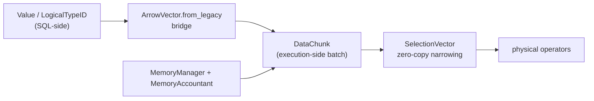

# Common Types & Foundation (akar-common)

**Module path:** `akar-core/akar-common/`
**Role:** Supporting domain — the shared vocabulary and plumbing every Akar crate depends on.

---

## Overview

`akar-common` is the foundation crate that every other Akar crate builds on — a shared vocabulary of types, batches, errors, memory accounting and IO plumbing. If the database were a bookstore, this crate defines the ISBN numbers (type IDs), the cardboard boxes used to move books between departments (DataChunks), the loan ledger (selection vectors), and the budget for each department (memory accounting). Nothing here is user-facing, but nothing else can exist without it.

Its modules (`src/lib.rs`) span `arrow_vector`, `data_chunk`, `enums`, `error`, `extension_utils`, `file_system`, `gzip_file_system`, `memory`, `memory_account`, `progress_bar`, `query_pool`, `selection`, `serialization`, `task_system`, `types`, `vector`. Two facts make it pivotal: it owns the authoritative type system (37 logical / 19 physical type IDs), and it defines the inter-operator batch (`DataChunk`) that the whole vectorized execution engine shuttles between operators.

## Core functions

1. **Columnar batches** — `DataChunk::new` / `resize_chunk` (`src/data_chunk.rs:53`, `data_chunk.rs:39`) build/resize the Arrow-backed batches; `with_names` (L75) slots in column names.
2. **Typed access over Arrow** — `ArrowVector::new` and the `VectorAccess` trait (`src/arrow_vector.rs:69`, `arrow_vector.rs:13`) give uniform `get_i64`/`get_f64`/`get_value`/`*_sel` accessors that respect the active selection vector (`arrow_vector.rs:25-59`).
3. **Accounted allocation** — `MemoryManager::allocate_with` (`src/memory.rs:53`) routes every allocation through the `MemoryAccountant` so per-subsystem budgets and spill thresholds can be derived.
4. **Zero-copy filtering** — `SelectionVector` (`src/selection.rs:4`) narrows a chunk without copying: `from_slice` L17, `push` L38, `iter` L47.
5. **Parallel tasks** — `TaskSystem::new` / `install` (`src/task_system.rs:18`, `task_system.rs:39`) provide the rayon-backed pool for parallel physical operators (`akar-worker-*` threads).

## Key components

| Component/type | File path | One-line responsibility |
|---|---|---|
| `LogicalTypeID` | `src/types.rs:8` | 37 logical types (Node=10, Rel=11, Serial=13, Int64=23, String=50 … List/Array/Struct/Map/Union) |
| `PhysicalTypeID` | `src/types.rs:51` | 19 physical storage/Arrow types (Any=0 … Blob=20) |
| `Value` | `src/types.rs:102` | Runtime scalar value enum (the SQL-side currency) |
| `InternalID` | `src/types.rs:75` | `(table_id, offset)` row identity shared by storage & processor |
| `AkarError` | `src/error.rs:28` | Root error enum (Storage/Transaction/Catalog/Binder/Planner/Processor/Parser/Io/Internal) with `From` conversions |
| `DataChunk` | `src/data_chunk.rs:26` | The fundamental inter-operator batch: `fields: Vec<ArrayRef>`, `field_types`, `size`, names, optional selection vector (L26-36) |
| `ArrowVector` | `src/arrow_vector.rs:63` | Arrow `ArrayRef` + physical type; `from_legacy` (L73) bridges old `ValueVector`s |
| `SelectionVector` | `src/selection.rs:4` | `indices: Vec<u32>` + active count |
| `MemoryManager` | `src/memory.rs:15` | `total_allocated` AtomicU64 + `MemoryAccountant` for spill-threshold math |
| `TaskSystem` | `src/task_system.rs:10` | Rayon `ThreadPool` (work-stealing, thread count defaults to logical CPUs) |
| `CompressionType` / `TransactionAction` / `PathSemantic` | `src/enums.rs:7/:20/:35` | Shared cross-crate enums (8 compression schemes; BeginRead..Checkpoint; Walk/Trail/Acyclic) |

## Internal data flow

Physical operators exchange `DataChunk`s; rows inside a chunk are optionally narrowed with a `SelectionVector`, and operators must iterate `sel_vector` rather than `0..size` (`data_chunk.rs:29-36`). The SQL-value world (`Value`/`LogicalTypeID`) and the execution world (`PhysicalTypeID`/Arrow arrays) are bridged by `ArrowVector::from_legacy` (`arrow_vector.rs:73`). All allocations route through `MemoryManager` so the memory governor can compute effective spill thresholds.

## Key interfaces & extension points

`DataChunk::get_value(col, row)`, `iter_rows()` and `active_rows()` (`data_chunk.rs:13-24`) are the primary reads. The `VectorAccess` trait (`arrow_vector.rs:13-60`) is the uniform typed accessor over Arrow arrays. `MemoryAccountant` (`memory.rs:44-55`) provides per-class attribution (buffer pool / indexes / graphs) for subsystem budgets. `TaskSystem::num_threads()` / `install(op)` drives parallel execution. `VirtualFileSystemRegistry` (file_system.rs) is the pluggable FS layer used by storage/checkpoint IO — this is what lets `akar-httpfs` and friends serve "files" that live on HTTP/S3.

## Interactions with other modules

| Module | Direction | Interface used | Note |
|---|---|---|---|
| akar-storage | depended on by | `Value`, `CompressionType`, `StorageError`, VFS | Storage uses the vocabulary + FS layer |
| akar-main | depended on by | `DataChunk`, `LogicalTypeID`, error conversions | Result building |
| binder/planner/optimizer/processor | depended on by | `LogicalTypeID`, `Value`, `DataChunk`, `InternalID` | Plumbed through every stage |
| akar-transaction | depended on by | `TransactionError` variant | Shared error enum |
| Every extension crate | depended on by | Types & enums | Avoids import cycles |

## Performance & concurrency notes

Selection vectors make filtering zero-copy (`data_chunk.rs:31-36`), and `resize_chunk` slices arrays instead of copying (`data_chunk.rs:39-46`). `MemoryManager` uses relaxed atomics for the aggregate counter and delegates to `MemoryAccountant` (`memory.rs:16/:54`) — cheap on hot paths. `TaskSystem` uses rayon work-stealing with a default thread count of logical CPUs (`task_system.rs:18-31`). `ArrowVector::from_legacy` has a fast path that builds primitive arrays from raw bytes + null bitmaps (`arrow_vector.rs:78-97`).

## Implementation highlights

- Single source of truth for SQL type IDs: 37 `LogicalTypeID` variants (`types.rs:8`) mapped onto 19 physical types.
- The legacy `ValueVector` is still supported for benchmark backward-compatibility via `from_legacy` (`data_chunk.rs:64-72`).
- All 8 compression algorithms are enumerated centrally (`enums.rs:7`) so extension crates reuse them without import cycles.