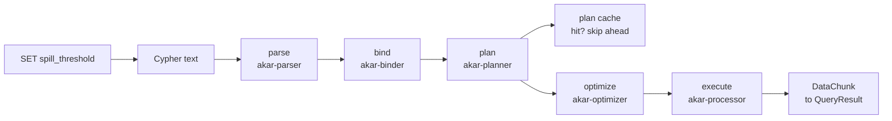

# Core Engine (akar-main)

**Module path:** `akar-core/akar-main/`
**Role:** Core domain — the embedded façade every Akar user actually touches.

---

## Overview

If the other crates are the departments of a database company, `akar-main` is the front desk. It owns the public API surface — `Database`, `Connection`, `QueryResult`, `PreparedStatement`, connection pooling, bulk loaders, the TCP client, and the storage introspection driver — and it is what `cargo add akar-main` pulls in. Everything else (parsing, binding, planning, optimizing, executing, storing) happens in sibling crates that `akar-main` orchestrates, which keeps the engine modular while presenting one stable door to the outside world.

The public surface is re-exported from `akar-core/akar-main/src/lib.rs:25-34` and includes `Database`, `SystemConfig`, `Connection`, `QueryResult`, `PreparedStatement`, `ConnectionPool`/`PoolConfig`/`PoolStats`/`PooledConnection`, `RemoteDatabase`, and `StorageDriver`, plus bulk helpers (`insert_nodes`/`insert_edges`/`neighbors` with `TypedNode`/`EdgeRow`/`RelSpec`/`Neighbor`). Because the crate is deliberately a thin orchestration layer, most of its logic lives in small, single-purpose files under `src/connection/` — one per concern (query, DDL, DML, copy, transaction, plan cache), which makes the code easy to navigate and reason about.

## Core functions

1. **The full query pipeline** — `Connection::query` in `akar-core/akar-main/src/connection/query.rs:21` runs parse → bind → plan → optimize → execute and returns a `QueryResult`. It also special-cases `SET spill_threshold = N` (`query.rs:30-43`), which tunes the memory governor without going through the normal planner.
2. **Explicit write transactions** — `Connection::begin_write_txn` (`src/connection/transaction.rs:9`) assembles the per-transaction `TxnResources` bundle (LocalStorage + LocalWAL + ShadowFile) and guards against poisoned locks (`transaction.rs:21-24`); `append_local_wal` (`transaction.rs:33`) buffers typed WAL records that commit bulk-copies to the global WAL and rollback simply discards.
3. **DDL execution** — `Connection::handle_ddl` (`src/connection/ddl.rs:15`) routes schema changes and deliberately rejects catalog-mutating DDL from inside an explicit transaction (`ddl.rs:25-31`), keeping the schema path simple and non-transactional.
4. **Database export/import** — `execute_export_database` / `execute_import_database` (`src/connection/copy.rs:8`, `copy.rs:45`) round-trip a whole database as `schema.cypher` + `copy.cypher` + per-table data files, so `COPY DATABASE` is re-runnable (the importer splits statements on `;`, never on newlines — `copy.rs:79`).
5. **Programmatic storage introspection** — `Database::storage_driver()` → `StorageDriver` (`src/storage_driver.rs:14`) exposes page counts, buffer stats, free-space map, WAL size and the table catalog without Cypher.
6. **TCP client** — `Database::connect_tcp` → `RemoteDatabase` (`src/remote.rs`) talks JSON over TCP to the `akar-server` broker, capped at a 128 MiB frame size to bound hostile-peer allocations (`remote.rs:42`).

## Key components

These are the types that make the façade concrete — the database handle, the connection, the plan cache, and the result structures:

| Component/type | File path | One-line responsibility |
|---|---|---|
| `Database` / `SystemConfig` | `akar-core/akar-main/src/database.rs:34` | Opens/locks a DB dir; `SystemConfig` carries buffer-pool size, thread count, compression, read-only, max size, checkpoint settings, `concurrent_writers` |
| `Connection` | `akar-core/akar-main/src/connection/mod.rs:95` | Per-thread query entry; holds the plan cache, txn resources, catalog/storage references |
| `TxnResources` | `akar-core/akar-main/src/connection/mod.rs:40` | Bundles LocalStorage/LocalWAL/ShadowFile for one write transaction |
| `PlanCache<T>` / `CachedPlan` | `akar-core/akar-main/src/connection/plan_cache.rs:30` / `plan_cache.rs:22` | Fixed-capacity LRU (100 plans) invalidated by catalog version bump |
| `QueryResult` / `QuerySummary` | `akar-core/akar-main/src/query_result.rs:9` | Column-major results plus timing summary |
| `PreparedStatement` | `akar-core/akar-main/src/prepared_statement.rs:14` | Reusable bound query + logical plan; exposes `parameter_names` (L39) and `num_parameters` (L44) |
| `DbStandaloneCallHandler` | `akar-core/akar-main/src/connection/standalone_call.rs:16` | Registers `SHOW TABLES`, `SHOW INDEXES`, `DB VERSION` and peers (`standalone_call.rs:26-60`) |
| `StorageDriver` | `akar-core/akar-main/src/storage_driver.rs:14` | Read-only storage metadata (db_path, storage/buffer/file/fsm info, wal_size, table_catalog) |

## Internal data flow

On the read path the plan cache sits between planning and optimization (Plans): identical statements skip parse/bind/plan/optimize entirely. On the write path `query.rs` → `begin_write_txn` (`transaction.rs:9`) → DML mutates `NodeTable`/`RelTable` under a txn_id while buffering `LocalWAL` records → commit calls `StorageManager::commit_transaction` (WAL → LocalStorage flush → shadow apply → checkpoint), then `append_local_wal` (`transaction.rs:33`) flushes the buffer.

## Key interfaces & extension points

`Database::new(path, config)` opens and locks the DB directory (`database.rs:23` catalog file, `database.rs:30` lock file). Queries run through `Connection::query(&self, sql) -> QueryResult`, prepared statements through `prepare()/add_parameter()/run()`. The bulk API (`insert_nodes`, `insert_edges`, `neighbors`) gives non-Cypher code a typed write path (`lib.rs:25-27`). `SchemaDdlFn`/`StandaloneCallHandler` wiring (`query.rs:15`) is the plug point where engine-level features — sequences, `SHOW`, vector similarity — enter the Cypher surface without new grammar.

## Interactions with other modules

| Module | Direction | Interface used | Note |
|---|---|---|---|
| akar-parser/binder/optimizer | depends on | BoundStatement → logical plan | The orchestrated pipeline |
| akar-processor | depends on | Physical operator execution | Runs the optimized plan |
| akar-storage | depends on | `NodeTable`, `RelTable`, `LocalStorage`, `LocalWAL`, `ShadowFile`, `TableCatalog`, `StorageManager` | Owns constructed indexes (`fts_runtime_handle`, `ddl.rs:641` vector index auto-population) |
| akar-transaction | depends on | `TransactionManager`, `UndoRecord` | begin/commit/rollback lifecycle |
| akar-catalog | depends on | `Catalog` | In-memory schema persisted to `catalog.json` |
| akar-server | peer | TCP JSON (`remote.rs`) | `RemoteDatabase` client ↔ `akar_server` daemon |

## Performance & concurrency notes

The plan cache is a fixed-capacity LRU (`plan_cache.rs:30`) keyed with plan invalidation via catalog version bumps — important for planning-dominated workloads; a timing-sensitive cache-hit test was known to be flaky and thresholds were relaxed. DDL deliberately bypasses the transactional LocalStorage/ShadowFile path (`ddl.rs:21-24`), trading transactionality for simple, fast schema changes. `concurrent_writers` (`database.rs:34`) gates how many write connections may be active at once, and copy/export releases the catalog lock before writing data files (`copy.rs:16-23`) to avoid holding it for the I/O-heavy part.

## Implementation highlights

- `TxnResources` (`mod.rs:40`) fuses three storage primitives (LocalStorage/LocalWAL/ShadowFile) into one per-transaction bundle, which is what makes the WAL→storage→shadow commit pipeline possible.
- The export format is a runnable `schema.cypher` + `copy.cypher` pair (`copy.rs:26-35`), so imports are round-trippable.
- The `StandaloneCallHandler` pattern (`standalone_call.rs:16`) lets engine features plug into Cypher without new syntax — a clean extension seam.
- The `SET spill_threshold` special case (`query.rs:30-43`) lets the memory governor be tuned at runtime outside the normal pipeline.