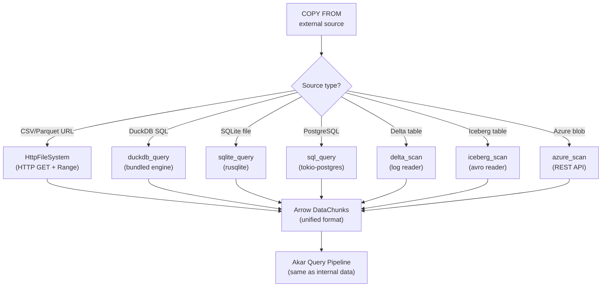

# Data Integrations Domain

**Module Path:** `akar-duckdb/`, `akar-sqlite/`, `akar-postgres/`, `akar-neo4j/`, `akar-delta/`, `akar-iceberg/`, `akar-azure/`, `akar-unity-catalog/`, `akar-httpfs/`
**Generated:** 2026-09-15

---

## What This Module Does

The data integration modules are Akar's bridges to the outside world. They let you query external databases (DuckDB, SQLite, PostgreSQL), read from data lakes (Delta Lake, Apache Iceberg), access cloud storage (Azure Blob), federate across metadata catalogs (Unity Catalog), and fetch remote files over HTTP/S3. Each integration is implemented as a separate extension crate, feature-gated and compiled statically — you only pay the compilation cost for the integrations you actually use.

Think of these modules as the "import/export desk" of the system. The core engine handles everything internally; these modules handle the cases where data lives somewhere else and needs to be brought in (or where queries need to be federated to external systems).

---

## Core Capabilities

1. **DuckDB Integration** — The `duckdb_query` function executes arbitrary SQL against a bundled DuckDB instance (v1.105, wasm32-safe). The `duckdb_scan` function reads DuckDB tables directly into Akar's query pipeline as Arrow DataChunks. Type conversion handles DuckDB's type system -> Arrow -> Akar's type system. Key file: `akar-duckdb/src/lib.rs`.

2. **SQLite Integration** — The `sqlite_query` function executes SQL against SQLite databases via rusqlite (bundled, no system SQLite dependency). The `sqlite_scan` function reads SQLite tables as Arrow DataChunks. Useful for querying local SQLite databases without leaving the Akar query context. Key file: `akar-sqlite/src/lib.rs`.

3. **PostgreSQL Integration** — The `sql_query` function executes SQL against PostgreSQL servers via tokio-postgres. This is the most complex extension (self-described) because it involves catalog binding (resolving PostgreSQL schemas/tables into Akar's type system) and table enumeration. Uses `block_on` to bridge the async/sync boundary. Key file: `akar-postgres/src/lib.rs`.

4. **Neo4j Migration** — The `neo4j_migrate` function parses Neo4j Cypher dump files (CREATE CONSTRAINT/INDEX/NODE/REL statements) and migrates the schema and data into Akar node/rel tables. This is a one-time migration path, not a live federation. Key file: `akar-neo4j/src/lib.rs`.

5. **Delta Lake Integration** — The `delta_scan` function reads Delta Lake tables. Two implementations: native Delta log reader (parses the Delta transaction log directly) or DuckDB delegation (uses DuckDB's Delta reader). Key file: `akar-delta/src/lib.rs`.

6. **Apache Iceberg Integration** — The `iceberg_scan` and `iceberg_metadata` functions read Iceberg tables. Two implementations: native avro-metadata reader or DuckDB delegation. Key file: `akar-iceberg/src/lib.rs`.

7. **Azure Blob Storage** — The `azure_scan` function reads files from Azure Blob Storage via `abfss://` URIs. Uses ureq for HTTP REST calls to Azure's blob API. Key file: `akar-azure/src/lib.rs`.

8. **Unity Catalog** — The `uc_scan` function federates queries across Unity Catalog-registered tables. Uses ureq to call Unity Catalog's REST API for table metadata and data access. Key file: `akar-unity-catalog/src/lib.rs`.

9. **HTTP/S3 Filesystem** — The `HttpFileSystem` provides read-only access to files over HTTP/HTTPS with Range request support (256KB readahead). Used by `COPY FROM` to fetch remote CSV/Parquet/JSON files. Key file: `akar-httpfs/src/lib.rs`.

---

## Key Components

| Component | File | One-Line Role |
|-----------|------|---------------|
| `DuckDbExtension` | `akar-duckdb/src/lib.rs` | Bundled DuckDB for SQL federation |
| `SqliteExtension` | `akar-sqlite/src/lib.rs` | rusqlite-backed SQLite query |
| `PostgresExtension` | `akar-postgres/src/lib.rs` | tokio-postgres SQL federation |
| `Neo4jExtension` | `akar-neo4j/src/lib.rs` | Cypher dump parser + migration |
| `DeltaExtension` | `akar-delta/src/lib.rs` | Delta Lake log reader or DuckDB delegation |
| `IcebergExtension` | `akar-iceberg/src/lib.rs` | Iceberg avro-metadata reader or DuckDB delegation |
| `AzureExtension` | `akar-azure/src/lib.rs` | Azure Blob Storage REST access |
| `UnityCatalogExtension` | `akar-unity-catalog/src/lib.rs` | Unity Catalog REST federation |
| `HttpFileSystem` | `akar-httpfs/src/lib.rs` | HTTP/HTTPS/S3 read-only filesystem |

---

## Internal Data Flow

**Key insight:** All integrations produce Arrow DataChunks, which is the same format the internal engine uses. This means external data flows through the same query pipeline as internal data — you can JOIN a local Akar table with a DuckDB table or a PostgreSQL table in a single Cypher query.

---

## Key Interfaces and Extension Points

- **`Extension` trait** (`akar-extension`): Each integration implements this trait. The `load()` method registers scalar/table functions into the FunctionRegistry.
- **`TableFunction::CustomTable`** (`akar-function`): Each integration exposes its capabilities as table functions (e.g., `duckdb_query`, `sqlite_query`, `delta_scan`).
- **`VirtualFileSystem`** trait: HTTP/S3 filesystem implements this trait for remote file access.

---

## Interactions with Other Modules

| Module | Direction | Interface | Description |
|--------|-----------|-----------|-------------|
| akar-function | Depends | `FunctionRegistry` | Integration functions registered here |
| akar-extension | Depends | `Extension` trait | Each integration is an Extension |
| akar-processor | Depends | `TableFunction` | Integration functions called by processor |
| akar-storage | Depends | `StorageManager` | Integration results stored/queried |

---

## Performance Characteristics

- DuckDB query: depends on DuckDB's engine; typically fast for analytical queries
- SQLite query: depends on SQLite's engine; fast for point lookups
- PostgreSQL query: network-bound; depends on query complexity and data volume
- HTTP/S3 reads: network-bound; 256KB readahead for sequential access
- Delta/Iceberg: depends on file format and data volume
