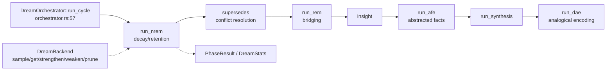

# Dream Engine (akar-dream)

**Module path:** `akar-core/akar-dream/`
**Role:** Core domain — the memory consolidation ("dreaming") engine.

---

## Overview

`akar-dream` implements the most distinctive idea in the engine: an autonomous background process that "dreams" over stored memories. During a dream cycle, the engine runs a fixed sequence of cognitive phases — NREM (decay/retention), SUPERSEDES (conflict resolution), REM (bridging / hop expansion), Insight, AFE (abstracted factual extraction), Synthesis, DAE (dynamic analogical encoding) — over a memory graph provided through a storage-agnostic backend. It is a miniature consolidation pipeline: it strengthens what should be strengthened, weakens what has decayed, resolves contradictions, and synthesizes new connections.

The engine is deliberately backend-agnostic: `DreamBackend` abstracts persistence so dreaming can run over the real storage catalog or a pure in-memory `MockBackend` in tests/embedded mode.

## Core functions

1. **Orchestrate** — `DreamOrchestrator::run_cycle` (`orchestrator.rs:57`) runs the fixed phase sequence; `new` (`:44`), `dream_count` (`:107`).
2. **NREM decay** — `run_nrem`/`memory_retention` (`phases/nrem.rs:27`) weakens edges/nodes by recency and salience.
3. **Synthesis & analogy** — `run_synthesis` (`phases/synthesis.rs:6`), `run_dae` (`phases/dae.rs:6`, dynamic analogical encoding).
4. **Backend abstraction** — `DreamBackend` trait (`backend.rs:31`) plus `MockBackend` (`backend.rs:88`).

## Key components

| Component/type | File path | One-line responsibility |
|---|---|---|
| `DreamConfig` | `akar-dream/src/config.rs:5` | Runtime knobs (salience, sampling, `enable_*` flags) |
| `DreamOrchestrator` | `akar-dream/src/orchestrator.rs:37` | Phase runner + stats |
| `DreamStats` | `akar-dream/src/orchestrator.rs:11` | Cumulative dream statistics |
| `DreamBackend` | `akar-dream/src/backend.rs:31` | Storage/edge API abstraction |
| `Memory` / `Edge` | `akar-dream/src/backend.rs:5,14` | Memory + connection records |
| Phase functions | `akar-dream/src/phases/*.rs` | One function per cognitive phase |
| `MockBackend` | `akar-dream/src/backend.rs:88` | Test / in-memory backend |

## Internal data flow

Each phase reads memories/edges via `DreamBackend`, mutates salience and edge weights, and emits a `PhaseResult`; stats accumulate on `DreamStats`, and dreams persist through the backend.

## Key interfaces & extension points

- **`DreamBackend` is the extension seam**: implement `sample_for_dream`, `get_connections`, `strengthen_edge`, `weaken_edge`, `prune_edge`, `get_communities`, `find_bridges`, etc., to run dreaming over any store.
- **`DreamConfig`** toggles each phase individually (`enable_*`).
- `retention_score` (from `akar-function`) feeds NREM decay; embeddings enable REM bridge detection (via `akar-ml`).

## Interactions with other modules

| Module | Direction | Interface used |
|---|---|---|
| akar-function | → | `retention_score` in `nrem.rs:27` |
| akar-ml | → | Shared embedding provider for bridges |
| storage/catalog backend | ← | `DreamBackend` implementations |
| Sulur/Python | ← (external) | Externally invoked dream cycles |

## Performance & concurrency notes

Phases run sequentially; state mutation goes through the backend trait (no global locks). AI-memory pruning thresholds (`prune_threshold`, `max_memories`) prevent unbounded growth. NREM applies retention scoring (P119.2) on top of the base `nrem_weaken_rate` config.

## Implementation highlights

- One cycle covers decay, conflict-resolution, bridging, abstraction, synthesis, and analogical encoding — a coherent miniature cognitive consolidation pipeline.
- The backend trait keeps the engine storage-agnostic (usable with the in-memory `MockBackend`).
- Config-driven phase gating keeps experiments cheap — each cognitive phase is independently enableable.