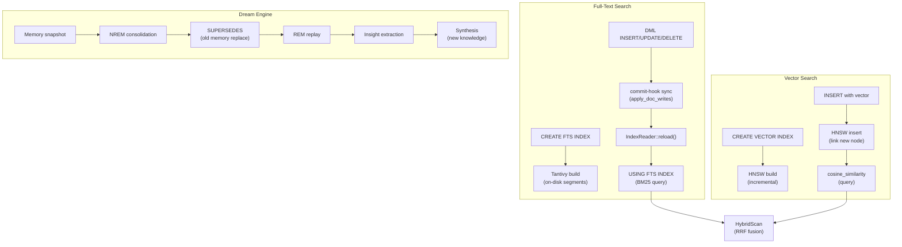

# Extensions & Intelligence Domain

**Module Path:** `akar-fts/`, `akar-vector/`, `akar-json/`, `akar-llm/`, `akar-dream/`, `akar-ml/`, `akar-extension/`
**Generated:** 2026-09-15

---

## What This Module Does

The extensions and intelligence modules are what make Akar more than just a graph database — they turn it into an AI-native memory system. The FTS and vector modules provide retrieval capabilities (find information by keyword or by semantic similarity), the LLM module provides embedding generation (convert text to vectors), the dream module provides memory consolidation (the "sleep cycle" that compresses and organizes memories), and the ML module provides in-process machine learning (LSTM training, embedding providers).

Think of these modules as the "cognitive layer" on top of the storage engine. The storage engine handles the mechanics of persistence; these modules handle the intelligence of understanding, retrieving, and consolidating information.

---

## Core Capabilities

1. **Full-Text Search (Tantivy-backed)** — The FTS module uses Tantivy 0.26.2 for BM25 scoring, phrase queries, boolean operators, regex, and phrase-prefix queries. Index lifecycle is commit-consistent: rows written after `CREATE FTS INDEX` are propagated to the Tantivy index at commit time by a sync hook (`sync_indexes_on_commit`). The reader lifecycle uses a shared cached `FtsIndexHandle` with reload-at-commit semantics (P107.2). Crash recovery is handled by Tantivy's segment-commit ACID (P107.3). Key file: `akar-fts/src/lib.rs`.

2. **Vector Similarity Search (HNSW)** — The vector module provides HNSW (Hierarchical Navigable Small World) indexing for approximate nearest neighbor search. Supports cosine, Euclidean, L2, and inner product distance metrics. The optimizer automatically rewrites `MATCH ... WHERE cosine_similarity(n.col, q) >= thr` into a `[VectorSimilarityScan, Filter, OrderBy, Projection, Limit]` plan (P71.4). SIMD-optimized distance kernels (AVX) for fast computation. Key file: `akar-vector/src/lib.rs`.

3. **Hybrid Search with RRF** — Combines vector similarity and full-text search using Reciprocal Rank Fusion. The `HybridScan` operator orchestrates both search paths and produces a unified ranking. This means a single query can find results by semantic similarity AND keyword matching. Key file: `akar-search/src/lib.rs`.

4. **LLM Embedding Functions** — The LLM module provides `create_embedding` scalar functions that call OpenAI or Ollama APIs to convert text into embedding vectors. The embeddings can be stored in the HNSW index for subsequent similarity search. Supports text-embedding-3-small/large/ada-002 (OpenAI) and nomic-embed-text/mxbai-embed-large (Ollama). Key file: `akar-llm/src/lib.rs`.

5. **Dream Engine (Memory Consolidation)** — The dream module orchestrates a memory consolidation cycle inspired by human sleep: NREM (consolidation) -> SUPERSEDES (old memory replacement) -> REM (replay) -> Insight (pattern extraction) -> AFE (affective framing) -> Synthesis (new knowledge) -> DAE (dream associative expansion). This is the differentiator that makes Akar an AI-native memory system, not just a graph database. Key file: `akar-dream/src/lib.rs`.

6. **In-Process ML (LSTM)** — The ML module provides LSTM training/inference (BPTT), ONNX embedding providers, and DirectML GPU acceleration. Used by the dream engine for memory consolidation and by the node2vec algorithm for embedding training. Key file: `akar-ml/src/lib.rs`.

7. **JSON Functions** — The JSON module provides scalar functions for JSON manipulation: `json_extract`, `json_valid`, `json_type`, `json_structure`, `json_contains`. These are registered as scalar functions in the FunctionRegistry. Key file: `akar-json/src/lib.rs`.

8. **Extension Framework** — The `Extension` trait provides the plugin SPI for all extensions. Extensions are compiled statically via Cargo feature flags and loaded during `Database::new()`. The `ExtensionContext` provides access to the FunctionRegistry, Catalog, and VirtualFileSystemRegistry. Key file: `akar-extension/src/lib.rs`.

---

## Key Components

| Component | File | One-Line Role |
|-----------|------|---------------|
| `FtsExtension` | `akar-fts/src/lib.rs` | Tantivy-backed FTS with BM25, commit-hook sync, crash recovery |
| `TantivyIndex` | `akar-fts/src/index.rs` | Tantivy index wrapper with shared FtsIndexHandle |
| `VectorExtension` | `akar-vector/src/lib.rs` | HNSW indexing with SIMD distance kernels |
| `HnswIndex` | `akar-vector/src/hnsw.rs` | HNSW graph index for ANN search |
| `HybridScan` | `akar-search/src/lib.rs` | Combines vector + FTS with RRF fusion |
| `LlmExtension` | `akar-llm/src/lib.rs` | OpenAI/Ollama embedding functions |
| `DreamOrchestrator` | `akar-dream/src/lib.rs` | Memory consolidation cycle orchestrator |
| `LstmModel` | `akar-ml/src/lstm.rs` | LSTM training/inference (BPTT) |
| `Extension` trait | `akar-extension/src/lib.rs` | Plugin SPI: name() + load(&ExtensionContext) |
| `ExtensionRegistry` | `akar-extension/src/registry.rs` | Extension lifecycle management |

---

## Internal Data Flow

**Key steps:**
1. **FTS Index Build** (`PhysicalCreateFtsIndex` in `akar-processor`): Builds Tantivy index from existing rows. On-disk segments with LZ4 compression.
2. **FTS Commit-Hook Sync** (`sync_indexes_on_commit` in `akar-processor/src/processor/write_ops.rs`): Propagates DML changes to Tantivy index at commit time. Non-fatal on failure.
3. **FTS Scan** (`PhysicalFtsScan`): Queries Tantivy `IndexReader` for BM25-ranked results. Shared cached reader via `FtsIndexHandle`.
4. **Vector Index Build** (`PhysicalCreateVectorIndex`): Builds HNSW graph from existing vector data.
5. **Vector Scan** (`PhysicalVectorSimilarityScan`): HNSW traversal for approximate nearest neighbors.
6. **Hybrid Fusion** (`HybridScan`): RRF score(d) = sum(1 / (k + rank_i(d))) across vector and FTS results.

---

## Key Interfaces and Extension Points

- **`Extension` trait** (`akar-extension`): Implement this trait to add new capabilities to Akar. The `load()` method receives an `ExtensionContext` with access to the FunctionRegistry, Catalog, and VirtualFileSystemRegistry.
- **`TableFunction`** trait (`akar-function`): Implement this table function to add new table-valued functions (e.g., `QUERY_FTS_INDEX`, `VECTOR_SIMILARITY_SCAN`).
- **FTS tokenizer pipeline**: Custom tokenizers can be added by implementing the Tantivy `TokenStream` trait.
- **HNSW distance metrics**: New distance metrics can be added by implementing the `DistanceMetric` trait.

---

## Interactions with Other Modules

| Module | Direction | Interface | Description |
|--------|-----------|-----------|-------------|
| akar-processor | Depends | `PhysicalOperator` | FTS/vector scan are physical operators |
| akar-storage | Depends | `StorageManager` | FTS/vector indexes persisted to disk |
| akar-transaction | Depends | `TransactionManager` | FTS visibility is commit-gated |
| akar-function | Depends | `FunctionRegistry` | Extension functions registered here |
| akar-main | Depends | `Database` | Extensions loaded during Database::new() |

---

## Cross-Module Collaboration

**In the FTS Lifecycle:** CREATE FTS INDEX builds a Tantivy index. DML changes are propagated at commit time via sync_indexes_commit_hook. FTS scan reads from the Tantivy IndexReader. Crash recovery uses Tantivy's segment-commit ACID.

**In the Vector Search Pipeline:** CREATE VECTOR INDEX builds an HNSW graph. Vector similarity queries traverse the HNSW graph. The optimizer rewrites cosine_similarity to VectorSimilarityScan.

**In the Dream Cycle:** The dream orchestrator reads memory snapshots, runs NREM consolidation (via LSTM inference), REPLACES old memories, runs REM replay, extracts insights, synthesizes new knowledge, and writes the consolidated memories back.

**In the Hybrid Search Pipeline:** HybridScan orchestrates both PhysicalVectorSimilarityScan (HNSW) and PhysicalFtsScan (Tantivy), fuses results via RRF, and produces a unified ranking.

---

## Performance Characteristics

- FTS index build: O(n * k) where n = rows, k = avg tokens per document
- FTS query: O(n) BM25 scoring (Tantivy inverted index makes this sub-linear in practice)
- HNSW build: O(n * log n) average case
- HNSW query: O(log n) average case (sub-linear traversal)
- RRF fusion: O(k * log k) where k = number of candidates
- Dream cycle: depends on consolidation algorithm; typically seconds to minutes
