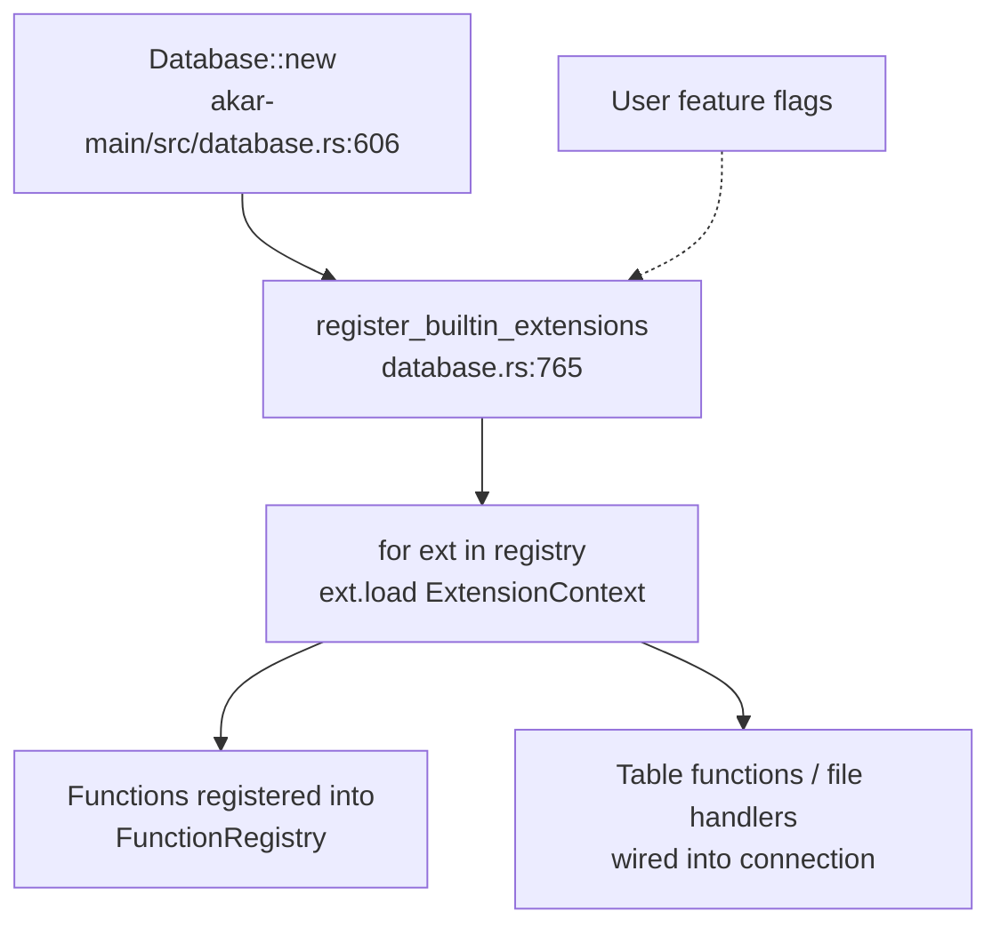

# Extensions domain

**Module paths**: `akar-core/akar-extension/`, `akar-core/akar-duckdb/`, `akar-core/akar-sqlite/`, `akar-core/akar-httpfs/`, plus feature-gated capability crates
**Generated**: 2026-09-23

---

## What this module is doing

Extensions are Akar's plugin docks: the mechanism by which the core stays lean while optional capabilities — DuckDB/Parquet access, SQLite tables, HTTP filesystem reads, and the bundled FTS/vector/algo/ML features — attach at runtime without forking the engine. The contract is deliberately tiny: one trait, one context, one `load()` call. Everything interesting (function registration, table-function hookup, file-format support) flows through that single door. For a database that wants to be embeddable *and* extensible, this seam decides whether plugins feel native or bolted-on; Akar's answer is a Rust-native trait rather than a C-style plugin ABI — consistent with the no-FFI identity (ADR-001).

The guiding restraint is worth naming: the trait has exactly **two methods**. Richer plugin APIs (lifecycle hooks, capability negotiation, hot reload) were considered and effectively declined — the payoff is a contract that has never needed a breaking change, and built-ins that exercise precisely the code third parties will.

---

## Core capabilities

1. **The `Extension` trait** — `akar-extension/src/lib.rs:20-28`: `name(&self) -> &'static str` + `load(&self, context: &ExtensionContext) -> Result<(), String>`, with `Send + Sync` required. Sibling modules `registry` and `context` (`lib.rs:7-8`) hold the ordered load list and the capability view handed to plugins.
2. **Uniform registration at open** — `Database::new` calls `register_builtin_extensions` (`akar-main/src/database.rs:765`), so built-ins (`FtsExtension`, `VectorExtension`, `AlgoExtension`, ML extensions…) load *exactly* like third-party ones would — no special-casing, no privileged path.
3. **DuckDB bridge (feature `duckdb-extension`)** — `akar-duckdb`: query/pushdown surface onto embedded DuckDB for Parquet and external analytics (parity with the reference's DuckDB integration, SPEC §6). Optional precisely because it would violate the default no-FFI promise.
4. **SQLite extension (feature `sqlite-extension`)** — `SqliteExtension` (`akar-sqlite/src/lib.rs:29-48`): `load` (`:48-192`) registers conversion of `rusqlite::types::Value` into Akar values (`sqlite_value_to_string` `:18`) — the reference template for wrapping an external engine's value model.
5. **HTTPFS extension** — `akar-httpfs`: remote filesystem reads for `LOAD FROM`/foreign tables; carries the workspace's only networked test (`test_httpfs_extension`, skipped in the default gate).
6. **Python-side extension surface** — `akar-python` exposes `vector`/`fts` helpers for PyO3 users; P123's direct in-process embedding path rides this surface.

---

## Key components

Each row answers "which contract, which reference implementation, or which boot site" — the three things needed to add, debug, or audit a plugin path.

| Component / type | File path | Core responsibility |
|-------------------|-----------|---------------------|
| `Extension` trait | `akar-core/akar-extension/src/lib.rs:20` | The two-method plugin contract |
| `ExtensionContext` | `akar-core/akar-extension/src/context.rs` | Capability bag given to `load()` |
| `ExtensionRegistry` | `akar-core/akar-extension/src/registry.rs` | Ordered load list |
| `register_builtin_extensions` | `akar-core/akar-main/src/database.rs:765` | Built-in wiring at `Database::new` |
| `SqliteExtension` | `akar-core/akar-sqlite/src/lib.rs:29` | Reference external-engine adapter (`load` `:48`) |
| `FtsExtension` / `VectorExtension` | `akar-core/akar-fts/src/lib.rs:23`, `akar-core/akar-vector/src/lib.rs:29` | Search capabilities as extensions |
| `AlgoExtension` | `akar-core/akar-algo/src/lib.rs:30` | Large real-world example (18 functions) |
| DuckDB / HTTPFS crates | `akar-core/akar-duckdb/`, `akar-core/akar-httpfs/` | File / remote-table bridges (feature-gated) |

---

## Internal data flow

**Key steps**: extension `load()` is synchronous and runs once per `Database::new` — before the first query — so registrations are effectively immutable for the database's lifetime. That's a deliberate simplicity trade: no hot-reload, no unload races, no "is this function still registered?" questions mid-query. (Recovery and catalog restore complete *before* this step, so FTS handles open against fully replayed directories.)

---

## Key interfaces & extension points

To add a capability: create a crate → impl `Extension` (two methods) → add it to `register_builtin_extensions` (feature-gate if it drags in heavy deps) → functions appear in `show_functions()` automatically. `ExtensionContext` is the *only* privileged API surface — extensions never reach into `Database` internals directly, which is what keeps the core's private surface small enough to refactor. The trait's reach extends to graph-aware table functions via `TableFunction::CustomTableWithGraph` (P52.46), where closures receive `Option<&dyn GraphDataSource>` — capability composition without trait growth.

## Cross-module collaboration

| Interacting module | Direction | Interface | Description |
|--------------------|-----------|-----------|-------------|
| `akar-main` (boot) | invokes | `register_builtin_extensions` | The single load site |
| Processor / functions | receives registrations | `FunctionRegistry`, table functions | Extension functions become callable |
| Search, graph, intelligence | *are* extensions | `FtsExtension`, `AlgoExtension`, ML `extension` module | "Extension" is a role, not just a folder |
| Feature flags (Cargo) | gates inclusion | `fts-extension`, `sqlite-extension`, `duckdb-extension`, … | Keeps default builds pure Rust |
| Boundary check (sulur tools) | audits | feature-flag/API surface | Cross-repo §13/ADR-02 enforcement |

**In the open/recovery flow**: extensions load as the final boot stage (after catalog + storage recovery) — the ordering that prevents half-recovered index handles.

**In query execution**: extension-registered functions evaluate through the same `evaluate_scalar` hub as builtins — the processor literally cannot tell the difference, which is the strongest form of "plugins are first-class."

---

## Performance considerations

Registration cost is paid once at open; thereafter extension functions are indistinguishable from builtins (same dispatch table, no per-call indirection penalty). Feature flags keep heavy dependencies (`libduckdb-sys`, `rusqlite`) out of default builds — which is exactly why the default gate `test [akar-core]` compiles without C++ DuckDB/SQLite, while `check [akar-core]` (release profile, `--all-features`) exists as the stricter pre-commit pass validating the full extension surface. The once-per-open load model also means zero steady-state synchronization: no registry locks on the query path.

---

## Highlights

The trait's radical minimalism is the standout design choice — two methods, one lifecycle event — avoiding the plugin-API churn that plagues databases with richer extension systems, while still supporting ambitious adapters (the SQLite value bridge, the 800-line `AlgoExtension`) and the entire search/intelligence stacks. Consistency between built-in and external paths — both go through `register_builtin_extensions` — means third-party plugins exercise exactly the code the first party does, so "works on my machine" extends to "works for plugin authors." And quarantining FFI (DuckDB/SQLite/HTTPFS) behind feature flags is how Akar gets both purity *and* pragmatic interoperability: the default identity stays intact, the escape hatches remain available and honestly labeled.
