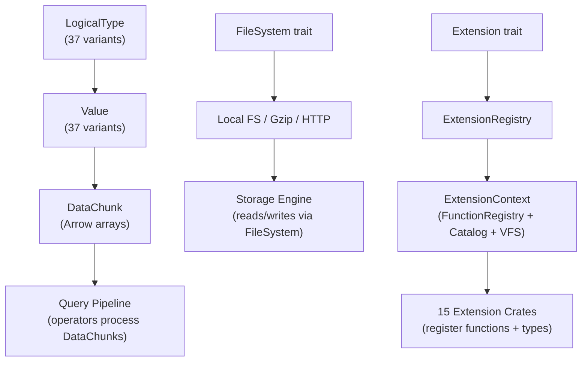

# Foundation Domain

**Module Path:** `akar-common/`, `akar-extension/`
**Generated:** 2026-09-15

---

## What This Module Does

The foundation modules are the bedrock that everything else in Akar is built on. `akar-common` defines the type system (37 logical types, 19 physical types), the universal `Value` enum, the `DataChunk` columnar batch format, memory management, the file system abstraction, and the unified error hierarchy. `akar-extension` defines the plugin SPI that all 15 extension crates implement.

Think of these modules as the "vocabulary" of the system. Every other module speaks this vocabulary — the parser produces `Value`s, the processor moves `DataChunk`s, the storage engine reads `FileSystem`s, and the extensions register through the `Extension` trait. Without these foundations, nothing else would compile.

---

## Core Capabilities

1. **Type System (37 Logical Types)** — Akar supports 37 logical types organized as scalar (26: Bool, Int8-Int128, UInt8-UInt128, Float, Double, Decimal, String, Blob, UUID, Serial, Date, Time, Timestamp variants, Interval), composite (9: List, Array, Map, Struct, Union, Node, Rel, RecursiveRel, InternalId), and special (2: Any, JSON). Physical representation uses 19 types. The type system is extensible — extensions can register custom types via the Catalog. Key file: `akar-common/src/types.rs`.

2. **Value Enum** — The universal cell type. A 37-variant enum that represents any value in the system. Used throughout the codebase for function arguments, query parameters, and serialization. Supports conversion to/from Arrow arrays. Key file: `akar-common/src/value.rs`.

3. **DataChunk (Arrow-Native Batches)** — The unit of data flow between operators. A column-major batch of Arrow arrays with column names and selection vectors. This is the interchange format that makes the query pipeline work — every operator receives DataChunks and produces DataChunks. Key file: `akar-common/src/data_chunk.rs`.

4. **Memory Manager** — Tracks memory usage across the system. Used by the buffer manager to enforce memory limits and by the spiller to decide when to spill to disk. Key file: `akar-common/src/memory.rs`.

5. **FileSystem Abstraction** — `FileRead` and `FileWrite` traits abstract over file I/O. Implementations include local filesystem, gzip filesystem, and HTTP filesystem (via akar-httpfs). This abstraction is what makes the storage engine work across different backends. Key file: `akar-common/src/file_system.rs`.

6. **Unified Error Hierarchy** — `AkarError` with domain-specific variants: `StorageError` (12 variants), `TransactionError` (6), `CatalogError` (5), `BinderError` (6), `PlannerError` (1), `ProcessorError` (3). All crates use `Result<T, E>` with `?` propagation. No `panic!()` in production code. Key file: `akar-common/src/error.rs`.

7. **Extension Framework** — The `Extension` trait defines the plugin SPI: `name() -> &'static str` + `load(&ExtensionContext) -> Result<(), String>`. The `ExtensionRegistry` manages lifecycle (register, load_all, is_loaded). The `ExtensionContext` provides access to FunctionRegistry, Catalog, and VirtualFileSystemRegistry. Extensions are compiled statically via Cargo feature flags. Key file: `akar-extension/src/lib.rs`.

---

## Key Components

| Component | File | One-Line Role |
|-----------|------|---------------|
| `LogicalType` | `akar-common/src/types.rs` | 37-variant type system (scalar + composite + special) |
| `Value` | `akar-common/src/value.rs` | Universal cell type (37 variants) |
| `DataChunk` | `akar-common/src/data_chunk.rs` | Arrow-native columnar batch |
| `MemoryManager` | `akar-common/src/memory.rs` | Memory tracking and limits |
| `FileSystem` | `akar-common/src/file_system.rs` | File I/O abstraction (local, gzip, HTTP) |
| `AkarError` | `akar-common/src/error.rs` | Unified error hierarchy |
| `Extension` | `akar-extension/src/lib.rs` | Plugin SPI: name() + load(&ExtensionContext) |
| `ExtensionRegistry` | `akar-extension/src/registry.rs` | Extension lifecycle management |
| `ExtensionContext` | `akar-extension/src/context.rs` | Context passed to extensions (FunctionRegistry, Catalog, VFS) |

---

## Internal Data Flow

**Key steps:**
1. **Type System** (`akar-common/src/types.rs`): Defines the 37 logical types. Types are used by the catalog to describe table schemas, by the binder to check expression types, and by the processor to select the right evaluation kernel.
2. **Value** (`akar-common/src/value.rs`): The universal cell type. Functions accept and return Values. Query parameters are Values. Serialization uses Values.
3. **DataChunk** (`akar-common/src/data_chunk.rs`): Arrow-native columnar batches. Operators pull DataChunks from children, process them, and push DataChunks to parents.
4. **FileSystem** (`akar-common/src/file_system.rs`): Abstracts file I/O. The storage engine reads/writes through this abstraction, enabling different backends (local, gzip, HTTP).
5. **Extension** (`akar-extension/src/lib.rs`): Plugin SPI. Extensions register functions, types, and VFS handlers during Database::new().

---

## Key Interfaces and Extension Points

- **`LogicalType`** extensible via Catalog: new types can be registered by extensions
- **`FileSystem` trait**: new file system backends can implement this trait
- **`Extension` trait**: new capabilities can be added by implementing this trait
- **`FunctionRegistry`**: new scalar/aggregate/table functions can be registered by extensions
- **Error hierarchy**: new error domains can be added as variants of `AkarError`

---

## Interactions with Other Modules

| Module | Direction | Interface | Description |
|--------|-----------|-----------|-------------|
| All modules | Depends | `Value`, `DataChunk`, `LogicalType` | Universal types used everywhere |
| akar-storage | Depends | `FileSystem`, `MemoryManager` | Storage engine uses file I/O and memory tracking |
| akar-processor | Depends | `DataChunk`, `Value` | Operators process DataChunks and produce Values |
| akar-function | Depends | `FunctionRegistry` | Functions registered by extensions |
| 15 extensions | Depends | `Extension` trait | All extensions implement this SPI |

---

## Performance Characteristics

- Value: stack-allocated for small types (Bool, Int, Float); heap-allocated for String, List, Struct
- DataChunk: zero-copy with Arrow arrays; column-oriented for vectorized processing
- FileSystem: local FS uses buffered I/O; HTTP uses Range requests with 256KB readahead
- Extension loading: O(n) where n = number of extensions; each extension's load() is called once
