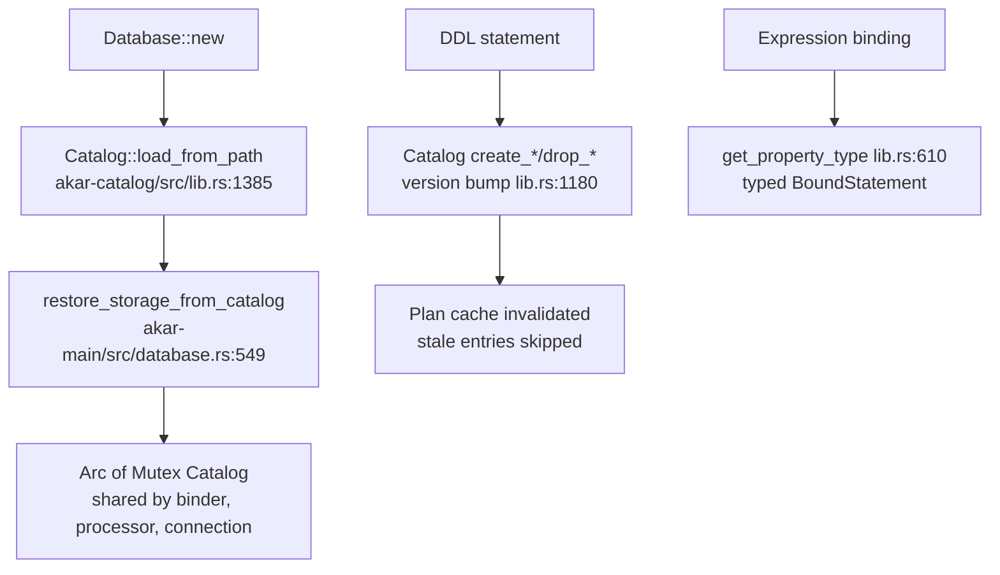

# Foundation domain

**Module paths**: `akar-core/akar-common/`, `akar-core/akar-catalog/`, `akar-core/akar-transaction/` (shared types)
**Generated**: 2026-09-23

---

## What this module is doing

Foundation is Akar's shared vocabulary — the crates every other layer depends on without ever talking back. It defines the value model (`Value`, `LogicalTypeID`), the columnar batch type (`DataChunk`), error taxonomy, memory-accounting primitives, and — centrally — the **Catalog**: the versioned in-memory registry of every table, column, sequence, macro, type alias, index, and foreign source the database knows about. Nothing in Akar can name a column or type an expression without going through this layer; keeping it small, stable, and dependency-light is what lets 35 workspace crates compile in a sane bottom-up order.

Think of it as the dictionary and the deeds office of the whole system: the dictionary (types/values) gives everyone a common language; the deeds office (Catalog) proves who owns which schema, and stamps a version number every time the deed changes so stale plans can be detected.

---

## Core capabilities

1. **Canonical value & type model** — `akar-common/src/types` and `enums` define `LogicalTypeID` and `Value`; every operator boundary exchanges these (plus Arrow-backed `DataChunk` from `akar-common/src/data_chunk`), giving the whole engine one currency instead of per-crate representations.
2. **Selection bitmasks & memory accounts** — `akar-common/src/selection` provides compact row-id masks that filters return (so a `WHERE` doesn't materialize rows), and `memory_account`/`memory` feed the `MemoryGovernor` admission decisions made in `akar-main`.
3. **Versioned Catalog as system of record** — `Catalog` (`akar-catalog/src/lib.rs:425`) holds `CatalogEntry` variants: `NodeTableEntry`, `RelTableEntry`, `SequenceEntry` (with `next_k_val`/`rollback_val` for gap-free SERIAL ids), `VectorIndexEntry`, `FtsIndexEntry`, `ForeignTableEntry`, `ScalarMacroEntry`, `TypeAliasEntry`, `ProjectedGraphInfo`. Every DDL mutation bumps an internal `version` (`lib.rs:1180`) used as the plan-cache invalidation stamp.
4. **DDL with validation** — `create_node_table`/`create_rel_table` (`lib.rs:525,:552`), `add_column`/`drop_column` (`lib.rs:620,:658`), sequences/macros/type-aliases/foreign tables/projected graphs — each validates before mutating, and round-trips through JSON persistence (`save_to_path`/`load_from_path`, `lib.rs:1370,:1385`).
5. **Property typing contract for the binder** — `get_property_type(table, prop)` (`lib.rs:610`) is how every expression gets its type; property legality is never hard-coded in the frontend (SPEC §4.1).

---

## Key components

The table is the map you'll use when editing anything schema-related: each row names the type you'll touch, where it lives, and what it's accountable for.

| Component / type | File path | Core responsibility |
|-------------------|-----------|---------------------|
| `Value` / `LogicalTypeID` | `akar-core/akar-common/src/types.rs`, `enums.rs` | Canonical value & type model for all layers |
| `DataChunk` | `akar-core/akar-common/src/data_chunk.rs` | Arrow batch wrapper passed through operators |
| `Selection` | `akar-core/akar-common/src/selection.rs` | Compact row-id bitmasks for filter outputs |
| `MemoryAccount` | `akar-core/akar-common/src/memory_account.rs` | Per-query budget accounting (feeds MemoryGovernor) |
| `Catalog` | `akar-core/akar-catalog/src/lib.rs:425` | Versioned metadata system of record |
| `CatalogEntry` enum | `akar-core/akar-catalog/src/lib.rs:308` | Tagged union over all schema object kinds |
| `SequenceEntry` | `akar-core/akar-catalog/src/lib.rs:99` | Gap-free id allocation with rollback (`next_k_val` `:140`) |
| `ExtensionContext` | `akar-core/akar-extension/src/context.rs` | Capability view extensions receive at load |
| `TransactionManager` (shared types) | `akar-core/akar-transaction/src/lib.rs:389` | Snapshot / visibility types reused by scans |

---

## Internal data flow

**Key steps**: (1) open loads the JSON catalog before any extension runs; (2) DDL bumps `version`, which the plan cache compares against — invalidation is an integer compare, not a cache sweep; (3) reads resolve types through `get_property_type`, so schema and query language can never drift apart silently.

---

## Key interfaces & extension points

The Catalog is the single fan-out point of the entire system: the binder resolves names through it, the processor reads schema through it, storage restores tables from its persisted state (WAL replay includes 6 DDL record variants), and extensions see a wrapped `ExtensionContext` view rather than raw internals. `Value`/`DataChunk` are the currency of every operator boundary — replacing them would touch all 35 crates, so they're treated as effectively frozen (a `0.2.0`-level break per AGENTS §4B). To add a new *kind* of schema object, the established pattern is: new `CatalogEntry` variant → create/drop/get methods on `Catalog` → JSON round-trip test → WAL DDL variant if it must survive recovery.

## Cross-module collaboration

| Interacting module | Direction | Interface | Description |
|--------------------|-----------|-----------|-------------|
| Query frontend | depends on foundation | `Catalog`, `get_property_type` | Binder resolves names/types against catalog |
| Storage | depends on foundation | `CatalogEntry` JSON, WAL DDL records | Catalog persisted/restored with tables |
| Processor | depends on foundation | `Value`, `DataChunk`, `Selection` | Operator I/O currency |
| `akar-main` | owns the instance | `Arc<Mutex<Catalog>>` | One catalog per `Database`, shared everywhere |
| Extensions | read-only view | `ExtensionContext` | Privileged-but-narrow capability surface |

**In the read-query flow**: foundation supplies the typed `BoundStatement` the planner needs (step 3 of the pipeline) — without `get_property_type`, planning couldn't specialize casts or detect type errors before execution.

**In the write-commit flow**: catalog version changes from DDL invalidate cached plans, ensuring a committed schema change is visible to the next `query()` call even on a warm cache.

---

## Performance considerations

The Catalog is a plain in-process map behind one mutex — fine because DDL is rare and reads are short lookups; the version-stamped plan cache means invalidation costs an integer compare rather than cache scans. `MemoryAccount` is lightweight per-query bookkeeping so budget checks don't become a contention point. `DataChunk`'s Arrow backing means the foundation never introduces a row-conversion tax between layers.

---

## Highlights

The catalog's breadth — sequences with rollback, macros, type aliases, projected graphs, foreign tables — reveals an ambition to be a *complete* metadata layer, not a minimal table map, while JSON round-trip tests (`test_serialize_roundtrip` at `lib.rs:1447`, `test_save_load_path_roundtrip` at `lib.rs:1482`) keep that ambition honest against on-disk reality. The version-stamp invalidation design is a quietly elegant pattern worth borrowing: schema mutation and plan caching cooperate through a single `u64` instead of explicit cache-purge plumbing.
