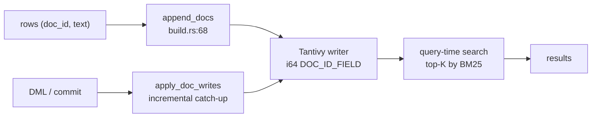

# Full-Text Search (akar-fts)

**Module path:** `akar-core/akar-fts/`
**Role:** Core domain — Tantivy-backed full-text search over text columns.

---

## Overview

`akar-fts` gives Akar records real full-text search by wrapping Tantivy, the Rust-native inverted index. It builds, opens, and maintains one Tantivy index per text column; exposes SQL scalar functions (`stem`, `tokenize`, `bm25`, `tf_idf`, `highlight`, stop-word helpers); and registers itself as a `FTS` extension. The subtlest part of this module is maintenance: because the index sits *outside* the normal columnar store, it must be kept in sync when rows are inserted, updated, or soft-deleted. That synchronization is incremental — DML commit-time propagation (P105.3/P107.1) — instead of full-table rebuilds.

Two families of full-text work co-exist in the codebase: the durable Tantivy index here, and the in-memory `NativeBm25Index` alternative inside `akar-search` (used for hybrid fusion when no durable index is needed).

## Core functions

1. **SQL scalars** — `stem_word` (`lib.rs:121`), `tokenize` (`lib.rs:131`), `tf_idf` (`lib.rs:136`), `bm25` (`lib.rs:151`), `term_frequencies` (`lib.rs:189`).
2. **Schema mapping** — `build_index_schema` (`schema.rs:37`) maps Akar `ColumnDefinition`s to Tantivy fields.
3. **Analyzer selection** — `resolve` (`tokenizer.rs:60`) picks the analyzer (EN_STEM/CJK); `is_supported` at `tokenizer.rs:52`; the tokenizer helpers `stem`/`tokenize`/`highlight` (`tokenizer.rs:119/130/151`) back the SQL scalars.
4. **Index build** — `build_index` (`build.rs:39`, persisted or in-memory), `append_docs` (`build.rs:68`), `apply_doc_writes` (`build.rs:116`).
5. **Open durable index** — `FtsIndexHandle::open_on_disk(index_dir)` (`index.rs:176`).

## Key components

| Component/type | File path | One-line responsibility |
|---|---|---|
| `FtsExtension` | `akar-fts/src/lib.rs:23` | Registers the scalar functions/extension |
| `TantivyIndex` | `akar-fts/src/index.rs:43` | Create/locate/open the Tantivy index |
| `FtsIndexHandle` | `akar-fts/src/index.rs:168` | Per-openable index handle (on-disk open, reader) |
| `build_index_schema` | `akar-fts/src/schema.rs:37` | Maps Akar columns → Tantivy fields (`DOC_ID_FIELD` is `i64` at `schema.rs:29`) |
| `resolve` | `akar-fts/src/tokenizer.rs:60` | Analyzer selection (EN_STEM/CJK) |
| `built_from` | `akar-fts/src/native_bm25.rs:153` | Reuses doc→field alignment for indexing (P109.1) |

## Internal data flow

Row writes commit into the Tantivy writer; the processor drives incremental catch-up on DML via commit-time propagation (P105.3/P107.1). Query-time, `search` returns the top-K rows by BM25 with the tokenizer baked into the schema (P109.1's `WITH TOKENIZER(...)`).

## Key interfaces & extension points

- **`Extension` trait** — `FtsExtension::load` is the SQL registration seam (same hub as `VectorExtension`, `AlgoExtension`).
- **`FtsIndexHandle::open_on_disk(index_dir)`** opens an existing index (`index.rs:176`).
- **`apply_doc_writes`** is the DML-invoked hook that keeps the index incrementally fresh.

## Interactions with other modules

| Module | Direction | Interface used |
|---|---|---|
| akar-main / akar-processor | ← | DML propagation drives index catch-up |
| akar-extension | → | `FtsExtension` implements the `Extension` contract |
| akar-function | → | Converts ColumnDefinition types into the Tantivy field map |
| akar-search | ← (score source) | BM25 score source for hybrid fusion |

## Performance & concurrency notes

Tantivy follows a single-writer, multi-reader model; the reader is reloaded for catch-up (`reload` in `index.rs`). Because the tokenizer is baked into the schema, query-time scoring does not re-tokenize per scorer. In-memory indexes (`create_in_memory`) avoid disk I/O entirely for tests and embedded use.

## Implementation highlights

- Deep Tantivy integration with a per-column schema and an `i64` `DOC_ID_FIELD` aligning Tantivy docs with Akar rows.
- **Incremental catch-up** avoids full-table rebuilds on macro tables (P105.3) — the FTS index stays hot while DML flows.
- **`WITH TOKENIZER(...)` DDL option (P109.1)** makes the analyzer choice part of the index definition rather than a hidden default.