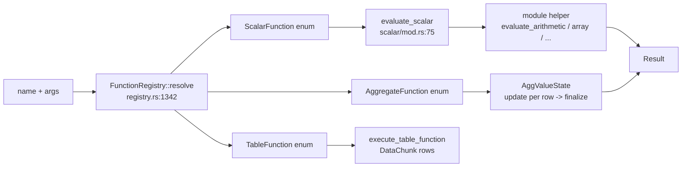

# Function Registry (akar-function)

**Module path:** `akar-core/akar-function/`
**Role:** Core domain — the catalog of every callable function in the engine.

---

## Overview

Everything callable from Cypher — arithmetic, string, date, list, geometry, hashing, vector math, retention scoring, aggregates and table-producing scans — lives in one place: `akar-function`. The crate is organized as a typed registry: each function family is a Rust enum (`ScalarFunction`, `AggregateFunction`, `TableFunction`), named functions resolve through a `FunctionRegistry` backed by a `hashbrown::HashMap`, and evaluation is a match over these enums rather than dynamic symbol lookup. This design choice has two payoffs: it is type-safe (a name resolves to a compile-time-known variant), and it is fast (name→enum is an O(1) map read, evaluation is a tight match).

The crate also owns the *dependency inversion* trick of the whole graph-GDS story: `GraphDataSource`/`GraphEdge` are declared here so that `akar-function` stays decoupled from `akar-graph` — GDS table functions receive graph topology through a trait, not a dependency.

## Core functions

1. **Register** — `FunctionRegistry::new()` (`registry.rs:585`) bulk-registers dozens of scalars (arithmetic at `:600-605`), aggregates, and table functions through ~`:1320`.
2. **Insert** — `register_scalar`/`register_aggregate`/`register_table` are the public insertion API (`registry.rs:1328/1332/1336`); `resolve(name)` returns `Option<ResolvedFunction>` (`:1342`).
3. **Count** — `scalar_count()`/`aggregate_count()`/`table_count()`/`total_count()` (`registry.rs:1393-1408`) report the live registration totals.
4. **Evaluate** — `evaluate_scalar(func, args)` (`scalar/mod.rs:75`) dispatches to per-module evaluators (`evaluate_arithmetic`, `evaluate_array`, …); `evaluate_aggregate(func, args)` (`aggregate/mod.rs:484`) drives incremental aggregate state.
5. **Aggregate state machine** — `AggValueState::new(func)` / `update(val)` / `finalize()` / `merge()` (`aggregate/mod.rs:55/94/165/222`) implement mergeable, per-row-incremental aggregation.
6. **Table functions** — `execute_table_function`/`execute_custom_table_function` (`registry.rs:1423`/`:1462`) produce `Vec<DataChunk>` rows.

## Key components

| Component/type | File path | One-line responsibility |
|---|---|---|
| `ScalarFunction` enum | `src/registry.rs:18` | Op-family variants: Arithmetic, Comparison, String, Cast, Date, List, Map, Struct, Boolean, Utility, Schema, Array, Path, UUID, Hash, Interval, Blob, Union, Retention, `CustomScalar` (callback closure) |
| `AggregateFunction` enum | `src/registry.rs:481` | Count, Sum, Avg, Min, Max, Collect, CountStar, StdDev, Variance, StringAgg, PercentileDisc/Cont, CountIf |
| `TableFunction` enum | `src/registry.rs:511` | ScanCsv/ScanParquet/ScanJson + `CustomTableWithGraph` (GDS) |
| `FunctionRegistry` | `src/registry.rs:585` | Name → function maps + resolver |
| `ResolvedFunction` | `src/registry.rs:575` | Resolver output union (scalar/aggregate/table) |
| `AggValueState` | `src/aggregate/mod.rs:19-51` | Typed incremental aggregate state |
| `GraphDataSource` / `GraphEdge` | `src/graph.rs:26` / `:11-20` | Graph topology access for GDS table functions (src/dst offsets, rel ids) |
| `evaluate_retention` / `retention_score` | `src/scalar/retention.rs:75` / `:113` | Memory-decay (retention) scalar |

## Internal data flow

Scalar helpers take `&[Value]` and return `Result<Value, String>`, with errors bubbled and wrapped into `ProcessorError` by the processor. Aggregates start a typed state machine, update it per row, `finalize()` at the end, and thread-local `merge()` combines states for rayon-parallel aggregation. Custom scalars (`ScalarFunction::CustomScalar`) run a closure `&[Value] -> Result<Value, String>`.

## Key interfaces & extension points

- **Custom scalar functions** — the `CustomScalar` variant holds `Arc<dyn Fn(&[Value]) -> Result<Value, String> + Send + Sync>` (registered from `registry.rs:18`); this is the "bring your own function" seam, used by the processor registry wiring.
- **Custom table functions** — `TableFunction::CustomTableWithGraph` (P52.46): GDS implementors receive `Option<&dyn GraphDataSource>`.
- **Determinism hooks** — `set_rng_seed(seed)` (`scalar/mod.rs:53`, `scalar/utils.rs:62`) drives the `thread_local!` `RNG_STATE` (`scalar/mod.rs:58`) for reproducible parallel random functions.
- **Cache** — global `REGEX_CACHE` (`scalar/mod.rs:72`) memoizes compiled `regex::Regex` by pattern across rows.

## Interactions with other modules

| Module | Direction | Interface used | Note |
|---|---|---|---|
| akar-binder/planner | peer | `evaluate_scalar` at type-check time | Some compiles evaluated during planning |
| akar-processor | consumer | `evaluate_scalar`, `GraphDataSource` | The main runtime driver |
| akar-common | depends on | `Value`, `DataChunk` | Data currency |
| akar-graph/algo | reverse | `akar-graph` depends on `akar-function`'s `GraphDataSource` | Dependency inversion, not hard link |
| akar-storage | peer | (COPY scans read via processor) | — |

## Performance & concurrency notes

Typed state machines mean aggregation never materializes per-row values — `AggValueState` is incremental and mergeable for parallel aggregation (used with rayon thread-local states at `aggregatehashtable.rs:170-189` in the processor). `REGEX_CACHE` avoids recompiling a pattern per row (~10–50 µs saved). `thread_local!` RNG keeps `random()` lock-free across threads while `set_rng_seed` guarantees reproducibility. `hashbrown::HashMap` lookups are O(1).

## Implementation highlights

- **C++/DuckDB parity aliases**: `prefix`→StartsWith, `suffix`→EndsWith, `ucase`/`lcase`, `length`/`size` (`registry.rs:800-846`, `:1178`) keep queries portable across engines — a core parity goal of the project.
- **Graph via trait, not dependency**: `graph.rs:1-8` makes the inversion explicit; GDS table functions stay decoupled from the graph crate.
- **Typed enums over string dispatch**: the registry is `name → enum`, evaluation is a big match — measurable, type-safe, no dynamic symbol resolution.
- `GraphDataSource` documents soft-deleted-edge filtering (`graph.rs:24-25`).