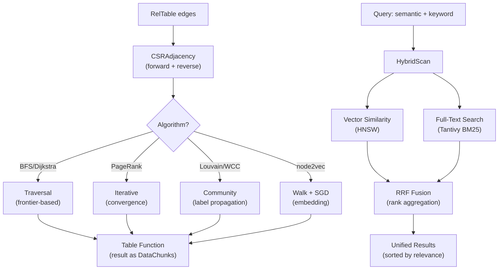

# Graph Algorithms & Search Domain

**Module Path:** `akar-graph/`, `akar-algo/`, `akar-search/`
**Generated:** 2026-09-15

---

## What This Module Does

Graph algorithms and search capabilities are what transform Akar from a simple graph storage engine into an intelligent memory system for AI agents. The graph algorithms module provides 18 algorithms for analyzing network structure — finding communities, measuring importance, detecting clusters — while the search module provides hybrid retrieval that combines vector similarity, full-text BM25 scoring, and Reciprocal Rank Fusion to give agents the best possible recall over their stored knowledge.

Think of the graph algorithms as the "analytical brain" of the system: given a social network, who are the most influential people (PageRank)? Which groups form natural communities (Louvain)? What are the strongest connected components (SCC)? And think of the search module as the "retrieval engine": given a natural language query, find the most relevant stored information by combining multiple search signals.

---

## Core Capabilities

1. **CSR Graph Storage** — The `CSRAdjacency` data structure stores graph edges in Compressed Sparse Row format, with both forward (outgoing) and reverse (incoming) adjacency arrays. This enables O(degree) traversal in both directions, which is the fundamental operation for all graph algorithms. The CSR is built from the RelTable storage and can be serialized to disk. Key file: `akar-graph/src/csr.rs`.

2. **18 Graph Algorithms** — A complete GDS (Graph Data Science) framework with algorithms spanning traversal (BFS, Dijkstra, all shortest paths), community detection (Louvain, WCC, SCC via Tarjan and Kosaraju), centrality (PageRank, betweenness, closeness), structural analysis (K-Core decomposition, triangle counting), sampling (random walk, node2vec), and embedding (node2vec walk + SGD training). All algorithms operate on the CSR adjacency and are exposed as table functions. Key file: `akar-algo/src/lib.rs`.

3. **Hybrid Search with RRF Fusion** — The search module combines vector similarity search (HNSW) with full-text search (BM25) using Reciprocal Rank Fusion (RRF). This means a single query can find results by semantic similarity AND keyword matching, with the fusion algorithm producing a unified ranking. The `HybridScan` operator sits above both vector and FTS scans. Key file: `akar-search/src/lib.rs`.

4. **GraphDataSource Abstraction** — The `GraphDataSource` trait abstracts over graph data for GDS algorithms. `CatalogGraphSource` is built from `TableCatalog` and provides the graph structure to algorithms without requiring them to know about storage internals. This is what makes the GDS framework extensible — new graph data sources can be plugged in. Key file: `akar-graph/src/lib.rs`.

5. **node2vec Embedding Training** — The node2vec algorithm combines random walks with SGD embedding training, producing vector embeddings that capture graph structure. These embeddings can be stored in the HNSW index for similarity search, creating a powerful loop: graph structure -> embeddings -> similarity search -> graph traversal. Key file: `akar-algo/src/node2vec.rs`.

---

## Key Components

| Component | File | One-Line Role |
|-----------|------|---------------|
| `CSRAdjacency` | `akar-graph/src/csr.rs` | Compressed Sparse Row forward/reverse adjacency arrays |
| `OnDiskGraph` | `akar-graph/src/lib.rs` | Graph loaded from disk storage |
| `GraphDataSource` | `akar-graph/src/lib.rs` | Trait abstraction over graph data for GDS |
| `CatalogGraphSource` | `akar-processor/src/processor/graph_source.rs` | GraphSource built from TableCatalog (P52.46) |
| `AlgoExtension` | `akar-algo/src/lib.rs` | Registers 18 GDS table functions |
| `HybridScan` | `akar-search/src/lib.rs` | Combines vector + FTS with RRF fusion |
| `NativeBm25Index` | `akar-search/src/lib.rs` | Native BM25 scoring for hybrid search |

---

## Internal Data Flow

**Key steps:**
1. **CSR Build** (`akar-graph/src/csr.rs`): Edges from RelTable are converted to forward/reverse adjacency arrays. O(n + m) where n = nodes, m = edges.
2. **Algorithm Execution** (`akar-algo/src/lib.rs`): Each algorithm operates on CSRAdjacency. BFS uses frontier-based expansion. PageRank uses iterative convergence. Louvain uses label propagation.
3. **Hybrid Search** (`akar-search/src/lib.rs`): Vector similarity (HNSW) and full-text (BM25) results are fused via RRF: score(d) = sum(1 / (k + rank_i(d))) across all retrieval sources.

---

## Key Interfaces and Extension Points

- **`GraphDataSource` trait** (`akar-graph`): Abstraction over graph data. Implement this trait to provide graph data from new sources (e.g., a remote graph database, a dynamically constructed graph).
- **Table functions**: Each algorithm is exposed as a table function (e.g., `CALL pagerank()`, `CALL louvain()`). New algorithms can be added by implementing the table function interface.
- **`HybridScan`** (`akar-search`): The RRF fusion algorithm is configurable — different weighting schemes can be plugged in.

---

## Interactions with Other Modules

| Module | Direction | Interface | Description |
|--------|-----------|-----------|-------------|
| akar-storage | Depends | `RelTable` | CSR built from on-disk edge storage |
| akar-processor | Depends | `TableFunction` | Algorithms exposed as callable table functions |
| akar-vector | Depends | `HnswIndex` | Hybrid search uses vector similarity |
| akar-fts | Depends | `TantivyIndex` | Hybrid search uses BM25 scoring |

---

## Cross-Module Collaboration

**In the GDS Framework:** The processor calls `TableFunction::execute()` with a `GraphDataSource` (built from `TableCatalog`). The algorithm operates on `CSRAdjacency` and returns results as `DataChunks`.

**In the Hybrid Search Pipeline:** The `HybridScan` operator orchestrates both `PhysicalVectorSimilarityScan` (HNSW) and `PhysicalFtsScan` (Tantivy), fuses results via RRF, and produces a unified ranking.

**In the node2vec Workflow:** Random walks are generated on the CSR graph, SGD training produces embeddings, and the embeddings are stored in the HNSW index for subsequent similarity search.

---

## Performance Characteristics

- CSR traversal: O(degree) per node — optimal for adjacency-based algorithms
- BFS/Dijkstra: O(n + m) total
- PageRank: O(k * (n + m)) where k = iterations (typically 20-50)
- Louvain: O(n * log n) per pass
- Hybrid search RRF: O(k * log k) where k = number of candidates
