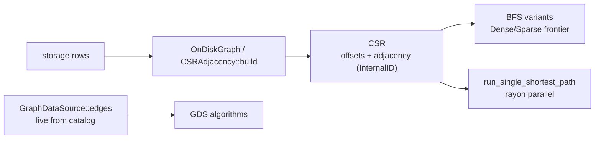

# Graph Data Source (akar-graph)

**Module path:** `akar-core/akar-graph/`
**Role:** Core domain — CSR structure + the GDS framework behind graph algorithms.

---

## Overview

`akar-graph` is the structural heart of graph processing: it builds an in-memory CSR (compressed sparse row) adjacency from storage rows, and hosts the **Graph Data Source (GDS)** framework that higher-level algorithms consume. The graph itself has two lives here — as a materialized `CSRAdjacency` (offsets + adjacency arrays, ideal for cache-friendly iteration), and as an abstract `GraphDataSource` trait (defined in `akar-function`) that table-function GDS closures use to read *live* edges from the table catalog without holding storage directly. That trait indirection is the load-bearing design decision: it keeps in-process embedders like Sulur decoupled from storage internals.

## Core functions

1. **CSR access** — `CSRAdjacency::neighbors(node)` (`graph.rs:49`); `num_nodes` (`graph.rs:55`).
2. **Graph building** — `Graph` add-edge API (`graph.rs:116`); `build` (`graph.rs:64`) assembles the CSR.
3. **In-crate algorithms** — `bfs` (`algorithms.rs:26`), `page_rank` (`algorithms.rs:54`), `weakly_connected_components` (`algorithms.rs:120`).
4. **Parallel BFS** — `GDSUtils::run_single_shortest_path` (`gds/utils.rs:21`), a rayon-powered per-source BFS.
5. **Re-exports** — `lib.rs:8-9` re-exports `CSRAdjacency, Edge, Graph, GraphEntry, OnDiskGraph, AlgorithmResult, bfs, page_rank, ...`.

## Key components

| Component/type | File path | One-line responsibility |
|---|---|---|
| `CSRAdjacency` | `akar-graph/src/graph.rs:33` | CSR {offsets, adjacency} |
| `GraphEntry` | `akar-graph/src/graph.rs:11` | Node/edge container |
| `Edge` | `akar-graph/src/graph.rs:21` | (source, target) row |
| `OnDiskGraph` | `akar-graph/src/graph.rs:183` | Builds a graph from storage |
| `gds` module | `akar-graph/src/gds/mod.rs` | BFS graphs + GDS orchestration |
| `GDSUtils` | `akar-graph/src/gds/utils.rs:21` | Parallel algorithms (rayon) |
| `AlgorithmResult` | `akar-graph/src/algorithms.rs:15` | Algorithm output enum |

## Internal data flow

## Key interfaces & extension points

- **`GraphDataSource` trait** (`akar-function/src/graph.rs:26`, `num_nodes`, `edges`) — implemented by catalog wrappers so GDS algorithms never touch storage directly.
- **`EdgeCompute` / `VertexCompute`** — pluggable compute for BFS-style algorithms.
- **GDSUtils parallel API** for single-source and all-pairs BFS, including weighted shortest path (`weighted_shortest_path`).

## Interactions with other modules

| Module | Direction | Interface used |
|---|---|---|
| akar-storage | → | Reads graph rows for `OnDiskGraph` |
| akar-algo | ← | Consumes `CSRAdjacency` for PageRank/Node2Vec/etc. |
| akar-function | → | Hosts the `GraphDataSource` trait |

## Performance & concurrency notes

CSR layout is `offsets: Vec<usize>` + `adjacency: Vec<(u64, InternalID)>` — eager, contiguous neighbor access that plays well with parallelism (no per-edge pointer chasing). `run_single_shortest_path` uses rayon parallel kernels for multi-source BFS. The crate is in-memory only: a graph is built per extension call and nothing is persisted here.

## Implementation highlights

- **Decoupled via trait, not dependency**: the data source lives in `akar-function`, letting Sulur embed Akar and run GDS without dependency cycles.
- Flexible GDS wrappers (BFSGraphManager, ParentList, output writers) support arbitrary vertex-compute workloads.
- Weighted shortest-path support through GDSUtils.