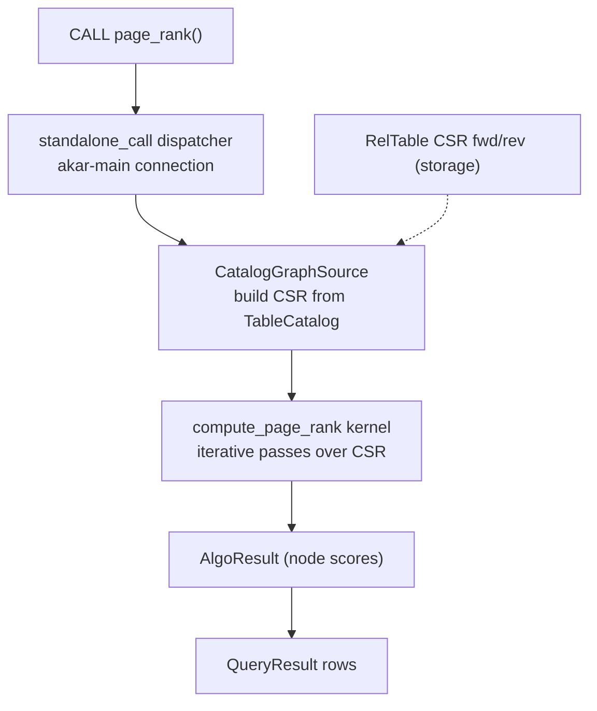

# Graph domain

**Module paths**: `akar-core/akar-graph/`, `akar-core/akar-algo/`
**Generated**: 2026-09-23

---

## What this module is doing

This module is Akar's terrain-analysis department: once edges are stored, someone has to reason about the shape of the network itself — who is central, which communities form, how far things are apart. `akar-graph` provides the substrate (CSR adjacency, traversal frontiers, the GDS framework), and `akar-algo` implements **18 graph algorithms** on top of it, exposed to users as `CALL page_rank()`, `CALL shortest_path(...)`, `CALL node2vec(...)` table functions. For an AI-memory product this is the difference between "stores relationships" and "understands relationships" — community detection and centrality are exactly what an agent needs to summarize its own knowledge graph.

The design mantra here is *kernel purity with a pluggable view*: each algorithm is a plain function from CSR to results (`compute_*(&CSRAdjacency) -> AlgoResult`), testable without a database, while the surrounding framework supplies the graph from whichever source is convenient — a live catalog, a test sample, or eventually something remote.

---

## Core capabilities

1. **CSR adjacency substrate** — compressed sparse-row forward/reverse edge arrays (maintained by storage's `RelTable`), small-graph CSR helpers (`small_csr`, construction in `akar-graph/src/graph.rs`, `bfs_graph.rs`), and dense/sparse **frontiers** for BFS-style traversal (`frontier.rs`) that switch representation based on frontier density.
2. **GDS framework** — `akar-graph/src/{algorithms, gds, graph}` organizes reusable scaffolding; runtime integration flows through `CatalogGraphSource` (`akar-processor/src/processor/graph_source.rs`), which materializes a `GraphDataSource` from `TableCatalog` (P52.46) — falling back to a deterministic 5-node sample ring only when no catalog exists (keeps registry/direct tests stable).
3. **18 algorithms** — registered by `AlgoExtension::load` (`akar-algo/src/lib.rs:49-874`): BFS `shortest_path_bfs` (`:1883`), weighted Dijkstra-style SP (`:1951`), all-destinations SP (`:2020`), PageRank (`compute_page_rank` `:894`), WCC (`:906`), SCC Tarjan (`:919`) & Kosaraju (`:994`) — both iterative versions safe on deep chains (explicit no-stack-overflow tests), K-Core (`:1075`), LPA (`:1141`), betweenness (`:1213`) & closeness (`:1277`) centrality, triangle count (`:1319`), Louvain weighted/unweighted with deterministic seeded `SimpleRng` (`:1385,:1617`), spanning forest via union-find (`:1799`), spread activation single & batch (`:1636,:1752`), and random-walk / node2vec walk+SGD embedding.
4. **Extension registration pattern** — `AlgoExtension` (`akar-algo/src/lib.rs:30`) is an `Extension` impl; its `load()` registers each algorithm as a `CALL`-able table function with typed arg parsing (`f64_arg`/`usize_arg` `:781-796`).

---

## Key components

Read the table as "the pure kernels vs. the framework that feeds them": everything in `akar-algo` is a function you could unit-test on a hand-built CSR; everything in `akar-graph`/`graph_source` is plumbing that gets real tables into that form.

| Component / type | File path | Core responsibility |
|-------------------|-----------|---------------------|
| CSR / frontier / graph builders | `akar-core/akar-graph/src/graph.rs`, `algorithms/`, `frontier.rs` | Traversal substrate, dense/sparse frontiers |
| `AlgoExtension` | `akar-core/akar-algo/src/lib.rs:30-874` | Registers 18 table functions at DB open |
| `compute_*` kernels | `akar-core/akar-algo/src/lib.rs:894-2034` | Pure CSR → `AlgoResult` algorithms |
| `AlgoResult` | `akar-core/akar-algo/src/lib.rs:884` | Uniform result envelope (scores/labels/paths) |
| `CatalogGraphSource` | `akar-core/akar-processor/src/processor/graph_source.rs` | TableCatalog → `GraphDataSource` view |
| `GraphDataSource` trait | (graph source interface, consumed by GDS) | Substitution seam: catalog vs sample vs future |
| `f64_arg` / `usize_arg` parsers | `akar-core/akar-algo/src/lib.rs:781-796` | Typed argument extraction for CALL syntax |
| node2vec / walk + `akar-ml` SGD | `akar-algo` + `akar-core/akar-ml/` | Embedding training pipeline |

---

## Internal data flow

**Key steps**: the dispatcher never passes table internals to algorithms — only a `GraphDataSource`; when no catalog is present (registry/direct tests), step C falls back to the hard-coded 5-node ring, giving deterministic behavior on harness paths (SPEC §18.6); results come back as ordinary table-function rows, so clients need no special result handling.

---

## Key interfaces & extension points

The user surface is plain Cypher — `CALL` syntax via the `FunctionRegistry` table-function channel, with `show_functions()` listing everything including the algorithms. Programmatically, `compute_*(&CSRAdjacency)` are free functions: trivially testable (81 tests) and reusable without a `Database` at all. The `GraphDataSource` trait is the real extension seam — swapping the source (catalog, sample, cached snapshot, remote) changes zero algorithm code, which is precisely how P52.46 fixed GDS table functions for catalog-backed graphs while preserving the fallback path.

## Cross-module collaboration

| Interacting module | Direction | Interface | Description |
|--------------------|-----------|-----------|-------------|
| Storage (`RelTable`) | supplies CSR | forward/reverse adjacency arrays | The physical edge data |
| Processor | hosts dispatch | `standalone_call` + `CatalogGraphSource` | Bridges SQL world → CSR world |
| Search / intelligence | complements | node2vec embeddings → vectors | Walk embeddings feed HNSW-style use |
| `akar-function/src/graph.rs` | path helpers | `nodes`, `rels`, `properties`, `length` | Cypher path manipulation alongside CALL |
| `akar-ml` | pairs with | SGD trainer for node2vec | Embedding optimization step |

**In the GDS-call flow**: this module is the whole body of `3.Workflows.md` §2.5 — dispatch → source materialization → kernel → rows.

**In memory summarization (Sulur-style usage)**: PageRank/centrality over a user's memory graph ranks which notes matter; Louvain/WCC surface topic clusters — the "understand my graph" capabilities that pure storage can't provide.

---

## Performance considerations

CSR makes neighbor iteration O(degree) and cache-friendly — the substrate choice pays off on every multi-hop traversal. Dense-vs-sparse frontier switching bounds memory on skewed degree distributions (a BFS that floods the graph flips to sparse before the dense bitmap dominates RAM). Iterative SCC avoids recursion-depth crashes (`test_scc_deep_chain_no_stack_overflow` guards this). Seeded RNG (`SimpleRng`) turns Louvain and random walks into reproducible benchmark fixtures instead of flaky ones. Batch spread-activation shares one CSR load across many seeds (`batch_spread_activation` `:1752`), amortizing the most expensive step (graph materialization).

---

## Highlights

Complete ~100% parity with the C++ GDS suite (SPEC §8) means every algorithm an existing Kuzu user relies on has an akar counterpart — verified by name in the parity matrix, not claimed in prose. The extension-registration pattern is on full display: `AlgoExtension::load` is roughly 800 lines of declarative wiring that turns an entire crate of kernels into database capabilities without touching core — the template any new algorithm family should copy. And deterministic seeding across the probabilistic algorithms (Louvain, random walk) is a small discipline with outsized payoff: "probabilistic" stops meaning "flaky in CI."
