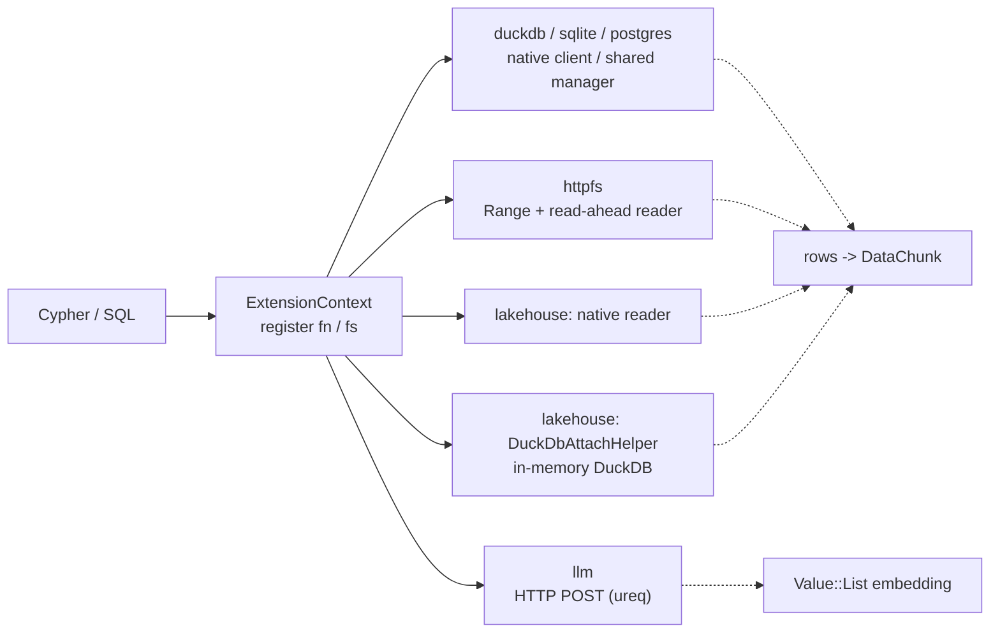

# Integrations (akar-duckdb, akar-sqlite, akar-postgres, akar-neo4j, akar-httpfs, akar-llm, lakehouse adapters)

**Module paths:** `akar-core/akar-duckdb/`, `akar-sqlite/`, `akar-postgres/`, `akar-neo4j/`, `akar-httpfs/`, `akar-llm/`, `akar-delta/`, `akar-iceberg/`, `akar-azure/`, `akar-unity-catalog/`
**Role:** Extension — external data sources, filesystems, LLM providers, and lakehouse catalogs.

---

## Overview

This family of adapter crates extends the query engine outward. They connect Akar to DuckDB, SQLite, PostgreSQL and Neo4j databases; to HTTP/HTTPS files (including S3-style object URLs through DuckDB delegation); to LLM embedding providers (OpenAI/Ollama); and to the lakehouse world — Delta, Iceberg, Azure Blob and Databricks Unity Catalog. Every adapter follows one pattern: implement the `akar_extension::Extension` trait (`name()` + `load()`, `akar-extension/src/lib.rs:20-27`) and register scalar functions, table functions, or a virtual filesystem into the `ExtensionContext`.

The four lakehouse adapters stand out architecturally: each supports **native mode** (a pure-Rust reader — e.g. Iceberg ships a self-contained Avro metadata reader) or **DuckDB-delegation mode**, which reuses DuckDB's own `httpfs`/`delta`/`iceberg`/`uc_catalog` extensions through the shared `DuckDbAttachHelper`.

## Core functions

1. **DuckDB** — `DuckDbExtension::load()` registers `duckdb_query(sql)` (scalar → JSON-ish string) and `duckdb_scan(sql)` (table) over a process-wide shared in-memory `DuckDbManager` (`akar-duckdb/src/lib.rs:37,78,118`).
2. **SQLite** — `sqlite_query(path, sql)` scalar and `sqlite_scan(path, table)` table function over `rusqlite`; every SQLite cell is converted to its string form so no typed column can fail (`akar-sqlite/src/lib.rs:43,94,161`).
3. **PostgreSQL** — `sql_query(conn_str, sql)` scalar over a cached `tokio-postgres` client on a process-wide tokio runtime bridged with `block_on` (`akar-postgres/src/lib.rs:149,191`; runtime `:58-132`).
4. **Neo4j** — `neo4j_migrate` table function plus a reusable dump parser: `parse_neo4j_dump()` → `Neo4jDump {schema, nodes, rels}` (CONSTRAINT/INDEX → PK, `CREATE (a:Label {...})`, `MATCH ... CREATE (a)-[r:T]->(b)`) and `run_migration()` producing a `MigrationReport` (`akar-neo4j/src/lib.rs:34,91,456`).
5. **HTTPFS** — `http_get` (scalar, 64 MiB body cap), `http_scan`/`https_scan` (download to a retained temp file), and `HttpFileSystem` VFS backed by an HTTP Range-request random-access reader (`akar-httpfs/src/lib.rs:277,285,354,370`).
6. **LLM** — `create_embedding(text[, provider[, model]])` scalar dispatching to OpenAI (`/v1/embeddings`) or Ollama (`/api/embed`) (`akar-llm/src/lib.rs:41,139`).
7. **Lakehouse delegation** — `DuckDbAttachHelper::query_extension(ext, setup, sql)` collapses the `new → install_and_load → execute_batch(setup) → query_rows → convert` dance (`akar-duckdb/src/attach_helper.rs:55`).

## Key components

| Component/type | File path | One-line responsibility |
|---|---|---|
| `DuckDbExtension` | `akar-duckdb/src/lib.rs:18` | `Extension` `"DUCKDB"`; real functions under `bundled`, error stubs otherwise |
| `DuckDbManager` / `DuckDbConfig` / `DuckDbMode` | `akar-duckdb/src/connection.rs:…`, `:25`, `:14` | Shared in-memory/local/remote DuckDB connection cache + config |
| `DuckDbAttachHelper` | `akar-duckdb/src/attach_helper.rs:10` | Shared facade for delta/iceberg/azure/uc delegation |
| `SqliteExtension` | `akar-sqlite/src/lib.rs:29` | `"SQLITE"`; native query + scan functions |
| `PostgresExtension` + `runtime` | `akar-postgres/src/lib.rs:135`, `:58` | `"POSTGRES"`; cached tokio runtime + per-conn client cache |
| `Neo4jExtension`, `Neo4jDump` | `akar-neo4j/src/lib.rs:15`, `:78` | `"NEO4J"`; dump parser types |
| `HttpFileSystem`, `HttpRandomAccessReader` | `akar-httpfs/src/lib.rs:16`, `:66` | `FileSystem`/`FileRead` impl with 256 KiB read-ahead Range windows |
| `LlmExtension`, `EmbeddingConfig`, `LlmProvider` | `akar-llm/src/lib.rs:22`, `:89`, `:98` | `"LLM"`; OpenAI/Ollama embedding clients |
| `DeltaExtension` | `akar-delta/src/lib.rs:17` | `"DELTA"`; native ledger reader or DuckDB `delta_scan` |
| `IcebergExtension` | `akar-iceberg/src/lib.rs:20`, `src/avro.rs`, `src/native_reader.rs` | `"ICEBERG"`; native metadata + manifest enumeration |
| `AzureExtension` | `akar-azure/src/lib.rs:22` | `"AZURE"`; `azure_scan` for `az://`/`abfss://` |
| `UnityCatalogExtension` | `akar-unity-catalog/src/lib.rs:17` | `"UNITY_CATALOG"`; `uc_scan(endpoint, token, table)` REST client or DuckDB delegation |

## Internal data flow

The scalar query functions flatten all rows and columns into one comma-joined string (`Value::String(parts.join(","))`) — a pragmatic but deliberately lossy wire shape; the scan functions return proper `DataChunk`s but check `chunk.size > 0` and yield a single chunk (no streaming).

## Key interfaces & extension points

- **`Extension: Send + Sync`** trait (`akar-extension/src/lib.rs:20-27`); registration APIs `register_scalar_function` (`context.rs:32`), `register_table_function` (`:48`), `register_file_system` (`:66`).
- **`FileSystem`/`FileRead`/`FileWrite`** in `akar-common` (`file_system.rs:10,31,34`) — `HttpFileSystem` implements these; writes return `Unsupported`.
- **Registered functions** (verified): `duckdb_query`, `duckdb_scan`, `sqlite_query`, `sqlite_scan`, `sql_query`, `neo4j_migrate`, `http_get`, `http_scan`, `https_scan`, `create_embedding`, `delta_scan`, `iceberg_scan`, `iceberg_metadata`, `iceberg_snapshots`, `azure_scan`, `uc_scan`.
- **Env/config**: `OPENAI_API_KEY` (`akar-llm/src/lib.rs:161`); per-call provider/model overrides; DuckDB `CREATE SECRET` setup strings for Azure/UC.

## Interactions with other modules

| Module | Direction | Interface used |
|---|---|---|
| akar-extension | implements | `Extension`, `ExtensionContext` |
| akar-function | uses | `ScalarFunction::CustomScalar`, `TableFunction::Custom/CustomTable`, `Value`, `DataChunk` |
| akar-common | uses | `Value`, `PhysicalTypeID`, `FileSystem/FileRead`, `extension_utils` |
| akar-duckdb (attach_helper) | used by | akar-delta, akar-iceberg, akar-azure, akar-unity-catalog (delegation mode) |
| akar-main | embeds | Loads extensions at `Database::new()` |

## Performance & concurrency notes

Postgres caches one client per connection string with a 10 s connect timeout, fails fast on `sslmode=require` when TLS is not compiled in, and self-evicts dead clients. HTTPFS uses a single 256 KiB read-ahead window and validates that servers honor `Range` (206 + matching `Content-Range`) — a misbehaving server yields an error rather than mis-positioned bytes (P52.33); `http_get` caps bodies at 64 MiB (P52.60). The LLM client uses a 30 s global timeout and 500 ms connect timeout so a non-running Ollama fails fast (P83.7). Lakehouse delegation reuses one shared in-memory DuckDB per process, avoiding per-call setup.

## Implementation highlights

- **Neo4j parser is hand-rolled** ASCII case-insensitive matching with a regression test for non-ASCII widening (`ß`→`SS`) that once panicked on byte-index slicing (`akar-neo4j/src/lib.rs:408-439,645-654`).
- **Iceberg native mode** ships a self-contained Avro metadata reader (`akar-iceberg/src/avro.rs`, 826 lines) — a compact pure-Rust slice of the Iceberg spec surface.
- **Delegation floor**: when the `bundled` DuckDB is available, every lakehouse adapter can degrade to DuckDB's battle-tested engines instead of the native readers.