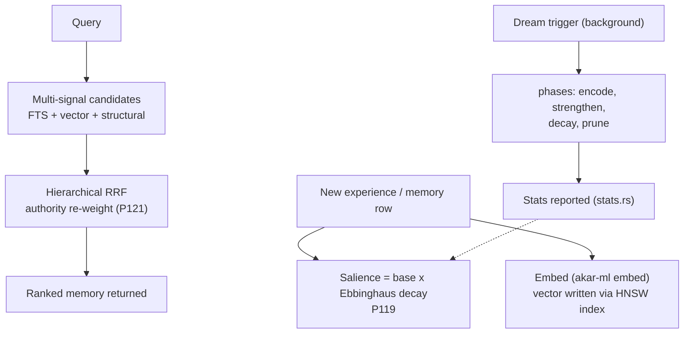

# Intelligence domain

**Module paths**: `akar-core/akar-ml/`, `akar-core/akar-dream/`, OKF ingestion, cognitive primitives
**Generated**: 2026-09-23

---

## What this module is doing

Intelligence is the layer where Akar stops being a generic graph database and becomes an AI-memory engine — the reason the repo lives under `dev/memory`. It provides the cognitive primitives an agent runtime needs embedded *inside* the database rather than bolted on outside it: forgetting curves (Ebbinghaus decay), local embeddings (Candle, no network required), learned sequence prediction (LSTM with parity against the reference), hierarchical result fusion, and background memory consolidation (`akar-dream`). Together with search's ANN/BM25, these give a self-contained substrate for the full loop — store, retrieve, forget, predict, consolidate — all in-process, all pure Rust (ADR-001 extends here: even the ML is FFI-free).

The metaphor is deliberate and worth taking literally: memory that never forgets isn't intelligence, it's a log file. This module is where *biologically plausible* memory behavior — decay, replay, salience — becomes tested code instead of research prose.

---

## Core capabilities

1. **LSTM (`akar.lstm`, Iterasi 1 / P116–P118)** — `akar-ml/src/lstm` module (`akar-ml/src/lib.rs:52`): a sequence model with parity against the KuzuDB C++ reference — gated recurrent kernels, training and inference paths, regression-tested for numeric parity so behavioral equivalence is provable, not assumed.
2. **Local embeddings (P120, Iterasi 3)** — `akar-ml/src/embed` (`lib.rs:55`) + `assets` (`lib.rs:66`): Candle-backed embedding generation that runs fully offline; pairs with P123's "direct in-process embedding readiness" so Sulur can embed without a network call or Python sidecar — the piece that makes "your memory DB embeds meaning itself" true on an air-gapped laptop.
3. **Ebbinghaus forgetting decay (P119)** — time-based salience decay applied to memory rows: retention weight falls exponentially with time unless refreshed by retrieval. Makes query-weighting biologically plausible rather than static — the explicit *forgetting* half of store-retrieve-forget.
4. **Hierarchical RRF fusion (P121)** — `akar-search/src/{hierarchical, rrf, fused, hybrid, hybrid_scan, multi, native_bm25}` (`akar-search/src/lib.rs:7-13`): multi-level reciprocal-rank fusion with authority re-weighting (54 tests) — merges ranked lists from structural, lexical, and vector signals into one ordering an agent can trust over any single channel.
5. **OKF reader (P122)** — Open Knowledge Format ingestion reads packaged knowledge artifacts into tables — Iterasi 3's "bring your own knowledge" path for seeding a memory store from exported corpora.
6. **Dream consolidation (`akar-dream`)** — modules `backend`, `config`, `phases`, `stats` (`akar-dream/src/lib.rs:9-12`): a background/offline **memory-consolidation pipeline** — phased (encode → strengthen → decay → prune per `phases`) runs over the memory store with its own config and stats reporting; the database analogue of sleep-time memory replay.
7. **Sparse + SBYO support** — `akar-ml/src/{sparse, sbyo}` (`lib.rs:63,72`): sparse representations and set-before-you-optimize utilities underpinning the ML paths.
8. **Topology-aware intelligence (graph side)** — batch/single spread activation and node2vec random-walk embeddings in `akar-algo` complement the ML crate: graph-structural inference sits beside neural inference, and walk embeddings can flow into the vector index.

---

## Key components

The table maps the two halves — *learned models* (`akar-ml`) and *consolidation lifecycle* (`akar-dream`) — plus the fusion machinery in `akar-search` that closes the retrieval loop.

| Component / type | File path | Core responsibility |
|-------------------|-----------|---------------------|
| LSTM kernels | `akar-core/akar-ml/src/lstm.rs` | Parity sequence model (P116–P118) |
| Embed pipeline | `akar-core/akar-ml/src/embed.rs` | Offline Candle embeddings (P120) |
| Model assets | `akar-core/akar-ml/src/assets.rs` | Bundled weights/metadata for offline use |
| ML extension registration | `akar-core/akar-ml/src/extension.rs` | Registers ML functions at DB open |
| Dream phase machine | `akar-core/akar-dream/src/phases.rs` | Consolidation stages (encode→strengthen→decay→prune) |
| Dream config | `akar-core/akar-dream/src/config.rs` | Cadence, thresholds, backend choice |
| Dream stats | `akar-core/akar-dream/src/stats.rs` | Observability for consolidation runs |
| Hierarchical RRF | `akar-core/akar-search/src/{hierarchical,rrf}.rs` | Multi-signal rank fusion (P121) |
| Native BM25 | `akar-core/akar-search/src/native_bm25.rs` | Dependency-light BM25 alternative |
| Spread activation / node2vec | `akar-core/akar-algo/src/lib.rs:1636-1752` | Topology-aware activation & walks |

---

## Internal data flow

**Key steps**: the loop closes deliberately — retrieval ranking (F) informs what consolidation strengthens (I), and decay informed by Ebbinghaus (C) weakens what wasn't retrieved. Embeddings write to the *same* HNSW vector columns ordinary application data uses: no side channel, no special memory-store format.

---

## Key interfaces & extension points

ML functions register through the standard extension mechanism (the `extension` module in `akar-ml`), so `CALL`/`RETURN` syntax reaches them uniformly — the same pattern as `AlgoExtension`, reinforcing that intelligence is a *role* plugins can also fill. `akar-dream`'s `config` module is the operator-facing seam: cadence, phase thresholds, backend choice — tunable without recompiling the phase machine. Embeddings plug into the standard vector-index path, meaning any code that can write a vector column can participate in the memory loop. The LSTM's parity-test harness is itself an extension point: it's how future model swaps prove behavioral equivalence before shipping.

## Cross-module collaboration

| Interacting module | Direction | Interface | Description |
|--------------------|-----------|-----------|-------------|
| Search (HNSW/FTS) | hosts + fuses | vector columns, RRF ranked lists | Embeddings and recall signals meet here |
| Graph (`akar-algo`) | supplies kernels | spread activation, node2vec walks | Topology-aware intelligence |
| Storage / transactions | persists | memory rows + salience columns | Decay operates on durable state |
| Processor | exposes | table functions via registry | `CALL`-able ML/dream operations |
| Extension system | registers through | `Extension::load` | ML capabilities are extensions too |
| **Sulur** (external) | consumes | P123 in-process embedding API | The intended downstream memory engine |

**In the memory lifecycle flow**: this module implements `3.Workflows.md`'s missing half — not query execution, but *what happens between queries*: embedding on write, decay over time, retrieval-weighted consolidation, and dream-phase replay.

**In Sulur's embedding flow (Iterasi 4 / P123)**: the in-process embedding readiness path means the memory engine gets vectors without network or Python — the boundary §13/AGENTS §0B was drawn to protect.

---

## Performance considerations

Everything runs in-process on CPU (Candle, no GPU stack) to honor the embedded-library promise — an embedded database that requires CUDA has failed its deployment story. LSTM parity targets *correctness* (bit-comparable outputs vs the reference) over raw speed; given plan caching and the offline-first constraint, that's the right priority. Dream consolidation runs in background phases so foreground queries don't absorb its cost — the `config` cadence controls are there precisely to keep consolidation off the hot path. Native BM25 (`native_bm25.rs`) offers lighter-weight scoring when full Tantivy machinery is unnecessary — a recall-path option sized to the workload.

---

## Highlights

The deliberate *biological framing* — decay, consolidation, activation — distinguishes this from generic "vector DB + cron" designs: forgetting is a first-class, tested primitive (P119), and `akar-dream`'s phased pipeline mirrors consolidation as an explicit state machine (`phases.rs`) rather than an ad-hoc cleanup job, with `stats.rs` making its behavior observable instead of mysterious. Keeping all of it pure Rust (Candle, no ONNX runtime) extends ADR-001 into ML without exception — preserving the no-FFI purity *and* the single-binary embedding story Sulur needs. And the parity-tested LSTM is a quiet statement about method: cognitive primitives get the same audited-equivalence treatment as query statements, because an agent's learned behavior is as much a contract as its SQL results.
