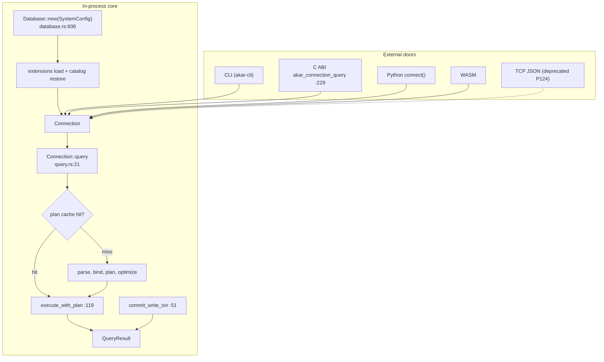

# Interfaces domain

**Module paths**: `akar-core/akar-main/src/connection/`, `akar-core/akar-cli/`, `akar-core/akar-c/`, `akar-python/`, `akar-core/akar-wasm/` (feature), `akar-core/akar-server/` (deprecated)
**Generated**: 2026-09-23

---

## What this module is doing

Interfaces are Akar's doorways — every way a caller can enter the engine without becoming a Rust compiler. The canonical surface is the in-process Rust API (`Database` → `Connection` → `query`/`prepare`), around which five satellite doors are cut: a CLI REPL, a C ABI for non-Rust embedders, PyO3 bindings for the Python/Sulur ecosystem, a WASM build for browsers/edge, and a (deprecated) TCP JSON broker now serving as a test harness. Because Akar is an *embedded library* first (§13 / ADR-004), these doors matter enormously: they define what "using Akar" feels like, and they are the contractual boundary that lets Sulur's single-binary embedding sit beside — never behind — an extra process.

The unifying design fact: **five doors, one `Connection`.** Every door converges on the same semantic implementation, so deprecation (like P124's demotion of the TCP broker) becomes a marshalling change rather than a behavior change — and parity tests written against any door test them all.

---

## Core capabilities

1. **In-process Rust API (primary)** — `Database` (`akar-main/src/database.rs:149`, ctor `:606`, `SystemConfig` `:34-69`) → connections → `Connection` with `Connection::query` (`akar-main/src/connection/query.rs:21`) driving the parse/bind/plan-cache/optimize/execute pipeline; cache-aware `query`/`prepare` (`:21,:283`); write-statement transaction wrapping (`execute_with_plan` `:119`); plan-cache predicate (`is_plan_cachable` `:799`); explicit transactions via `begin_write_txn`/`commit_write_txn` (`akar-main/src/connection/transaction.rs:51-149`); `create_processor` (`query.rs:553`) + `build_processor_handlers` (`:587`) inject runtime plumbing; savepoints and `IsolationLevel` sit alongside.
2. **CLI (`akar` binary, feature `cli`)** — `akar-cli/src/main.rs:1-16,:34-44`: args (`OutputMode` for table/JSON/CSV), REPL mode, `--init-script`; executes through the same Rust API; doubles as the benchmark/demo entry behind README claims.
3. **C ABI (`akar-c`, `cdylib`+`staticlib`, `publish = false`)** — `akar-c/src/lib.rs`: `akar_system_config` (`:9`), opaque `akar_database`/`akar_connection`/`akar_query_result` handles (`:21,:27,:33`), `akar_state` status enum (`:43`) with panic-catching `catch` (`:55`); lifecycle `akar_database_init/destroy` (`:95,:143`), `akar_connection_init/destroy` (`:168,:196`), `akar_connection_query` (`:229`), result/error teardown (`:286,:306`). A minimal, malloc-disciplined flat C surface.
4. **Python (`akar-python`, PyO3, `publish = false`)** — `connect()`, query objects, `vector`/`fts` extension helpers; the ecosystem door Sulur's tooling inspects; P123's direct embedding path targets this surface.
5. **WASM (feature `wasm`)** — compile-to-WASM target for browser/edge demos; same `Connection` pipeline with the filesystem adapter swapped.
6. **TCP JSON broker (`akar-server`, DEPRECATED for production, P124)** — line-delimited JSON over TCP; role demoted to **test harness / wire reference** while Sulur migrates to single-binary in-process embedding (AGENTS §0B). New production traffic should not target this door.

---

## Key components

Read the table as "the orchestrator, then each door with its entry symbol" — the entry function or handle type is what you'll grep for when integrating or debugging a binding.

| Component / type | File path | Core responsibility |
|-------------------|-----------|---------------------|
| `Database` / `SystemConfig` | `akar-core/akar-main/src/database.rs:149,:34` | Lifecycle, config, extension boot |
| `Connection::query` | `akar-core/akar-main/src/connection/query.rs:21` | The canonical query entry |
| `commit_write_txn` | `akar-core/akar-main/src/connection/transaction.rs:51` | Durability boundary for writes |
| Plan cache (`is_plan_cachable`) | `akar-core/akar-main/src/connection/query.rs:799` | Skip parse/bind/optimize on hot statements |
| CLI entry + `OutputMode` | `akar-core/akar-cli/src/main.rs:34-44` | Human/scripting door |
| C ABI functions | `akar-core/akar-c/src/lib.rs:72-319` | Foreign-language door (`akar_state` `:43`) |
| PyO3 module | `akar-python/` (workspace sibling) | Python / Sulur tooling door |
| WASM feature | `akar-main` `wasm` feature | Browser/edge door |
| TCP broker | `akar-core/akar-server/` | Deprecated wire reference / test harness |

---

## Internal data flow

**Key steps**: every door converges on the same `Connection` — there is exactly one semantic implementation; doors only translate marshalling, lifecycle, and error formatting. The plan-cache gate (`E`) is the shared hot-path optimization no door can bypass or accidentally disable.

---

## Key interfaces & extension points

`SystemConfig` (`database.rs:34-69`) is the single configuration funnel — buffer pool size, checkpoint threshold, max threads, FTS/vector toggles, salvage mode — meaning embedders configure in code, not config files (library-first posture). The C ABI's `catch`-wrapper + `akar_state` pattern (`akar-c/src/lib.rs:55,:43`) is the established way to expose Rust panics safely to foreign runtimes: any door that can't unwind (C, sometimes Python) should copy this shape. The plan-cache hook (`is_plan_cachable` `query.rs:799`) is where any future statement-level policy (pinning, per-tenant cache partitioning) would attach without disturbing the pipeline itself.

## Cross-module collaboration

| Interacting module | Direction | Interface | Description |
|--------------------|-----------|-----------|-------------|
| Foundation (Catalog/Value) | uses | `Value`, `DataChunk`, `Catalog` | Marshalling currency at every door |
| Frontend + optimizer + processor | drives | full pipeline via `Connection` | Steps 1–9 of query execution (SPEC §3.3) |
| Storage / transactions | wraps | `commit_write_txn` drives WAL/OCC | The door owns orchestration, storage owns bytes |
| Search / extensions | surfaces | feature-gated functions via doors | Capabilities reach users only through this layer |
| **Sulur** (external) | embeds | in-process API + boundary-check | §13/ADR-004 contract enforcement |

**In the read-query flow**: this module is the orchestrator that sequences every stage of `3.Workflows.md` §1.2 — it literally *is* `Connection::query`.

**In the deprecation flow (P124)**: demoting `akar-server` touched only that door's deployment story — because semantics live in `Connection`, no core behavior changed, illustrating the five-doors/one-Connection payoff.

---

## Performance considerations

The LRU plan cache is the headline: hot statements skip parse/bind/plan/optimize entirely (`query.rs:799`), turning steady-state latency into execute-only — the single highest-leverage optimization for repeated workloads, shared by every door. Explicit transaction APIs let embedders batch commits so group commit amortizes fsync across statements. In-process doors (Rust/Python/C) pay zero serialization overhead; the deprecated TCP door's per-request JSON cost is one concrete reason Sulur is leaving it behind. WASM reuses the same pipeline, so demo/browser behavior matches production rather than forking into a toy implementation.

---

## Highlights

The convergence design — five doors, one `Connection` — is the module's key insight: it makes deprecation *cheap* (P124 demotes `akar-server` without touching semantics), keeps parity testing honest (CLI, C ABI, and Python tests all assert against the same core behaviors), and means new doors (future JNI? UniFFI?) are additive work rather than re-implementations. The C ABI's disciplined `catch` + explicit destroy functions (`akar_database_destroy` `:143`, `akar_connection_destroy` `:196`, `akar_query_result_destroy` `:306`) show mature FFI ownership thinking — even though the project's soul (ADR-001) is "no FFI *required*," the FFI that exists is careful. And `SystemConfig`-as-single-funnel deserves mention as quiet API design: one struct, code-as-config, no hidden environment magic — the configuration model embedded libraries actually want.
