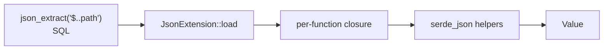

# JSON (akar-json)

**Module path:** `akar-core/akar-json/`
**Role:** Extension — JSON scalar functions.

---

## Overview

`akar-json` is a small, focused extension: a set of scalar SQL functions over JSON strings. Where `akar-markdown` and `akar-json` differ in ambition, this one plays the utility-tool role — `json_extract`, `json_array_length`, `json_valid`, `json_contains`, `json_keys`, `json_structure`, `json_type` — enough to introspect and query JSON payloads stored in nodes or properties, with no JSON-table machinery.

Path extraction supports simple dot paths (`$.name`) and array indexing (`$.items.0`) via `serde_json` behind the scenes.

## Core functions

1. **Extract** — `json_extract_value(json, path)` (`lib.rs:191`); a missing path yields `Ok(None)` → SQL `NULL` (per P52.49), not an error.
2. **Type & structure** — `json_type_of` (`lib.rs:255`); `json_structure_of` (`lib.rs:268`) returns a textual structure description.
3. **Keys & length** — `json_keys_of` (`lib.rs:319`); `json_array_length_of` (`lib.rs:328`).
4. **Membership & validity** — `json_contains_value` (`lib.rs:337`); `is_valid_json` (`lib.rs:250`).

## Key components

| Component/type | File path | One-line responsibility |
|---|---|---|
| `JsonExtension` | `akar-json/src/lib.rs:15` | The extension struct |
| load/registration | `akar-json/src/lib.rs` | Registers the 7 scalar functions in `load` |
| `json_extract_value` | `akar-json/src/lib.rs:191` | Core path extraction |
| wrappers | `akar-json/src/lib.rs:250-337` | type / structure / keys / length / contains |

## Internal data flow

## Key interfaces & extension points

- Standard `Extension` trait implementation, registered in the `akar-main` builtin list.
- Scalar functions reuse the shared `ext_fn` helper — adding a new JSON function is trivial.

## Interactions with other modules

| Module | Direction | Interface used |
|---|---|---|
| akar-extension | → | `JsonExtension` implements `Extension` |
| akar-main | → | Wired as builtin (`database.rs:761`) |
| akar-function | → | Scalar registry usage |

## Performance & concurrency notes

Path navigation is simple dot-splitting over `serde_json` indices — O(path length) per call. The functions are stateless closures with no interior state.

## Implementation highlights

- `json_extract` returns `NULL` for missing keys — proper SQL/JSON semantics (P52.49), not an error that aborts a query.
- Seven functions cover the common JSON introspection needs for graph property payloads.