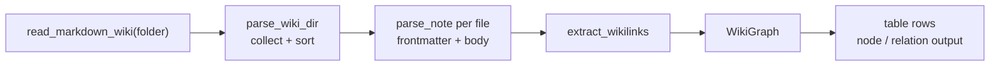

# Markdown Reader (akar-markdown)

**Module path:** `akar-core/akar-markdown/`
**Role:** Extension — zero-dependency Markdown-wiki ingestion.

---

## Overview

`akar-markdown` turns a folder of `.md` notes into a queryable knowledge graph — with deliberately zero third-party parsing dependencies. It walks a directory recursively, parses each note into a `WikiNote` (id = relative path), extracts a YAML-subset frontmatter and inline `[[wikilinks]]`, and assembles them into a `WikiGraph` of notes and deduplicated relations. The `MARKDOWN` extension then exposes it to SQL as the `read_markdown_wiki` table function over local folders.

The zero-dependency decision is the headline trade: no `pulldown-cmark`, no serde-yaml — just a deterministic single-pass line scanner. That keeps cold start fast and the binary small, at the cost of supporting only a safe YAML subset.

## Core functions

1. **Walk directory** — `parse_wiki_dir(root)` (`wiki.rs:153`) recurses, skips dot-files, accepts `.md` (any case), sorts by id.
2. **Parse note** — `parse_note(path, root)` (`wiki.rs:119`) → `WikiNote {id, path, frontmatter, body, links}`.
3. **Extract links** — `extract_wikilinks(body)` (`wikilink.rs:38`) parses inline `[[target|label]]` with line spans.
4. **Split frontmatter** — `split` (`frontmatter.rs:90`) separates the YAML header; `FrontMatter` getters (`title`, `tags`, …).
5. **Register extension** — `extension.rs:64` registers `read_markdown_wiki` (folder column → node/relation output rows).

## Key components

| Component/type | File path | One-line responsibility |
|---|---|---|
| `WikiNote` | `akar-markdown/src/wiki.rs:19` | One parsed note |
| `WikiRelation` | `akar-markdown/src/wiki.rs:36` | (from, to, label) link edge |
| `WikiGraph` | `akar-markdown/src/wiki.rs:47` | Notes + deduplicated relations |
| `MarkdownError` | `akar-markdown/src/wiki.rs:86` | IO/NotADirectory/NotUnderRoot |
| `FrontMatter` | `akar-markdown/src/frontmatter.rs:62` | Subset YAML header |
| `WikiLink` | `akar-markdown/src/wikilink.rs:14` | Inline link + line reference |
| `MarkdownExtension` | `akar-markdown/src/extension.rs:43` | Extension registration |

## Internal data flow

## Key interfaces & extension points

- `MarkdownExtension::load` registers `read_markdown_wiki` on the `ExtensionContext`.
- `parse_note` / `parse_wiki_dir` are standalone APIs for programmatic wiki ingestion.
- `WikiGraph::relations()` dedups by (from, to) with deterministic ordering.

## Interactions with other modules

| Module | Direction | Interface used |
|---|---|---|
| akar-extension | → | `MarkdownExtension` implements `Extension` |
| akar-function | → | Table-function contract registration |
| akar-main | → | Wires `MARKDOWN` into builtins (`database.rs:796`) |

## Performance & concurrency notes

Single-pass line scanner with minimal allocation; whole files read via `read_to_string`. Deterministic id ordering and a per-call `HashSet` for de-dup. No heavy regex/parser crate at all — faster cold start, smaller binary.

## Implementation highlights

- Frontmatter is a **restricted YAML subset**: deterministic, safe, dependency-free.
- Wiki links keep line numbers relative to the whole file (`link.line += split.line_offset` in `wiki.rs:131-133`) so errors and highlights point at real locations.
- Relations are intentionally **left unresolved** (`WikiRelation.to` = raw link text), leaving id-mapping decisions entirely to the caller.