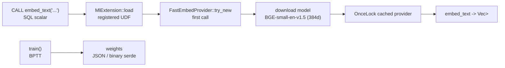

# ML (akar-ml)

**Module path:** `akar-core/akar-ml/`
**Role:** Core domain — local LSTM training and ONNX embeddings.

---

## Overview

`akar-ml` brings machine learning inside the process: a pure-Rust LSTM training/inference stack (backprop through time) and an optional ONNX-Runtime embedding layer (fastembed/bge/rerank models) surfaced through an `MlExtension`. Its raison d'être is the "memory-grade AI" ambition of the project: embeddings and simple sequence learning must be *local* so the dream engine and retrieval can run without any external API. Nothing leaves the process except an optional one-time model download.

This is the crate behind two Sprint-19 pillars: P120 (Candle/ONNX local embeddings, superseded by fastembed-backed `FastEmbedProvider` here) and P119 (Ebbinghaus decay memory, adjacent in ai-memory work).

## Core functions

1. **LSTM training** — `train` (`lstm.rs:661`, BPTT over `LstmConfig` × data); `train_pair` (`lstm.rs:455`) single-pair BPTT with metrics.
2. **LSTM persistence** — `save_model`/`load_model` (`lstm.rs:848/859`, serde JSON); `save_bin`/`load_bin` (`lstm.rs:928/964`, compact binary).
3. **LSTM forward** — `forward_cell` (`lstm.rs:274`) single-step cell; `forward_sequence` (`lstm.rs:356`) full sequence.
4. **Embeddings** — `FastEmbedProvider::embed_texts` (`embed.rs:710`); `embed_text` (`embed.rs:820`); `par_embed_texts` (`embed.rs:778`) parallel batch; `dimensions` (`embed.rs:825`).
5. **Process-wide provider** — `shared_embedding_provider` (`extension.rs:75`) OnceLock singleton; `embed_text` scalar UDF (`extension.rs:3-10`).

## Key components

| Component/type | File path | One-line responsibility |
|---|---|---|
| `MlExtension` | `akar-ml/src/extension.rs:23` | ALGO-like extension exposing `embed_text` as SQL |
| `LstmModel` / `LstmCell` | `akar-ml/src/lstm.rs:85,/111` | Parameterized recurrent model |
| `LstmConfig` | `akar-ml/src/lstm.rs:42` | dims/layers/learning settings |
| `TrainingResult` | `akar-ml/src/lstm.rs:128` | Per-epoch loss output |
| `EmbeddingProvider` trait | `akar-ml/src/embed.rs:92` | Model-agnostic interface: `embed_text(s)` |
| `FastEmbedProvider` | `akar-ml/src/embed.rs:324` | fastembed dense (ONNX) |
| `RerankProvider` | `akar-ml/src/embed.rs:1502` | Cross-encoder rerank |
| `embedding_provider` | `akar-ml/src/extension.rs:38` | Module-level `OnceLock` |

## Internal data flow

The first SQL call triggers `FastEmbedProvider::try_new` (default model `BGE-small-en-v1.5`, 384 dims) via fastembed, cached in a `OnceLock`; subsequent calls reuse it. The LSTM path trains via BPTT and serializes weights to JSON or compact binary.

## Key interfaces & extension points

- **`EmbeddingProvider` trait** (`embed.rs:92`) — swap the model without touching SQL.
- **`MlExtension::shared_embedding_provider`** (`extension.rs:75`) — reused by dream and other consumers.
- Language-independent: ONNX local inference, no network except the one-time model download.

## Interactions with other modules

| Module | Direction | Interface used |
|---|---|---|
| akar-extension | → | `MlExtension` implements `Extension` |
| akar-function | → | Registers the `embed_text` scalar |
| akar-dream | ← (reused) | Dreams reuse the shared embedding provider (P119/P120) |
| cache/store | local | Model artifacts cached for reuse |

## Performance & concurrency notes

`par_embed_texts` parallelizes across texts (onnxruntime is thread-pool aware). The provider is a process-wide `OnceLock`, so one model load is shared by all callers. The LSTM is pure Rust and deterministic — suitable for embedded offline training. A DirectML execution provider is available (`embed.rs:66`) for GPU acceleration on Windows.

## Implementation highlights

- **Model-agnostic embedding trait**: fastembed + bge + sparse + rerank all behind one surface.
- **Embedded-by-default**: local embeddings with zero external API.
- **Binary serialization** supports compact persistence (`save_bin`/`load_bin`).