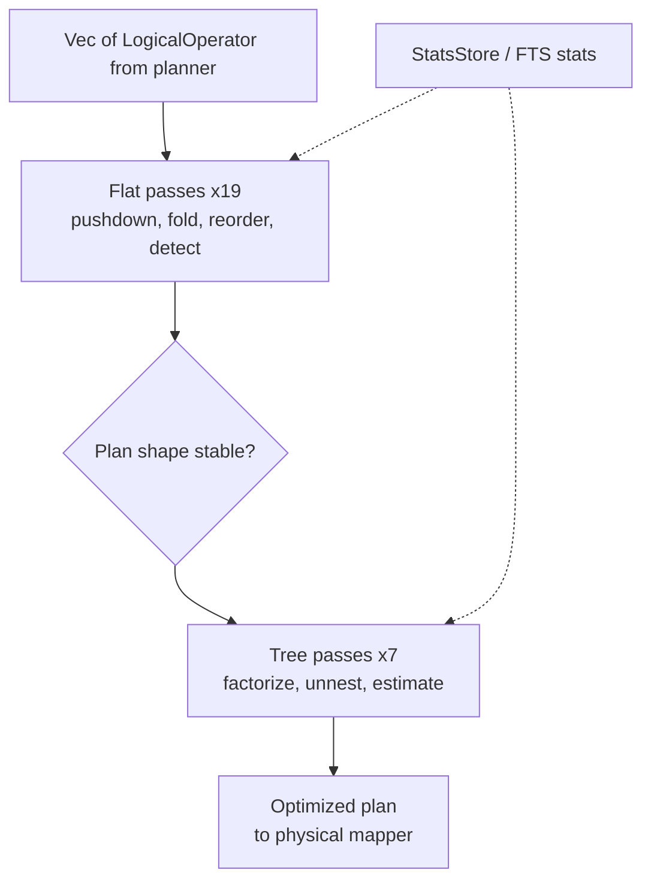

# Optimizer domain

**Module paths**: `akar-core/akar-optimizer/`
**Generated**: 2026-09-23

---

## What this module is doing

The optimizer is Akar's route planner: given the logical blueprint from the frontend, it rewrites the plan into a shape that finishes sooner *without changing what the query means*. A naive plan scans everything and sorts at the end; an optimized plan filters at the source, joins in cardinality order, and keeps only top-k. Akar runs **26 ordered passes** (19 flat + 7 tree) — more than the 17 of the C++ reference — and its discipline is unusual: three passes are audited **NO-OPs kept visible** rather than silently deleted, documenting that their correct forms need features a flat pass can't yet express. Honesty over vanity.

The practical consequence for anyone reading `EXPLAIN` output: what you see has already been pushed, folded, reordered, and annotated — and if a rewrite *didn't* happen, the pass list will tell you so explicitly instead of leaving you guessing.

---

## Core capabilities

1. **Flat restructuring passes (19)** — linear rewrites over the operator pipeline: `RemoveUnnecessaryOperators`, `FilterPushDown`, `PredicatePushDown`, `ProjectionPushDown`, `ConstantFolding`, `AggregateDetection`, `JoinOptimization` (DP bushy-tree reordering), `TopKOptimization` (OrderBy+Limit → TopK), `VectorSimilarityDetection` (SQL idiom → HNSW scan, P71.4), `ArtRangeScanDetection` (conservative, P52.4), `LimitPushDown`, `UnwindDedup`, `CountRelTable` (CSR-metadata shortcut), `AggregateFusion`/`CommonSubexpressionElimination`/`OrderByPushDown` (documented NO-OPs), `SortElision`, `ExpressionInline`, `ExtendFilterPushDown` (P1-PERF-1).
2. **Tree passes (7)** — recursive once structure stabilizes: `FactorizationRewriting` (insert Flatten), `ForeignJoinPushDown`, `AccHashJoinOptimization`, `CorrelatedSubqueryUnnesting`, `AggKeyDependency`, `CardinalityEstimation` (annotate estimates), `FtsPredicatePushdown` (Extend → FtsScan pre-join, P108.1).
3. **Ordered execution** — `Optimizer::new()` registers passes (`akar-optimizer/src/optimizer.rs:21-93`); `optimize()` (`optimizer.rs:134`) runs flat first, then tree — the ordering rationale is codified as ADR-003: restructure cheaply bottom-up, run expensive recursion only on stable shape, join reorder must precede factorization, and cardinality estimation is necessarily last (it needs the final join structure).
4. **Statistics-aware decisions** — `with_stats`/`with_stats_and_fts` (`optimizer.rs:84,:93`) inject a `StatsStore` and FTS estimates so cost choices (join sides, scan strategies) aren't flying blind.

---

## Key components

Read the table as "the driver, the two pass families, and the detector you'll most likely extend." Detection passes are the module's signature contribution — pattern recognizers that swap generic idioms for specialized operators.

| Component / type | File path | Core responsibility |
|-------------------|-----------|---------------------|
| `Optimizer` | `akar-core/akar-optimizer/src/optimizer.rs:15` | Pass registry + driver |
| `optimize()` | `akar-core/akar-optimizer/src/optimizer.rs:134` | Runs flat passes then tree passes |
| Flat passes directory | `akar-core/akar-optimizer/src/passes/flat/` | e.g. `vector_similarity.rs:54-101`, `art_range_scan.rs`, `ladybug.rs` |
| Tree passes directory | `akar-core/akar-optimizer/src/passes/tree/` | factorization, unnesting, cardinality, FTS pushdown |
| `VectorSimilarityDetection` | `akar-core/akar-optimizer/src/passes/flat/vector_similarity.rs:54` | Rewrites cosine/ORDER/LIMIT idiom → VectorSimilarityScan |
| `FtsPredicatePushdown` | `akar-core/akar-optimizer/src/passes/tree/` | Moves FTS predicates into FtsScan pre-join (P108.1) |
| `StatsStore` | `akar-core/akar-optimizer/src/stats.rs` | Cardinality & FTS estimates |
| ADR-003 | `akar-core/docs/adr/003-optimizer-pass-ordering.md` | Ordering rationale (why flat-before-tree) |

---

## Internal data flow

**Key steps**: detection passes (`VectorSimilarityDetection`, `ArtRangeScanDetection`, `FtsPredicatePushdown`) spot a *semantic idiom* — a recognizable arrangement of generic operators — and replace it with an operator the processor can execute far faster (ANN probe, ART lookup, pre-joined BM25). This is how Akar exposes indexes through standard Cypher without proprietary syntax.

---

## Key interfaces & extension points

Input/output is a plain `Vec<LogicalOperator>` in → out, called from `akar-main`'s `build_optimized_plan` (`akar-main/src/connection/query.rs:175`) after a plan-cache miss — the optimizer itself is stateless per call (stats are injected). Adding a pass follows a fixed ritual: implement the apply function → register it in `Optimizer::new` at the correct phase (flat vs tree, respecting ADR-003 ordering) → add a regression test proving both the rewrite and its semantic invariance. `pass_names()` (`optimizer.rs:155`) exposes the registry for EXPLAIN and tests, so pass-order changes are observable, not tribal knowledge.

## Cross-module collaboration

| Interacting module | Direction | Interface | Description |
|--------------------|-----------|-----------|-------------|
| Frontend (planner) | feeds optimizer | `Vec<LogicalOperator>` | Guaranteed-bound input |
| Processor (mapper) | consumes output | optimized operator list | Builds `Physical*` operators |
| `akar-main` (connection) | invokes | `build_optimized_plan` (`query.rs:175`) | After cache miss only |
| Search (FTS/vector) | provides stats + scan ops | `StatsStore`, FtsScan/VectorSimilarityScan targets | Detection passes swap these in |
| Catalog | indirect | version stamp via plan cache | Schema change → re-optimize |

**In the read-query flow**: this module is stage 4 — the only stage whose output can change latency profiles across orders of magnitude (a missed pushdown turns a selective filter into a full scan).

**In the vector-search flow**: `VectorSimilarityDetection` (`vector_similarity.rs:54-101`) is the bridge that lets `WHERE cosine_similarity(...) >= thr ORDER BY ... LIMIT k` reach the HNSW index at all — without it, the query degrades to brute-force evaluation.

---

## Performance considerations

Pass ordering *is* the performance strategy: filters move to scans first (less data flows), projections drop dead columns early (narrower chunks), join order follows estimated cardinality (small side becomes build side), TopK avoids full sorts, and `CountRelTable` answers `COUNT` from CSR metadata without touching rows. Estimated-row annotations from `CardinalityEstimation` feed runtime choices (hash-join build sides, spill decisions). Because the whole front half is plan-cached, these 26 passes run once per distinct statement text, not once per execution — optimization cost is amortized to near zero on hot paths.

---

## Highlights

The honesty-as-a-feature pattern is the module's crown: audits P52.2/P52.6/P52.7 left `CommonSubexpressionElimination`, `OrderByPushDown`, and `AggregateFusion` as documented NO-OPs with explicit reasons (arity breakage, missing MergeUnion, merged-schema rewrite) instead of shipping subtly wrong rewrites — a rare engineering posture worth imitating wherever correctness outranks feature-matrix vanity. `VectorSimilarityDetection` shows the ideal detection pass in miniature: recognize a four-operator idiom, swap the scan, preserve threshold/projection/limit exactly, and prove it with a regression test — the reusable template for any future index exposure.
