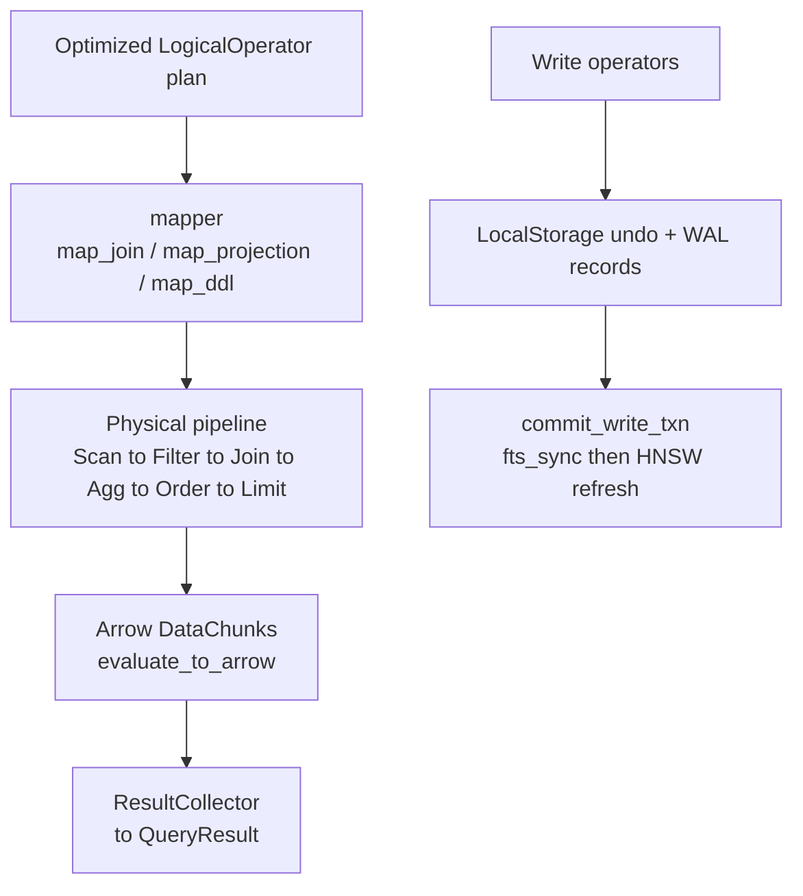

# Processor domain

**Module paths**: `akar-core/akar-processor/`, `akar-core/akar-function/`
**Generated**: 2026-09-23

---

## What this module is doing

If storage is the factory floor and the frontend is customs, the processor is the logistics fleet: it takes the optimized route sheet and actually moves the goods — scanning pages, filtering rows, joining sides, aggregating groups, sorting order — as vectorized Arrow batches. It also owns the vocabulary of computation itself: `akar-function` registers the **260 built-in functions** (245 scalar, 14 aggregate, 1 table) that expressions call at runtime. Together they are where plans become results; the parity audit shows all 58 C++ physical operator types have functional akar counterparts (55 executors), with no operator genuinely missing.

This is the layer users *feel*: a missing pushdown shows up as optimizer slowness, but a slow join implementation, a wrong aggregate, or a serial hotspot is born here. It's also where the engine's columnar identity is most literal — data crosses operator boundaries as `DataChunk`s, never as rows.

---

## Core capabilities

1. **Physical operator library (50 `Physical*` structs + 5 infrastructure ops)** — scans (`PhysicalScan`, `PhysicalScanRel`, `PhysicalPrimaryKeyScan`), filter, joins (`PhysicalHashJoin` build/probe, `PhysicalSemiJoin`/`AntiJoin`, `PhysicalIntersect` WCOJ), aggregate (with finalize/scan split), order (`PhysicalOrderBy` using `BlockMergeSort` + radix), TopK (binary heap, O(n log k)), limit/skip, projection, flatten, unwind/foreach, recursive extend, union-all scan, index lookup, path property probe, multiplicity reducer, accumulate, explain, copy-from, and the specialized FTS/vector/ART scans; infrastructure ops `ResultCollector`/`DummySink`/`Profile`/`Partitioner` live in `physical/missing_ops.rs`.
2. **Arrow-native expression evaluation** — `expression_evaluator.rs` (`evaluate_to_arrow` + `boolean_array_to_selection`) computes predicates/expressions directly on columnar arrays instead of row-at-a-time — the single biggest constant-factor win in the execution engine.
3. **Parallel runtime structures** — `AggregateHashTable` and `JoinHashTable` are built for concurrent population; rayon splits work across `SystemConfig::max_num_threads`.
4. **Write operators + index sync** — Insert/Delete/Set/Merge (incl. `PhysicalMergeRel`), batch insert, and `sync_indexes_on_commit` (`physical/write_ops/fts_sync.rs:39-125`) which propagates committed rows into Tantivy and reloads the shared reader — the one production reload point (P107.2).
5. **Logical → physical mapping** — `mapper/` (`map_join.rs`, `map_projection.rs`, `map_ddl.rs`) translates `LogicalOperator`s into operator pipelines; DDL/admin statements often execute inline at the connection layer instead (SPEC processor matrix category (b)).
6. **Function registry** — `akar-function/src/{scalar,aggregate,graph,registry}`: arithmetic/string/date/cast/list/map/struct/path families; 14 aggregates (COUNT/SUM/AVG/… plus name-mangled `count_distinct` since P88); the `evaluate_scalar` dispatch hub (`akar-function/src/scalar/mod.rs:75-102`). `CALL`-able system/GDS functions route through connection `standalone_call.rs` instead.

---

## Key components

The table separates *the driver*, *the operator zoo*, and *the function vocabulary* — the three things you'd touch when adding a computation: an operator for new physical behavior, an evaluator for new expression semantics, or a registry entry for a new callable function.

| Component / type | File path | Core responsibility |
|-------------------|-----------|---------------------|
| `QueryProcessor` | `akar-core/akar-processor/src/processor/` | Pipeline driver, built per statement |
| `Physical*` operators | `akar-core/akar-processor/src/physical/` | 50+ executors over DataChunks |
| Logical→physical mapper | `akar-core/akar-processor/src/processor/mapper/` | Wires `LogicalOperator`s into pipelines |
| `expression_evaluator` | `akar-core/akar-processor/src/expression_evaluator.rs` | Vectorized expression evaluation |
| `fts_sync` | `akar-core/akar-processor/src/physical/write_ops/fts_sync.rs:39` | Commit-time FTS propagation + reader reload |
| `CatalogGraphSource` | `akar-core/akar-processor/src/processor/graph_source.rs` | TableCatalog → `GraphDataSource` for GDS |
| `FunctionRegistry` | `akar-core/akar-function/src/registry/` | Lookup/execute for 260 builtins |
| `evaluate_scalar` | `akar-core/akar-function/src/scalar/mod.rs:75` | Scalar dispatch hub |
| `AggregateHashTable` / `JoinHashTable` | `akar-core/akar-processor/src/` | Parallel hash structures |

---

## Internal data flow

**Key steps**: (1) the mapper materializes operators with injected storage/catalog/txn handlers (built by `create_processor`/`build_processor_handlers` in `akar-main/src/connection/query.rs:553,:587`); (2) execution exchanges only Arrow batches; (3) writes stage durable-adjacent state (undo, deltas) that the connection's commit path later validates — the processor never fsyncs anything itself.

---

## Key interfaces & extension points

The processor is constructed per statement by `akar-main` (`create_processor` at `query.rs:553`), which injects handlers for storage, catalog, transactions, and result sinks — this dependency-injection seam is what keeps the crate testable in isolation. New functions extend via `FunctionRegistry` registration (extensions add more at their `load()`); new physical behavior follows the established pattern: logical operator (planner) → mapper case → `Physical*` impl → parity/SPEC update. The `TableFunction::CustomTableWithGraph` seam (P52.46) lets GDS closures receive `Option<&dyn GraphDataSource>` — graph-aware table functions without hard-wiring the catalog.

## Cross-module collaboration

| Interacting module | Direction | Interface | Description |
|--------------------|-----------|-----------|-------------|
| Optimizer | consumes output | optimized `Vec<LogicalOperator>` | Builds physical pipeline from it |
| Storage / transactions | reads + stages | page scans, `LocalStorage` undo | Never touches WAL directly |
| Search (FTS/vector) | executes specialized ops | `PhysicalFtsScan`, `PhysicalVectorSimilarityScan` | Index probes inside pipelines |
| Graph/GDS | hosts | `CatalogGraphSource` | Supplies CSR views to `akar-algo` |
| `akar-main` (connection) | constructs | `create_processor` (`query.rs:553`) | Per-statement wiring |
| Extensions | register into | `FunctionRegistry` | Their functions become callable here |

**In the read-query flow**: this module is stage 6 (execute) — consuming frontend+optimizer output, reading storage pages through the buffer manager, returning Arrow results.

**In the write-commit flow**: its write ops create the undo/local-WAL state that `commit_write_txn` validates; the FTS sync hook sits *after* durable commit by contract (P107.x).

---

## Performance considerations

Vectorization (Arrow batches, not rows) is the foundational win; operator-local parallel hash tables keep multi-core utilization high without a global shuffle; radix/block merge sort bounds sort memory; TopK heaps avoid materializing full orderings; specialized scans (HNSW/ART/FTS/CSR-count) bypass generic paths entirely; and spill-aware memory governance (`admit_query`, `MemoryGovernor` in `akar-main`) keeps a big join from OOM-ing the host process — an embedded database that crashes its embedder has failed regardless of query speed.

---

## Highlights

The parity matrix in `SPEC.md` (§ physical operator matrix, lines ~245-325) is the standout artifact — 58 C++ enum entries mapped to 55 akar executors with explicit 1:1 / merge / inline categories, plus akar-only operators (CopyFrom, Explain, FTS/Vector/ART scans) called out as additions rather than smuggled in. The FTS commit hook's re-entrancy scoping — the DashMap `Ref` dropped before the writer lock is opened, the root-cause fix for the P53 test flake — is a masterclass in subtle concurrency hygiene: the bug was a shard-collision under *random seed* timing, found only under full-suite load, and fixed at the exact lock boundary where it lived.
