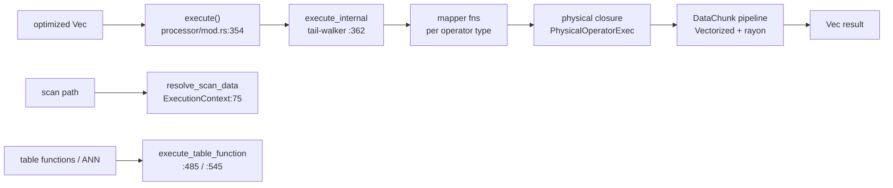

# Processor (akar-processor)

**Module path:** `akar-core/akar-processor/`
**Role:** Core domain — where plans become real work.

---

## Overview

The processor is the engine room of the database: it takes the optimized logical plan and turns each operator into a concrete physical closure that pushes columnar `DataChunk`s forward through a pipeline. Think of it as the factory floor: the plan is the blueprint, the mapper is the foreman who assigns each blueprint step to a machine, and the physical operators are the machines themselves — scan, filter, hash join, aggregation, top-k, sorts, writes, vector-similarity scans, FTS, COPY, DDL and GDS table functions. Because data flows as whole Arrow column batches rather than row-by-row, the whole floor works in vectorized sweeps, with rayon handling the heavy parallel lifting for joins, aggregation and sorts.

`QueryProcessor` (`akar-processor/src/processor/mod.rs:131`) is the orchestrator, holding the registry/catalog/VFS references plus the MVCC fields so that every operator has transaction context without threading it through call signatures.

## Core functions

1. **Execute** — `QueryProcessor::execute(operators)` (`processor/mod.rs:354`) turns `&[LogicalOperator]` into `Result<Vec<DataChunk>, ProcessorError>`; the core tail-walker `execute_internal` (`:362`) dispatches each operator to its mapper.
2. **Map & run** — `map_and_execute(operators)` / `execute_children` (`mapper/mod.rs:199`, `:66`) recurse through the plan building physical ops.
3. **Special entry points** — `execute_table_function` (`mod.rs:485`) and `execute_vector_similarity_scan` (`:545`) bypass the generic mapper for table functions and HNSW vector scans.
4. **Expression evaluation** — `ExpressionEvaluator` / `evaluate_expression` (`mod.rs:638` and `expression_evaluator.rs`) front the scalar functions from `akar_function::scalar::evaluate_scalar`.
5. **Limit budget** — `forward_limit_budget(tail)` (`processor/mod.rs:43-52`) safely pushes `limit+offset` budgets upstream, but only through Projections (Filter/Aggregate/OrderBy/joins are barriers: `mod.rs:38-52`).
6. **Physical contract** — `PhysicalOperatorExec` trait: `execute(&self, input: Vec<DataChunk>) -> OperatorResult` (`physical/types.rs:14-17`); `OperatorResult` is `Result<Vec<DataChunk>, ProcessorError>` (`physical/types.rs:9`).

## Key components

| Component/type | File path | One-line responsibility |
|---|---|---|
| `QueryProcessor` | `src/processor/mod.rs:131` | Orchestrates execution; holds registry/catalog/VFS/MVCC fields |
| `ExecutionContext` | `src/processor/mapper/mod.rs:23-40` | Threads processor, registry, `snapshot_ts`, `commit_history`, `written_rows`, `txn_id`, undo/wal sinks through mappers |
| `PhysicalOperatorExec` trait | `src/physical/types.rs:14-17` | Contract every physical operator implements |
| `PhysicalFilter` | `src/physical/scan_filter/filter.rs:28` | Row-level predicate filtering |
| `PhysicalHashJoin` | `src/physical/join_ops.rs:909` | Build-probe hash join (rayon-parallel build at `:755-758`) |
| `PhysicalTopK` | `src/physical/order_aggregate/topk.rs:16` | `ORDER BY ... LIMIT k` streaming top-k |
| `BlockMergeSorter` | `src/physical/order_aggregate/blockmergesort.rs:10` | Block-based parallel sort + k-way merge (radix for Int64) |
| `AggregateHashTable` | `src/physical/order_aggregate/aggregatehashtable.rs:18` | Thread-local rayon aggregation, merged at `:170` |
| `PhysicalVectorSimilarityScan` | `src/physical/write_ops/vectorsimilarityscan.rs:15` | HNSW/vector-index scan read path (the ANN backend) |
| `CatalogGraphSource` | `src/processor/graph_source.rs:13` | `GraphDataSource` snapshot built from `TableCatalog` (`new(catalog)` `:20`) |
| `PhysicalCopyFrom` | `src/physical/write_ops/copyfrom.rs:17` | COPY CSV/Parquet ingestion |
| `PhysicalCreateFtsIndex` / `PhysicalCountRelTable` | `src/physical/write_ops/ddl_fts.rs:50` / `:12` | FTS index creation; CSR-metadata COUNT |
| `PhysicalDelete` / `PhysicalSet` | `src/physical/write_ops/delete.rs:14` / `set.rs:26` | Soft-delete / SET with correct `_id` semantics (P52.62) |

## Internal data flow

Execution is a depth-first tail-walk: `execute_internal` visits operators in plan order, each mapper builds a physical closure and invokes it on the incoming chunks, pushing results forward. Write operators funnel MVCC/OCC/WAL state through `undo_sink`/`wal_sink` (`mod.rs:304-352`). Carting data from `TableCatalog` to GDS table functions goes through `resolve_scan_data` (`mapper/mod.rs:75`) and `CatalogGraphSource`.

## Key interfaces & extension points

- **Standalone call handler** — `StandaloneCallHandler` trait (`mod.rs:93`) + `StandaloneCallRegistry` (`mod.rs:110`); performance-critical external calls (e.g. `CALL vector_similarity_scan`, backup/restore) inject via `with_standalone_call_handler` (`mod.rs:264`).
- **Callback aliases** — `SequenceFn`, `SubqueryFn`, `SchemaDdlFn` (`mod.rs:59-91`) mark the schema-level catalog boundary.
- **Builders** — `with_catalog` (`:216`), `with_memory_pool` (`:241`), `with_spill_dir` (`:252`), `with_snapshot` (`:287`), `with_txn_id` (`:298`) configure each execution.

## Interactions with other modules

| Module | Direction | Interface used | Note |
|---|---|---|---|
| akar-planner/optimizer | input | Optimized logical plan | Map source |
| akar-common | depends on | `DataChunk`, `Value`, `InternalID` | Data currency |
| akar-function | depends on | `evaluate_scalar`, `GraphDataSource` | Scalar/aggregate/table execution |
| akar-storage | depends on | `NodeTable`, `TableCatalog`, `LocalStorage/WAL` | Scans/writes; WAL sinks |
| akar-storage transaction | depends on | `snapshot_ts`, `commit_history`, `written_rows` | MVCC/OCC context |
| akar-graph/algo | peer | `CatalogGraphSource` | GDS table functions read the catalog graph |

## Performance & concurrency notes

Rayon parallelism is the headline: hash-join builds (`join_ops.rs:755-758`) and thread-local aggregation (`aggregatehashtable.rs:170-189`) are parallel, and sorts use `BlockMergeSorter` with a radix path for Int64 keys. Everything is vectorized over Arrow `DataChunk`s. `forward_limit_budget` is deliberately conservative (Projection-only) so limit/offset semantics can't be corrupted by pushed-down operator reordering. Memory-pool registration and spill-dir support (`with_memory_pool` `:241`, `with_spill_dir` `:252`) back the memory-governor feature (P110/P111). Graph hops use `PhysicalPackedExtend` (`write_ops/packedextend.rs:16`) over packed CSR adjacency for fast traversal.

## Implementation highlights

- **WCOJ Intersect shape**: `PhysicalIntersect` (`join_ops.rs:485`) plus Semi/Anti joins (`:269`, `:371`) implement the planner's worst-case-optimal multi-pattern intersect shapes.
- **Vector ANN wiring**: the optimizer's `VectorSimilarityDetection` feeds `PhysicalVectorSimilarityScan` (`vectorsimilarityscan.rs:15`) — vector search is a first-class operator, not a bolted-on function.
- **MVCC transparency**: `snapshot_ts` + `commit_history` + `txn_id` live in `ExecutionContext`, so isolation is available to every operator without changing mapper signatures.
- **OCC write-set**: `written_rows` is captured at row level so the connection layer can run optimistic-concurrency retries after a failed commit.