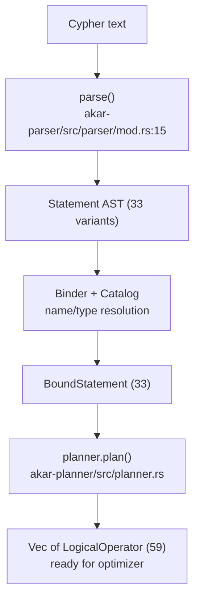

# Query Frontend domain

**Module paths**: `akar-core/akar-parser/`, `akar-core/akar-binder/`, `akar-core/akar-planner/`
**Generated**: 2026-09-23

---

## What this module is doing

The frontend is Akar's customs office: every Cypher sentence arriving from the outside world gets grammatically inspected (parser), matched against the registry of legal entities and types (binder), and issued a route through the country's road network (planner). Nothing executes until it has the right stamps. Getting this layer right is what lets the rest of the engine work on *structured certainty* — bound, typed plans — instead of guessing at raw text, and it's where Akar's parity with the C++ reference is most meticulously audited: 33 statements vs the reference's 22, 33 bound variants vs 20, 59 logical operators vs 50.

The payoff of this strictness shows up downstream as *early failure with useful messages*: a typo'd table name or a wrong-case label dies at the customs desk (`Bind error: Table 'X' not found`), never as a confusing runtime fault halfway through a scan.

---

## Core capabilities

1. **PEG parsing** — `parse()` at `akar-parser/src/parser/mod.rs:15-35` strips `EXPLAIN [LOGICAL|PROFILE]` prefixes, runs pest against `cypher.pest` (rule `akar_query`), then `parse_statement` builds a 33-variant `Statement` AST (+10 clause sub-variants). The dialect is a documented superset of the reference: vector/FTS/index/sequence/graph DDL, `Union`, `Merge`, `Analyze`, `LoadFrom` are akar-only additions (SPEC §3.3).
2. **Semantic binding** — the binder resolves symbols and types against `Arc<Mutex<Catalog>>` into 33 `BoundStatement` variants (`akar-binder/src/bound_statement.rs`), case-sensitively (matching the reference's behavior), with property types sourced from `Catalog::get_property_type` rather than hard-coded assumptions.
3. **Logical planning** — `planner.plan()` in `akar-planner/src/planner.rs` emits a `Vec<LogicalOperator>`: ScanNode/ScanRel, HashJoin, CrossProduct, TopK, Intersect, SemiJoin/AntiJoin, RecursiveExtend, OptionalMatch/OptionalExtend, VectorSimilarityScan, FtsScan, ArtIndexRangeScan, CountRelTable, DDL operators and more — all 59 variants, each counterpart-verified against the C++ operator set (SPEC §3.3 Planner).
4. **EXPLAIN integration** — handled at parse entry (`EXPLAIN`, `EXPLAIN LOGICAL`, `EXPLAIN PROFILE`) so introspection shares the identical pipeline as execution — what you see in EXPLAIN is what runs.

---

## Key components

The three-crate split is itself the key architectural fact: syntax (parser), legality (binder), and strategy (planner) are independently testable units. The table gives you the entry function and output type of each.

| Component / type | File path | Core responsibility |
|-------------------|-----------|---------------------|
| `parse()` | `akar-core/akar-parser/src/parser/mod.rs:15` | Text → `Statement` (EXPLAIN-aware) |
| `Statement` enum (33 variants) | `akar-core/akar-parser/src/ast/` | Canonical syntax tree |
| `cypher.pest` grammar | `akar-core/akar-parser/src/grammar/cypher.pest` | Declarative PEG grammar (ADR-001) |
| `BoundStatement` enum (33) | `akar-core/akar-binder/src/bound_statement.rs` | Name/type-resolved statement |
| Binder resolution logic | `akar-core/akar-binder/src/lib.rs` | Symbol & property resolution vs Catalog |
| `LogicalOperator` (59 variants) | `akar-core/akar-planner/src/logical_operator.rs` | Plan-node vocabulary |
| `plan()` | `akar-core/akar-planner/src/planner.rs` | `BoundStatement` → logical plan |

---

## Internal data flow

**Key steps**: each arrow is a full validation gate — a syntax error stops at B→C, a semantic error at C→D or D→E — and no storage page is ever touched before G is produced. This is the "bound certainty before execution" principle of `2.Architecture.md` §1.1 made concrete.

---

## Key interfaces & extension points

The public entry is `parse()`, consumed by `Connection::query`/`prepare` (`akar-main/src/connection/query.rs:21,:283`); the connection's plan cache keys on the bound/optimized result (gate: `is_plan_cachable`, `query.rs:799`), which is why the frontend's cost is paid once per distinct statement text. The grammar-extension pattern for adding a statement is well-worn (13 akar-only statements have walked it): add a pest rule → add a `Statement` variant → add a binder case → add a planner mapping → add a parity test against the SPEC matrix. The optimizer (next crate in the pipeline) consumes `Vec<LogicalOperator>` and must never see an unbound name — that contract is enforced by types, not convention.

## Cross-module collaboration

| Interacting module | Direction | Interface | Description |
|--------------------|-----------|-----------|-------------|
| `akar-main` (connection) | calls frontend | `parse()` + plan cache | Steps 1–3 of query pipeline |
| Catalog (foundation) | read by binder | `get_property_type`, entry lookup | Name/type legality source |
| Optimizer | consumes output | `Vec<LogicalOperator>` | Guaranteed-bound plan input |
| Processor (DDL) | special path | `is_write_statement` classification | DDL often executes inline (SPEC matrix b) |
| EXPLAIN rendering | shares pipeline | same parse entry | Logical/PROFILE introspection |

**In the read-query flow**: this module *is* stages 1–3 (parse → bind → plan) — the work the plan cache skips on a hit.

**In schema changes**: because binding reads the live `Catalog` and plans are version-stamped, a committed DDL invalidates cached plans for affected statements automatically (foundation's version bump).

---

## Performance considerations

Parsing is intentionally cheap and rare: the connection-level LRU plan cache skips parse/bind/plan/optimize entirely for repeated statements, making front-end cost a non-issue on hot paths. pest (a PEG generator) isn't the fastest possible choice — the alternative considered was a hand-rolled or `nom` parser — but grammar readability and error messages won (ADR-001-adjacent trade), and the cache makes the choice nearly free. The binder's per-statement Catalog lookups are short mutex-protected map reads; DDL rarity keeps contention negligible.

---

## Highlights

Audited 1:1-or-better parity across two C++ statement grammars is the headline: every reference statement has a tested akar counterpart, and the 13 extras (vector/FTS/graph DDL, `LoadFrom`, etc.) are labeled as supersets rather than quietly diverging. Per-aggregate `DISTINCT` (`COUNT(DISTINCT x)`) landed as an explicit parity fix (P88) — the kind of small correctness detail that separates a demo parser from a production one. And the three-crate separation — syntax / legality / strategy — remains the cleanest example in the repo of single-responsibility layering: 97 + 102 + 22 focused tests, each crate small enough to hold in your head.
