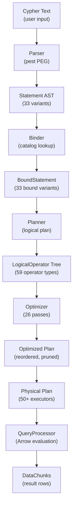

# Query Pipeline Domain

**Module Path:** `akar-parser/`, `akar-binder/`, `akar-planner/`, `akar-optimizer/`, `akar-processor/`
**Generated:** 2026-09-15

---

## What This Module Does

The query pipeline is the central nervous system of Akar. It takes a raw Cypher query string and transforms it, step by step, into executable physical operations that produce Arrow-native result chunks. Think of it as a translation chain: first you translate from human-readable Cypher into a structured AST, then you resolve names and types against the catalog, then you build a logical execution plan, then you optimize that plan through 25 rewrite passes, and finally you execute it with 50+ physical operators.

Each stage has a clean interface to the next — the Parser does not know about the Catalog, the Optimizer does not know about the physical operators. This separability is what makes the system testable: you can verify that the parser produces the right AST without needing a storage engine, or that the optimizer produces the right plan without needing to execute it.

---

## Core Capabilities

1. **Cypher Parsing (pest PEG grammar)** — The parser converts Cypher text into an AST using a pest PEG grammar (`cypher.pest`). It produces 33 Statement variants, which is a superset of Kuzu's 22 C++ grammar rules. The grammar is composable and maintainable — adding a new clause is a matter of adding a pest rule, not rewriting a hand-coded recursive descent parser. Key file: `akar-parser/src/lib.rs`, grammar: `akar-parser/src/cypher.pest`.

2. **Semantic Analysis (Binder)** — The binder resolves symbols against the system catalog, checks types, and produces BoundStatement variants (33 types, 1:1 with parser). Property resolution goes through the catalog (not hardcoded types), which means the binder works correctly even when users add custom columns via ALTER TABLE. A `ConfidentialStatementAnalyzer` detects sensitive CALL statements (S3/Azure secrets) to exclude them from CLI history. Key file: `akar-binder/src/lib.rs`.

3. **Logical Planning (Planner)** — The planner converts bound statements into a logical plan tree with 59 LogicalOperator variants. It handles join ordering, optional match expansion, recursive extend planning, and DDL operator generation. The planner is where the "what to do" is decided — the optimizer later decides "how to do it efficiently." Key file: `akar-planner/src/lib.rs`.

4. **Optimization (26 Passes)** — The optimizer applies 19 flat passes (applied in sequence to the plan tree) and 7 tree passes (applied to the tree structure). Key passes include FilterPushDown (push filters closer to scans), ExtendFilterPushDown (hoist source-only predicates above an `Extend` so anchored hops filter before traversal), JoinOptimization (cardinality-aware reordering), TopKOptimization (convert ORDER BY + LIMIT to TopK), VectorSimilarityDetection (rewrite cosine_similarity to HNSW scan), and ArtRangeScanDetection (rewrite range filters to ART index scans). Three passes (CSE, OrderByPushDown, AggregateFusion) are deliberately NO-OP until a proven cost model exists — shipping a wrong optimization is worse than shipping no optimization. Key file: `akar-optimizer/src/lib.rs`.

5. **Physical Execution (Processor)** — The processor executes the optimized plan using 50+ physical operator executors. Arrow-native expression evaluation (`evaluate_to_arrow` + `boolean_array_to_selection`), parallel aggregation via `AggregateHashTable`, parallel hash join via `JoinHashTable`, `BlockMergeSort` + `RadixSort` for ORDER BY, and `BinaryHeap` O(n log k) TopK. The processor is where the "how to do it" is decided — it picks the right algorithm for each operator based on data characteristics. Key file: `akar-processor/src/lib.rs`.

---

## Key Components

The pipeline is a chain of five specialized processors, each with a well-defined input/output contract.

| Component | File | One-Line Role |
|-----------|------|---------------|
| `parse()` | `akar-parser/src/lib.rs` | Converts Cypher text to 33-variant Statement AST via pest PEG grammar |
| `Binder` | `akar-binder/src/lib.rs` | Resolves symbols against Catalog, checks types, produces BoundStatement |
| `QueryPlanner` | `akar-planner/src/lib.rs` | Builds logical plan tree with 59 LogicalOperator variants |
| `Optimizer` | `akar-optimizer/src/lib.rs` | Applies 26 optimization passes (19 flat + 7 tree) |
| `QueryProcessor` | `akar-processor/src/lib.rs` | Executes physical plan with 50+ operators, returns DataChunks |

---

## Internal Data Flow

**Key steps:**
1. **Parse** (`parse()` in `akar-parser/src/lib.rs`): pest PEG grammar parses Cypher text into an AST. The grammar is in `cypher.pest` with composable rules. 33 Statement variants cover DDL, DML, transactions, and extensions.

2. **Bind** (`Binder::bind()` in `akar-binder/src/lib.rs`): Resolves table names, column names, and function names against the Catalog. Type-checks expressions. Produces BoundStatement with fully resolved references.

3. **Plan** (`QueryPlanner::plan()` in `akar-planner/src/lib.rs`): Converts bound statements into a logical plan tree. Handles join ordering, optional match expansion, recursive extend planning. 59 LogicalOperator types.

4. **Optimize** (`Optimizer::optimize()` in `akar-optimizer/src/lib.rs`): Applies 26 passes. FilterPushDown pushes WHERE clauses closer to scans. ExtendFilterPushDown hoists source-only predicates above `Extend`. JoinOptimization reorders joins by cardinality. TopKOptimization converts ORDER BY + LIMIT to a single TopK operator. VectorSimilarityDetection rewrites cosine_similarity to HNSW scan.

5. **Execute** (`QueryProcessor::execute()` in `akar-processor/src/lib.rs`): Runs the physical plan. Each operator pulls data from its child, processes it, and produces DataChunks. Arrow-native expression evaluation. Parallel aggregation and hash join via rayon.

---

## Key Interfaces and Extension Points

- **`TableFunction`** trait (`akar-function`): Custom table-valued functions (e.g., `JSON_SCAN`, `QUERY_FTS_INDEX`). Two variants: `CustomTable` and `CustomTableWithGraph` (P52.46 — receives `Option<&dyn GraphDataSource>` for GDS algorithms).
- **`ExpressionEvaluator`** (`akar-processor`): Arrow-native expression evaluation; `evaluate_to_arrow` -> `boolean_array_to_selection`. Can be extended with new scalar functions via the `FunctionRegistry`.
- **Plan cache**: LRU(100) at connection level; keyed by normalized query string, validated against catalog version. New plan types automatically benefit from caching.

---

## Interactions with Other Modules

| Module | Direction | Interface | Description |
|--------|-----------|-----------|-------------|
| akar-storage | Depends | `StorageManager` | Physical operators read/write columnar data |
| akar-catalog | Depends | `Catalog` | Binder resolves symbols; planner checks table schemas |
| akar-function | Depends | `FunctionRegistry` | Processor dispatches to registered functions |
| akar-fts | Depends | `FtsExtension` | FTS scan bypasses extension registry; physical operators call FTS directly |
| akar-transaction | Depends | `TransactionManager` | Write statements wrapped in OCC transactions |

---

## Cross-Module Collaboration

**In the Query Execution Pipeline:** The parser produces an AST, the binder resolves it against the catalog, the planner builds a logical plan, the optimizer rewrites it for efficiency, and the processor executes it. Each stage is independently testable.

**In the Write Path:** The processor's PhysicalInsert/PhysicalDelete/PhysicalSet operators write to LocalStorage, emit WAL records, and register writes for OCC tracking. The TransactionManager validates conflicts at commit time.

**In the FTS Lifecycle:** The PhysicalCreateFtsIndex operator builds a Tantivy index. The PhysicalFtsScan operator reads from it. The FTS commit-hook sync propagates DML changes to the index at commit time.

---

## Performance Characteristics

- Parse: ~10 microseconds for typical queries (PEG grammar is fast)
- Bind: ~50 microseconds (catalog lookup is the bottleneck)
- Plan: ~100 microseconds (59 operators is manageable)
- Optimize: ~200 microseconds (26 passes, each O(n) in plan size)
- Execute: varies by query; hot path 397 microseconds on 10K rows
- Plan cache hit: ~5 microseconds (skip parse/bind/plan/optimize entirely)
