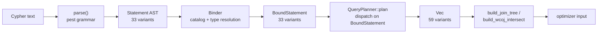

# Query Pipeline: Parser → Binder → Planner

**Module path:** `akar-core/akar-parser/`, `akar-core/akar-binder/`, `akar-core/akar-planner/`
**Role:** Core domain — turning Cypher text into a logical plan.

---

## Overview

The query pipeline is the front door of the database: it takes a Cypher string and produces the plan that the optimizer will reshape and the processor will execute. It works like a translation agency with three desks. The **parser** (`akar-parser`) reads the raw text and produces a syntax tree — the *what was said*. The **binder** (`akar-binder`) then reads that tree with the catalog open beside it, resolving every symbol — table names, column types, index references — and type-checking the result, producing a bound statement: the *what was meant*. Finally the **planner** (`akar-planner`) arranges that bound statement into an ordered list of logical operators — the *how it could be done* — including choosing a join order.

These three crates are strictly layered: output of one is input to the next, and each keeps a near-1:1 mapping to the official C++ Kuzu statement types (33 parser `Statement` variants, 33 `BoundStatement` variants) plus Akar-specific additions (vector/FTS/graph/index statements) that the C++ grammar lacked.

## Core functions

1. **Parse** — `parse(input)` (`akar-parser/src/parser/mod.rs:15`) handles an optional `EXPLAIN` prefix (PhysicalPlan/LogicalPlan/Profile) at `:19-29` then delegates to statement parsing; expressions are parsed by `parse_expression` (`akar-parser/src/parser/expression.rs:8`), query clauses by helpers in `dml.rs` (e.g. `parse_call`, `parse_merge_clause` at `:452/:490`).
2. **Bind** — the `Binder` (`pub use binder::Binder`, `akar-binder/src/lib.rs:10`) resolves symbols against `Arc<Mutex<TableCatalog>>` (locked at `binder/mod.rs:170`), with key methods `bind_query` (`:198`), `bind_return` (`:537`), `resolve_expression` (`:652`), `bind_create_vector_index` (`:1005`), `bind_standalone_call` (`:1592`), and user-type resolution `parse_type_resolved` (`:166`).
3. **Confidential-call detection** — `is_confidential_call(query)` (`akar-binder/src/confidential_statement_analyzer.rs:29`) flags `CALL`s that reference S3/GCS/Azure secrets so the engine can route them to the credential-aware path.
4. **Plan** — `QueryPlanner::plan(statement)` (`akar-planner/src/planner.rs:139`) dispatches on the `BoundStatement` (e.g. `plan_query` at `:491`, `plan_union`, `plan_merge`) and emits `Vec<LogicalOperator>`.
5. **Join ordering** — `build_join_tree(scans, filter_expr)` (greedy, smallest-first) and `build_wcoj_intersect(patterns)` (worst-case-optimal `Intersect`) at `akar-planner/src/join_order.rs:36` and `:216`, flattened back to a list by `flatten_join_plan` (`join_order.rs:492`).

## Key components

| Component/type | File path | One-line responsibility |
|---|---|---|
| `Statement` (33 variants) | `akar-parser/src/ast.rs:107-141` | Root AST for all statements (Query, DDL, DML, Transaction) |
| `Clause` (11 variants) | `akar-parser/src/ast.rs:151-163` | Query sub-clauses (Match, Return, Where, Create, Delete, Set, OptionalMatch, With, Unwind, Foreach, Merge) |
| `Expression` | `akar-parser/src/ast.rs:313` | Expression AST incl. `Parameter($x)`, `ExistsSubquery`, `Case`, `ListPredicate`, `Star` |
| `MatchClause` (+ `FtsQuery`) | `akar-parser/src/ast.rs:197-208` | MATCH with optional `USING FTS INDEX ...` |
| `CypherParser` (pest) | `akar-parser/src/parser/mod.rs:13` | The pest `#[grammar = "cypher.pest"]` struct |
| `BoundStatement` (33 variants) | `akar-binder/src/bound_statement.rs:10-44` | Type-resolved output of the binder |
| `BoundExpression` | `akar-binder/src/bound_statement.rs:244-251` | Typed expression carrying `resolved_type`, `alias`, `is_constant` |
| `ConfidentialStatementAnalyzer` | `akar-binder/src/confidential_statement_analyzer.rs` | Flags confidential S3/GCS/Azure `CALL`s |
| `LogicalOperator` (59 variants) | `akar-planner/src/logical_operator.rs:66-126` | Operator AST (`ScanNode`, `Filter`, `HashJoin`, `TopK`, `FtsScan`, `CountRelTable`, …) |
| `JoinPlan` | `akar-planner/src/join_order.rs:13-24` | Join tree shape: Leaf / HashJoin / CrossProduct |
| `QueryPlanner` | `akar-planner/src/lib.rs:7` | Public planner API |

## Internal data flow

MATCH patterns are the heart of the planner: `build_join_tree` uses a greedy smallest-first heuristic, while `build_wcoj_intersect` produces worst-case-optimal `Intersect` shapes for multi-pattern MATCHes with shared variables — an advanced feature inherited from the research-community heritage of Kuzu. FTS queries detected in MATCH (`take_fts_if_table`, `planner.rs:37`) become `FtsScan` operators before join planning.

## Key interfaces & extension points

The parser exports `expression::*`, `ddl`, and `dml` production surfaces (`parser/mod.rs:97-99`). The `Binder` is extensible through `bind_*` methods — a new DDL needs a new `BoundStatement` variant plus matching `binder::ddl` code. The planner's dispatch is a big `match` over `BoundStatement` (`planner.rs:139-491`) where new statement types add `plan_*` methods. `CALL vector_similarity_scan(...)` is the flagship *extension seam*: bound via `bind_standalone_call`, planned via `plan_vector_similarity_scan_call` (`planner.rs:225`), reaching the processor as `VectorSimilarityScan` — non-standard scans get into the plan without touching the grammar.

## Interactions with other modules

| Module | Direction | Interface used | Note |
|---|---|---|---|
| akar-common | depends on | `Value`, `DataChunk`, type IDs | Shared vocabulary |
| akar-storage | depends on (binder) | `TableCatalog` | Schema lookup at bind time |
| akar-optimizer | feeds | `Vec<LogicalOperator>` | Planner output is the optimizer's input |
| akar-processor | feeds | Bound + planned shape | Downstream consumption |
| akar-function | cross | `evaluate_scalar` | Type-check support |

## Performance & concurrency notes

The binder holds `Arc<Mutex<Catalog>>`, so binding is serialized per statement — a deliberate trade for schema-snapshot correctness over parallel binding. Join ordering is a greedy heuristic (not exhaustive DP) to keep planning cheap; WCOJ `Intersect` shapes try to keep intermediate sizes low (`join_order.rs:216-430`). Prepared-statement support (`Parameter($x)`, `limit_param`/`skip_param`, `ast.rs:236-242`) means the pipeline is fully reusable across executions. `visit_bottom_up` (`logical_operator.rs:263`) is the tree traversal the optimizer's tree passes use to walk the plan in place.

## Implementation highlights

- The pest PEG grammar is modular (`dml.rs`, `ddl.rs`, `expression.rs`) with `parse()` as a thin dispatcher (`parser/mod.rs:3`) — easier to extend than one monolithic grammar file.
- `RETURN` is sugar for a `ReturnClause`, and `WITH` is reused as `Clause::With(ReturnClause)` (`ast.rs:159`), unifying two clause kinds under one structure.
- The binder supports late-bound parameters, so identical `MATCH` shapes are planned once and cached.
- The pipeline is a **superset** of the C++ Kuzu grammar: it keeps 1:1 counterparts for every C++ statement/operator while adding 13 statements C++ lacks (vector index, FTS index, graph DDL, index drop, sequences, etc.).