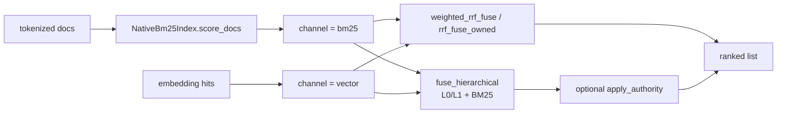

# Search (akar-search)

**Module path:** `akar-core/akar-search/`
**Role:** Core domain — fusing sparse and dense signals into one ranked list.

---

## Overview

`akar-search` is the memory-retrieval brain: it combines BM25-style sparse scores and vector-embedding scores into a single ranked result list using Reciprocal Rank Fusion (RRF) — or, for the richer path, a hierarchical summary/content/BM25 channel model with optional authority (link-rank) boosting. It exists because neither signal alone is enough for memory recall: keyword hits are exact and controllable, vector hits are fuzzy and semantic. RRF fuses on *rank* rather than raw score, so channels with entirely different score scales become comparable.

The crate is deliberately small and pure-Rust, oriented around a few fusion functions (`weighted_rrf_fuse`, `hybrid_search`, `fuse_hierarchical*`) plus an operator-layer `HybridScan` that the vectorized query processor can drop straight into a plan.

## Core functions

1. **RRF core** — `weighted_rrf_fuse` (`akar-search/src/algorithm/rrf.rs:23`) applies per-channel weights + rank fusion; `rrf_fuse_owned` (`rrf.rs:54`) and `rrf_fuse_ref` (`rrf.rs:90`) are owned/reference convenience wrappers. `DEFAULT_K = 60` (`rrf.rs:10`).
2. **Canonical hybrid** — `hybrid_search` (`hybrid.rs:19`) fuses vector hits with BM25 hits through `rrf_fuse_owned`, producing `SearchResult { id, score, channel }` (`hybrid.rs:7`).
3. **Weighted fusion** — `fuse_vector_and_bm25` (`fused.rs:50`) merges a vector score list with a BM25 list using `FusedSearchConfig` (`fused.rs:23`; defaults bm25_weight 0.5 / vector_weight 0.5, `rrf_k = 60`, `limit = 10`).
4. **Hierarchical fusion** — `fuse_hierarchical` (`hierarchical.rs:71`) fuses three channels (L0 summary embedding, L1 content embedding, BM25) with `HierarchicalRrfConfig` weights (`hierarchical.rs:25`).
5. **Authority boost** — `apply_authority` (`hierarchical.rs:119`) multiplies fused scores by `authority_multiplier` clamped to `AuthorityConfig` floor/ceiling (`hierarchical.rs:87`); `fuse_hierarchical_with_authority` (`hierarchical.rs:144`) is the full pipeline.
6. **Multi-perspective recall** — `multi_perspective_recall_with_id` (`multi.rs:6`) computes recall across perspectives using an ID oracle.

## Key components

| Component/type | File path | One-line responsibility |
|---|---|---|
| `FusedItem<T>` | `akar-search/src/rrf.rs:14` | Scored item carrying a channel tag |
| `SearchResult` | `akar-search/src/hybrid.rs:7` | `{id: String, score: f64, channel: Channel}` output row |
| `HybridScan` | `akar-search/src/hybrid_scan.rs:36` | Operator combining vector hits + native BM25; `new()` `:44`, `execute()` `:56` |
| `HybridScanConfig` | `akar-search/src/hybrid_scan.rs:25` | Tuning for the scan operator (top-k, weights) |
| `HierarchicalRrfConfig` | `akar-search/src/hierarchical.rs:25` | `l0_weight`/`l1_weight`/`bm25_weight`/`rrf_k`/`limit` |
| `AuthorityConfig` | `akar-search/src/hierarchical.rs:87` | Clamp range for the authority multiplier |
| `NativeBm25Index` | `akar-search/src/native_bm25.rs:44` | In-process BM25 over tokenized docs; `score_docs` `:126` |
| `Bm25Params` | `akar-search/src/native_bm25.rs:12` | k1/b parameters for the BM25 scorer |
| `FusedSearchConfig` | `akar-search/src/fused.rs:23` | Weights + `rrf_k` + result `limit` for the vector+BM25 fuse |

## Internal data flow

There are two families of flow: the classic path funnels the BM25 and vector channels into RRF and ranks; the hierarchical path routes L0 summary, L1 content and BM25 through `fuse_hierarchical`, then optionally multiplies by authority. `HybridScan::execute` exposes the same behavior as an operator producing result rows for the processor.

## Key interfaces & extension points

- **New channels** — tag scores via `FusedItem.channel` and feed them into `weighted_rrf_fuse`; the fusion math doesn't care what a channel means.
- **`HybridScan`** is the integration seam into the vectorized processor's operator `execute()` contract.
- **`fuse_hierarchical_with_authority`** is the "one call" high-level API for the summary/content hybrid (the ai-memory P121 design).

## Interactions with other modules

| Module | Direction | Interface used |
|---|---|---|
| akar-vector | supplies → | Vector hit scores for the vector channel |
| akar-fts / BM25 | peer | Sparse scores for the BM25 channel |
| akar-function | → | `ClassifierFn`-style functions feed BM25 params into `Bm25Params` |
| akar-processor | → | Consumes `HybridScan` as an operator in query plans |

## Performance & concurrency notes

Fusion is arithmetic over ranked f64 score vectors — O(n) per channel, no allocation-heavy sort beyond top-k, structurally SIMD-friendly. `NativeBm25Index` is an in-memory corpus; scoring within one call is single-threaded, with parallelism decided by the caller. `rrf_fuse_*` takes no locks; the crate is stateless except the caller-owned index.

## Implementation highlights

- **Rank-based weights**: per-channel weights apply to ranks (RRF), not raw scores, which makes channel scale differences irrelevant — the key design decision for robust hybrid recall.
- `DEFAULT_K = 60` tunes fusion sensitivity to ranking noise (top-K doc convention).
- `fuse_hierarchical` deliberately widens recall across three complementary representations (summary/content/sparse) before applying the final limit.