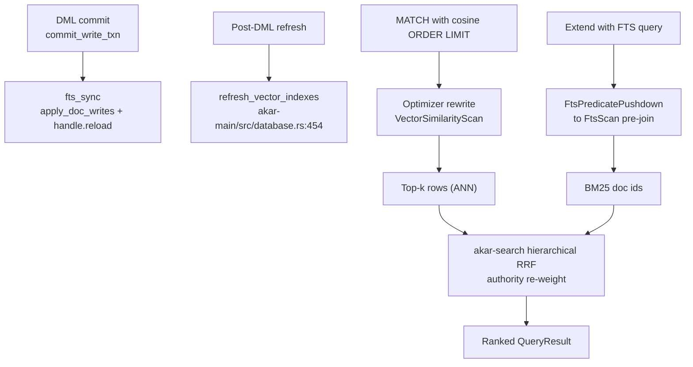

# Search domain

**Module paths**: `akar-core/akar-fts/`, `akar-core/akar-vector/`, `akar-core/akar-search/`
**Generated**: 2026-09-23

---

## What this module is doing

Search is Akar's recall desk — the part of the memory engine that answers "what have I seen that matches this?" rather than "traverse from this node." Agent memory lives or dies on retrieval: exact keyword matches (BM25 full-text), semantic similarity (HNSW vector ANN), and especially the fusion of many signals into one ranked list (hierarchical RRF). Akar bundles all three natively — no external search cluster, no separate vector DB — while owning the hard part most libraries skip: **index lifecycle contracts** (commit-gated visibility, crash recovery, read-after-write consistency) that keep indexes truthful relative to the row store.

The mental model worth carrying: an index that can drift from its table is worse than no index at all, because results become *plausibly wrong*. This module's distinguishing feature is that its consistency guarantees are written down (P107.x) and tested as contracts, not implied by hope.

---

## Core capabilities

1. **BM25 full-text (Tantivy-backed)** — `akar-fts` modules `build`, `index`, `schema`, `tokenizer` (`akar-fts/src/lib.rs:14-17`); English stemmer (`stem_word` `:121`), tokenizer, stop words (`:169`), TF-IDF (`:136`) and BM25 scoring (`:151`) with parity tests against Tantivy's own outputs (P106.1/P106.3). `CREATE FTS INDEX` builds on disk under `<db_path>/fts/<name>`.
2. **Commit-time index sync** — `sync_indexes_on_commit` (`akar-processor/src/physical/write_ops/fts_sync.rs:39`): after durable commit, propagates the transaction's deduplicated undo write-set into Tantivy (`apply_doc_writes`: delete-term-then-readd), then **reloads the single shared `FtsIndexHandle` reader** — the one production reload point (P107.2), giving deterministic read-after-write without per-scan refreshes. Non-fatal by contract (P107.1); crash boundary = Tantivy segment commit (P107.3); aborted writes never sync (P107.4).
3. **FTS query language** — verbatim pass-through to Tantivy `QueryParser`: terms, phrases, `+`/`-`/`AND`/`OR`, phrase-prefix, phrase-slop `~N`, field-regex `/.../` (P106.2, SPEC §7).
4. **HNSW vector search** — `akar-vector/src/hnsw.rs` (graph build/insert/search) + `distance.rs` (SIMD cosine/dot/L2 incl. NEON parity on macOS, P113); scalar functions `cosine_similarity`/`euclidean_distance`/`dot_product`/`l2` (`lib.rs:136-159`); rerank machinery (`RerankCandidate`, `rerank_knn` `:197-248`). Indexes refresh after DML (P52.38, `refresh_vector_indexes` in `akar-main/src/database.rs:454`).
5. **SQL read path via optimizer** — `VectorSimilarityDetection` rewrites `MATCH ... WHERE cosine_similarity(n.col,q) >= thr ORDER BY ... LIMIT k` into `VectorSimilarityScan → Filter → OrderBy → Projection → Limit` (`akar-optimizer/src/passes/flat/vector_similarity.rs:54-101`); explicit `CALL vector_similarity_scan(...)` also exists (P71.1–P71.4). FTS side: `FtsPredicatePushdown` tree pass (P108.1) + `USING FTS INDEX` scans.
6. **Hybrid fusion (RRF)** — `akar-search` modules `fused`, `hierarchical`, `hybrid`, `hybrid_scan`, `multi`, `native_bm25`, `rrf` (`akar-search/src/lib.rs:7-13`): hierarchical multi-vector RRF with authority re-weighting (P121) merges ranked lists — FTS + vector + structural signals — into one ordering (54 tests).

---

## Key components

The table divides the domain into its three crates by *concern*: indexing & lifecycle (fts), approximation & metrics (vector), fusion & ranking (search) — plus the commit hook in the processor that ties them to the transaction story.

| Component / type | File path | Core responsibility |
|-------------------|-----------|---------------------|
| `FtsExtension` | `akar-core/akar-fts/src/lib.rs:23-113` | Registers FTS functions at load |
| `TantivyIndex` / `FtsIndexHandle` | `akar-core/akar-fts/src/index.rs` | Writer + cached shared reader (reload-at-commit) |
| `apply_doc_writes` | `akar-core/akar-fts/src/build.rs` | Incremental doc update/delete from undo set |
| `sync_indexes_on_commit` | `akar-core/akar-processor/src/physical/write_ops/fts_sync.rs:39` | The commit hook (P107.2 reload) |
| HNSW graph | `akar-core/akar-vector/src/hnsw.rs` | ANN index build / insert / search |
| Distance kernels | `akar-core/akar-vector/src/distance.rs` | SIMD metric functions (SSE/AVX/NEON) |
| `VectorExtension` | `akar-core/akar-vector/src/lib.rs:29-130` | Registers similarity scalar functions |
| `VectorSimilarityDetection` | `akar-core/akar-optimizer/src/passes/flat/vector_similarity.rs:54` | SQL idiom → ANN scan rewrite |
| RRF / hierarchical fusion | `akar-core/akar-search/src/{rrf,hierarchical,fused}.rs` | Hybrid multi-signal ranking (P121) |
| `PhysicalFtsScan` / `PhysicalVectorSimilarityScan` | `akar-core/akar-processor/src/physical/` | Execution operators probing indexes |

---

## Internal data flow

**Key steps**: write-side sync runs *after* fsync (so index visibility never precedes row durability — P107.3's crash boundary); the single reader reload per commit is what makes "write then immediately search" deterministic; the read-side optimizer rewrites are what let standard Cypher reach these indexes without proprietary syntax.

---

## Key interfaces & extension points

SQL/DQL surface: `CREATE FTS INDEX`, `USING FTS INDEX`, `cosine_similarity(...)`, `CALL vector_similarity_scan(...)`. Registry: functions arrive via `FtsExtension::load` / `VectorExtension::load` under feature flags (`fts-extension`, `vector-extension`) — so a build can exclude them cleanly. The FTS handle registry lives on `TableCatalog` as `Arc<dyn Any>` (via `fts_runtime_handle`), following a lazy open-once pattern — the handle opens on first use against the already-recovered directory. `GraphDataSource`-style substitution isn't needed here; instead the rerank seam (`rerank_knn`) accepts candidate lists from any retrieval stage, which is how hybrid pipelines compose.

## Cross-module collaboration

| Interacting module | Direction | Interface | Description |
|--------------------|-----------|-----------|-------------|
| Storage | persists | `create_vector_index`/`restore_vector_index` (`akar-storage/src/lib.rs:384,:407`), FTS dir under db path | Index files live with the database |
| Transactions / commit path | triggers | `sync_indexes_on_commit` after fsync | Consistency keystone (P107.x) |
| Optimizer | exposes | detection/pushdown passes → specialized scans | Standard SQL reaches indexes |
| Processor | executes | `PhysicalFtsScan`, `PhysicalVectorSimilarityScan` | Probe operators in pipelines |
| Intelligence (`akar-search` RRF host) | fuses | ranked lists from FTS + vector | Hybrid recall for memory queries |
| `akar-python` (P123) | surfaces | in-process embedding + vector helpers | Python/Sulur embedding path |

**In the hybrid-recall flow**: FTS and HNSW each produce a ranked list; `akar-search`'s hierarchical RRF merges them — the concrete implementation of "find what I mean, not just what I said."

**In the write-commit flow**: this module owns the post-fsync index-sync stage of `3.Workflows.md` §2.2 — the reason committed rows are immediately searchable.

---

## Performance considerations

ANN search is roughly O(log n) versus brute-force O(n); BM25 scoring rides Tantivy's inverted index rather than scanning text; **exactly one reader reload per commit** avoids per-query refresh costs (the common naive design pays a reload per search); threshold + top-k push into the scan so HNSW never materializes a full-table ranking; SIMD distance kernels cut metric cost by vector width (NEON verified on macOS CI — the only aarch64-specific surface in the engine). `native_bm25.rs` offers a lighter-weight scoring path when full Tantivy machinery is unnecessary.

---

## Highlights

The P107.x contract family is the module's crown jewel: a coherent, tested story for *visibility* (commit-gated), *durability* (Tantivy segment commit as crash boundary), and *recovery* (lazy reopen), with explicit caveats documented (pre-P107.1 FAST-only `doc_id` indexes need rebuild — a caveat admitted rather than buried). The optimizer-rewrite-to-ANN pattern is the architectural highlight: exposing vector search through *recognized query idioms* instead of proprietary syntax is exactly how an embedded, standard-facing database should do it — the query stays portable even when the execution path specializes. And the P53 re-entrancy fix (DashMap `Ref` scope before writer acquisition in `fts_sync`) remains the repo's best-documented example of a real concurrency bug found under full-suite load and fixed at its precise lock boundary.
