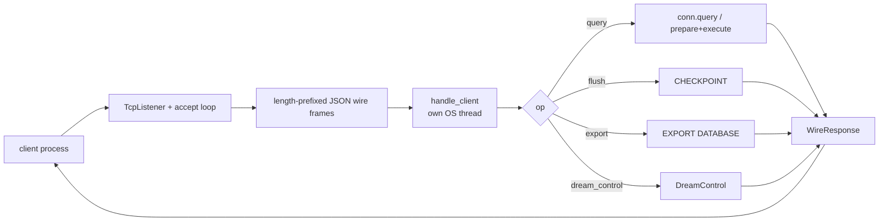

# Server (akar-server)

**Module path:** `akar-core/akar-server/`
**Role:** Integration — multi-process access over TCP (wire reference / test harness).

---

## Overview

`akar-server` is the multi-process access layer on top of Akar's single-writer embedded engine: one process owns the `Database` (and its exclusive file lock) and serves N client processes over TCP. Each client gets its own `Connection`, so transactions are per-session, while a shared `TransactionManager` serializes commits and surfaces row-level conflicts as `WriteConflict` errors. This crate is where the length-prefixed JSON wire protocol is exercised end-to-end (the client lives in `akar-main::remote`).

> **Status per AGENTS.md §0B / P124:** this crate is **deprecated for the production path**. Sulur is migrating to a single-binary Rust server (`sulur-server`) that embeds `akar-main` in-process. Akar-server is retained as a test harness and wire reference.

## Core functions

1. **Bind & accept** — `Server::bind(addr, db)` + `Server::start()` (`lib.rs:75,203`): bind a `TcpListener` (port `0` = OS-assigned), spawn a background non-blocking accept thread; each accepted stream gets its own `"akar-server-client"` thread running `session::handle_client`.
2. **Shutdown** — `Server::shutdown()` (`lib.rs:173`): idempotent graceful drain of the idle-monitor, accept, then client threads (bounded by the 250 ms read timeout) until all sessions exit.
3. **Session loop** — `handle_client(stream, db, config)` (`session.rs:63`): reads length-prefixed JSON frames via `read_frame`, validates the auth token on first request, dispatches on `op`, writes `WireResponse` frames.
4. **Parameterized queries** — `execute_parameterized_query()` (`session.rs:341`): JSON values → Akar `Value`s (`json_value_to_akar_value`, objects → `Value::Struct` so `UNWIND $batch` works), routed through `conn.prepare` → `conn.execute` instead of plain `conn.query`.
5. **Result conversion** — `query_result_to_wire()` / `cell_value()` (`session.rs:381,431`): Arrow chunks → row-major `WireResponse`, with defensive bounds checks that render `<malformed chunk>` instead of panicking the session thread.
6. **Dream control** — `DreamControl::run` / `resume` / `pause` (`dream.rs:883,903`): `run` executes a full consolidation cycle through the shared `Mutex<DreamEngine>`; paused runs are no-ops returning last stats.

## Key components

| Component/type | File path | One-line responsibility |
|---|---|---|
| `Server` struct | `src/lib.rs:54` | Holds `Arc<Database>`, listener, shutdown flag, client handles, counters, auth token |
| `accept_loop()` | `src/lib.rs:246` | Non-blocking accept loop; builds a `DreamControl` per server |
| `SessionConfig` | `src/session.rs:45` | Shared per-session state (auth, `last_activity`, `total_queries`, shutdown flag) |
| `LoggingAllocator` | `src/daemon_log.rs:94` | `#[global_allocator]` that logs allocation failure to stderr (non-allocating) before the OOM handler aborts |
| `install_panic_hook()` | `src/daemon_log.rs:50` | Timestamped `START`/`EXIT`/`PANIC` lines with pid and thread |
| `DreamControl` / `DreamEngine` | `src/dream.rs:781` / `:791` | Per-server dream lifecycle (`Grace` or `Graph` backend) |
| `GraceBackend` / `GraphBackend` | `src/dream.rs:56` / `:127` | `DreamBackend` impls: no-op stub vs real Cypher against a memory graph schema |
| `Args` (clap) | `src/bin/akar_server.rs:42` | Daemon CLI flags (`--db`, `--port`, `--idle`, …) |

## Internal data flow

Writes are serialized by the shared `TransactionManager` (optimistic concurrency); read-only clients use normal MVCC snapshots. The session thread parks on a 250 ms read timeout so it can observe the shutdown flag; the idle monitor compares `last_activity` against `--idle`.

## Key interfaces & extension points

- **Wire protocol** (`akar-main/src/remote.rs`): `WireRequest` (`:46`), `WireResponse` (`:88`), `ServerStats` (`:103`), `PartialFrame`, framing helpers. `DEFAULT_PORT = 9876`, `MAX_FRAME_SIZE = 128 MiB` (`remote.rs:36,42`). Client entry: `Database::connect_tcp(addr)` (`akar-main/src/database.rs:512`).
- **Wire ops** (dispatch at `session.rs:134`): `query` (default), `ping`, `flush` (CHECKPOINT), `stats`, `export`, `shutdown`, `dream_control` (actions `run`/`resume`/`pause`/`status`).
- **`DreamBackend` trait** from `akar-dream`, implemented by `GraceBackend`/`GraphBackend` (`dream.rs:507`).
- **Daemon CLI** (`bin/akar_server.rs:37-86`): `--db` (required), `--port` (9876), `--addr` (127.0.0.1), `--auth-token`, `--idle`, `--json-sidecar`, `--read-only`, `--skip-wal` (salvage-mode recovery, P114.2), `--checkpoint-threshold` (16 MiB default; 0 disables, -1 restores checkpoint-per-write).
- **Sidecar contract**: JSON `protocol: "json-v1"` with host/port/token/pid/db_path/started_at (`bin/akar_server.rs:89`).

## Interactions with other modules

| Module | Direction | Interface used |
|---|---|---|
| akar-main | uses | `Database`, `Connection`, `QueryResult`, `remote::{WireRequest,WireResponse,PartialFrame,read_frame,write_frame}` |
| akar-transaction | uses (indirect) | `TransactionManager` — serializes commits; OCC conflicts surface as `WriteConflict` |
| akar-dream | uses | `DreamBackend`, `DreamOrchestrator`, `DreamConfig`, `DreamStats`, `EmbeddingProvider` (feature `embed`) |
| akar-ml | uses (feature `ml-extension`) | `shared_embedding_provider()` for real embeddings |
| akar-common | uses | `PhysicalTypeID`, `Value`, `arrow_vector` |
| sulur (external) | target | TCP wire protocol — deprecated for production (P124) |

## Performance & concurrency notes

One OS thread per client; writes serialized through the shared `TransactionManager`. `READ_TIMEOUT = 250 ms` (`session.rs:37`) bounds shutdown latency; `WRITE_TIMEOUT = 10 s` (`session.rs:42`) bounds how long shutdown waits on a stuck client. A Windows-specific fix (`session.rs:64-71`) forces blocking mode on accepted sockets so `set_read_timeout` actually parks the thread instead of busy-spinning a core. Frames are capped at 128 MiB on both sides to bound hostile allocations. One shared `DreamControl` serializes dream cycles across connections (mutex held across the whole multi-phase `run_cycle`). Daemon log hardening (P114.3): `LoggingAllocator` + panic hook ensure abnormal termination leaves a trace in the supervisor's captured stderr.

## Implementation highlights

- Blocking-vs-nonblocking socket inheritance fix on Windows (`session.rs:64-71`) — a real cross-platform bug avoided.
- `GraphBackend` degrades gracefully: on a non-kairos DB (no `Memory`/`Connected` tables) every method falls back to empty/zero so a dream cycle never crashes (`dream.rs:115-126`).
- `--checkpoint-threshold` default 16 MiB avoids the historical ~1 s `persist_all_tables` rewrite per write caused by the old -1 default (`akar_server.rs:79-85`).