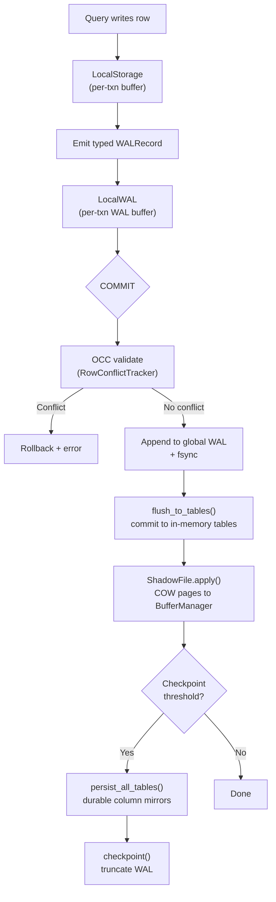

# Storage Engine Domain

**Module Path:** `akar-storage/`, `akar-catalog/`, `akar-transaction/`, `akar-function/`
**Generated:** 2026-09-15

---

## What This Module Does

The storage engine is the foundation beneath everything else in Akar. It manages the lifecycle of data from the moment a query writes a row to the moment it is safely persisted on disk, and from the moment a database starts up to the moment it is ready for queries. Think of it as the building's foundation and plumbing — not visible to visitors, but everything else depends on it being solid.

The storage engine has three major responsibilities: (1) managing the columnar on-disk format (how data is physically laid out on disk), (2) ensuring durability through WAL and checkpoint mechanisms (how data survives crashes), and (3) providing transaction isolation through MVCC and OCC (how concurrent readers and writers coexist without stepping on each other).

---

## Core Capabilities

1. **Columnar Disk Storage** — Data is organized into NodeGroups (groups of rows stored column-major), with each column having its own ColumnChunk. This layout is optimized for analytical workloads that scan entire columns rather than individual rows. Compression (constant, boolean, string dictionary) reduces I/O. Key file: `akar-storage/src/column_chunk.rs`, `akar-storage/src/node_group.rs`.

2. **Buffer Manager with Clock Eviction** — The buffer manager keeps frequently accessed pages in memory and evicts less-used pages using a clock algorithm. It supports mmap for zero-copy reads, NUMA-aware allocation for multi-socket servers, and 256KB readahead for sequential scans. Key file: `akar-storage/src/buffer_manager.rs`.

3. **WAL + Crash Recovery** — The Write-Ahead Log uses typed records (Insert/Delete/Update/Commit/Rollback) with CRC32 checksums per record. The WAL is append-only for 52x write speedup over random I/O. Recovery loads durable column mirrors (last checkpoint state) and replays post-checkpoint WAL deltas on top. Key file: `akar-storage/src/wal.rs`, `akar-storage/src/wal_replayer.rs`.

4. **MVCC + OCC Transactions** — Multi-Version Concurrency Control provides snapshot isolation: each transaction sees a consistent view of the database at its start time. Optimistic Concurrency Control detects write-write conflicts at commit time via row-level tracking. First committer wins; the loser rolls back. Key file: `akar-transaction/src/lib.rs`.

5. **CSR Adjacency Indices** — Compressed Sparse Row forward and reverse adjacency arrays enable efficient graph traversal. Given a node, you can quickly find all incoming and outgoing edges. This is the data structure that makes multi-hop queries fast. Key file: `akar-graph/src/csr.rs`.

6. **ART Index** — Adaptive Radix Tree (Node4/16/48/256) for primary key lookups and range scans. Order-preserving key encoding via `ArtKey` enables efficient range queries. Key file: `akar-storage/src/art_index.rs`.

---

## Key Components

| Component | File | One-Line Role |
|-----------|------|---------------|
| `StorageManager` | `akar-storage/src/lib.rs` | Root of storage engine: BufferManager + WAL + TableCatalog + PageManager |
| `BufferManager` | `akar-storage/src/buffer_manager.rs` | Clock eviction + mmap + NUMA + readahead page cache |
| `WAL` | `akar-storage/src/wal.rs` | Append-only typed WAL with CRC32 checksums |
| `WALReplayer` | `akar-storage/src/wal_replayer.rs` | Replay typed WAL records on top of checkpoint state |
| `NodeGroup` | `akar-storage/src/node_group.rs` | Column-major row group (NODE_GROUP_SIZE rows per group) |
| `ColumnChunk` | `akar-storage/src/column_chunk.rs` | Per-column storage with compression |
| `Catalog` | `akar-catalog/src/lib.rs` | System catalog (schemas, tables, types, sequences) |
| `TransactionManager` | `akar-transaction/src/lib.rs` | MVCC snapshots, OCC conflict detection, checkpoint gating |
| `RowConflictTracker` | `akar-transaction/src/lib.rs` | Row-level (table_id, row_id) write set tracking for OCC |
| `ArtPrimaryKeyIndex` | `akar-storage/src/art_index.rs` | Adaptive Radix Tree for primary key lookup and range scan |

---

## Internal Data Flow

**Key steps:**
1. **LocalStorage** (`akar-storage/src/local_storage.rs`): Per-transaction buffer. Writes accumulate here, invisible to other transactions.
2. **LocalWAL** (`akar-storage/src/local_wal.rs`): Per-transaction typed WAL records. Bulk-copied into global WAL only after OCC validation.
3. **OCC Validation** (`akar-transaction/src/lib.rs:488-543`): RowConflictTracker checks if any other active transaction wrote to the same (table_id, row_id).
4. **WAL Append** (`akar-storage/src/wal.rs`): Typed records with CRC32 checksums. Append-only for 52x speedup.
5. **flush_to_tables()**: Commits writes to in-memory NodeTable/RelTable.
6. **ShadowFile.apply()**: COW pages applied to BufferManager.
7. **Checkpoint**: Persists durable column mirrors; truncates WAL.

---

## Key Interfaces and Extension Points

- **`WalLike`** trait (`akar-storage`): Trait for WAL-compatible sinks (used by `GroupCommit`). New WAL backends can implement this trait.
- **`TableFunction`** trait (`akar-function`): Custom table-valued functions. The storage engine provides the data; functions provide the transformation.
- **`GraphDataSource`** trait (`akar-graph`): Abstraction over graph data for GDS algorithms. `CatalogGraphSource` built from `TableCatalog` (P52.46).
- **Compression codecs**: String dictionary, constant, boolean encoding are pluggable per ColumnChunk.

---

## Interactions with Other Modules

| Module | Direction | Interface | Description |
|--------|-----------|-----------|-------------|
| akar-processor | Depends | `StorageManager` | Physical operators read/write columnar data |
| akar-transaction | Depends | `TransactionManager` | OCC validation, MVCC snapshots |
| akar-catalog | Depends | `Catalog` | Table schema, column types, index metadata |
| akar-graph | Depends | `CSRAdjacency` | Graph traversal via CSR forward/reverse indices |
| akar-vector | Depends | `DistanceMetric` | HNSW index uses vector distance metrics |

---

## Cross-Module Collaboration

**In the Query Execution Pipeline:** The processor's PhysicalScan/PhysicalScanRel operators read from storage. PhysicalInsert/PhysicalDelete/PhysicalSet operators write to storage. The storage engine manages the buffer cache, WAL, and checkpoint lifecycle.

**In the Transaction Lifecycle:** The TransactionManager gates new transactions during checkpoint, assigns snapshot timestamps, validates OCC write sets at commit, and manages the commit history for MVCC readers.

**In the FTS Lifecycle:** FTS index build (PhysicalCreateFtsIndex) writes to both the Tantivy index and the storage engine. FTS scan (PhysicalFtsScan) reads from the Tantivy index while the storage engine provides the row data. FTS commit-hook sync propagates storage DML changes to the Tantivy index.

---

## Performance Characteristics

- Buffer manager: clock eviction O(1) amortized; mmap for zero-copy reads
- WAL append: ~52x faster than random I/O (append-only sequential writes)
- ART index: O(k) lookup where k = key length; range scan O(m + log n) where m = result size
- Checkpoint: O(n) where n = total rows; batch persist + truncate WAL
- OCC validation: O(w) where w = write set size; row-level granularity
