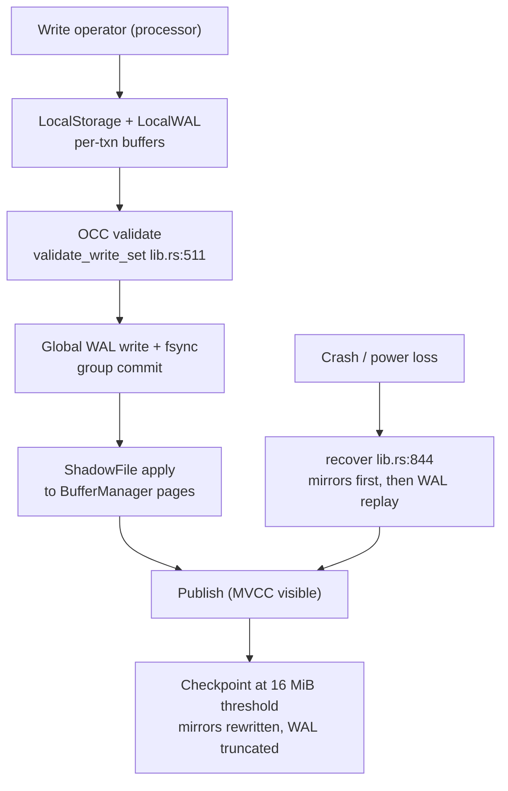

# Storage domain

**Module paths**: `akar-core/akar-storage/`, `akar-core/akar-transaction/`
**Generated**: 2026-09-23

---

## What this module is doing

Storage is the factory floor of Akar — the only place where data actually becomes durable. Everything above it (plans, operators, functions) is machinery for deciding *what* to read or write; storage decides *how bytes survive a power cut and come back identical*. It owns the column-major page files, the buffer cache that mediates RAM vs disk, the append-only WAL that makes commits cheap, and — together with `akar-transaction` — the MVCC/OCC discipline that lets many writers share that floor without collisions.

If the query engine is the assembly line, storage is the building it stands in: the line can be redesigned any week, but the building must never collapse. That's why changes here carry the heaviest process burden in the repo (SPEC gates, WAL recovery tests, crash simulations).

---

## Core capabilities

1. **Columnar persistence with page management** — `StorageManager` (`akar-storage/src/lib.rs:111`) ties together `BufferManager` (clock-eviction page cache), `PageManager` (buddy free-space FSM), column chunks, node groups, and overflow `.ovf` pages. Tables restore/drop via `restore_node_table`/`restore_rel_table` (`lib.rs:343,:371`).
2. **Write-ahead log + typed recovery** — WAL records carry CRC32; `recover` (`lib.rs:844`) loads checkpoint mirrors first, then replays typed deltas via `replay_data_record` (`lib.rs:921`) with last-write-wins on duplicate PKs (P2-WAL-1). Salvage mode (`set_skip_wal`, `lib.rs:211`) opens a database even with a corrupt WAL — an explicit, operator-chosen escape hatch.
3. **Checkpointing** — `checkpoint`/`checkpoint_with_drain`/`maybe_checkpoint` (`lib.rs:488,:542,:506`) rewrite column mirrors then truncate the WAL; triggered at `checkpoint_threshold` (16 MiB default) so recovery stays bounded.
4. **Commit/rollback pipeline** — `commit_transaction` (`lib.rs:658`) and `rollback_transaction` (`lib.rs:734`) implement the LocalStorage → ShadowFile → BufferManager dance; `group_commit.rs` batches fsyncs across writers.
5. **Indexes at rest** — ART primary-key index (`art_index.rs`, Node4/16/48/256 variants), HNSW vector index (`vector_index.rs`), on-disk hash; compression families in `compression.rs`/`string_dictionary.rs` (constant, boolean, string-dictionary).
6. **Bulk I/O & spill** — CSV/Parquet/NPY readers, lazy scanner, and `spiller.rs`/`local_storage.rs` keep large ingests inside `spill_threshold` instead of host RAM.
7. **Transactions (OCC/MVCC)** — `TransactionManager::begin_read/begin_write` (`akar-transaction/src/lib.rs:775,:785`), row-level `RowConflictTracker::validate_write_set` (`lib.rs:511`), `ConcurrencyControl` gate (`lib.rs:545`), visibility via commit-history snapshots (`is_visible` `lib.rs:944`).

---

## Key components

Each row below answers "which file do I open when X breaks" — the facade, the log, the cache, the allocator, the conflict tracker, and the batch-fsync path are the six pieces that must agree for any commit to be correct.

| Component / type | File path | Core responsibility |
|-------------------|-----------|---------------------|
| `StorageManager` | `akar-core/akar-storage/src/lib.rs:111` | Facade over WAL, buffers, tables, indexes, recovery |
| `WAL` / `WALReplayer` | `akar-core/akar-storage/src/wal.rs`, `wal_replayer.rs` | Append-only log + crash replay (6 DDL variants) |
| `BufferManager` | `akar-core/akar-storage/src/buffer_manager.rs` | Page cache with clock eviction |
| `PageManager` / FSM | `akar-core/akar-storage/src/page_manager.rs`, `free_space_manager.rs` | Page allocation, buddy defragmentation |
| `NodeTable` / `RelTable` | `akar-core/akar-storage/src/table.rs` | Column chunks + CSR forward/reverse adjacency |
| `UndoBuffer` / `UndoRecord` | `akar-core/akar-storage/src/undo_buffer.rs`, `akar-transaction/src/lib.rs:51` | Before-images enabling rollback |
| `TransactionManager` | `akar-core/akar-transaction/src/lib.rs:389` | Snapshots, OCC, multi-writer gate |
| `RowConflictTracker` | `akar-core/akar-transaction/src/lib.rs:488` | Row-level write-write conflict detection |
| `GroupCommit` | `akar-core/akar-storage/src/group_commit.rs` | Batched WAL fsync across writers |

---

## Internal data flow

**Key steps**: validation strictly precedes the WAL copy (losers never pollute the log); the fsync strictly precedes publication (a commit ack implies durability); mirrors are written only by checkpoints/recovery (P60.2), never on the hot path.

---

## Key interfaces & extension points

Consumers are `akar-main`'s connection commit path (`commit_write_txn` drives this module end-to-end) and the processor's write operators (which record undo/deltas). Two test seams matter: the `WalLike` trait makes fsync testable without a real disk, and `set_group_commit`/`set_spiller` (`lib.rs:244,:219`) let tests or embedders swap policy. The visibility contract (`is_visible(txn_id, snapshot_ts)`) is what binder/processor scans consume to filter rows — it's the module's most-sensitive public promise.

## Cross-module collaboration

| Interacting module | Direction | Interface | Description |
|--------------------|-----------|-----------|-------------|
| `akar-main` (connection) | drives | `commit_transaction` / `rollback_transaction` | Commit workflow orchestration |
| Processor write ops | produces state | `LocalStorage` + `UndoBuffer` records | Insert/Delete/Set/Merge feed deltas |
| Search (FTS/HNSW) | consumes write set | Post-commit undo records | `fts_sync` propagates after fsync |
| Foundation (Catalog) | persists | WAL DDL records | Schema changes survive recovery |
| Memory governor (akar-main) | constrains | `spill_threshold`, buffer pool size | Admission before ingest |

**In the write-commit flow**: this module owns stages 2–5 (validate → log → publish → checkpoint trigger) of the commit sequence — the correctness core of `3.Workflows.md` §2.2.

**In the open/recovery flow**: `recover` runs before extensions load, ensuring FTS handles open against fully replayed segments.

---

## Performance considerations

WAL append is sequential — SPEC's audit claims ~52× versus page-image logging; group commit amortizes fsync across concurrent winners; clock-eviction buffers are sized by `buffer_pool_size` so an embedded host stays in control; the spill path keeps bulk ingest within `spill_threshold`; and OCC avoids per-statement lock traffic entirely — the steady-state concurrency cost is validation at commit only, not lock maintenance during execution.

---

## Highlights

Three design choices stand out as worth studying anywhere, not just in databases. First, *deterministic recovery ordering* (mirrors → replay → re-persist) turns crash recovery from an art into a testable procedure — see the literal crash-simulation tests (`test_wal_recovery_*`, `test_commit_pipeline_local_storage_flush` at `lib.rs:2019`). Second, *salvage mode as an explicit opt-in* acknowledges that the worst day will happen and gives the operator a documented lever instead of folklore. Third, *row-granular OCC instead of table locks* keeps readers never-blocked and writes conflict-free in the common case — trading abort-retry under contention for the absence of deadlocks, a deliberate exchange made visible in `RowConflictTracker` rather than hidden in lock managers.
