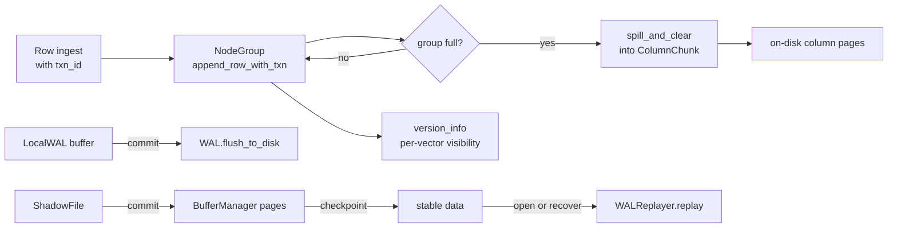

# Storage Engine (akar-storage)

**Module path:** `akar-core/akar-storage/`
**Role:** Core domain — the columnar engine that makes Akar durable and fast.

---

## Overview

`akar-storage` is the machinery room of the database: it decides how rows land on disk, how pages are cached and evicted, how crashes are survived, and how edges are laid out for fast traversal. Think of it as a warehouse with a meticulous inventory system — fixed-size node groups hold the data like pallets, a buffer manager keeps hot pallets near the loading dock, a write-ahead log is the accountant's ledger that can reconstruct everything after a fire, and a CSR index is the cross-reference that lets you walk from one package to its neighbours without searching the whole warehouse.

The module list in `akar-core/akar-storage/src/lib.rs` gives a full census: `art_index`, `buffer_manager`, `checkpoint`, `column_chunk`, `compression`, `csr`, `csv_reader`, `free_space_manager`, `group_commit`, `hyperloglog`, `ice_format`, `index`, `lazy_scanner`, `local_storage`, `local_wal`, `node_group`, `npy_reader`, `page`, `page_manager`, `parquet_reader`/`writer` (feature `parquet`), `persistence`, `predicate`, `roaring_bitmap`, `shadow_file`, `spiller`, `stats`, `string_dictionary`, `table`, `undo_buffer`, `update_info`, `vector_index`, `version_info`, `wal`, `wal_replayer`. The top-level handle consumers interact with is `StorageManager`.

## Core functions

1. **Row ingestion under MVCC** — `NodeTable::insert_row_with_txn` / `insert_rows_batch_with_txn` (`src/table.rs:137`, `table.rs:231`) store rows with an optional txn_id so visibility can be versioned.
2. **Lookup and update** — `NodeTable::lookup_by_pk` (`src/table.rs:360`), `lookup_by_pk_range` (`table.rs:388`), `scan_column` (`table.rs:420`), `update_cell` (`table.rs:528`), `delete_row_with_txn` (`table.rs:558`).
3. **Node-group buffering** — `NodeGroup::append_row_with_txn` (`src/node_group.rs:129`), plus `spill_and_clear` (`node_group.rs:170`) and `restore_spilled` (`node_group.rs:199`) for memory bounds on large inserts.
4. **Write-ahead logging** — `WAL::append` / `flush_to_disk` (`src/wal.rs:324`, `wal.rs:441`): an append-only log branded with magic `b"AKAR"` and format version 2 (`wal.rs:12/14`), typed via `WALRecord` (`wal.rs:18`).
5. **Crash recovery** — `WALReplayer::replay` (`src/wal_replayer.rs:36`) applies only committed records and returns a `ReplayResult` with counts of replayed/skipped records and committed txns (`wal_replayer.rs:17`).
6. **Checkpointing** — `checkpoint()` / `flush_table` (`src/checkpoint.rs:43`, `checkpoint.rs:25`) persist dirty pages to stable storage, so the WAL never grows unbounded.

## Key components

| Component/type | File path | One-line responsibility |
|---|---|---|
| `BufferManager` (+ config/stats) | `src/buffer_manager.rs:120`, `:77`, `:104` | Page cache with file registration (`register_file` L219) and per-page/whole flush (`flush` L306 / `flush_all` L322) |
| `NodeTable` / `ColumnDefinition` | `src/table.rs:39`, `table.rs:21` | Row/column store; `NO_PRIMARY_KEY=usize::MAX` (L69); `add_column` L103 |
| `TableCatalog` | `src/table.rs:1230` | Runtime table registry; `fts_runtime_handle(name)` L1294, `refresh_vector_indexes_for_tables` L1614 |
| `NodeGroup` | `src/node_group.rs:38` | Fixed-size row group (4096 rows; `NODE_GROUP_SIZE` in `column_chunk.rs:25`) with spilling |
| `ColumnChunk` | `src/column_chunk.rs` | In-memory column chunk (`append` L77, `flush_to_column` L227) |
| `CompressedChunk` / `compress`/`decompress` | `src/compression.rs:11/:18/:41` | Constant, bitpacking, string-dictionary, float compression |
| `CsrIndex` | `src/csr.rs:21` | Compressed Sparse Row forward+reverse adjacency for graph traversal |
| `ArtPrimaryKeyIndex` (ART) | `src/art_index.rs` (art_node.rs:32-34) | Order-preserving radix-tree PK index (NODE4/16/48 fanout) |
| `HashIndex` / `OnDiskHashIndex` | `src/index.rs:55` | O(1) PK index — in-memory HashMap L1 over page-based L2 (`SLOTS_PER_PAGE=64`, `index.rs:39`) |
| `LocalStorage` / `LocalWAL` / `ShadowFile` | `src/local_storage.rs:143`, `src/local_wal.rs:19`, `src/shadow_file.rs:21` | Per-transaction staging, txn WAL buffer, copy-on-write page versioning |
| `UndoBuffer` | `src/undo_buffer.rs:14` | Old-cell recorder for rollback (`record` L24) |
| `VectorVersionInfo` / `VersionInfo` | `src/version_info.rs:18/:129` | Per-vector (1024-row) txn→bitmap inserted/deleted maps |
| `GroupCommit` | `src/group_commit.rs` | 200µs drain / 50ms leader timeouts (`group_commit.rs:36/:39`), `flush` L166 |
| `VectorIndex` | `src/vector_index.rs` | Wraps `HnswIndex` with buffer-manager persistence (48-byte header, magic `"HNSW"`) |
| `WALReplayer` | `src/wal_replayer.rs:27` | Crash-recovery entry point |

## Internal data flow

The commit pipeline (`WAL` durable → `LocalStorage` flush → `ShadowFile` apply → checkpoint) is orchestrated by `StorageManager::commit_transaction`, whose contract lives in `akar-transaction/src/lib.rs:9-13`.

## Key interfaces & extension points

`StorageManager` exposes `db_path()`, `storage_info()`, `buffer_info()`, `file_info()`, `fsm_info()`, `wal_size()`, and `table_catalog()`, consumed by the `StorageDriver` in `akar-main/src/storage_driver.rs:34-66`. `BufferManagerConfig` (`buffer_manager.rs:77`) carries db_path, max_memory, page_size and log_path. The `NodeTable` API is uniformly threaded with `txn_id: Option<u64>` so MVCC correctness is enforced at the storage layer rather than by callers. Because the per-txn `LocalWAL` and the global `WAL` share one binary format, commit is a bulk byte copy (`local_wal.rs:1-8`) — a clean seam that keeps both paths trivially consistent.

## Interactions with other modules

| Module | Direction | Interface used | Note |
|---|---|---|---|
| akar-main | depended on by | `StorageManager`, `TableCatalog`, `LocalStorage/WAL/ShadowFile` | Connection, StorageDriver, DDL wiring |
| akar-transaction | depends on | `UndoRecord` (via `UndoBuffer`) | Commit/rollback trigger storage flushes |
| akar-common | depends on | `Value`, `DataChunk`, `CompressionType`, `StorageError`/`TransactionError` | Data + error vocabulary |
| akar-vector | depends on | `HnswIndex` embedded in `VectorIndex` (`vector_index.rs:14`) | ANN persistence |
| akar-common/file_system | depends on | `VirtualFileSystemRegistry` | VFS-backed IO for httpfs etc. |

## Performance & concurrency notes

Group commit amortises WAL fsync with a 200µs drain window and a 50ms leader timeout (`group_commit.rs:36/39`). The per-transaction `LocalWAL` removes contention on the global WAL mutex — only the actual commit serialises. `HashIndex` keeps a hot in-memory HashMap L1 over cold page-based L2 and rebuilds L1 by scanning L2 at startup (`index.rs:4-9`). MVCC visibility is per-vector segment (1024 rows) with `Mutex<HashMap<txn_id, Vec<u32>>>` inserted/deleted maps, so version checks are chunk-local instead of row-local. Spilling (`spill_and_clear`, `node_group.rs:170`) bounds per-group memory during bulk loads, and ART fanout thresholds (NODE4/16/48, `art_node.rs:32-34`) tune radix-node growth.

## Implementation highlights

- FTS runtime handles and vector-index refresh live inside storage's `TableCatalog` (not `akar-catalog`) — storage owns the constructed indexes (`table.rs:1294`, `table.rs:1614`).
- Shadow-file copy-on-write (`shadow_file.rs:40`) gives transaction isolation at the page level without copying whole tables.
- The WAL header (`wal.rs:12-14`) guards format compatibility; `WAL_VERSION=2`.
- `CsrIndex` dual forward/reverse arrays make both traversal directions O(deg) (`csr.rs:13-19`).
- Hash and vector indexes share one persistence pattern — header page + serialized data pages through the BufferManager (`index.rs:12-30`, `vector_index.rs:1-24`).