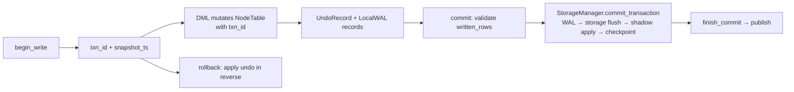

# Transaction Manager (akar-transaction)

**Module path:** `akar-core/akar-transaction/`
**Role:** Core domain — how Akar stays ACID under concurrent readers and writers.

---

## Overview

Think of `akar-transaction` as the traffic controller of the database. Every transaction is issued a unique timestamp entry ticket at the gate (`tx_id`); readers see a consistent snapshot frozen at their ticket time, while writers append new versions of data without blocking those readers. Serializability is achieved the optimistic way — transactions are allowed to work in parallel, and only when two writers try to check out with overlapping writes does the controller compare their `written_rows` claim slips and reject the loser. This is the MVCC + OCC design that lets Akar claim "concurrent multi-writer" support while keeping reads lock-free.

The crate is deliberately single-file (`akar-core/akar-transaction/src/lib.rs`, ~1,300 lines), because the transaction state machine is small and tightly coupled: begin, mutate, validate, commit or roll back.

## Core functions

1. **Begin** — `TransactionManager::begin_read` / `begin_write` (`src/lib.rs:775`, `lib.rs:785`) allocate a transaction; write-begin can be gated on the configured `concurrent_writers` limit.
2. **Commit with conflict validation** — `TransactionManager::commit` (`src/lib.rs:830`) runs write–write conflict detection over each txn's `written_rows` (OCC), then the durability pipeline `StorageManager::commit_transaction()` runs *between* `prepare_commit()` and `finish_commit()` (`lib.rs:9-13`) so that durability strictly precedes visibility (P51.29).
3. **Rollback** — `TransactionManager::rollback` (`src/lib.rs:931`) returns the `UndoRecord`s so the caller can apply them in reverse.
4. **Undo capture** — `Transaction::record_undo` / `record_insert_undo` (`src/lib.rs:125`, `lib.rs:133`) append old-value records and track which tables were modified.
5. **Undo record types** — `UndoRecord::update` / `insert` / `delete` constructors (`src/lib.rs:60`, `:70`, `:80`).

## Key components

| Component/type | File path | One-line responsibility |
|---|---|---|
| `TransactionType` | `src/lib.rs:25` | `ReadOnly` vs `Write` |
| `TransactionStatus` | `src/lib.rs:32` | `Active` / `Committed` / `RolledBack` |
| `UndoType` | `src/lib.rs:40` | `Update` / `Insert` / `Delete` |
| `UndoRecord` | `src/lib.rs:51` | Old-value capture: table_id, row_id, column, old_data, undo_type |
| `Transaction` | `src/lib.rs:93` | Per-txn context: id, type, commit_ts, status, undo_records, modified_tables, `snapshot_ts` (L103), `written_rows` write-set (L107) |
| `TransactionManagerConfig` | `src/lib.rs:188` | Manager knobs (concurrency limits, etc.) |
| `TransactionManager` | `src/lib.rs:389` (impl at L752) | Central registry/coordinator of active transactions |

## Internal data flow

Reads consult the per-vector `VersionInfo` in `akar-storage` using `snapshot_ts`; writers buffer into LocalWAL + UndoBuffer, and only commit triggers durable flush.

## Key interfaces & extension points

`Transaction` is a plain `Clone` struct rather than a handle — the `Connection` clones/owns it alongside its `TxnResources`. `TransactionManager` is `Arc`-shared and its begin/commit/rollback take `&mut Transaction`, making state transitions explicit. `commit` returns a `CommitResult`; rollback hands back `Vec<UndoRecord>` for the storage layer to apply. This small surface is the whole contract, so "host" crates (`akar-main`) can't wedge into the transaction manager's internals.

## Interactions with other modules

| Module | Direction | Interface used | Note |
|---|---|---|---|
| akar-storage | depends on | `UndoBuffer` wrapping `UndoRecord`; implements the `StorageManager::commit_transaction` pipeline | Durability + undo live in storage |
| akar-main | depended on by | `Connection` calls begin/commit/rollback per statement/batch | DDL bypasses the txn path entirely |
| akar-common | depends on | `TransactionError` (in `AkarError` hierarchy) | Shared error vocabulary |

## Performance & concurrency notes

Timestamp-based MVCC means snapshot reads never contend on read/write locks; writers serialize only on commit validation. OCC validation tracks `written_rows` (table_id, row_id) per txn and detects conflicts at commit time (`lib.rs:104-107`). Most write state lives outside the manager in per-transaction staging (LocalStorage/LocalWAL/ShadowFile assembled by `akar-main`'s `TxnResources`), so the manager itself stays lightweight. Lazy initialisation (`lib.rs:112-123`) means read-only transactions never allocate undo infrastructure.

## Implementation highlights

- The durability contract is documented in the module header (`lib.rs:9-13`): the caller must run `StorageManager::commit_transaction` between prepare and finish so durability precedes publish — a deliberate fix after the durability phasing audit (P51.29).
- The undo model is dual-granularity: cell-level (`UndoRecord::update` with old_data) and row-level (`insert`/`delete`), matching the two ways writers can damage a snapshot.
- `Transaction::new` lazily initializes the snapshot/write-set (`lib.rs:112-123`) so a read connection is near-free to open.